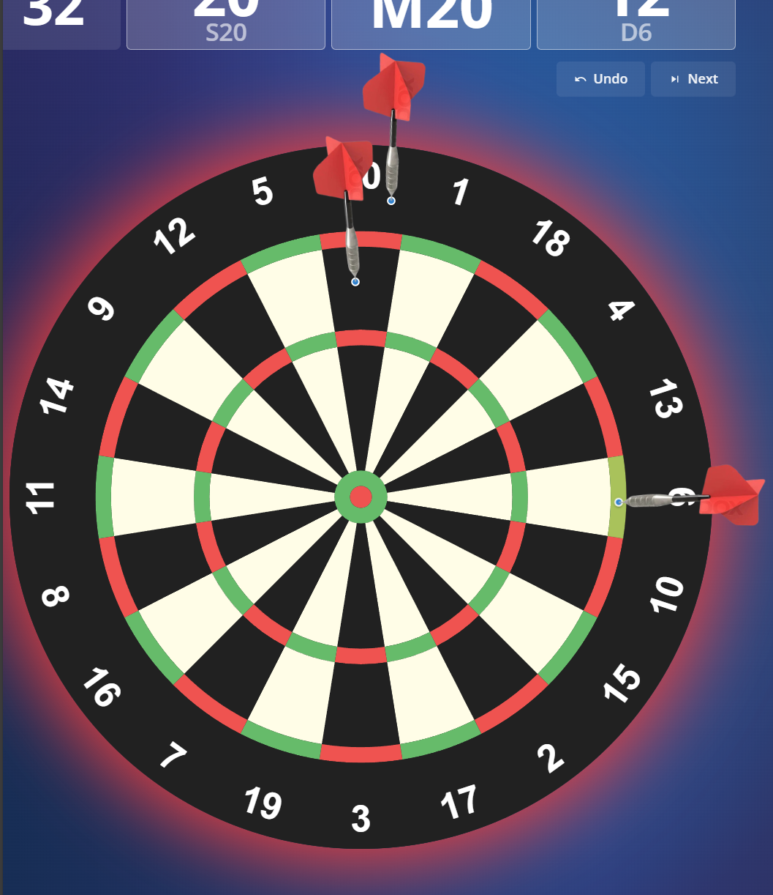
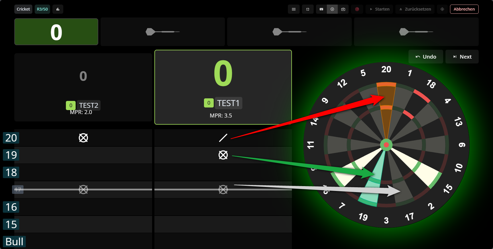

# Technische Referenz

> Technische Detaildokumentation zu allen Themes und Animationen (Variablen, Selektoren, Trigger, CSS-Blöcke, Fallbacks).

- Zur Endnutzer-Dokumentation: [README.md](../README.md)
- Zielgruppe: Nutzer mit Programmiererfahrung und technischem Hintergrund.

## 🧩 Skripte

Hinweis:
Die tägliche Konfiguration erfolgt über **AD xConfig** (Ein/Aus, Einstellungen, Laufzeitstatus).
Diese Datei ergänzt die README um die technischen Hintergründe pro Modul.

Kennzeichnung:
Jede Skriptsektion enthält **Einfache Variablen (Beispiele)** als schnelle Orientierung.
Die vollständigen Tabellen dokumentieren anschließend die internen Parameter.

Begriffe in den Tabellen:

- **Selektor**: CSS-„Adresse“ eines Elements. Nur ändern, wenn Autodarts die Klassen/Struktur geändert hat.
- **CSS-Block**: Mehrzeilige CSS-Regeln für Farben, Größen, Abstände und Effekte.
- **RGB/RGBA**: Farbwerte; RGB = 0-255 pro Kanal, RGBA = RGB + Transparenz (0..1).

Medien-Hinweis: Alle Bilder/GIFs und Sounds liegen in `assets/`. PNGs sind statisch, GIFs zeigen Bewegung.
Kleine Variantenbilder sind als Vorschau eingebettet.

## 🐞 Debugging (für reproduzierbare Reports)

Wenn ein Modul nicht wie erwartet funktioniert, kannst du mit diesen Schritten verwertbare Debug-Infos liefern:

1. Öffne in Autodarts das Menü **AD xConfig**.
2. Öffne das betroffene Modul und stelle den Schalter **`Debug`** auf **An**.
3. Öffne die Browser-Entwicklertools:
   - Windows/Linux: `F12` oder `Strg + Shift + I`
   - macOS: `Cmd + Option + I`
4. Wechsle in den Tab **Console**.
5. Leere die Console (Papierkorb-Symbol oder Rechtsklick -> `Clear console`).
6. Führe den fehlerhaften Ablauf erneut aus (z. B. Match starten, Wurf auslösen, Effekt prüfen).
7. Filtere optional nach **`[xConfig]`**, damit nur relevante Logs sichtbar sind.
8. Kopiere den Console-Inhalt und füge ihn in dein GitHub-Issue/Ticket ein.
9. Stelle den Schalter **`Debug`** danach wieder auf **Aus**.

Hinweis: Bitte Debug nur auf Anweisung aktivieren, da je nach Modul viele technische Logs entstehen können.

### 🧱 Templates

Diese Skripte verändern Layout und Farben und aktivieren sich automatisch je Spielvariante.

#### Gemeinsamer Helfer (autodarts-theme-shared.js, kein Userscript)

- Die Template-Skripte laden den Helfer per `@require`, du musst ihn nicht separat installieren.
- URL: [autodarts-theme-shared.js](https://github.com/thomasasen/autodarts-tampermonkey-themes/raw/refs/heads/main/Template/autodarts-theme-shared.js)
- Wenn du das Repo forkst oder lokale Dateien nutzt, passe die `@require`-URL im Skript an.
- Enthält die gemeinsame Visual-Settings-Pipeline für Hintergrundbilder und Spielerfeld-Transparenz aller Template-Themes.

**Theme-Hintergrund-Assets (persistente Daten)**

- Storage-Key: `ad-xconfig:theme-background-assets:v1`
- Struktur: Map `assets[featureId] -> { dataUrl, mimeType, width, height, sizeBytes, updatedAt }`
- Scope: strikt theme-spezifisch über `featureId` (`theme-x01`, `theme-shanghai`, `theme-bermuda`, `theme-cricket`, `theme-bull-off`)

**Upload-/Clear-Contract (AD xConfig Actions)**

- `theme-background-upload`: Öffnet Dateiauswahl (`image/*`), normalisiert und komprimiert clientseitig.
- `theme-background-clear`: Entfernt das gespeicherte Bild nur für das aktuelle Theme.
- Runtime-Event nach beiden Aktionen: `ad-xconfig:theme-background-updated` mit `{ featureId, hasImage, updatedAt }`.

**Upload-Verarbeitung**

- Max. lange Kante: `1920px`
- Export: bevorzugt `image/webp`, Fallback `image/jpeg`
- Zielgröße: max. `600 KB` pro Theme-Bild (`THEME_BACKGROUND_MAX_ENCODED_BYTES`)
- Bei Fehlern (invalid image, quota/size) bleibt der bisher gespeicherte Zustand unverändert.

**Darstellungs-Mapping (xConfig -> CSS)**

- `fill` -> `background-size: cover`
- `fit` -> `background-size: contain`
- `stretch` -> `background-size: 100% 100%`
- `center` -> zentriert, nicht wiederholt
- `tile` -> wiederholt (`background-repeat: repeat`)

**Deckkraft und Transparenz**

- Hintergrundbild-Deckkraft wird über ein Overlay (`linear-gradient(...alpha...)`) geregelt, nicht über globale Container-`opacity`.
- Spielerfeld-Transparenz wird ausschließlich per `background: rgba(...)` auf die Karten gelegt.
- Wichtig: Text-Deckkraft bleibt erhalten; Namen/Scores werden nicht transparent gerendert.

Hinweis: Wenn die DartsZoom-Vorschau in den "Tools für Autodarts" deaktiviert ist, wird kein Platz reserviert.

#### Template: Autodarts Theme X01

- Bezeichnung: Autodarts Theme X01
- Datei: `Template/Autodarts Theme X01.user.js`

##### 📝 Beschreibung

- Zweck: Vollständiges Layout- und Farb-Theme für X01, mit Fokus auf klare Scores, Player-Karten und Navigation.
- Aktivierung: Variante `x01` (liest `#ad-ext-game-variant` über den Shared Helper).
- Änderungen: setzt CSS-Variablen, Grid-Layout und Typografie, passt Größen/Abstände sowie die DartsZoom-Platzierung an.
- Hinweis: rein visuell, keine Änderungen an Spiellogik oder Erkennung.

##### ✅ Einfache Variablen (Beispiele)

- `PREVIEW_PLACEMENT = "standard"` oder `"under-throws"`
- `PREVIEW_HEIGHT_PX = 128`
- `PREVIEW_GAP_PX = 8`
- `xConfig_AVG_ANZEIGE`: `An` oder `Aus`

##### ⚙️ Konfiguration (Variablen)

**AD xConfig-Einstellungen (empfohlen)**

- `xConfig_AVG_ANZEIGE`: Blendet den AVG-Wert für X01 ein oder aus.
- Kombination: Wenn `Aus` gesetzt ist, wird auch der Trendpfeil aus `Autodarts Animate Average Trend Arrow` ausgeblendet.
- `xConfig_HINTERGRUND_DARSTELLUNG`: Steuert die Bilddarstellung (`fill`, `fit`, `stretch`, `center`, `tile`).
- `xConfig_HINTERGRUND_OPAZITAET`: Presets `100/85/70/55/40/25/10`; wirkt nur auf das Hintergrundbild.
- `xConfig_SPIELERFELD_TRANSPARENZ`: Presets `0/5/10/15/30/45/60`; reduziert nur Kartenhintergründe.
- `xConfig_HINTERGRUND_BILD_HOCHLADEN`: Action `theme-background-upload` (pro Theme persistent gespeichert).
- `xConfig_HINTERGRUND_BILD_ENTFERNEN`: Action `theme-background-clear` (Fallback auf Standard-Hintergrund).

| Variable                        | Standard                     | Wirkung                                                                                                               |
| :------------------------------ | :--------------------------- | :-------------------------------------------------------------------------------------------------------------------- |
| `STYLE_ID`                      | `autodarts-x01-custom-style` | Eindeutige ID des Style-Tags; bei Änderung bleiben alte Styles bis zum Reload aktiv.                                  |
| `VARIANT_NAME`                  | `x01`                        | Name der Spielvariante, bei der das Theme aktiv wird.                                                                 |
| `SOURCE_PATH`                   | `Template/Autodarts Theme X01.user.js` | Wird genutzt, um das korrekte Theme-`featureId` für Hintergrund-Assets aufzulösen.                         |
| `xConfig_AVG_ANZEIGE`           | `true`                       | `true` zeigt den AVG normal an, `false` blendet AVG und Trendpfeil aus.                                               |
| `xConfig_HINTERGRUND_DARSTELLUNG` | `fill`                     | Mapping auf CSS-Hintergrundmodus (`cover/contain/stretch/center/tile`).                                              |
| `xConfig_HINTERGRUND_OPAZITAET` | `25`                         | Regelt die Sichtbarkeit des Custom-Bildes über Overlay-Alpha.                                                         |
| `xConfig_SPIELERFELD_TRANSPARENZ` | `10`                       | Reduziert Kartenhintergründe via RGBA ohne Text-Opacity zu verändern.                                                |
| `xConfig_HINTERGRUND_BILD_HOCHLADEN` | `theme-background-upload` | Reservierte Action zum Upload und Speichern des Theme-Bildes.                                                        |
| `xConfig_HINTERGRUND_BILD_ENTFERNEN` | `theme-background-clear` | Reservierte Action zum Entfernen des gespeicherten Theme-Bildes.                                                     |
| `PREVIEW_PLACEMENT`             | `under-throws`               | Position der DartsZoom-Vorschau: `standard` (Standardplatz) oder `under-throws` (unter den Würfen).                   |
| `PREVIEW_HEIGHT_PX`             | `128`                        | Reservierte Höhe der Vorschau in Pixeln; beeinflusst das Layout.                                                      |
| `PREVIEW_GAP_PX`                | `8`                          | Abstand zwischen Wurfbox und Vorschau in Pixeln.                                                                      |
| `PREVIEW_SPACE_CLASS`           | `ad-ext-turn-preview-space`  | CSS-Klasse für den reservierten Platz (nützlich für eigenes Styling).                                                 |
| `STAT_AVG_FONT_SIZE_PX`         | `36`                         | Schriftgröße des AVG-Werts in px.                                                                                     |
| `STAT_LEG_FONT_SIZE_PX`         | `38`                         | Schriftgröße der Leg/Stat-Badges in px.                                                                               |
| `STAT_AVG_LINE_HEIGHT`          | `1.15`                       | Zeilenhöhe des AVG-Texts.                                                                                             |
| `STAT_AVG_ARROW_WIDTH_PX`       | `12`                         | Breite des AVG-Trendpfeils in px.                                                                                     |
| `STAT_AVG_ARROW_HEIGHT_PX`      | `23`                         | Höhe des AVG-Trendpfeils in px.                                                                                       |
| `STAT_AVG_ARROW_MARGIN_LEFT_PX` | `8`                          | Abstand zwischen AVG-Text und Trendpfeil in px.                                                                       |
| `INACTIVE_STAT_SCALE`           | `0.6`                        | Skalierung der Stats bei inaktiven Spielern.                                                                          |
| `fallbackThemeCss`              | CSS-Block                    | Fallback-Farben und Typografie, falls der Shared Helper nicht lädt.                                                   |
| `fallbackLayoutCss`             | CSS-Block                    | Fallback-Layout/Grid, falls der Shared Helper nicht lädt.                                                             |
| `visualSettingsCss`             | Funktionsaufruf              | Hängt die gemeinsamen Visual-Regeln für Hintergrundbild + Spielerfeld-Transparenz an das Theme-CSS an.              |
| `x01LayoutOverrides`            | CSS-Block                    | X01-spezifische Layout-Regeln (z.B. Score/Player/Grid); nur ändern, wenn du das X01-Layout bewusst anpassen möchtest. |
| `navigationOverride`            | CSS-Block                    | Erzwingt die dunkle Navigation in X01, auch wenn andere Styles aktiv sind.                                            |

##### 🖼️ Beispiele/Screenshots

DartsZoom-Vorschau (PREVIEW_PLACEMENT):

##### ℹ️ Weitere Hinweise

- Passe `fallbackThemeCss`, `fallbackLayoutCss` oder `navigationOverride` im Skript an.

---

#### Template: Autodarts Theme Shanghai

- Bezeichnung: Autodarts Theme Shanghai
- Datei: `Template/Autodarts Theme Shanghai.user.js`

##### 📝 Beschreibung

- Zweck: Gemeinsames Theme plus Grid-Layout für Shanghai, damit Board und Spielerinfos sauber ausgerichtet sind.
- Aktivierung: Variante `shanghai` (via `#ad-ext-game-variant`).
- Änderungen: nutzt `commonThemeCss` und `commonLayoutCss` aus `Template/autodarts-theme-shared.js`.
- Hinweis: rein visuell, keine Änderungen an Spiellogik oder Erkennung.

##### ✅ Einfache Variablen (Beispiele)

- `PREVIEW_PLACEMENT = "standard"` oder `"under-throws"`
- `PREVIEW_HEIGHT_PX = 128`
- `PREVIEW_GAP_PX = 8`
- `xConfig_AVG_ANZEIGE`: `An` oder `Aus`

##### ⚙️ Konfiguration (Variablen)

**AD xConfig-Einstellungen (empfohlen)**

- `xConfig_AVG_ANZEIGE`: Blendet den AVG-Wert im Shanghai-Theme ein oder aus.
- Kombination: Bei `Aus` wird zusätzlich der Trendpfeil (`Autodarts Animate Average Trend Arrow`) verborgen.
- `xConfig_HINTERGRUND_DARSTELLUNG`: Steuert die Bilddarstellung (`fill`, `fit`, `stretch`, `center`, `tile`).
- `xConfig_HINTERGRUND_OPAZITAET`: Presets `100/85/70/55/40/25/10`; wirkt nur auf das Hintergrundbild.
- `xConfig_SPIELERFELD_TRANSPARENZ`: Presets `0/5/10/15/30/45/60`; reduziert nur Kartenhintergründe.
- `xConfig_HINTERGRUND_BILD_HOCHLADEN`: Action `theme-background-upload` (pro Theme persistent gespeichert).
- `xConfig_HINTERGRUND_BILD_ENTFERNEN`: Action `theme-background-clear` (Fallback auf Standard-Hintergrund).

| Variable              | Standard                          | Wirkung                                                                           |
| :-------------------- | :-------------------------------- | :-------------------------------------------------------------------------------- |
| `STYLE_ID`            | `autodarts-shanghai-custom-style` | Eindeutige ID des Style-Tags; bei Änderung bleibt altes CSS bis zum Reload aktiv. |
| `VARIANT_NAME`        | `shanghai`                        | Name der Spielvariante, bei der das Theme aktiv wird.                             |
| `SOURCE_PATH`         | `Template/Autodarts Theme Shanghai.user.js` | Wird genutzt, um das korrekte Theme-`featureId` für Hintergrund-Assets aufzulösen. |
| `xConfig_AVG_ANZEIGE` | `true`                            | `true` zeigt den AVG, `false` blendet AVG und Trendpfeil aus.                     |
| `xConfig_HINTERGRUND_DARSTELLUNG` | `fill`               | Mapping auf CSS-Hintergrundmodus (`cover/contain/stretch/center/tile`).           |
| `xConfig_HINTERGRUND_OPAZITAET` | `25`                    | Regelt die Sichtbarkeit des Custom-Bildes über Overlay-Alpha.                      |
| `xConfig_SPIELERFELD_TRANSPARENZ` | `10`                  | Reduziert Kartenhintergründe via RGBA ohne Text-Opacity zu verändern.             |
| `xConfig_HINTERGRUND_BILD_HOCHLADEN` | `theme-background-upload` | Reservierte Action zum Upload und Speichern des Theme-Bildes.             |
| `xConfig_HINTERGRUND_BILD_ENTFERNEN` | `theme-background-clear` | Reservierte Action zum Entfernen des gespeicherten Theme-Bildes.          |
| `PREVIEW_PLACEMENT`   | `under-throws`                    | Position der DartsZoom-Vorschau: `standard` oder `under-throws`.                  |
| `PREVIEW_HEIGHT_PX`   | `128`                             | Reservierte Höhe der Vorschau in Pixeln; beeinflusst das Layout.                  |
| `PREVIEW_GAP_PX`      | `8`                               | Abstand zwischen Wurfbox und Vorschau in Pixeln.                                  |
| `PREVIEW_SPACE_CLASS` | `ad-ext-turn-preview-space`       | CSS-Klasse für den reservierten Platz (für eigenes Styling).                      |
| `fallbackThemeCss`    | `commonThemeCss`                  | Fallback-Farben und Typografie aus dem Shared Helper.                             |
| `fallbackLayoutCss`   | `commonLayoutCss`                 | Fallback-Layout/Grid aus dem Shared Helper.                                       |
| `visualSettingsCss`   | Funktionsaufruf                   | Hängt die gemeinsamen Visual-Regeln für Hintergrundbild + Spielerfeld-Transparenz an das Theme-CSS an. |

##### 🖼️ Beispiele/Screenshots

##### ℹ️ Weitere Hinweise

- Farben/Layout im Shared Helper anpassen (wirkt auf alle Template-Themes).

---

#### Template: Autodarts Theme Bermuda

- Bezeichnung: Autodarts Theme Bermuda
- Datei: `Template/Autodarts Theme Bermuda.user.js`

##### 📝 Beschreibung

- Zweck: Gemeinsames Theme plus Grid-Layout für Bermuda, mit klarer Trennung von Spieler- und Boardbereich.
- Aktivierung: Variante enthält `bermuda` (matchMode `includes`).
- Änderungen: nutzt `commonThemeCss` und `commonLayoutCss`.
- Hinweis: rein visuell, keine Änderungen an Spiellogik oder Erkennung.

##### ✅ Einfache Variablen (Beispiele)

- `PREVIEW_PLACEMENT = "standard"` oder `"under-throws"`
- `PREVIEW_HEIGHT_PX = 128`
- `PREVIEW_GAP_PX = 8`

##### ⚙️ Konfiguration (Variablen)

**AD xConfig-Einstellungen (empfohlen)**

- `xConfig_HINTERGRUND_DARSTELLUNG`: Steuert die Bilddarstellung (`fill`, `fit`, `stretch`, `center`, `tile`).
- `xConfig_HINTERGRUND_OPAZITAET`: Presets `100/85/70/55/40/25/10`; wirkt nur auf das Hintergrundbild.
- `xConfig_SPIELERFELD_TRANSPARENZ`: Presets `0/5/10/15/30/45/60`; reduziert nur Kartenhintergründe.
- `xConfig_HINTERGRUND_BILD_HOCHLADEN`: Action `theme-background-upload` (pro Theme persistent gespeichert).
- `xConfig_HINTERGRUND_BILD_ENTFERNEN`: Action `theme-background-clear` (Fallback auf Standard-Hintergrund).

| Variable              | Standard                         | Wirkung                                                                              |
| :-------------------- | :------------------------------- | :----------------------------------------------------------------------------------- |
| `STYLE_ID`            | `autodarts-bermuda-custom-style` | Eindeutige ID des Style-Tags; bei Änderung bleibt altes CSS bis zum Reload aktiv.    |
| `VARIANT_NAME`        | `bermuda`                        | Basisname der Variante, an dem geprüft wird.                                         |
| `SOURCE_PATH`         | `Template/Autodarts Theme Bermuda.user.js` | Wird genutzt, um das korrekte Theme-`featureId` für Hintergrund-Assets aufzulösen. |
| `xConfig_HINTERGRUND_DARSTELLUNG` | `fill`              | Mapping auf CSS-Hintergrundmodus (`cover/contain/stretch/center/tile`).             |
| `xConfig_HINTERGRUND_OPAZITAET` | `25`                   | Regelt die Sichtbarkeit des Custom-Bildes über Overlay-Alpha.                        |
| `xConfig_SPIELERFELD_TRANSPARENZ` | `10`                 | Reduziert Kartenhintergründe via RGBA ohne Text-Opacity zu verändern.               |
| `xConfig_HINTERGRUND_BILD_HOCHLADEN` | `theme-background-upload` | Reservierte Action zum Upload und Speichern des Theme-Bildes.           |
| `xConfig_HINTERGRUND_BILD_ENTFERNEN` | `theme-background-clear` | Reservierte Action zum Entfernen des gespeicherten Theme-Bildes.        |
| `PREVIEW_PLACEMENT`   | `under-throws`                   | Position der DartsZoom-Vorschau: `standard` oder `under-throws`.                     |
| `PREVIEW_HEIGHT_PX`   | `128`                            | Reservierte Höhe der Vorschau in Pixeln; beeinflusst das Layout.                     |
| `PREVIEW_GAP_PX`      | `8`                              | Abstand zwischen Wurfbox und Vorschau in Pixeln.                                     |
| `PREVIEW_SPACE_CLASS` | `ad-ext-turn-preview-space`      | CSS-Klasse für den reservierten Platz (für eigenes Styling).                         |
| `matchMode`           | `includes`                       | Aktiviert das Theme, wenn der Varianten-Text `bermuda` enthält (z.B. `bermuda-pro`). |
| `fallbackThemeCss`    | `commonThemeCss`                 | Fallback-Farben und Typografie aus dem Shared Helper.                                |
| `fallbackLayoutCss`   | `commonLayoutCss`                | Fallback-Layout/Grid aus dem Shared Helper.                                          |
| `visualSettingsCss`   | Funktionsaufruf                  | Hängt die gemeinsamen Visual-Regeln für Hintergrundbild + Spielerfeld-Transparenz an das Theme-CSS an. |

##### 🖼️ Beispiele/Screenshots

##### ℹ️ Weitere Hinweise

- Farben/Layout im Shared Helper anpassen (wirkt auf alle Template-Themes).

---

#### Template: Autodarts Theme Cricket

- Bezeichnung: Autodarts Theme Cricket
- Datei: `Template/Autodarts Theme Cricket.user.js`

##### 📝 Beschreibung

- Zweck: Leichtgewichtiges Farb-Theme für Cricket und Tactics ohne große Layout-Eingriffe, damit die Spielansicht vertraut bleibt.
- Aktivierung: Cricket-Familie, also sichtbare Variante `cricket` oder `tactics`.
- Änderungen: setzt Farben und kleine UI-Anpassungen (z.B. Kontraste und Hervorhebungen) und wird über die gemeinsame Cricket-Familien-Erkennung aktiviert.
- Hinweis: rein visuell, keine Änderungen an Spiellogik oder Erkennung.

##### ✅ Einfache Variablen (Beispiele)

- `PREVIEW_PLACEMENT = "standard"` oder `"under-throws"`
- `PREVIEW_HEIGHT_PX = 128`
- `PREVIEW_GAP_PX = 8`
- `xConfig_AVG_ANZEIGE`: `An` oder `Aus`

##### ⚙️ Konfiguration (Variablen)

**AD xConfig-Einstellungen (empfohlen)**

- `xConfig_AVG_ANZEIGE`: Blendet den AVG-Wert im Cricket-/Tactics-Theme ein oder aus.
- Kombination: Bei `Aus` wird auch der Trendpfeil (`Autodarts Animate Average Trend Arrow`) ausgeblendet.
- `xConfig_HINTERGRUND_DARSTELLUNG`: Steuert die Bilddarstellung (`fill`, `fit`, `stretch`, `center`, `tile`).
- `xConfig_HINTERGRUND_OPAZITAET`: Presets `100/85/70/55/40/25/10`; wirkt nur auf das Hintergrundbild.
- `xConfig_SPIELERFELD_TRANSPARENZ`: Presets `0/5/10/15/30/45/60`; reduziert nur Kartenhintergründe.
- `xConfig_HINTERGRUND_BILD_HOCHLADEN`: Action `theme-background-upload` (pro Theme persistent gespeichert).
- `xConfig_HINTERGRUND_BILD_ENTFERNEN`: Action `theme-background-clear` (Fallback auf Standard-Hintergrund).

| Variable              | Standard                         | Wirkung                                                                                                          |
| :-------------------- | :------------------------------- | :--------------------------------------------------------------------------------------------------------------- |
| `STYLE_ID`            | `autodarts-cricket-custom-style` | Eindeutige ID des Style-Tags; bei Änderung bleibt altes CSS bis zum Reload aktiv.                                |
| `VARIANT_NAME`        | `cricket`                        | Basis-Variantename; die Aktivierung erweitert `cricket` im Shared Helper automatisch auf die sichtbaren Modi `Cricket` und `Tactics`. |
| `SOURCE_PATH`         | `Template/Autodarts Theme Cricket.user.js` | Wird genutzt, um das korrekte Theme-`featureId` für Hintergrund-Assets aufzulösen.                 |
| `xConfig_AVG_ANZEIGE` | `true`                           | `true` zeigt den AVG, `false` blendet AVG und Trendpfeil aus.                                                    |
| `xConfig_HINTERGRUND_DARSTELLUNG` | `fill`              | Mapping auf CSS-Hintergrundmodus (`cover/contain/stretch/center/tile`).                                          |
| `xConfig_HINTERGRUND_OPAZITAET` | `25`                   | Regelt die Sichtbarkeit des Custom-Bildes über Overlay-Alpha.                                                    |
| `xConfig_SPIELERFELD_TRANSPARENZ` | `10`                 | Reduziert Kartenhintergründe via RGBA ohne Text-Opacity zu verändern.                                           |
| `xConfig_HINTERGRUND_BILD_HOCHLADEN` | `theme-background-upload` | Reservierte Action zum Upload und Speichern des Theme-Bildes.                                       |
| `xConfig_HINTERGRUND_BILD_ENTFERNEN` | `theme-background-clear` | Reservierte Action zum Entfernen des gespeicherten Theme-Bildes.                                    |
| `PREVIEW_PLACEMENT`   | `under-throws`                   | Position der DartsZoom-Vorschau: `standard` oder `under-throws`.                                                 |
| `PREVIEW_HEIGHT_PX`   | `128`                            | Reservierte Höhe der Vorschau in Pixeln; beeinflusst das Layout.                                                 |
| `PREVIEW_GAP_PX`      | `8`                              | Abstand zwischen Wurfbox und Vorschau in Pixeln.                                                                 |
| `PREVIEW_SPACE_CLASS` | `ad-ext-turn-preview-space`      | CSS-Klasse für den reservierten Platz (für eigenes Styling).                                                     |
| `customCss`           | CSS-Block                        | CSS-Block für Cricket; oben im Block stehen `--theme-...` Variablen für Farben, darunter Layout-/Abstandsregeln. |
| `buildThemeVisualSettingsCss(...)` | Helper-Aufruf       | Ergänzt Hintergrundbild- und Spielerfeld-Transparenz zur bestehenden `customCss`-Ausgabe.                       |

##### 🖼️ Beispiele/Screenshots

##### ℹ️ Weitere Hinweise

- CSS in `customCss` anpassen, wenn du Farben oder Abstände ändern möchtest.
- Tactics nutzt bewusst dieselbe Theme-Datei; es gibt keine zweite Tactics-spezifische Theme-Codebasis.

---

#### Template: Autodarts Theme Bull-off

- Bezeichnung: Autodarts Theme Bull-off
- Datei: `Template/Autodarts Theme Bull-off.user.js`

##### 📝 Beschreibung

- Zweck: Bull-off-spezifisches Theme mit bull-fokussierter Farbgebung (Rot/Grün), klarerem Score-Kontrast und besserer Abgrenzung von Wurf-/Board-Bereichen.
- Aktivierung: Variante enthält `bull-off` (matchMode `includes`).
- Änderungen: nutzt `commonThemeCss` und `commonLayoutCss` aus dem Shared Helper und ergänzt Bull-off-Overrides (`bullOffCss`) für Farben, Karten und Buttons.
- Hinweis: rein visuell, keine Änderungen an Spiellogik oder Erkennung.

##### ✅ Einfache Variablen (Beispiele)

- `PREVIEW_PLACEMENT = "standard"` oder `"under-throws"`
- `PREVIEW_HEIGHT_PX = 128`
- `PREVIEW_GAP_PX = 8`
- `xConfig_KONTRAST_PRESET`: `Sanft`, `Standard`, `Kräftig`

##### ⚙️ Konfiguration (Variablen)

**AD xConfig-Einstellungen (empfohlen)**

- `xConfig_KONTRAST_PRESET`: Regelt, wie deutlich Kontraste, Konturen und Glow-Effekte im Bull-off-Theme sichtbar sind.
- `Sanft` ist ruhiger, `Standard` entspricht dem bisherigen Look, `Kräftig` hebt Kontraste deutlich stärker hervor.
- Das Preset ändert nur die Intensität, nicht Layout oder Positionen.
- `xConfig_HINTERGRUND_DARSTELLUNG`: Steuert die Bilddarstellung (`fill`, `fit`, `stretch`, `center`, `tile`).
- `xConfig_HINTERGRUND_OPAZITAET`: Presets `100/85/70/55/40/25/10`; wirkt nur auf das Hintergrundbild.
- `xConfig_SPIELERFELD_TRANSPARENZ`: Presets `0/5/10/15/30/45/60`; reduziert nur Kartenhintergründe.
- `xConfig_HINTERGRUND_BILD_HOCHLADEN`: Action `theme-background-upload` (pro Theme persistent gespeichert).
- `xConfig_HINTERGRUND_BILD_ENTFERNEN`: Action `theme-background-clear` (Fallback auf Standard-Hintergrund).

| Variable              | Standard                          | Wirkung                                                                                             |
| :-------------------- | :-------------------------------- | :-------------------------------------------------------------------------------------------------- |
| `STYLE_ID`            | `autodarts-bull-off-custom-style` | Eindeutige ID des Style-Tags; bei Änderung bleibt altes CSS bis zum Reload aktiv.                 |
| `VARIANT_NAME`        | `bull-off`                        | Basisname der Variante, an dem geprüft wird.                                                       |
| `SOURCE_PATH`         | `Template/Autodarts Theme Bull-off.user.js` | Wird genutzt, um das korrekte Theme-`featureId` für Hintergrund-Assets aufzulösen.     |
| `xConfig_KONTRAST_PRESET` | `standard`                    | Preset für Kontrast-Intensität: `soft`, `standard`, `high` (sichtbar als Sanft/Standard/Kräftig). |
| `xConfig_HINTERGRUND_DARSTELLUNG` | `fill`               | Mapping auf CSS-Hintergrundmodus (`cover/contain/stretch/center/tile`).                            |
| `xConfig_HINTERGRUND_OPAZITAET` | `25`                    | Regelt die Sichtbarkeit des Custom-Bildes über Overlay-Alpha.                                      |
| `xConfig_SPIELERFELD_TRANSPARENZ` | `10`                  | Reduziert Kartenhintergründe via RGBA ohne Text-Opacity zu verändern.                             |
| `xConfig_HINTERGRUND_BILD_HOCHLADEN` | `theme-background-upload` | Reservierte Action zum Upload und Speichern des Theme-Bildes.                         |
| `xConfig_HINTERGRUND_BILD_ENTFERNEN` | `theme-background-clear` | Reservierte Action zum Entfernen des gespeicherten Theme-Bildes.                      |
| `PREVIEW_PLACEMENT`   | `standard`                        | Position der DartsZoom-Vorschau: `standard` oder `under-throws`.                                  |
| `PREVIEW_HEIGHT_PX`   | `128`                             | Reservierte Höhe der Vorschau in Pixeln; beeinflusst das Layout.                                  |
| `PREVIEW_GAP_PX`      | `8`                               | Abstand zwischen Wurfbox und Vorschau in Pixeln.                                                   |
| `PREVIEW_SPACE_CLASS` | `ad-ext-turn-preview-space`       | CSS-Klasse für den reservierten Platz (für eigenes Styling).                                      |
| `matchMode`           | `includes`                        | Aktiviert das Theme, wenn der Varianten-Text `bull-off` enthält.                                  |
| `fallbackThemeCss`    | `commonThemeCss`                  | Fallback-Farben und Typografie aus dem Shared Helper.                                              |
| `fallbackLayoutCss`   | `commonLayoutCss`                 | Fallback-Layout/Grid aus dem Shared Helper.                                                        |
| `visualSettingsCss`   | Funktionsaufruf                   | Hängt die gemeinsamen Visual-Regeln für Hintergrundbild + Spielerfeld-Transparenz an das Theme-CSS an. |
| `bullOffCss`          | CSS-Block                         | Bull-off-spezifische Farben und UI-Regeln (Variant-Badge, Spielerkarten, Throw-Boxen, Board-Rahmen). |

##### 🖼️ Beispiele/Screenshots

##### ℹ️ Weitere Hinweise

- Für schnelle Anpassungen nutze `xConfig_KONTRAST_PRESET`; tieferes Fine-Tuning bleibt im CSS-Block `bullOffCss` möglich.

---

### 🎬 Animationen

#### Gemeinsamer Helfer (autodarts-animation-shared.js, kein Userscript)

- Viele Animationen laden den Helfer per `@require`, du musst ihn nicht separat installieren.
- URL: [autodarts-animation-shared.js](https://github.com/thomasasen/autodarts-tampermonkey-themes/raw/refs/heads/main/Animation/autodarts-animation-shared.js)
- Enthält u.a. Observer-Utilities, Variant-Checks (X01/Cricket) und Board-Overlay-Helfer.
- Wenn du das Repo forkst oder lokale Dateien nutzt, passe die `@require`-URL im Skript an.

#### Animation: Autodarts Animate Triple Double Bull Hits

- Bezeichnung: Autodarts Animate Triple Double Bull Hits
- Datei: `Animation/Autodarts Animate Triple Double Bull Hits.user.js`

##### 📝 Beschreibung

- Zweck: hebt Triple/Double/Bull-Treffer in der Wurfliste deutlich hervor (Gradient + Highlight).
- Trigger/Erkennung: liest Wurfzeilen via `CONFIG.selectors.throwText`, erkennt `Txx`, `Dxx` oder `BULL`; MutationObserver plus optionales Polling.
- Änderungen: setzt Klassen auf der Wurfzeile, formatiert den Treffertext per `` und macht wichtige Würfe schneller sichtbar.

##### ✅ Einfache Variablen (Beispiele)

- `xConfig_TRIPLE_HERVORHEBEN`: `An` oder `Aus`
- `xConfig_DOUBLE_HERVORHEBEN`: `An` oder `Aus`
- `xConfig_BULL_HERVORHEBEN`: `An` oder `Aus`
- `xConfig_AKTUALISIERUNGSMODUS`: `Nur Live (Observer)` oder `Kompatibel (zusätzliches Polling)`

##### ⚙️ Konfiguration (Variablen)

**AD xConfig-Einstellungen (empfohlen)**

- `xConfig_TRIPLE_HERVORHEBEN`: Steuert Triple-Highlights (T1–T20).
- `xConfig_DOUBLE_HERVORHEBEN`: Steuert Double-Highlights (D1–D20).
- `xConfig_BULL_HERVORHEBEN`: Schaltet Bull-Highlight separat.
- `xConfig_AKTUALISIERUNGSMODUS`: `Nur Live` für minimale Last, `Kompatibel` für robuste Erkennung.

| Variable                      | Standard                           | Wirkung                                                                                                                                                                                   |
| :---------------------------- | :--------------------------------- | :---------------------------------------------------------------------------------------------------------------------------------------------------------------------------------------- |
| `CONFIG.pollIntervalMs`       | `3000`                             | Zusätzliches Polling in ms; `0` deaktiviert Polling und nutzt nur den Observer.                                                                                                           |
| `CONFIG.selectors.throwRow`   | `.ad-ext-turn-throw`               | Element der Wurfzeile, an das Klassen/Gradienten angehängt werden.                                                                                                                        |
| `CONFIG.selectors.throwText`  | `.ad-ext-turn-throw p.chakra-text` | Element, aus dem der Treffertext gelesen wird.                                                                                                                                            |
| `CONFIG.selectors.textNode`   | `p.chakra-text`                    | Filter für Textänderungen, damit nur relevante Knoten geprüft werden.                                                                                                                     |
| `CONFIG.defaultGradientStops` | Farb-Liste                         | Array mit CSS-Farben (z.B. `#ff6b6b`); Reihenfolge = Verlauf von links nach rechts, Fallback wenn ein Treffer-Typ keine `gradientStops` hat.                                              |
| `CONFIG.hitTypes`             | T/D 1..20                          | Array der Treffer-Typen (z.B. `triple`/`double`): `prefix` ist der Buchstabe im Wurftext (T/D), `values` die gültigen Zahlen (1–20); `highlightColor`/`gradientStops` steuern die Farben. |
| `CONFIG.bull`                 | `enabled: true`                    | Objekt für Bull-Treffer mit `enabled`, `label` (Text im Wurf), `highlightColor`, `gradientStops`; `enabled=false` deaktiviert Bull-Highlights.                                            |

##### 🖼️ Beispiele/Screenshots

- Hinweis: Die numerische Punktezeile im Preview wird vom separaten Skript `Autodarts Animate Turn Points Count` gerendert; dieses Skript dekoriert nur das Treffer-Label (`T20`, `D16`, `BULL`).

##### ℹ️ Weitere Hinweise

- Optionales Polling kann bei Bedarf deaktiviert werden (`CONFIG.pollIntervalMs = 0`).

---

#### Animation: Autodarts Animate Single Bull Sound

- Bezeichnung: Autodarts Animate Single Bull Sound
- Datei: `Animation/Autodarts Animate Single Bull Sound.user.js`

##### 📝 Beschreibung

- Zweck: spielt einen Sound, wenn ein Single Bull (25/BULL) in der Wurfliste erscheint.
- Trigger/Erkennung: beobachtet `.ad-ext-turn-throw` und erkennt 25+BULL im Text/DOM.
- Ergebnis: akustisches Feedback für Single Bull, auch wenn die Tools keinen Event liefern.

##### ✅ Einfache Variablen (Beispiele)

- `xConfig_LAUTSTAERKE`: `Leise`, `Mittel`, `Laut`, `Sehr laut`

##### ⚙️ Konfiguration (Variablen)

**AD xConfig-Einstellungen (empfohlen)**

- `xConfig_LAUTSTAERKE`: Wählt die Sound-Lautstärke für den Single-Bull-Treffer.

| Variable                     | Standard                                                                                                | Wirkung                                                                     |
| :--------------------------- | :------------------------------------------------------------------------------------------------------ | :-------------------------------------------------------------------------- |
| `CONFIG.soundUrl`            | `https://raw.githubusercontent.com/thomasasen/autodarts-tampermonkey-themes/refs/heads/main/assets/singlebull.mp3` | Direkt-URL zur Sounddatei (MP3/OGG), muss öffentlich erreichbar sein.       |
| `CONFIG.volume`              | `0.9`                                                                                                   | Lautstärke von 0..1; `1` ist volle Lautstärke.                              |
| `CONFIG.targetPoints`        | `25`                                                                                                    | Punktwert für Single Bull (standardmäßig 25).                               |
| `CONFIG.targetLabel`         | `BULL`                                                                                                  | Textlabel für Single Bull (Case-insensitive).                               |
| `CONFIG.selectors.throwRow`  | `.ad-ext-turn-throw`                                                                                    | Selector für eine Wurfzeile.                                                |
| `CONFIG.selectors.throwText` | `.chakra-text`                                                                                          | Selector für den Wurftext innerhalb der Zeile.                              |
| `CONFIG.cooldownMs`          | `700`                                                                                                   | Mindestabstand zwischen Plays pro Wurfzeile (Schutz vor Mehrfachauslösung). |
| `CONFIG.pollIntervalMs`      | `0`                                                                                                     | Optionales Polling in ms; `0` deaktiviert Polling.                          |

##### 🖼️ Beispiele/Screenshots

Aktuell gibt es kein eigenes Bild/GIF für dieses Modul.
Sound-Beispiel: [singlebull.mp3](../assets/singlebull.mp3)

##### ℹ️ Weitere Hinweise

- In den "Tools für Autodarts" gibt es keinen zuverlässigen Trigger für "Single Bull" (S25); dieses Skript erkennt Single Bull direkt in der Wurfliste.

---

#### Animation: Autodarts Animate Checkout Score Pulse

- Bezeichnung: Autodarts Animate Checkout Score Pulse
- Datei: `Animation/Autodarts Animate Checkout Score Pulse.user.js`

##### 📝 Beschreibung

- Zweck: Lässt bei möglichem Checkout die Score-Zahl des aktiven Spielers pulsieren.
- Trigger/Erkennung: bevorzugt `.suggestion`-Text, fällt auf Score-Logik zurück; Variante via `#ad-ext-game-variant`.
- Änderungen: setzt Klassen am Score-Element und animiert per CSS, damit Checkout-Situationen sofort ins Auge fallen.

##### ✅ Einfache Variablen (Beispiele)

- `xConfig_EFFEKT`: `Pulse`, `Glow`, `Scale`, `Blink`
- `xConfig_FARBTHEMA`: `Grün (Standard)`, `Cyan`, `Amber`, `Rot`
- `xConfig_INTENSITAET`: `Dezent`, `Standard`, `Stark`
- `xConfig_TRIGGER_QUELLE`: `Vorschlag zuerst`, `Nur Score`, `Nur Vorschlag`

##### ⚙️ Konfiguration (Variablen)

**AD xConfig-Einstellungen (empfohlen)**

- `xConfig_EFFEKT`: Legt die Art der Score-Animation fest.
- `xConfig_FARBTHEMA`: Wechselt den Farbton von Glow/Pulse.
- `xConfig_INTENSITAET`: Steuert, wie stark Scale/Glow/Blink ausfallen.
- `xConfig_TRIGGER_QUELLE`: Legt fest, wodurch ausgelöst wird:
- `Vorschlag zuerst`: nutzt zuerst den Suggestion-Text, fällt sonst auf Score-Regel zurück.
- `Nur Score`: ignoriert Suggestion und prüft nur die Checkout-Mathematik des Scores.
- `Nur Vorschlag`: reagiert nur auf Suggestion-Text, ohne Score-Fallback.

| Variable                | Standard                                      | Wirkung                                                                                                  |
| :---------------------- | :-------------------------------------------- | :------------------------------------------------------------------------------------------------------- |
| `STYLE_ID`              | `autodarts-animate-checkout-style`            | ID des injizierten Style-Tags; bei Änderung entstehen ggf. doppelte Styles bis zum Reload.               |
| `HIGHLIGHT_CLASS`       | `ad-ext-checkout-possible`                    | CSS-Klasse, die auf den aktiven Score gesetzt wird; nützlich, wenn du eigene CSS-Regeln anhängen willst. |
| `EFFECT`                | `scale`                                       | Art der Animation: `pulse`, `glow`, `scale` oder `blink`.                                                |
| `PULSE_COLOR`           | `159, 219, 88`                                | RGB-Wert für Glow/Pulse (Alpha wird intern ergänzt).                                                     |
| `xConfig_INTENSITAET`   | `standard`                                    | Preset für Stärke des Effekts: `dezent`, `standard`, `stark`.                                            |
| `xConfig_TRIGGER_QUELLE`| `suggestion-first`                            | Trigger-Logik: `suggestion-first`, `score-only`, `suggestion-only`.                                     |
| `IMPOSSIBLE_CHECKOUTS`  | `169, 168, 166, 165, 163, 162, 159`           | Scores, die nie checkoutbar sind (verhindert Fehltrigger).                                               |
| `SUGGESTION_SELECTOR`   | `.suggestion`                                 | Selector für den Checkout-Vorschlag (bevorzugte Quelle).                                                 |
| `SCORE_SELECTOR`        | `p.ad-ext-player-score`                       | Fallback-Selector für die Score-Anzeige, wenn keine Suggestion da ist.                                   |
| `ACTIVE_SCORE_SELECTOR` | `.ad-ext-player-active p.ad-ext-player-score` | Selector für den aktiven Score, damit der Effekt nur beim aktuellen Spieler greift.                      |
| `VARIANT_ELEMENT_ID`    | `ad-ext-game-variant`                         | Quelle für die Varianten-Erkennung (zur Begrenzung auf X01).                                             |

##### 🖼️ Beispiele/Screenshots

##### ℹ️ Weitere Hinweise

- Funktioniert für X01, da Checkout-Logik genutzt wird.
- Bei Kombination mit `Autodarts Style Checkout Suggestions`: `Nur Vorschlag` zeigt nur dann Effekt, wenn ein passender Vorschlagstext vorhanden ist.
- Bei Kombination mit `Autodarts Animate Checkout Board Targets` sind parallele Highlights normal (Score + Board).

---

#### Animation: Autodarts Animate Turn Points Count

- Bezeichnung: Autodarts Animate Turn Points Count
- Datei: `Animation/Autodarts Animate Turn Points Count.user.js`

##### 📝 Beschreibung

- Zweck: animiert die Turn-Punkte als kurzes Count-up/down.
- Trigger/Erkennung: Textänderung an `CONFIG.scoreSelector`.
- Änderungen: schreibt während der Animation Zwischenwerte in die Anzeige, damit der Punktewechsel flüssig wirkt.

##### ✅ Einfache Variablen (Beispiele)

- `xConfig_ANIMATIONSDAUER_MS`: `Schnell`, `Standard`, `Langsam`

##### ⚙️ Konfiguration (Variablen)

**AD xConfig-Einstellungen (empfohlen)**

- `xConfig_ANIMATIONSDAUER_MS`: Steuert, wie schnell die Turn-Punkte hoch/runter zählen.

| Variable               | Standard               | Wirkung                                                                                 |
| :--------------------- | :--------------------- | :-------------------------------------------------------------------------------------- |
| `CONFIG.scoreSelector` | `p.ad-ext-turn-points` | CSS-Selector für die Turn-Punkte-Anzeige; anpassen, falls Autodarts die Klassen ändert. |
| `CONFIG.animationMs`   | `416`                  | Dauer der Count-Animation in ms; höhere Werte wirken langsamer.                         |

##### 🖼️ Beispiele/Screenshots

##### ℹ️ Weitere Hinweise

- Wenn dir der Effekt zu schnell/langsam ist, passe `CONFIG.animationMs` an.

---

#### Animation: Autodarts Animate Average Trend Arrow

- Bezeichnung: Autodarts Animate Average Trend Arrow
- Datei: `Animation/Autodarts Animate Average Trend Arrow.user.js`

##### 📝 Beschreibung

- Zweck: zeigt einen Auf/Ab-Pfeil neben dem AVG, sobald sich der Durchschnitt ändert.
- Trigger/Erkennung: beobachtet `AVG_SELECTOR` (AVG-Text).
- Änderungen: fügt einen Pfeil-Span ein, toggelt Klassen/Animation und macht Trendwechsel sichtbar.

##### ✅ Einfache Variablen (Beispiele)

- `xConfig_ANIMATIONSDAUER_MS`: `Schnell`, `Standard`, `Langsam`
- `xConfig_PFEIL_GROESSE`: `Klein`, `Standard`, `Groß`

##### ⚙️ Konfiguration (Variablen)

**AD xConfig-Einstellungen (empfohlen)**

- `xConfig_ANIMATIONSDAUER_MS`: Legt die Dauer des Auf/Ab-Pfeils fest.
- `xConfig_PFEIL_GROESSE`: Ändert die sichtbare Pfeilgröße neben dem AVG.

| Variable        | Standard                        | Wirkung                                                                                       |
| :-------------- | :------------------------------ | :-------------------------------------------------------------------------------------------- |
| `AVG_SELECTOR`  | `p.css-1j0bqop`                 | Selector für das AVG-Element; anpassen, wenn Autodarts die Klasse ändert.                     |
| `ANIMATION_MS`  | `320`                           | Dauer der Pfeil-Animation in ms.                                                              |
| `xConfig_PFEIL_GROESSE` | `standard`               | Größe des Trendpfeils: `klein`, `standard`, `groß`.                                          |
| `STYLE_ID`      | `autodarts-average-trend-style` | ID für das injizierte CSS, damit keine doppelten Styles entstehen.                            |
| `ARROW_CLASS`   | `ad-ext-avg-trend-arrow`        | Basis-Klasse für den Pfeil-Span (Form/Abstand); nur ändern, wenn du das CSS darauf abstimmst. |
| `VISIBLE_CLASS` | `ad-ext-avg-trend-visible`      | Schaltet die Sichtbarkeit des Pfeils (Opacity/Transition).                                    |
| `UP_CLASS`      | `ad-ext-avg-trend-up`           | Stil/Klasse für steigenden AVG (Pfeil nach oben).                                             |
| `DOWN_CLASS`    | `ad-ext-avg-trend-down`         | Stil/Klasse für fallenden AVG (Pfeil nach unten).                                             |
| `ANIMATE_CLASS` | `ad-ext-avg-trend-animate`      | Triggert die kurze Bounce-Animation beim AVG-Wechsel.                                         |

##### 🖼️ Beispiele/Screenshots

##### ℹ️ Weitere Hinweise

- Wenn Autodarts die CSS-Klasse für AVG ändert, passe `AVG_SELECTOR` an.
- Wenn in einem Theme `xConfig_AVG_ANZEIGE = Aus` gesetzt ist, wird auch der Trendpfeil bewusst nicht angezeigt.

---

#### Animation: Autodarts Animate Turn Start Sweep

- Bezeichnung: Autodarts Animate Turn Start Sweep
- Datei: `Animation/Autodarts Animate Turn Start Sweep.user.js`

##### 📝 Beschreibung

- Zweck: kurzer Licht-Sweep beim Wechsel des aktiven Spielers.
- Trigger/Erkennung: Klassenwechsel an `.ad-ext-player-active`.
- Änderungen: fügt eine Sweep-Klasse am aktiven Player-Block hinzu (Pseudo-Element).

##### ✅ Einfache Variablen (Beispiele)

- `xConfig_SWEEP_GESCHWINDIGKEIT_MS`: `Schnell`, `Standard`, `Langsam`
- `xConfig_SWEEP_STIL`: `Dezent`, `Standard`, `Stark`

##### ⚙️ Konfiguration (Variablen)

**AD xConfig-Einstellungen (empfohlen)**

- `xConfig_SWEEP_GESCHWINDIGKEIT_MS`: Passt die Sweep-Dauer an.
- `xConfig_SWEEP_STIL`: Wählt Breite/Intensität des Lichtstreifens.

| Variable                 | Standard                     | Wirkung                                                                                  |
| :----------------------- | :--------------------------- | :--------------------------------------------------------------------------------------- |
| `CONFIG.activeSelector`  | `.ad-ext-player-active`      | Selector für den aktiven Spieler-Container.                                              |
| `CONFIG.sweepClass`      | `ad-ext-turn-sweep`          | Klasse, die die Sweep-Animation auslöst.                                                 |
| `STYLE_ID`               | `autodarts-turn-sweep-style` | ID des injizierten Style-Tags; ändern nur bei Konflikten oder wenn du eigenes CSS nutzt. |
| `CONFIG.sweepDurationMs` | `420`                        | Dauer der Sweep-Animation in ms; größere Werte wirken langsamer.                         |
| `CONFIG.sweepDelayMs`    | `0`                          | Verzögerung vor dem Sweep in ms; hilfreich bei schnellen Wechseln.                       |
| `CONFIG.sweepWidth`      | `45%`                        | Breite des Lichtstreifens relativ zum Block; größer = breiter Sweep.                     |
| `CONFIG.sweepColor`      | `rgba(255, 255, 255, 0.35)`  | Farbe/Transparenz des Sweep-Highlights (CSS rgba).                                       |

##### 🖼️ Beispiele/Screenshots

##### ℹ️ Weitere Hinweise

- Für einen subtileren Effekt: Breite/Farbe über `CONFIG.sweepWidth` und `CONFIG.sweepColor` anpassen.

---

#### Animation: Autodarts Animate Remove Darts Notification

- Bezeichnung: Autodarts Animate Remove Darts Notification
- Datei: `Animation/Autodarts Animate Remove Darts Notification.user.js`

##### 📝 Beschreibung

- Zweck: ersetzt die TakeOut-Notifikation aus den "Tools für Autodarts" über dem Board durch eine Hand-Grafik, damit sie schöner und besser erkennbar ist.
- Trigger/Erkennung: findet `.adt-remove` (mit Text-Fallbacks und optionalem Shadow-DOM-Scan).
- Änderungen: entfernt den gelben Hintergrund der Notification und rendert das Bild in größerer Darstellung.
- Hinweis: funktioniert nur, wenn in den Autodarts Tools die Option "Takeout Notification" aktiviert ist.

##### ✅ Einfache Variablen (Beispiele)

- `xConfig_BILDGROESSE`: `Kompakt`, `Standard`, `Groß`
- `xConfig_PULSE_ANIMATION`: `An` oder `Aus`
- `xConfig_PULSE_STAERKE`: `Dezent`, `Standard`, `Stark`

##### ⚙️ Konfiguration (Variablen)

**AD xConfig-Einstellungen (empfohlen)**

- `xConfig_BILDGROESSE`: Skaliert das TakeOut-Bild (kompakt/standard/groß).
- `xConfig_PULSE_ANIMATION`: Aktiviert oder deaktiviert den Puls-Effekt.
- `xConfig_PULSE_STAERKE`: Regelt, wie stark das Bild beim Puls gezoomt wird.
- Hinweis: Bei `xConfig_PULSE_ANIMATION = Aus` hat `xConfig_PULSE_STAERKE` keinen sichtbaren Effekt.

| Variable                   | Standard                                                                                             | Wirkung                                                                       |
| :------------------------- | :--------------------------------------------------------------------------------------------------- | :---------------------------------------------------------------------------- |
| `CONFIG.noticeSelector`    | `.adt-remove`                                                                                        | Selector für die Takeout-Notification.                                        |
| `CONFIG.imageUrl`          | `https://github.com/thomasasen/autodarts-tampermonkey-themes/raw/refs/heads/main/assets/TakeOut.png` | Bildquelle für die Ersetzung.                                                 |
| `CONFIG.imageAlt`          | `Removing darts`                                                                                     | Alternativtext fürs Bild (Accessibility/Fallback, falls das Bild nicht lädt). |
| `CONFIG.imageMaxWidthRem`  | `30`                                                                                                 | Maximale Breite in rem (Desktop).                                             |
| `CONFIG.imageMaxWidthVw`   | `90`                                                                                                 | Maximale Breite in vw (Mobile).                                               |
| `CONFIG.pulseDurationMs`   | `1400`                                                                                               | Pulsdauer in ms.                                                              |
| `xConfig_PULSE_STAERKE`    | `1.04`                                                                                               | Puls-Amplitude: `1.02` (dezent), `1.04` (standard), `1.08` (stark).          |
| `CONFIG.pulseScale`        | `1.04`                                                                                               | Maximaler Scale beim Puls.                                                    |
| `CONFIG.fallbackTexts`     | `["Removing Darts", "Darts entfernen"]`                                                              | Text-Fallbacks, falls sich die Klasse ändert.                                 |
| `CONFIG.searchShadowRoots` | `true`                                                                                               | Sucht zusätzlich in offenen Shadow Roots.                                     |
| `CONFIG.fallbackScanMs`    | `900`                                                                                                | Mindestabstand zwischen Text-Scans (Performance).                             |

##### 🖼️ Beispiele/Screenshots

##### ℹ️ Weitere Hinweise

- Die Option "Takeout Notification" in den Autodarts Tools muss aktiv sein.

---

#### Animation: Autodarts Animate Winner Fireworks

- Bezeichnung: Autodarts Animate Winner Fireworks
- Datei: `Animation/Autodarts Animate Winner Fireworks.user.js`

##### 📝 Beschreibung

- Zweck: Overlay-Effekt bei Gewinner mit 6 abgestimmten Styles, konfigurierbarer Farbpalette und Intensität.
- Trigger/Erkennung: Sichtbarkeit von `CONFIG.winnerSelector`.
- Änderungen: Fullscreen-Canvas-Overlay, Klick blendet aus; zusätzlicher xConfig-Test-Button zum direkten Vorschau-Start.

##### ✅ Einfache Variablen (Beispiele)

- `xConfig_STYLE`: `realistic`, `fireworks`, `cannon`, `victorystorm`, `stars`, `sides`
- `xConfig_FARBE`: `autodarts`, `redwhite`, `ice`, `sunset`, `neon`, `gold`
- `xConfig_INTENSITAET`: `dezent`, `standard`, `stark`
- `xConfig_TEST_BUTTON`: `preview` (Action-Button in AD xConfig)
- `xConfig_BULLOUT_AKTIV`: `An` oder `Aus`
- `xConfig_KLICK_ZUM_STOPPEN`: `An` oder `Aus`
- `xConfig_DEBUG`: `Aus` oder `An` (nur zur Diagnose)

##### ⚙️ Konfiguration (Variablen)

**AD xConfig-Einstellungen (empfohlen)**

- `xConfig_STYLE`: Wechselt zwischen den 6 Gewinner-Styles.
- `xConfig_FARBE`: Wählt die globale Farbpalette für alle Bursts.
- `xConfig_INTENSITAET`: Steuert Dichte/Taktung/Dynamik (`dezent`, `standard`, `stark`).
- `xConfig_TEST_BUTTON`: Führt den aktuell eingestellten Effekt sofort als Vorschau aus.
- `xConfig_BULLOUT_AKTIV`: Aktiviert den Effekt auch bei Bull-Out/Bull-Off-Varianten.
- `xConfig_KLICK_ZUM_STOPPEN`: Klick/Tap blendet den Effekt sofort aus.
- `xConfig_DEBUG`: Schreibt Diagnose-Logs in die Konsole.

| Variable                | Standard                                                                             | Wirkung                                                                                      |
| :---------------------- | :----------------------------------------------------------------------------------- | :------------------------------------------------------------------------------------------- |
| `CONFIG.winnerSelector` | `.ad-ext_winner-animation, .ad-ext-player-winner, .ad-ext-player.ad-ext-player-winner` | Selector für den Gewinner-Block; sobald sichtbar, startet der Effekt.                       |
| `CONFIG.overlayId`      | `ad-ext-winner-fireworks`                                                            | ID für das Overlay-Element.                                                                  |
| `CONFIG.styleId`        | `ad-ext-winner-fireworks-style`                                                      | ID für das injizierte Style-Tag.                                                             |
| `CONFIG.style`          | `realistic`                                                                          | Gewählter Style: `realistic`, `fireworks`, `cannon`, `victorystorm`, `stars`, `sides`.     |
| `CONFIG.colorTheme`     | `autodarts`                                                                          | Farbpalette: `autodarts`, `redwhite`, `ice`, `sunset`, `neon`, `gold`.                     |
| `CONFIG.intensity`      | `standard`                                                                           | Intensitätsprofil: `dezent`, `standard`, `stark`.                                           |
| `xConfig_TEST_BUTTON`   | `preview`                                                                            | Action-Button in AD xConfig für sofortigen Effekt-Test mit der aktuellen Konfiguration.     |
| `CONFIG.includeBullOut` | `true`                                                                               | Wenn `true`, läuft der Effekt auch in Bull-Out/Bull-Off-Situationen.                        |
| `CONFIG.debug`          | `false`                                                                              | Wenn `true`, werden Diagnose-Logs (`[xConfig][Winner Fireworks]`) geschrieben.              |
| `CONFIG.pointerDismiss` | `true`                                                                               | Wenn `true`, beendet ein Klick/Tap den Effekt sofort.                                        |
| `INTENSITY_PRESETS`     | `dezent`, `standard`, `stark`                                                        | Skaliert Partikelmenge, Taktung sowie Dynamik (`particleScale`, `intervalScale`, `velocityScale`, `scalarScale`). |
| `COLOR_THEMES`          | `autodarts`, `redwhite`, `ice`, `sunset`, `neon`, `gold`                            | Liefert je Palette abgestimmte Farbsets (`primary`, `accent`, `special`) für alle Styles.  |
| `STYLE_TUNING`          | style-spezifische Werte                                                              | Enthält pro Style optimierte Werte (inkl. `sides` mit seitlichem Dauerfluss).               |

##### 🖼️ Beispiele/Screenshots

Varianten:
`xConfig_STYLE`: `realistic`, `fireworks`, `cannon`, `victorystorm`, `stars`, `sides`.

##### ℹ️ Weitere Hinweise

- Alte Werte werden automatisch migriert: `schoolpride/continuous -> victorystorm`, `party -> cannon`, `snow -> stars`, `random -> fireworks`.
- Legacy-Mapping für alte `xConfig_EFFEKT`-Werte bleibt erhalten (`firework`, `confetti`, `aurora`, `pulse`).
- Alte `xConfig_PERFORMANCE`-Werte werden auf Intensität gemappt: `eco -> dezent`, `balanced -> standard`, `high -> stark`.

---

#### Animation: Autodarts Animate Dart Marker Emphasis

- Bezeichnung: Autodarts Animate Dart Marker Emphasis
- Datei: `Animation/Autodarts Animate Dart Marker Emphasis.user.js`

##### 📝 Beschreibung

- Zweck: Dart-Marker am Board größer/farbiger machen, optional mit Glow/Pulse.
- Trigger/Erkennung: SVG-Marker via `MARKER_SELECTOR`.
- Änderungen: setzt `r`, `fill` und Klassen auf Marker, damit Treffer besser zu sehen sind.

##### ✅ Einfache Variablen (Beispiele)

- `xConfig_MARKER_GROESSE`: `Klein`, `Standard`, `Groß`
- `xConfig_MARKER_FARBE`: `Blau (Standard)`, `Grün`, `Rot`, `Gelb`, `Weiß`
- `xConfig_EFFEKT`: `Glow`, `Pulse`, `Kein Effekt`
- `xConfig_MARKER_OPAZITAET`: `Dezent (65%)`, `Standard (85%)`, `Voll sichtbar (100%)`
- `xConfig_OUTLINE`: `Aus`, `Weiß`, `Schwarz`

##### ⚙️ Konfiguration (Variablen)

**AD xConfig-Einstellungen (empfohlen)**

- `xConfig_MARKER_GROESSE`: Passt die Markergröße sichtbar an.
- `xConfig_MARKER_FARBE`: Wählt die Marker-Farbe.
- `xConfig_EFFEKT`: Aktiviert `Glow`, `Pulse` oder deaktiviert den Effekt.
- `xConfig_MARKER_OPAZITAET`: Regelt die Grundsichtbarkeit der Marker.
- `xConfig_OUTLINE`: Fügt optional einen weißen oder schwarzen Rand hinzu.

| Variable          | Standard                                                    | Wirkung                                                            |
| :---------------- | :---------------------------------------------------------- | :----------------------------------------------------------------- |
| `MARKER_RADIUS`   | `6`                                                         | Radius der Treffer-Marker in px; größere Werte wirken auffälliger. |
| `MARKER_FILL`     | `rgb(49, 130, 206)`                                         | Füllfarbe der Marker (CSS-Farbwert).                               |
| `EFFECT`          | `glow`                                                      | Zusatz-Effekt: `pulse`, `glow`, `none`.                            |
| `xConfig_MARKER_OPAZITAET` | `85`                                               | Grund-Opazität in Prozent: `65`, `85`, `100`.                      |
| `xConfig_OUTLINE` | `aus`                                                       | Outline-Rand: `aus`, `weiß`, `schwarz`.                            |
| `MARKER_SELECTOR` | `circle[style*="shadow-2dp"], circle[filter*="shadow-2dp"]` | Selector für Board-Marker; bei SVG-Änderungen anpassen.            |

##### 🖼️ Beispiele/Screenshots

##### ℹ️ Weitere Hinweise

- Wenn Marker nicht erkannt werden, prüfe/aktualisiere `MARKER_SELECTOR`.
- Kombi-Hinweis: Wenn `Autodarts Animate Dart Marker Darts` die Option `Original-Marker ausblenden` auf `An` hat, sind diese Marker (und damit Emphasis) bewusst nicht sichtbar.

---

#### Animation: Autodarts Animate Dart Marker Darts

- Bezeichnung: Autodarts Animate Dart Marker Darts
- Datei: `Animation/Autodarts Animate Dart Marker Darts.user.js`

##### 📝 Beschreibung

- Zweck: stellt konfigurierbare Bilder von Dartpfeilen auf dem Board dar.
- Animation: optionaler Flug mit leichtem Gravity-Bogen und kurzem Einschlag-Wobble.
- Trigger/Erkennung: SVG-Marker via `CONFIG.markerSelector`.
- Änderungen: legt ein SVG-Overlay mit `<image>`-Darts an, optional Rotation zur Boardmitte für bessere Ausrichtung.
- Hinweis: Bilder der auswählbaren Designs findest du auch über den Button `📖 README` im AD xConfig-Modul.

##### ✅ Einfache Variablen (Beispiele)

- `xConfig_DART_DESIGN`: z.B. `Dart_red.png`
- `xConfig_ANIMATE_DARTS`: `Aktiv` oder `Inaktiv`
- `xConfig_DART_GROESSE`: `Klein (90%)`, `Standard (100%)`, `Groß (115%)`
- `xConfig_ORIGINAL_MARKER_AUSBLENDEN`: `An` oder `Aus`
- `xConfig_FLUGGESCHWINDIGKEIT`: `Schnell`, `Standard`, `Cinematic`

##### ⚙️ Konfiguration (Variablen)

**AD xConfig-Einstellungen (empfohlen)**

- `xConfig_DART_DESIGN`: Wählt direkt das Dart-Bild.
- `xConfig_ANIMATE_DARTS`: Schaltet Flug- und Einschlag-Animation an oder aus.
- `xConfig_DART_GROESSE`: Verkleinert oder vergrößert die Dart-Bilder.
- `xConfig_ORIGINAL_MARKER_AUSBLENDEN`: Blendet die runden Original-Marker aus, damit nur Dart-Bilder sichtbar sind.
- `xConfig_FLUGGESCHWINDIGKEIT`: Steuert das Animationstempo (`Schnell`, `Standard`, `Cinematic`).

| Variable                          | Standard                                                                                                                                                                                                                    | Wirkung                                                       |
| :-------------------------------- | :-------------------------------------------------------------------------------------------------------------------------------------------------------------------------------------------------------------------------- | :------------------------------------------------------------ |
| `xConfig_DART_DESIGN`             | `Dart_autodarts.png`                                                                                                                                                                                                        | Dateiname des Dart-Designs (über AD xConfig auswählbar).     |
| `xConfig_ANIMATE_DARTS`           | `true`                                                                                                                                                                                                                      | Aktiviert oder deaktiviert Flug- und Einschlag-Animation.    |
| `xConfig_DART_GROESSE`            | `100`                                                                                                                                                                                                                       | Dartgröße in Prozent (`90`, `100`, `115`).                   |
| `xConfig_ORIGINAL_MARKER_AUSBLENDEN` | `false`                                                                                                                                                                                                                  | Blendet runde Original-Marker bei Dart-Bildern aus.          |
| `xConfig_FLUGGESCHWINDIGKEIT`     | `standard`                                                                                                                                                                                                                  | Flugtempo-Preset: `schnell`, `standard`, `cinematic`.        |
| `DART_DESIGN`                     | `Dart_autodarts.png`                                                                                                                                                                                                        | Dateiname des Dart-Designs (siehe Liste unten).               |
| `DART_BASE_URL`                   | `https://github.com/thomasasen/autodarts-tampermonkey-themes/raw/refs/heads/main/assets/`                                                                                                                                   | Basis-URL für die Dart-Designs (bei Fork/Lokal anpassen).     |
| `ANIMATE_DARTS`                   | `true`                                                                                                                                                                                                                      | Schaltet die Flug-/Impact-Animation global an/aus.            |
| `CONFIG.dartImageUrl`             | `DART_BASE_URL + DART_DESIGN`                                                                                                                                                                                               | Komplette PNG-URL; leer = deaktiviert oder eigene URL setzen. |
| `CONFIG.dartLengthRatio`          | `0.416`                                                                                                                                                                                                                     | Länge relativ zum Board-Radius; steuert die Größe des Darts.  |
| `CONFIG.dartAspectRatio`          | `472 / 198`                                                                                                                                                                                                                 | Seitenverhältnis des PNG; falsche Werte verzerren das Bild.   |
| `CONFIG.tipOffsetXRatio`          | `0`                                                                                                                                                                                                                         | X-Offset der Spitze relativ zur Bildbreite (Ausrichtung).     |
| `CONFIG.tipOffsetYRatio`          | `130 / 198`                                                                                                                                                                                                                 | Y-Offset der Spitze relativ zur Bildhöhe (Ausrichtung).       |
| `CONFIG.rotateToCenter`           | `true`                                                                                                                                                                                                                      | Darts zur Boardmitte drehen (`true` empfohlen).               |
| `CONFIG.baseAngleDeg`             | `180`                                                                                                                                                                                                                       | Grundausrichtung des PNG; je nach Bild anpassen.              |
| `CONFIG.dartTransparency`         | `0`                                                                                                                                                                                                                         | Transparenz der Darts (0 = deckend, 1 = unsichtbar).          |
| `CONFIG.hideMarkers`              | `false`                                                                                                                                                                                                                     | Originale Trefferpunkte ausblenden.                           |
| `CONFIG.animateDarts`             | `ANIMATE_DARTS`                                                                                                                                                                                                             | Aktiviert die Animation pro Dart.                             |
| `CONFIG.animationStyle`           | `arc`                                                                                                                                                                                                                       | Flugstil: `arc` (Gravity-Bogen) oder `linear`.                |
| `CONFIG.flightDurationMs`         | `320`                                                                                                                                                                                                                       | Flugzeit in Millisekunden.                                    |
| `CONFIG.flightDistanceRatio`      | `1.2`                                                                                                                                                                                                                       | Start-Entfernung relativ zur Dart-Länge.                      |
| `CONFIG.arcHeightRatio`           | `0.16`                                                                                                                                                                                                                      | Höhe des Bogens relativ zur Dart-Länge.                       |
| `CONFIG.variationArcRatio`        | `0.1`                                                                                                                                                                                                                       | Zufallsvariation der Bogenhöhe (0.1 = +/-10%).                |
| `CONFIG.variationDurationRatio`   | `0.06`                                                                                                                                                                                                                      | Zufallsvariation der Flugdauer (0.1 = +/-10%).                |
| `CONFIG.enableShadow`             | `true`                                                                                                                                                                                                                      | Weichen Schatten unter dem Dart aktivieren.                   |
| `CONFIG.shadowOpacity`            | `0.28`                                                                                                                                                                                                                      | Grund-Opazität des Schattens.                                 |
| `CONFIG.shadowBlurPx`             | `2`                                                                                                                                                                                                                         | Blur-Stärke des Schattens in px.                              |
| `CONFIG.shadowOffsetXRatio`       | `0.06`                                                                                                                                                                                                                      | X-Offset des Schattens relativ zur Dart-Länge.                |
| `CONFIG.shadowOffsetYRatio`       | `0.08`                                                                                                                                                                                                                      | Y-Offset des Schattens relativ zur Dart-Länge.                |
| `CONFIG.shadowImpactOpacityBoost` | `0.12`                                                                                                                                                                                                                      | Zusätzliche Opazität beim Einschlag.                          |
| `CONFIG.shadowImpactDurationMs`   | `160`                                                                                                                                                                                                                       | Dauer des Schatten-Impulses beim Einschlag in ms.             |
| `CONFIG.flightEasing`             | `cubic-bezier(0.15, 0.7, 0.2, 1)`                                                                                                                                                                                           | Timing-Funktion für den Flug.                                 |
| `CONFIG.wobbleDurationMs`         | `280`                                                                                                                                                                                                                       | Dauer des Einschlag-Wobble.                                   |
| `CONFIG.wobbleAngleDeg`           | `4`                                                                                                                                                                                                                         | Maximaler Wobble-Winkel in Grad.                              |
| `CONFIG.wobbleEasing`             | `cubic-bezier(0.2, 0.6, 0.2, 1)`                                                                                                                                                                                            | Timing-Funktion für den Wobble.                               |
| `CONFIG.blurPx`                   | `2`                                                                                                                                                                                                                         | Bewegungsunschärfe während des Flugs.                         |
| `CONFIG.scaleFrom`                | `0.94`                                                                                                                                                                                                                      | Start-Scale während des Flugs.                                |
| `CONFIG.fadeFrom`                 | `0.2`                                                                                                                                                                                                                       | Start-Opacity während des Flugs.                              |
| `CONFIG.markerSelector`           | `circle[style*="shadow-2dp"], circle[filter*="shadow-2dp"], circle[filter*="shadow"], circle[style*="filter"], circle[class*="dart"], circle[class*="marker"], circle[class*="hit"], circle[data-hit], circle[data-marker]` | Selector für Board-Marker; bei SVG-Änderungen anpassen.       |

##### 🖼️ Beispiele/Screenshots

Designs (DART_DESIGN):
Variante über `DART_DESIGN` (siehe Tabelle unten).

| Design                 | Vorschau                                         | Design               | Vorschau                                     |
| :--------------------- | :----------------------------------------------- | :------------------- | :------------------------------------------- |
| `Dart_autodarts.png`   |      | `Dart_blackblue.png` |  |
| `Dart_blackgreen.png`  |    | `Dart_blackred.png`  |    |
| `Dart_blue.png`        |                | `Dart_camoflage.png` |  |
| `Dart_green.png`       |              | `Dart_pride.png`     |          |
| `Dart_red.png`         |                  | `Dart_white.png`     |          |
| `Dart_whitetrible.png` |  | `Dart_yellow.png`    |        |
| `Dart_yellowscull.png` |  |                      |                                              |

##### ℹ️ Weitere Hinweise

- Wähle dein Dart-Design primär über `xConfig_DART_DESIGN` in AD xConfig (optional weiterhin technisch über `DART_DESIGN` im Skript).
- Animation komplett deaktivieren: bevorzugt `xConfig_ANIMATE_DARTS = Inaktiv` (technisch alternativ `ANIMATE_DARTS = false`).
- Kombi-Hinweis: Bei `xConfig_ORIGINAL_MARKER_AUSBLENDEN = An` sind Marker-Effekte aus `Autodarts Animate Dart Marker Emphasis` absichtlich nicht sichtbar.

---

#### Animation: Autodarts Animate Checkout Board Targets

- Bezeichnung: Autodarts Animate Checkout Board Targets
- Datei: `Animation/Autodarts Animate Checkout Board Targets.user.js`

##### 📝 Beschreibung

- Zweck: markiert Checkout-Ziele auf dem Board (blink/pulse/glow), damit der nächste Wurf schneller erkannt wird.
- Trigger/Erkennung: parst `.suggestion` in X01, Variantencheck via `CONFIG.requireX01`.
- Änderungen: legt ein Overlay-SVG mit Ziel-Segmenten an und hebt passende Felder hervor.

##### ✅ Einfache Variablen (Beispiele)

- `xConfig_EFFEKT`: `Pulse`, `Blink`, `Glow`
- `xConfig_ZIELUMFANG`: `Erstes Ziel` oder `Alle Ziele`
- `xConfig_SINGLE_RING`: `Beide Ringe`, `Nur innen`, `Nur außen`
- `xConfig_FARBTHEMA`: `Violett (Standard)`, `Cyan`, `Amber`
- `xConfig_KONTUR_INTENSITAET`: `Dezent`, `Standard`, `Stark`

##### ⚙️ Konfiguration (Variablen)

**AD xConfig-Einstellungen (empfohlen)**

- `xConfig_EFFEKT`: Wechselt den Ziel-Effekt direkt.
- `xConfig_ZIELUMFANG`: Markiert nur das erste oder alle vorgeschlagenen Ziele.
- `xConfig_SINGLE_RING`: Steuert die Single-Ring-Auswahl.
- `xConfig_FARBTHEMA`: Wechselt Füll- und Konturfarben als Paket.
- `xConfig_KONTUR_INTENSITAET`: Regelt, wie deutlich die weiße Kontur um Zielbereiche pulsiert.

| Variable                    | Standard                   | Wirkung                                                                                                                                                                       |
| :-------------------------- | :------------------------- | :---------------------------------------------------------------------------------------------------------------------------------------------------------------------------- |
| `CONFIG.suggestionSelector` | `.suggestion`              | Selector für den Checkout-Vorschlag (Textquelle).                                                                                                                             |
| `CONFIG.variantElementId`   | `ad-ext-game-variant`      | Quelle für die Varianten-Erkennung.                                                                                                                                           |
| `CONFIG.requireX01`         | `true`                     | Aktiviert nur in X01; `false` nutzt es überall.                                                                                                                               |
| `CONFIG.highlightTargets`   | `first`                    | Markiert `first` (nur erstes Ziel) oder `all`.                                                                                                                                |
| `CONFIG.effect`             | `pulse`                    | Effekt: `pulse`, `blink`, `glow`.                                                                                                                                             |
| `CONFIG.color`              | `rgba(168, 85, 247, 0.85)` | Füllfarbe der Ziele.                                                                                                                                                          |
| `CONFIG.strokeColor`        | `rgba(168, 85, 247, 0.95)` | Rahmenfarbe der Ziele.                                                                                                                                                        |
| `xConfig_KONTUR_INTENSITAET`| `standard`                 | Kontur-Preset: `dezent`, `standard`, `stark`.                                                                                                                                 |
| `CONFIG.strokeWidthRatio`   | `0.008`                    | Rahmenstärke relativ zum Board-Radius.                                                                                                                                        |
| `CONFIG.animationMs`        | `1000`                     | Dauer der Animation in ms.                                                                                                                                                    |
| `CONFIG.singleRing`         | `both`                     | `inner`, `outer` oder `both` für Single-Ringe.                                                                                                                                |
| `CONFIG.edgePaddingPx`      | `1`                        | Zusatz-Padding für die Shapes (gegen Abschneiden).                                                                                                                            |
| `CONFIG.ringRatios`         | Objekt                     | Objekt mit `outerBullInner/outerBullOuter`, `tripleInner/tripleOuter`, `doubleInner/doubleOuter`; Werte sind Anteile des Board-Radius, nur bei abweichendem Board-SVG ändern. |

##### 🖼️ Beispiele/Screenshots

Varianten über:

- `xConfig_EFFEKT`: `Pulse`, `Blink`, `Glow`
- `xConfig_ZIELUMFANG`: `Erstes Ziel`, `Alle Ziele`
- `xConfig_SINGLE_RING`: `Beide Ringe`, `Nur innen`, `Nur außen`

##### ℹ️ Weitere Hinweise

- Setze `CONFIG.highlightTargets` auf `all`, wenn alle Ziele gleichzeitig markiert werden sollen.
- Bei Kombination mit `Autodarts Animate Checkout Score Pulse` ergänzen sich Board-Hinweis und Score-Hinweis bewusst.

---

#### Animation: Autodarts Animate TV Board Zoom

- Bezeichnung: Autodarts Animate TV Board Zoom
- Datei: `Animation/Autodarts Animate TV Board Zoom.user.js`

##### 📝 Beschreibung

- Zweck: Simuliert TV-ähnliche Kamera-Zooms auf relevante Zielbereiche vor Dart 3 in X01, auf dem virtuellen Dartboard und im Liveboard mit aktiviertem virtuellem Zahlenring.
- Trigger/Erkennung: `T20,T20`-Setup (nur wenn ein dritter `T20` nicht bustet) oder eindeutiger 1-Dart-Checkout (`D1`–`D20`/`Bull`).
- Änderungen: Transformiert den Board-Container per `translate(...) scale(...)`, inklusive sauberem Clip-Host und Rückbau beim Deaktivieren.

##### ✅ Einfache Variablen (Beispiele)

- `xConfig_ZOOM_STUFE`: `Dezent (2.35x)`, `Mittel (2.75x)`, `Nah (3.15x)`
- `xConfig_ZOOM_GESCHWINDIGKEIT`: `Schnell`, `Mittel`, `Langsam`
- `xConfig_CHECKOUT_ZOOM`: `An` oder `Aus`

##### ⚙️ Konfiguration (Variablen)

**AD xConfig-Einstellungen (empfohlen)**

- `xConfig_ZOOM_STUFE`: Wählt die Zoom-Stufe (`2.35x`, `2.75x`, `3.15x`).
- `xConfig_ZOOM_GESCHWINDIGKEIT`: Schaltet Presets für Ein-/Auszoom und Haltezeit (`schnell`, `mittel`, `langsam`).
- `xConfig_CHECKOUT_ZOOM`: Aktiviert die Checkout-Priorität (Finish-Felder werden vor `T20,T20` bevorzugt).

| Variable                                   | Standard                  | Wirkung                                                                                                                                         |
| :----------------------------------------- | :------------------------ | :---------------------------------------------------------------------------------------------------------------------------------------------- |
| `xConfig_ZOOM_STUFE`                       | `"2.75"`                  | Zoomfaktor-Preset: `2.35`, `2.75`, `3.15`.                                                                                                     |
| `xConfig_ZOOM_GESCHWINDIGKEIT`             | `"mittel"`                | Geschwindigkeits-Preset: `schnell`, `mittel`, `langsam`.                                                                                       |
| `xConfig_CHECKOUT_ZOOM`                    | `true`                    | Aktiviert Zoom auf klaren 1-Dart-Checkouts (`D1`–`D20`, `Bull`).                                                                               |
| `ZOOM_SPEED_PRESETS.schnell.zoomInMs`      | `140`                     | Einzoom-Dauer im schnellen Preset.                                                                                                              |
| `ZOOM_SPEED_PRESETS.mittel.zoomInMs`       | `180`                     | Einzoom-Dauer im Standard-Preset.                                                                                                               |
| `ZOOM_SPEED_PRESETS.langsam.zoomInMs`      | `240`                     | Einzoom-Dauer im langsamen Preset.                                                                                                              |
| `CONFIG.zoomOutMs`                         | Preset-basiert            | Auszoom-Dauer (`180`/`220`/`300` ms je Preset).                                                                                                 |
| `CONFIG.holdAfterThirdMs`                  | Preset-basiert            | Haltezeit nach Dart 3 (`320`/`450`/`620` ms je Preset).                                                                                         |
| `CONFIG.zoomLevel`                         | `2.75`                    | Ziel-Zoomfaktor (wird intern gegen vorhandene Basisskalierung kompensiert).                                                                    |
| `STYLE_ID`                                 | `ad-ext-tv-board-zoom-style` | Style-Tag für Zoom-/Host-Klassen.                                                                                                            |
| `ZOOM_CLASS`                               | `ad-ext-tv-board-zoom`    | Klasse für transformierten Zoom-Container.                                                                                                      |
| `ZOOM_HOST_CLASS`                          | `ad-ext-tv-board-zoom-host` | Klasse für Clip-Container mit `overflow: hidden`.                                                                                           |
| `ACTIVE_REMAINING_SCORE_SELECTOR`          | (Selector-Liste)          | Liest den sichtbaren Restwert des aktiven Spielers für Checkout-Entscheidung.                                                                  |
| `STRICT_ACTIVE_REMAINING_SCORE_SELECTOR`   | (Selector-Liste)          | Priorisierte Selektoren für robuste Restwert-Erkennung bei unterschiedlichen Theme-Klassen.                                                    |

##### 🖼️ Beispiele/Screenshots

##### ℹ️ Weitere Hinweise

- Im Liveboard ist der Zoom verfügbar, wenn der virtuelle Zahlenring aktiviert ist.
- Checkout-Zoom wird immer vor `T20,T20` geprüft.
- Bei Restwert `< 62` wird ein drittes `T20` unterdrückt (Bust-Vermeidung).
- Für reine Zielvisualisierung ohne Kamerafahrt eignet sich zusätzlich `Autodarts Animate Checkout Board Targets`.

---

#### Animation: Autodarts Style Checkout Suggestions

- Bezeichnung: Autodarts Style Checkout Suggestions
- Datei: `Animation/Autodarts Style Checkout Suggestions.user.js`

##### 📝 Beschreibung

- Zweck: stylt Checkout-Vorschläge als Empfehlung (Badge/Ribbon/Stripe/Ticket/Outline).
- Trigger/Erkennung: `.suggestion`, X01.
- Änderungen: setzt Klassen und CSS-Variablen am Vorschlags-Element, um Hinweise klarer hervorzuheben.

##### ✅ Einfache Variablen (Beispiele)

- `xConfig_STIL`: `Badge`, `Ribbon`, `Stripe`, `Ticket`, `Outline`
- `xConfig_LABELTEXT`: `CHECKOUT`, `FINISH`, `Kein Label`
- `xConfig_FARBTHEMA`: `Amber (Standard)`, `Cyan`, `Rose`

##### ⚙️ Konfiguration (Variablen)

**AD xConfig-Einstellungen (empfohlen)**

- `xConfig_STIL`: Wählt die visuelle Darstellungsart der Suggestion.
- `xConfig_LABELTEXT`: Legt den Labeltext fest oder blendet ihn aus.
- `xConfig_FARBTHEMA`: Wechselt Akzent-, Glow- und Labelfarben.

| Variable                    | Standard                   | Wirkung                                                 |
| :-------------------------- | :------------------------- | :------------------------------------------------------ |
| `CONFIG.suggestionSelector` | `.suggestion`              | Selector für den Vorschlags-Block.                      |
| `CONFIG.variantElementId`   | `ad-ext-game-variant`      | Quelle für die Varianten-Erkennung.                     |
| `CONFIG.requireX01`         | `true`                     | Aktiviert nur in X01; `false` nutzt es überall.         |
| `CONFIG.formatStyle`        | `ribbon`                   | Stil: `badge`, `ribbon`, `stripe`, `ticket`, `outline`. |
| `CONFIG.labelText`          | `CHECKOUT`                 | Text im Badge/Label (leer = kein Label).                |
| `CONFIG.accentColor`        | `#f59e0b`                  | Primäre Akzentfarbe für Rahmen/Glow.                    |
| `CONFIG.accentSoftColor`    | `rgba(245, 158, 11, 0.16)` | Weiche Akzentfläche für Hintergründe.                   |
| `CONFIG.accentStrongColor`  | `rgba(245, 158, 11, 0.6)`  | Starker Akzent für Glows/Highlights.                    |
| `CONFIG.labelBackground`    | `#fcd34d`                  | Hintergrundfarbe für das Label.                         |
| `CONFIG.labelTextColor`     | `#1f1300`                  | Textfarbe für das Label.                                |
| `CONFIG.borderRadiusPx`     | `14`                       | Rundung der Box in px.                                  |
| `CONFIG.stripeOpacity`      | `0.35`                     | Deckkraft der Stripe-Overlay-Fläche.                    |

##### 🖼️ Beispiele/Screenshots

Das Vollbild zeigt die Stripe-Variante, die kleineren Bilder sind Detailstreifen der anderen Stile.
Variante über `xConfig_STIL`: `Stripe`, `Ribbon`, `Badge`, `Ticket`, `Outline`.

Vollbild (xConfig):

Varianten:

- 
- 
- 
- 
- 

##### ℹ️ Weitere Hinweise

- Stilwechsel über `CONFIG.formatStyle`.

---

#### Animation: Autodarts Animate Cricket Target Highlighter

- Bezeichnung: Autodarts Animate Cricket Target Highlighter
- Datei: `Animation/Autodarts Animate Cricket Target Highlighter.user.js`

##### 📝 Beschreibung

- Zweck: blendet Nicht-Zielfelder aus und markiert die aktiven Cricket-/Tactics-Ziele nach Status.
- Trigger/Erkennung: Cricket-Familie, also sichtbare Variante `cricket` oder `tactics`; liest die Tabelle über den gemeinsamen Helper `Animation/autodarts-cricket-state-shared.js`.
- Änderungen: Overlay-SVG mit Statusfarben (open/closed/offense/danger/dead) für bessere Entscheidungen; Board und Grid FX nutzen dieselbe Zustandslogik und denselben dynamischen Zielsatz.
- Aktivspieler-Priorität: Der Shared Helper verwendet zuerst den sichtbar aktiven Spieler aus dem primären Player-Display `#ad-ext-player-display` mit der DOM-Klasse `.ad-ext-player-active`; nur ohne eindeutigen sichtbaren DOM-Aktivstatus fällt er auf den Match-/WebSocket-State zurück. Damit bleiben Board-Overlay und Matrix auch bei kurzen State-Verzögerungen konsistent.
- Board-Auflösung: Der finale Board-Spieler wird im Snapshot als `boardPlayerIndex` und `activePlayerResolution` mit Quelle (`visible-dom-*`, `game-state-match`, `dom-fallback-*`, `index-fallback`) offengelegt. Das Board rendert ausschließlich aus dieser finalen Auflösung, das Grid weiterhin parallel pro Spielerzelle.
- Runtime-Schutz: `Target Highlighter`, `Cricket Grid FX` und `Theme Cricket` claimen ihre Feature-Instanz jetzt zentral über `Animation/autodarts-animation-shared.js`. Damit bleibt bei doppelten xConfig-/Tampermonkey-Ausführungen genau eine aktive Instanz Overlay-Owner.
- Perspektive: Das Board rendert immer ausschließlich aus Sicht des aktiven Spielers. Dieselbe Zielzeile kann im Grid parallel andere Zustände für andere Spieler tragen, das Board bleibt davon unberührt.
- Spielerzuordnung: Der Shared Helper führt sichtbare Player-Karten, Grid-Spalten und `match.players` über Links-nach-Rechts-Reihenfolge plus ID-/Namensabgleich zusammen. So bleiben Board und Grid auch bei abweichender DOM- oder Match-Reihenfolge auf den richtigen Spielerslots.
- Spieleranzahl-Priorität: Die aus dem Grid erkannte Spielerzahl schlägt global gezählte `.ad-ext-player`-Nodes. Zusätzliche oder versteckte DOM-Spieler erzeugen dadurch keine Phantom-Gegner.
- Grid-Root-Priorität: Der Shared Helper bevorzugt ein sichtbar gerendertes Grid vor versteckten, aber noch verbundenen Alt-Grids. Dadurch bleiben Board-Overlay und Matrix auch nach React-Re-Rendern auf dem aktuellen Match-Grid.
- Live-Wurf-Vorschau: Laufende Würfe aus `gameStateShared.getActiveThrows()` werden direkt auf den aktiven Spieler projiziert. Dadurch wird ein Ziel schon nach dem ersten schließenden Dart als `offense` erkannt, auch wenn das Grid-DOM noch nicht vollständig nachgezogen hat.
- Spielerwechsel-Vorschau: Bereits abgeschlossene Würfe aus `gameStateShared.getState().match.turns` werden zusätzlich als kumulative Vorschau verarbeitet. Wechselt der Zug nach einem schließenden Dart, wird dasselbe Ziel beim nun aktiven Gegner sofort als roter Defensivzustand (`danger`/`pressure`) erkannt, auch wenn das Grid-DOM noch hinterherhinkt.
- Live-Refresh: Zusätzlich zu MutationObserver und Match-State-Events läuft ein 300-ms-Watchdog, damit Board-Segmente nach jedem Wurf zuverlässig nachziehen.

##### ✅ Einfache Variablen (Beispiele)

- `xConfig_DEAD_ZIELE_ANZEIGEN`: `An` oder `Aus`
- `xConfig_FARBTHEMA`: `Standard` oder `High Contrast`
- `xConfig_INTENSITAET`: `Dezent`, `Standard`, `Stark`

##### ⚙️ Konfiguration (Variablen)

**AD xConfig-Einstellungen (empfohlen)**

- `xConfig_DEAD_ZIELE_ANZEIGEN`: Zeigt bzw. versteckt bereits „tote“ Ziele.
- `xConfig_FARBTHEMA`: Wählt das Farbschema für `Offense` und `Danger`.
- `xConfig_INTENSITAET`: Regelt Deckkraft und Kontrast des Overlays.

| Variable                      | Standard                  | Wirkung                                                                                                                           |
| :---------------------------- | :------------------------ | :-------------------------------------------------------------------------------------------------------------------------------- |
| `CONFIG.variantElementId`     | `ad-ext-game-variant`     | Quelle für die Varianten-Erkennung.                                                                                               |
| `CONFIG.tableSelector`        | `null`                    | Optional fixer Selector für die Cricket-/Tactics-Tabelle; `null` = automatische Erkennung, setze ihn wenn die Tabelle nicht gefunden wird. |
| `CONFIG.playerSelector`       | `.ad-ext-player`          | Selector für Player-Karten.                                                                                                       |
| `CONFIG.activePlayerSelector` | `.ad-ext-player-active`   | Selector für den aktiven Player.                                                                                                  |
| `CONFIG.showDeadTargets`      | `true`                    | Zeigt Ziele, die alle geschlossen haben.                                                                                          |
| `CONFIG.strokeWidthRatio`     | `0.006`                   | Rahmenstärke relativ zum Board-Radius.                                                                                            |
| `CONFIG.edgePaddingPx`        | `0.8`                     | Zusatz-Padding für Shapes.                                                                                                        |
| `CONFIG.baseColor`            | `{ r: 90, g: 90, b: 90 }` | RGB-Grundfarbe (`r/g/b` 0..255) für ausgeblendete Bereiche.                                                                       |
| `CONFIG.opacity.closed`       | `0.8`                     | Deckkraft für geschlossene Ziele.                                                                                                 |
| `CONFIG.opacity.dead`         | `0.98`                    | Deckkraft für „dead“-Ziele.                                                                                                       |
| `CONFIG.opacity.inactive`     | `0.8`                     | Deckkraft für inaktive Bereiche.                                                                                                  |
| `CONFIG.highlight.offense`    | RGB/Opacity               | Objekt mit `r/g/b`, `opacity` und `strokeBoost`; Farbe für offensive Ziele (Standard-Cricket/-Tactics: Scoring, Cut-Throat: Angriffschance) inkl. Kontur-Boost. |
| `CONFIG.highlight.danger`     | RGB/Opacity               | Objekt mit `r/g/b`, `opacity` und `strokeBoost`; Farbe für Danger-Ziele in Cricket und Tactics (aktiver Spieler offen, Gegner geschlossen) inkl. Kontur-Boost. |
| `CONFIG.ringRatios`           | Objekt                    | Objekt mit `outerBullInner/outerBullOuter`, `tripleInner/tripleOuter`, `doubleInner/doubleOuter`; Anteile des Board-Radius.       |
| `Animation/autodarts-cricket-state-shared.js` | Shared Helper | Liest Grid-Layout, sortiert Player-Karten und Grid-Zellen nach sichtbarer Links-nach-Rechts-Reihenfolge, führt Player-Display, Grid-Spalten und `match.players` per ID-/Namensabgleich zusammen, priorisiert den sichtbar aktiven Spieler aus `#ad-ext-player-display` vor verzögertem Match-State, bevorzugt das sichtbare aktuelle Grid vor versteckten Alt-Grids, berücksichtigt laufende `activeThrows` sofort für den aktiven Spieler, verarbeitet abgeschlossene Würfe aus `match.turns` als Sofort-Vorschau für den nächsten Spieler, repariert kleine Grid-Unterzählungen gezielt aus dem sichtbaren Player-Display und berechnet die regelkonformen Zustände für Cricket und Tactics gemeinsam. |
| `xConfig_DEBUG`               | `false`                   | Aktiviert kompakte Fehler-/Warnlogs in der Konsole. Wiederholte Root-/Player-Mismatch-Signaturen werden dedupliziert; laute Vorschau-Logs bleiben standardmäßig aus. |

##### 🖼️ Beispiele/Screenshots

🧭 Screenshot erklärt:

- Das Overlay färbt nur die aktiven Ziele der laufenden Variante: in Cricket `15` bis `20` plus `Bull`, in Tactics `10` bis `20` plus `Bull`. Alle übrigen Felder bleiben dunkel/neutral.
- **Grün** zeigt ein **offensives Ziel**: Du hast das Ziel bereits geschlossen (3 Marks), mindestens ein Gegner ist noch offen. In Standard-Cricket bzw. Standard-Tactics bedeutet das ein Scoring-Ziel, in Cut-Throat ein Angriffsfenster.
- **Rot** zeigt **Danger**: Du bist noch offen, mindestens ein Gegner hat das Ziel geschlossen → der Gegner kann dort Druck aufbauen, du solltest es schließen.
- **Neutral/hell** markiert **offene Ziele** (noch nicht geschlossen und aktuell ohne akute Gefahr).
- **Gedämpfte/abgeschwächte Farben** stehen für **geschlossen/tot/inaktiv** (z.B. alle geschlossen, keine Punkte mehr möglich).  
  Hinweis: Die genauen Farbtöne kannst du über `CONFIG.baseColor`, `CONFIG.highlight.offense`, `CONFIG.highlight.danger` und `CONFIG.opacity.*` anpassen.

##### ℹ️ Weitere Hinweise

- Debug-Ausgaben kannst du über `xConfig_DEBUG` in AD xConfig aktivieren/deaktivieren.
- Für unbekannte oder nicht-scoring Cricket-/Tactics-Modi unterdrückt der Helper taktische Grün/Rot-Hinweise bewusst und bleibt bei neutralen Zuständen.
- Der Render-Key berücksichtigt Game-Mode, Modusfamilie, aktiven Spieler, Spieleranzahl und die Marks pro Ziel. Dadurch werden auch reine Mark-Änderungen ohne Farbwechsel zuverlässig neu gezeichnet.

---

#### Animation: Autodarts Animate Cricket Grid FX

- Bezeichnung: Autodarts Animate Cricket Grid FX
- Datei: `Animation/Autodarts Animate Cricket Grid FX.user.js`

##### 📝 Beschreibung

- Zweck: Ergänzt die Cricket-/Tactics-Zielmatrix um kombinierbare Grid-Effekte für schnellere Orientierung (Row-Sweep, Badge-Fokus, Mark-Progress, Threat/Offense/Pressure, Delta-Chips, Turn-Wipe).
- Trigger/Erkennung: Cricket-Familie, also sichtbare Variante `cricket` oder `tactics`, und nur bei aktivem `Template/Autodarts Theme Cricket.user.js` (feste Modul-Bindung, kein separater Toggle).
- Änderungen: Nutzt dieselbe Cricket-State-Basis wie der Board-Highlighter, setzt modul-eigene CSS-Klassen nur auf Spielerzellen/Badge-Node und entfernt sie beim Verlassen der Variante wieder. Die Zeilenanzahl ergibt sich dynamisch aus der aktiven Variante.
- Spielerperspektive: Taktische Farben werden pro echter Spielerzelle gesetzt. Dadurch kann dieselbe Zeile gleichzeitig offensiv grün und defensiv rot sein; `dead` dimmt weiterhin alle beteiligten Zellen.
- Stabilität: Große Wrapper oder komplette Label-Zellen werden nicht mehr als Badge-Ziele verwendet; Badge-Effekte greifen nur auf kleine, dedizierte Label-Nodes, damit das Matrix-Layout in Cricket und Tactics nicht kippt.
- Grid-Root-Priorität: Die Effekte werden nur auf dem sichtbaren aktuellen Grid angewendet. Versteckte, aber noch im DOM verbundene Alt-Grids bleiben unberührt.
- Live-Wurf-Vorschau: Da dieselbe Shared-State-Basis wie im Board-Highlighter genutzt wird, werden auch laufende Würfe aus `activeThrows` sofort in Offense-/Danger-Zeilen übersetzt.
- Spielerwechsel-Vorschau: Zusätzlich übernimmt das Grid bereits abgeschlossene Würfe aus `match.turns`, damit nach dem Spielerwechsel sofort die neue Board-Sicht des aktiven Spielers und parallel die gegensätzlichen offense-/pressure-Zellfarben im Grid sichtbar werden.
- Live-Refresh: Nutzt MutationObserver, Match-State-Events und einen festen 300-ms-Watchdog, damit Zeilenklassen und Effekte auch bei kurzen DOM-/WebSocket-Verzögerungen aktuell bleiben.
- Runtime-Schutz: Auch das Grid läuft nur noch als Singleton-Instanz pro Feature-Key. Gemischte oder doppelte Läufe können dadurch keine Cricket-Klassen mehr gegenseitig überschreiben.

##### ✅ Einfache Variablen (Beispiele)

- `xConfig_ROW_RAIL_PULSE`: `An` oder `Aus`
- `xConfig_BADGE_BEACON`: `An` oder `Aus`
- `xConfig_MARK_PROGRESS_ANIMATOR`: `An` oder `Aus`
- `xConfig_THREAT_EDGE`: `An` oder `Aus`
- `xConfig_SCORING_LANE_HIGHLIGHT`: `An` oder `Aus`
- `xConfig_DEAD_ROW_COLLAPSE`: `An` oder `Aus`
- `xConfig_DELTA_CHIPS`: `An` oder `Aus`
- `xConfig_HIT_SPARK`: `An` oder `Aus`
- `xConfig_ROUND_TRANSITION_WIPE`: `An` oder `Aus`
- `xConfig_OPPONENT_PRESSURE_OVERLAY`: `An` oder `Aus`

##### ⚙️ Konfiguration (Variablen)

**AD xConfig-Einstellungen (empfohlen)**

- `xConfig_ROW_RAIL_PULSE`: Sweep über die komplette betroffene Zeile.
  Sichtbild: Ein kurzer Lichtlauf zieht über die Zeile und macht Zustandswechsel sofort sichtbar.
- `xConfig_BADGE_BEACON`: Hervorhebung des linken Ziel-Badges der aktuell aktiven Ziele.
  Sichtbild: Badge wird deutlicher in den Vordergrund gesetzt; Burst-Effekt bei relevanten Triggern.
- `xConfig_MARK_PROGRESS_ANIMATOR`: Progress-Animation am Mark-Symbol bei Trefferzuwachs.
  Sichtbild: Mark-Symbol „setzt“ sich sichtbar mit kurzer, levelabhängiger Intensität.
- `xConfig_THREAT_EDGE`: Seitliche Warnkanten bei Danger-Zielen.
  Sichtbild: Schmale Warnkanten links/rechts statt großer Flächen-Overlays.
- `xConfig_SCORING_LANE_HIGHLIGHT`: Grüne Lane bei offensiv nutzbaren Zielen.
  Sichtbild: Dezentes, aber durchgehendes Offensiv-Band über die gesamte Zeile.
- `xConfig_DEAD_ROW_COLLAPSE`: Dämpft komplett geschlossene Ziele.
  Sichtbild: Dead-Zeilen werden entsättigt/abgeblendet und treten in den Hintergrund.
- `xConfig_DELTA_CHIPS`: Kurzzeit-Overlay `+1/+2/+3` pro Trefferzuwachs.
  Sichtbild: Delta erscheint direkt am Ereignisort und verschwindet automatisch wieder.
- `xConfig_HIT_SPARK`: Impact-Spark bei Trefferzuwachs.
  Sichtbild: Sehr kurzer radialer Trefferimpuls als zusätzliches Direktfeedback.
- `xConfig_ROUND_TRANSITION_WIPE`: Wipe bei erkanntem Turn-Wechsel.
  Sichtbild: Kurzer Übergangseffekt über das Grid zur besseren Phasenorientierung.
- `xConfig_OPPONENT_PRESSURE_OVERLAY`: Overlay bei Defensivdruck (Gegner geschlossen, eigener Mark-Stand niedrig).
  Sichtbild: Kritische Zeilen werden klar als „sofort beachten“ markiert.

| Variable                                 | Standard | Wirkung                                                                                                 |
| :--------------------------------------- | :------- | :------------------------------------------------------------------------------------------------------ |
| `xConfig_ROW_RAIL_PULSE`                 | `true`   | Aktiviert den Zeilen-Sweep bei relevanten Statuswechseln.                                               |
| `xConfig_BADGE_BEACON`                   | `true`   | Aktiviert Badge-Hervorhebung und Badge-Burst.                                                           |
| `xConfig_MARK_PROGRESS_ANIMATOR`         | `true`   | Aktiviert Mark-Progress-Animation auf Symbolen.                                                         |
| `xConfig_THREAT_EDGE`                    | `true`   | Aktiviert seitliche Danger-Warnkanten.                                                                  |
| `xConfig_SCORING_LANE_HIGHLIGHT`         | `true`   | Aktiviert die grüne Offensiv-Lane.                                                                      |
| `xConfig_DEAD_ROW_COLLAPSE`              | `true`   | Aktiviert Dämpfung/Desaturierung für Dead-Zeilen.                                                       |
| `xConfig_DELTA_CHIPS`                    | `true`   | Aktiviert `+Δ`-Hinweise bei neuen Marks.                                                                |
| `xConfig_HIT_SPARK`                      | `true`   | Aktiviert den kurzen Spark-Effekt bei neuen Marks.                                                      |
| `xConfig_ROUND_TRANSITION_WIPE`          | `true`   | Aktiviert Wipe-Overlay beim Turn-Wechsel.                                                               |
| `xConfig_OPPONENT_PRESSURE_OVERLAY`      | `true`   | Aktiviert Pressure-Overlay bei Defensivdruck.                                                           |
| `snapshot.targetOrder`                   | dynamisch | Verarbeitete Zielzeilen: in Cricket `20..15,BULL`, in Tactics `20..10,BULL`. |
| `snapshot.visiblePlayerCount`            | dynamisch | Anzahl sichtbar bevorzugter Player-Nodes aus `#ad-ext-player-display` bzw. dem sichtbaren Fallback-Set. |
| `snapshot.detectedPlayerCount`           | dynamisch | Aus dem Grid erkannte Spieleranzahl; diese hat Vorrang vor global gezählten DOM-Spielern. |
| `snapshot.playerSource`                  | dynamisch | Quelle der final verwendeten Spieleranzahl, z. B. `grid`, `visible-gap-repair`, `visible-players` oder `explicit`. |
| `CRICKET_THEME_STYLE_ID`                 | `autodarts-cricket-custom-style` | Feste Theme-Voraussetzung: Modul läuft nur bei aktivem Theme Cricket.                          |
| `VARIANT_ID`                             | `ad-ext-game-variant` | Quelle der Varianten-Erkennung.                                                               |
| `STYLE_ID`                               | `ad-ext-crfx-style` | Style-Tag für alle Modul-CSS-Regeln.                                                          |
| `setInterval(apply, 300)`                | aktiv    | Zusätzlicher Watchdog neben MutationObserver/RAF für robuste Live-Updates nach jedem Wurf.            |

##### 🖼️ Beispiele/Screenshots

🧭 Screenshot erklärt:

- Die linke Zielspalte bleibt visuell vorne und wird bei Bedarf über `Badge Beacon` betont, unabhängig davon, ob gerade 7 oder 12 Zielzeilen aktiv sind.
- Offensiv-Zeilen bekommen eine grüne Lane; Danger/Pressure nutzen klar getrennte Warnsignale.
- Trefferzuwachs wird über `Mark Progress`, `Delta Chips` und optional `Hit Spark` direkt erkennbar gemacht.

##### ℹ️ Weitere Hinweise

- Das Modul ist auf die Cricket-Familie begrenzt und entfernt seine Klassen/Overlays beim Wechsel zu Nicht-Cricket-Varianten.
- Das Modul ist fest mit `Template: Autodarts Theme Cricket` gekoppelt (kein eigener Schalter dafür).
- Die Effekte sind unabhängig schaltbar, um Side-Effekte zwischen den Features zu minimieren.
- Parser-relevante Labelstrukturen bleiben unberührt: temporäre Overlays sitzen nur auf Spielerzellen oder auf dem Root-Wipe, nicht auf der linken Zielspalte.

---

## Tampermonkey-Injection (Developer Mode)

Diese Meldung ist erwartbar (siehe Tampermonkey FAQ: [Q209](https://www.tampermonkey.net/faq.php#Q209)):
`Please enable developer mode to allow userscript injection`.

Kurz gesagt: Ohne aktivierten Developer Mode darf Tampermonkey auf manchen Browsern keine Userscripts in die Seite injizieren.

Warum dann **AD xConfig** nicht erscheint und nichts funktioniert:

- `Config/AD xConfig Auto Loader.user.js` und `Config/AD xConfig.user.js` laufen beide als Userscript mit `@match *://play.autodarts.io/*` und `@run-at document-start`.
- Wird die Injection blockiert, startet der Code gar nicht. Dann läuft weder `init()` noch die DOM-Synchronisierung.
- Der Menüpunkt **AD xConfig** wird nur im Skript erzeugt (`ensureMenuButton()` in `Config/AD xConfig.user.js`).
- Das Laden/Ausführen der Module passiert ebenfalls nur im Skript (`executeEnabledFeaturesFromCache(...)` und `executeModuleFileFromCache(...)` in `Config/AD xConfig.user.js`).
- Der Auto Loader lädt `AD xConfig.user.js` dynamisch per `requestText(...)` und startet ihn per `executeCode(...)` (indirect `eval`) in `Config/AD xConfig Auto Loader.user.js`. Ohne Injection wird auch dieser Bootstrap nie ausgeführt.

Ergebnis: Ohne die Freigabe aus Q209 gibt es keinen AD xConfig-Menüpunkt, keinen Loader-Cache-Sync und keine laufenden Theme-/Animationsmodule.

---

## ⚙️ Konfigurationskern: AD xConfig.user.js (403-Absicherung)

- Datei: `Config/AD xConfig.user.js`
- Relevante Version: `1.0.2`
- Ziel der Änderungen: GitHub-`403` (Rate-Limit/Throttle) robust behandeln, ohne dass Aktivierung/Konfiguration der Module ausfällt.

### 🧠 Problemhintergrund

- AD xConfig lädt Modul-Metadaten und Skriptinhalte aus dem GitHub-Repo.
- Bei zu vielen API-Requests antwortet GitHub mit `403` (oder `429`/`Retry-After`).
- Ohne Gegenmaßnahmen führt das zu wiederholten Fehlschlägen beim Skriptabgleich.

### ✅ Technische Maßnahmen gegen 403

#### 1) Strukturierte HTTP-Fehlerauswertung

- Requests erzeugen jetzt ein erweitertes Fehlerobjekt (`createRequestError(...)`) statt nur einem generischen Statusfehler.
- Ausgelesene Header:
- `X-RateLimit-Reset` -> Zeitpunkt für erneute API-Nutzung.
- `Retry-After` -> serverseitig geforderte Wartezeit.
- Ergebnis: AD xConfig kann gezielt reagieren statt blind neu zu versuchen.

#### 2) Persistenter API-Backoff

- Neuer Storage-Key: `ad-xconfig:git-api-backoff-until:v1`.
- Bei `403`, `429` oder gesetztem `Retry-After` wird eine Backoff-Zeit gesetzt.
- Während Backoff aktiv ist, werden API-Aufrufe übersprungen und direkt Fallback-Pfade verwendet.
- Backoff bleibt über Reloads erhalten (LocalStorage), damit nicht jede Seite sofort wieder gegen das Limit läuft.

#### 3) Reduzierte API-Last im Normalfall

- Modul-Discovery bevorzugt jetzt `git/trees/{branch}?recursive=1` (ein zentraler API-Call) statt mehrfacher `contents`-Aufrufe.
- Dependency-Inhalte werden bevorzugt über RAW geladen, sodass zusätzliche API-Endpunkte entlastet werden.
- Ergebnis: deutlich weniger API-Treffer pro Sync.

#### 4) RAW-Fallback bei API-Problemen

- Wenn API nicht verfügbar/limitiert ist, lädt AD xConfig Skripte direkt über `raw.githubusercontent.com`.
- Dafür werden bekannte Modulpfade aus mehreren Quellen zusammengeführt:
- Legacy-Mapping,
- aktueller Module-Cache,
- persistenter Source-Index (`ad-xconfig:managed-source-index:v1`).
- Ergebnis: xConfig bleibt in der Regel nutzbar, auch wenn API blockiert ist.

#### 5) Cache-Fallback als letzte Stufe

- Wenn Live-API und RAW-Fallback nicht verfügbar sind, wird die Registry aus dem lokalen Module-Cache rekonstruiert.
- Dadurch bleiben bekannte Module und deren xConfig-Felder weiterhin bedienbar.

### 🔁 Fallback-Reihenfolge (Laufzeit)

- Schritt 1: Prüfe API-Backoff.
- Schritt 2: Wenn kein Backoff: versuche GitHub-API-Live-Sync.
- Schritt 3: Bei API-Fehler oder aktivem Backoff: versuche RAW-Fallback.
- Schritt 4: Falls RAW scheitert: nutze Cache-Fallback.
- Schritt 5: Aktualisiere Status/Notice im UI passend zur tatsächlich genutzten Quelle.

### 🧾 UI-Statusmeldungen (neu/verbessert)

- Verbindungsbanner unterscheidet nun sauber:
- Live-Sync erfolgreich (`github-live`),
- RAW-Fallback aktiv (`github-raw-fallback`),
- API-Backoff aktiv mit Zeitfenster,
- Cache-Fallback aktiv,
- echter Fehler ohne nutzbare Daten.
- Dadurch ist für Nutzer sofort sichtbar, ob gerade live, aus RAW oder aus Cache gearbeitet wird.

### 🧩 Zukunftssicherheit für neue Skripte

- Der xConfig-Parser in AD xConfig wurde robuster gemacht:
- `xConfig:`-Kommentar wird case-insensitive erkannt (`xconfig:` ebenfalls gültig).
- Feld-Declaration akzeptiert `const`, `let`, `var` und optionales Semikolon.
- Wirkung: neue Skripte mit leicht abweichendem Stil bleiben kompatibel, solange das `xConfig_...`-Schema eingehalten wird.

### 🔐 Wirkung auf bestehende Module (inkl. Cricket Grid FX)

- Aktivieren/Deaktivieren und Konfigurieren über AD xConfig bleibt unverändert möglich.
- Speziell bei temporären GitHub-API-Limits führt der Sync nicht mehr sofort zu einem Totalausfall.
- `Autodarts Animate Cricket Grid FX.user.js` bleibt dadurch auch unter Rate-Limit-Bedingungen in der Regel steuerbar.

