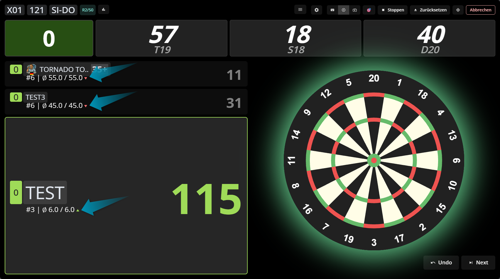

# Autodarts xConfig

> Visuelle Erweiterungen für Autodarts: bessere Lesbarkeit, klare Hinweise, Themes und optionale Effekte.  
> Die Spiellogik bleibt unverändert.

Für bestehende Nutzer fühlt sich alles vertraut an: Menüpunkt **AD xConfig**, Feature-Toggles, Theme-Einstellungen und lokale Speicherung.

[](https://raw.githubusercontent.com/thomasasen/autodarts-xconfig/main/dist/autodarts-xconfig.user.js)

## Für wen ist das?

Autodarts xConfig ist für Spieler gedacht, die in Matches schneller sehen wollen:

- ist ein Checkout möglich?
- welches Ziel ist gerade sinnvoll?
- wo ist sofortiger Druck in Cricket/Tactics?
- welche Informationen sollen klarer hervorgehoben werden?

Alles wird zentral im Spiel über **AD xConfig** ein- und ausgeschaltet.


## Schnellstart

1. Tampermonkey installieren: [tampermonkey.net](https://www.tampermonkey.net/)
2. Auf den Install-Button oben klicken
3. `https://play.autodarts.io/` neu laden
4. In der linken Navigation **AD xConfig** öffnen
5. Gewünschte Module aktivieren und Einstellungen anpassen

Wenn Tampermonkey einen Injection-Hinweis zeigt, aktiviere die empfohlene Browser-Einstellung:


## Was ist enthalten?

Aktuell sind 20 Module enthalten:

- 15 Animationen und Komfortfunktionen
- 5 Themes (Templates)

Standardmäßig ist `Checkout Score Pulse` aktiv, der Rest ist bewusst opt-in.

## Templates / Themes

### Theme X01

- Für: `X01`
- Fokus: klare Score- und Player-Bereiche
- Optionen: AVG, Hintergrundbild, Darstellung, Deckkraft, Spielerfeld-Transparenz


### Theme Shanghai

- Für: `Shanghai`
- Fokus: aufgeräumter Lesefluss


### Theme Bermuda

- Für: `Bermuda` (inklusive Varianten mit Namenszusatz)
- Fokus: klare Trennung wichtiger UI-Bereiche


### Theme Cricket

- Für: `Cricket` und `Tactics`
- Fokus: ruhiges Layout mit gutem Kontrast


### Theme Bull-off

- Für: `Bull-off` (inklusive Varianten mit Namenszusatz)
- Fokus: kontraststarke Score-Darstellung
- Zusatz: Kontrast-Preset (`Sanft`, `Standard`, `Kräftig`)


## Animationen und Komfort

### X01-Funktionen

- `Checkout Score Pulse`
- `Checkout Board Targets`
- `TV Board Zoom`
- `Style Checkout Suggestions`


Formatvarianten für Checkout Suggestions:


### Cricket / Tactics

- `Cricket Highlighter`
- `Cricket Grid FX`


### Funktionen für alle Modi

- `Average Trend Arrow`
- `Turn Start Sweep`
- `Triple/Double/Bull Hits`
- `Dart Marker Emphasis`
- `Dart Marker Darts`
- `Remove Darts Notification`
- `Single Bull Sound`
- `Turn Points Count`
- `Winner Fireworks`





## Konfiguration in AD xConfig

Im Panel gibt es zwei Tabs:

- `Themen`: Theme-spezifische Optionen und Hintergrundbild-Verwaltung
- `Animationen`: alle Animations- und Komfortmodule mit ihren Einstellungen

Die Einstellungen werden lokal gespeichert und nach einem Reload automatisch wiederhergestellt.

## Weitere Dokumentation

- [Feature-Übersicht](docs/FEATURES.md)
- [Technische Architektur](docs/TECHNICAL-ARCHITECTURE.md)
- [Legacy-Paritätsmatrix](docs/LEGACY-PARITY-MATRIX.md)

## Für Entwickler

```bash
npm install
npm run build
npm test
npm run verify
```
