# Autodarts xConfig

> Visuelle Erweiterungen für Autodarts: bessere Lesbarkeit, klarere Hinweise, Themes und optionale Effekte.  
> Die Spiellogik bleibt unverändert.

[](https://raw.githubusercontent.com/thomasasen/autodarts-xconfig/main/dist/autodarts-xconfig.user.js)

## Was ist AD xConfig?

`autodarts-xconfig` ergänzt Autodarts um Themes, Animationen und kleine Komfortfunktionen. Du kannst damit das Spiel übersichtlicher machen und die Oberfläche nach deinem Geschmack anpassen.

Alles wird direkt im Spiel im Menü **AD xConfig** eingestellt. Du musst nichts programmieren und keine Dateien ändern.

## Was bringt es mir?

- ruhigere oder auffälligere Themes
- besser sichtbare Hinweise für Checkouts, Spielerwechsel und Treffer
- Einstellungen direkt im Spiel statt in einzelnen Skripten
- eigene Hintergrundbilder für Themes

## Schnell loslegen

1. Tampermonkey installieren: [tampermonkey.net](https://www.tampermonkey.net/)
2. Oben auf `Installieren` klicken
3. `https://play.autodarts.io/` neu laden
4. Links in der Navigation **AD xConfig** öffnen
5. Erst `Themen` und `Animationen` in Ruhe ansehen, dann einzelne Module einschalten

Wichtiger Hinweis nach der Installation: Alle Themes sind zuerst ausgeschaltet. Die meisten Animationen und Komfortfunktionen sind ebenfalls aus. `Checkout Score Pulse` ist standardmäßig bereits eingeschaltet. Am einfachsten ist es, wenn du Themes und Animationen einzeln ausprobierst und Autodarts Schritt für Schritt an deine Wünsche anpasst.

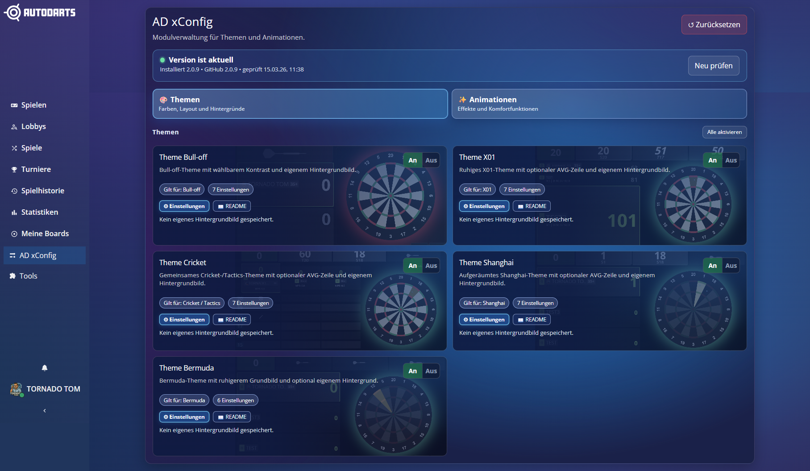


Wenn Tampermonkey einen Injection-Hinweis zeigt, aktiviere die empfohlene Browser-Einstellung:

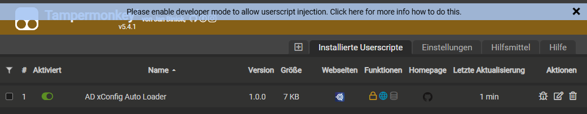

## Wo finde ich was?

- `Themen`: Hier findest du Farben, Layouts und Hintergründe.
- `Animationen`: Hier findest du Effekte und Komfortfunktionen.
- `⚙ Einstellungen`: Mit diesem Button öffnest du die Einstellungen einer Kachel.
- `📖 README`: Mit diesem Button springst du direkt zur passenden Stelle in dieser Dokumentation.
- An/Aus-Schalter: Hier schaltest du ein Modul direkt ein oder aus.

## Der obere Bereich im Menü

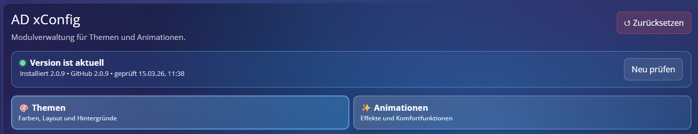

- `↺ Zurücksetzen`: Setzt alle Einstellungen auf Standard zurück und deaktiviert alle Module.
- Versionsstatus: Hier siehst du, ob deine Version aktuell ist, ob ein Update verfügbar ist oder ob die Update-Prüfung fehlgeschlagen ist.
- `Changelog` / `Was ist neu?`: Öffnet direkt die veröffentlichten Änderungen auf GitHub in einem neuen Tab.
- `Neu prüfen`: Startet sofort eine neue Update-Prüfung.
- `Themen` und `Animationen`: Mit diesen Buttons wechselst du zwischen beiden Bereichen.

## Updates erkennen und installieren

1. AD xConfig prüft direkt beim Start, ob auf GitHub eine neuere Version verfügbar ist.
2. Danach wird im Hintergrund weiter geprüft. Der Hintergrund-Timer läuft alle 15 Minuten. Wegen Zwischenspeicherung wird ohne Klick auf `Neu prüfen` höchstens ungefähr einmal pro Stunde wirklich online verglichen.
3. Wenn ein Update verfügbar ist, siehst du am Menüpunkt **AD xConfig** einen kleinen orangefarbenen Punkt.
4. Im geöffneten Menü erscheint die Meldung `Update verfügbar` mit dem Button `Update installieren`.
5. Direkt daneben führt `Was ist neu?` zum `CHANGELOG.md`, damit du vor dem Update die Änderungen prüfen kannst.
6. Ein Klick auf `Update installieren` öffnet die Userscript-Datei in einem neuen Tab. Tampermonkey übernimmt dort die Neuinstallation.
7. Es kann ein paar Sekunden dauern, bis Tampermonkey die Aufforderung zur Re-Installation anzeigt. Danach das Update einfach bestätigen.

## So ist eine Kachel aufgebaut

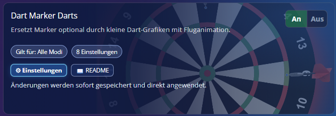

- Oben steht die Überschrift des Moduls.
- Darunter steht eine kurze Beschreibung, was das Modul macht.
- `Gilt für` zeigt dir, in welchen Spielmodi das Modul gedacht ist.
- Die Zahl bei `Einstellungen` zeigt, wie viele Einstellmöglichkeiten es gibt.
- `⚙ Einstellungen` öffnet das Einstellungsfenster dieser Kachel.
- `📖 README` öffnet direkt die passende Stelle in dieser `README.md`.
- Der Hinweis unten zeigt bei Themes zum Beispiel an, ob schon ein eigenes Hintergrundbild gespeichert ist.
- Der An/Aus-Schalter oben rechts ist die wichtigste Aktion: Hier schaltest du das Modul direkt ein oder aus.

## So sieht das Einstellungsfenster aus

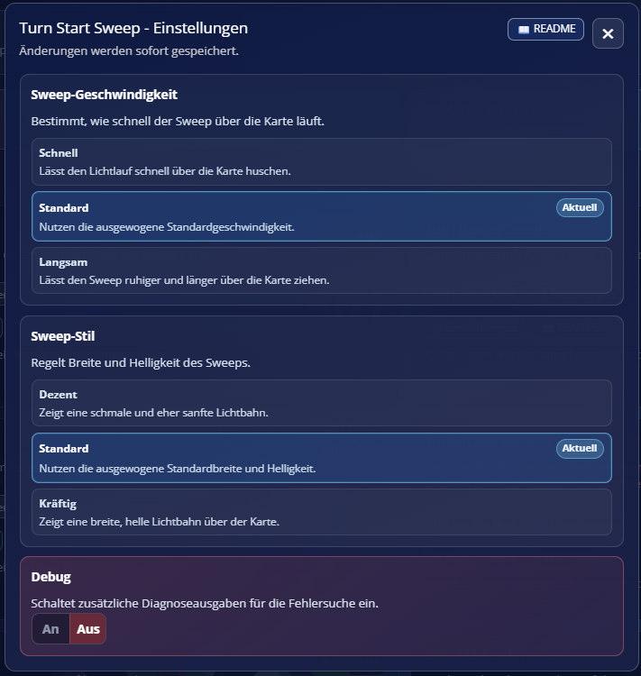

- Oben findest du wieder den Button `📖 README` für mehr Informationen zum gerade geöffneten Modul.
- Die Einstellungen sind in Gruppen aufgeteilt, damit du nicht alles auf einmal suchen musst.
- Viele Gruppen funktionieren wie eine Einzelauswahl. Meist ist pro Gruppe nur eine Option gleichzeitig aktiv.
- Die aktuell ausgewählte Option ist mit `Aktuell` markiert.
- Manche Einstellungen sind einfache An/Aus-Schalter.
- `Debug` ist nur für Entwicklung und Fehlersuche gedacht. Diese Option nur aktivieren, wenn du ausdrücklich dazu aufgefordert wirst. Sonst kann es zu unerwünschten Nebeneffekten kommen.

## Eigene Hintergrundbilder in Themes

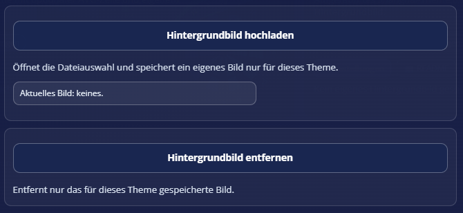

Bei den Themes kannst du ein eigenes Hintergrundbild hochladen und später auch wieder entfernen. Das Bild wird nur für das jeweilige Theme gespeichert.

Je nach Theme kannst du dein Hintergrundbild zusätzlich anpassen:

- `Hintergrund-Darstellung`: Hier legst du fest, wie das Bild platziert wird.
- `Hintergrundbild-Deckkraft`: Hier regelst du, wie stark das Bild sichtbar bleibt.
- `Spielerfelder-Transparenz`: Hier bestimmst du, wie stark die Spielerfelder den Hintergrund durchlassen.

Hinweis: Die Option `Debug` ist in allen Modulen nur für Fehlersuche gedacht. Im normalen Spielbetrieb sollte sie deaktiviert bleiben.

## Schnellnavigation

### Themen

- [Theme Bull-off](#template-autodarts-theme-bull-off)
- [Theme X01](#template-autodarts-theme-x01)
- [Theme Cricket](#template-autodarts-theme-cricket)
- [Theme Shanghai](#template-autodarts-theme-shanghai)
- [Theme Bermuda](#template-autodarts-theme-bermuda)

### Animationen und Komfort

- [Checkout Score Pulse](#animation-autodarts-animate-checkout-score-pulse)
- [X01 Score Progress](#animation-autodarts-x01-score-progress)
- [Checkout Board Targets](#animation-autodarts-animate-checkout-board-targets)
- [TV Board Zoom](#animation-autodarts-animate-tv-board-zoom)
- [Style Checkout Suggestions](#animation-autodarts-style-checkout-suggestions)
- [Average Trend Arrow](#animation-autodarts-animate-average-trend-arrow)
- [Turn Start Sweep](#animation-autodarts-animate-turn-start-sweep)
- [Triple/Double/Bull Hits](#animation-autodarts-animate-triple-double-bull-hits)
- [Cricket Highlighter](#animation-autodarts-animate-cricket-target-highlighter)
- [Cricket Grid FX](#animation-autodarts-animate-cricket-grid-fx)
- [Dart Marker Emphasis](#animation-autodarts-animate-dart-marker-emphasis)
- [Dart Marker Darts](#animation-autodarts-animate-dart-marker-darts)
- [Remove Darts Notification](#animation-autodarts-animate-remove-darts-notification)
- [Single Bull Sound](#animation-autodarts-animate-single-bull-sound)
- [Turn Points Count](#animation-autodarts-animate-turn-points-count)
- [Winner Fireworks](#animation-autodarts-animate-winner-fireworks)

## Themen

<a id="template-autodarts-theme-bull-off"></a>

### Theme Bull-off

- Gilt für: `Bull-off`
- Was macht es sichtbar? Ein kontrastbetontes Bull-off-Layout mit wählbarer Stärke und eigener Bildfläche.
- Grafisch: Das Theme verändert Farben, Kontrast und Flächen speziell für Bull-off. Ein optionales Hintergrundbild liegt dahinter, während der Spielaufbau gleich bleibt.
- Wann sinnvoll? Wenn Bull-off auf helleren Displays oder aus der Distanz klarer lesbar sein soll.

**Einstellungen einfach erklärt**

- `Kontrast-Preset`: Wählt, wie stark Texte, Flächen und Hervorhebungen im Bull-off-Theme voneinander abgesetzt werden. Grafisch wirkt `Sanft` zurückhaltender, `Kräftig` zeichnet Kanten und Kontraste deutlich härter.
  - `Sanft`: Die Bull-off-Oberfläche bleibt kontrastärmer. Rahmen, Glows und aktive Flächen wirken ruhiger und weniger hart voneinander getrennt.
  - `Standard`: Das Theme zeigt klare, aber noch ausgewogene Kanten, Rahmen und Hervorhebungen. Diese Stufe ist der Mittelweg zwischen ruhiger Fläche und deutlicher Lesbarkeit.
  - `Kräftig`: Rahmen, Glows und aktive Flächen treten sichtbar stärker hervor. Das Theme wirkt klarer, markanter und kontrastreicher.
- `Hintergrund-Darstellung`: Bestimmt, ob ein eigenes Theme-Bild den Bereich füllt, eingepasst wird, gestreckt erscheint, mittig ohne Skalierung liegt oder gekachelt wiederholt wird. Grafisch ändert sich die Bildplatzierung, nicht die Struktur des Themes.
  - `Füllen`: Das Bild legt sich wie ein Vollflächen-Hintergrund über den gesamten Spielbereich. Leere Ränder entstehen nicht, dafür können Randbereiche abgeschnitten werden.
  - `Einpassen`: Das komplette Bild bleibt sichtbar und wird in die verfügbare Fläche eingepasst. Wenn das Seitenverhältnis nicht passt, bleiben am Rand freie Bereiche des Themes sichtbar.
  - `Strecken`: Das Bild wird auf Breite und Höhe des Bereichs gestreckt. Dadurch wird alles ausgefüllt, aber Kreise, Personen oder Logos können sichtbar verzerrt wirken.
  - `Zentriert`: Das Bild sitzt mittig und bleibt in seiner natürlichen Größe. Ist es kleiner als der Bereich, bleibt rundherum der normale Theme-Hintergrund sichtbar.
  - `Kacheln`: Das Bild wird nicht skaliert, sondern links oben gestartet und über die Fläche wiederholt. Dadurch entsteht eher ein Musterteppich als ein einzelnes zentriertes Motiv.
- `Hintergrundbild-Deckkraft`: Steuert, wie stark das gespeicherte Hintergrundbild durch die dunkle Theme-Überlagerung durchscheint. Hohe Werte zeigen das Bild klarer, niedrige Werte dämpfen es stärker zugunsten der Lesbarkeit.
  - `100 %`: Das Hintergrundbild bleibt fast ohne dunkle Dämpfung sichtbar. Farben, Kontraste und Details treten sehr klar hervor.
  - `85 %`: Das Bild bleibt sehr präsent, wird aber leicht durch die dunkle Theme-Schicht beruhigt. Details bleiben klar lesbar, ohne ganz so dominant wie bei 100 % zu wirken.
  - `70 %`: Das Bild bleibt gut erkennbar, während die dunkle Überlagerung bereits spürbar für Ruhe sorgt. Motive und Farben sind noch klar da, aber weniger dominant.
  - `55 %`: Das Bild bleibt sichtbar, wird aber schon spürbar abgedunkelt. Dadurch wirkt die Fläche ruhiger und konkurriert weniger mit Texten und Karten.
  - `40 %`: Das Motiv bleibt sichtbar, rückt aber klar in den Hintergrund. Farbflächen und Konturen wirken gedämpfter und dienen mehr als Stimmung als als Hauptmotiv.
  - `25 %`: Das Bild schimmert eher subtil durch die dunkle Fläche. Einzelne Formen und Farben bleiben sichtbar, ohne die Lesbarkeit des Layouts zu stören.
  - `10 %`: Das Bild wird sehr stark gedämpft. Erkennbar bleiben meist nur grobe Formen, helle Bereiche oder größere Farbflächen.
- `Spielerfelder-Transparenz`: Passt die Transparenz der Spielerflächen an. Hohe Werte lassen mehr vom Hintergrund durch, niedrige Werte machen die Flächen geschlossener und ruhiger.
  - `0 %`: Die Spielerfelder bleiben fast vollständig geschlossen. Der Hintergrund tritt kaum durch und die Karten wirken sehr kompakt.
  - `5 %`: Die Spielerfelder bleiben überwiegend geschlossen, lassen aber minimal mehr Hintergrund durch als 0 %. Der Unterschied ist dezent, aber sichtbar ruhiger als höhere Stufen.
  - `10 %`: Die Spielerfelder bleiben klar lesbar, wirken aber nicht mehr komplett geschlossen. Das Hintergrundbild schimmert leicht durch die Flächen.
  - `15 %`: Die Spielerfelder wirken bereits lockerer und lassen das Hintergrundbild sichtbar mitspielen. Texte und Werte bleiben dabei weiter klar getrennt.
  - `30 %`: Der Hintergrund tritt nun klar hinter den Spielerfeldern hervor. Die Karten wirken leichter und weniger massiv als bei den niedrigen Stufen.
  - `45 %`: Die Spielerfelder wirken sichtbar glasiger. Das Hintergrundmotiv bleibt unter den Flächen deutlich erkennbar und prägt den Gesamteindruck stärker.
  - `60 %`: Die Spielerfelder lassen den Hintergrund sehr deutlich sichtbar werden. Diese Stufe wirkt am luftigsten, kann aber je nach Bild die Ruhe der Oberfläche reduzieren.
- `Debug`: Aktiviert zusätzliche Debug-Ausgaben und Diagnosehinweise. Für den normalen Spielbetrieb ist die Option nicht gedacht und sollte in der Regel ausgeschaltet bleiben.
- `Hintergrundbild hochladen`: Öffnet die Dateiauswahl und speichert das gewählte Bild ausschließlich für dieses Theme. Das Bild wird lokal gesichert und nach Reloads wieder für genau dieses Theme verwendet.
- `Hintergrundbild entfernen`: Löscht nur den lokalen Bild-Override dieses Themes. Das Theme bleibt aktiv, verwendet danach aber wieder kein eigenes gespeichertes Hintergrundbild.

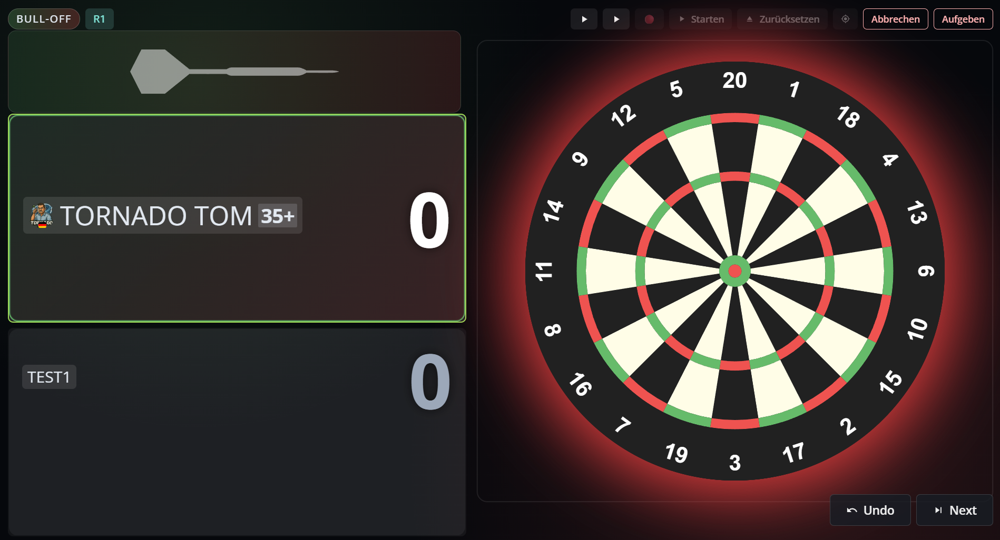

<a id="template-autodarts-theme-x01"></a>

### Theme X01

- Gilt für: `X01`
- Was macht es sichtbar? Ein ruhiges X01-Layout mit eigener Bildfläche und optionaler AVG-Zeile.
- Grafisch: Farben, Flächen und Karten werden neu gestaltet; ein eigenes Hintergrundbild liegt hinter dem Spielbereich, während die Grundstruktur des X01-Layouts erhalten bleibt.
- Wann sinnvoll? Wenn dir das Standardlayout zu unruhig ist oder du X01 optisch personalisieren möchtest.

**Einstellungen einfach erklärt**

- `AVG anzeigen`: Schaltet die AVG-Anzeige im X01-Theme sichtbar an oder aus. Grafisch bleibt das Layout gleich, nur der AVG-Bereich erscheint oder verschwindet.
- `Hintergrund-Darstellung`: Bestimmt, ob ein eigenes Theme-Bild den Bereich füllt, eingepasst wird, gestreckt erscheint, mittig ohne Skalierung liegt oder gekachelt wiederholt wird. Grafisch ändert sich die Bildplatzierung, nicht die Struktur des Themes.
  - `Füllen`: Das Bild legt sich wie ein Vollflächen-Hintergrund über den gesamten Spielbereich. Leere Ränder entstehen nicht, dafür können Randbereiche abgeschnitten werden.
  - `Einpassen`: Das komplette Bild bleibt sichtbar und wird in die verfügbare Fläche eingepasst. Wenn das Seitenverhältnis nicht passt, bleiben am Rand freie Bereiche des Themes sichtbar.
  - `Strecken`: Das Bild wird auf Breite und Höhe des Bereichs gestreckt. Dadurch wird alles ausgefüllt, aber Kreise, Personen oder Logos können sichtbar verzerrt wirken.
  - `Zentriert`: Das Bild sitzt mittig und bleibt in seiner natürlichen Größe. Ist es kleiner als der Bereich, bleibt rundherum der normale Theme-Hintergrund sichtbar.
  - `Kacheln`: Das Bild wird nicht skaliert, sondern links oben gestartet und über die Fläche wiederholt. Dadurch entsteht eher ein Musterteppich als ein einzelnes zentriertes Motiv.
- `Hintergrundbild-Deckkraft`: Steuert, wie stark das gespeicherte Hintergrundbild durch die dunkle Theme-Überlagerung durchscheint. Hohe Werte zeigen das Bild klarer, niedrige Werte dämpfen es stärker zugunsten der Lesbarkeit.
  - `100 %`: Das Hintergrundbild bleibt fast ohne dunkle Dämpfung sichtbar. Farben, Kontraste und Details treten sehr klar hervor.
  - `85 %`: Das Bild bleibt sehr präsent, wird aber leicht durch die dunkle Theme-Schicht beruhigt. Details bleiben klar lesbar, ohne ganz so dominant wie bei 100 % zu wirken.
  - `70 %`: Das Bild bleibt gut erkennbar, während die dunkle Überlagerung bereits spürbar für Ruhe sorgt. Motive und Farben sind noch klar da, aber weniger dominant.
  - `55 %`: Das Bild bleibt sichtbar, wird aber schon spürbar abgedunkelt. Dadurch wirkt die Fläche ruhiger und konkurriert weniger mit Texten und Karten.
  - `40 %`: Das Motiv bleibt sichtbar, rückt aber klar in den Hintergrund. Farbflächen und Konturen wirken gedämpfter und dienen mehr als Stimmung als als Hauptmotiv.
  - `25 %`: Das Bild schimmert eher subtil durch die dunkle Fläche. Einzelne Formen und Farben bleiben sichtbar, ohne die Lesbarkeit des Layouts zu stören.
  - `10 %`: Das Bild wird sehr stark gedämpft. Erkennbar bleiben meist nur grobe Formen, helle Bereiche oder größere Farbflächen.
- `Spielerfelder-Transparenz`: Passt die Transparenz der Spielerflächen an. Hohe Werte lassen mehr vom Hintergrund durch, niedrige Werte machen die Flächen geschlossener und ruhiger.
  - `0 %`: Die Spielerfelder bleiben fast vollständig geschlossen. Der Hintergrund tritt kaum durch und die Karten wirken sehr kompakt.
  - `5 %`: Die Spielerfelder bleiben überwiegend geschlossen, lassen aber minimal mehr Hintergrund durch als 0 %. Der Unterschied ist dezent, aber sichtbar ruhiger als höhere Stufen.
  - `10 %`: Die Spielerfelder bleiben klar lesbar, wirken aber nicht mehr komplett geschlossen. Das Hintergrundbild schimmert leicht durch die Flächen.
  - `15 %`: Die Spielerfelder wirken bereits lockerer und lassen das Hintergrundbild sichtbar mitspielen. Texte und Werte bleiben dabei weiter klar getrennt.
  - `30 %`: Der Hintergrund tritt nun klar hinter den Spielerfeldern hervor. Die Karten wirken leichter und weniger massiv als bei den niedrigen Stufen.
  - `45 %`: Die Spielerfelder wirken sichtbar glasiger. Das Hintergrundmotiv bleibt unter den Flächen deutlich erkennbar und prägt den Gesamteindruck stärker.
  - `60 %`: Die Spielerfelder lassen den Hintergrund sehr deutlich sichtbar werden. Diese Stufe wirkt am luftigsten, kann aber je nach Bild die Ruhe der Oberfläche reduzieren.
- `Debug`: Aktiviert zusätzliche Debug-Ausgaben und Diagnosehinweise. Für den normalen Spielbetrieb ist die Option nicht gedacht und sollte in der Regel ausgeschaltet bleiben.
- `Hintergrundbild hochladen`: Öffnet die Dateiauswahl und speichert das gewählte Bild ausschließlich für dieses Theme. Das Bild wird lokal gesichert und nach Reloads wieder für genau dieses Theme verwendet.
- `Hintergrundbild entfernen`: Löscht nur den lokalen Bild-Override dieses Themes. Das Theme bleibt aktiv, verwendet danach aber wieder kein eigenes gespeichertes Hintergrundbild.


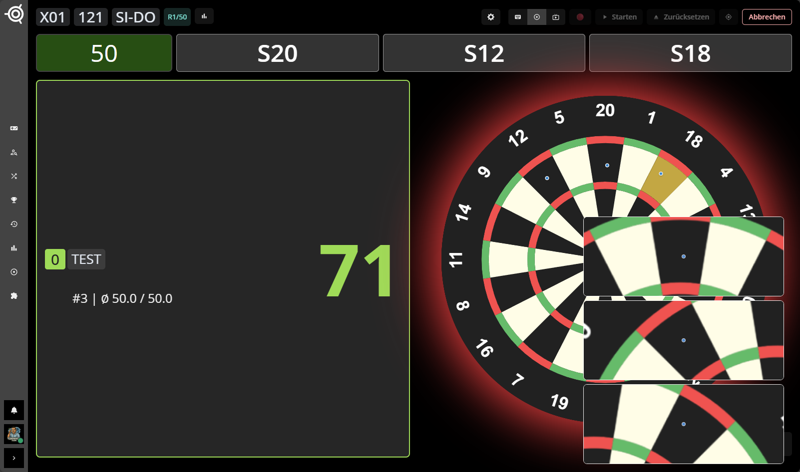
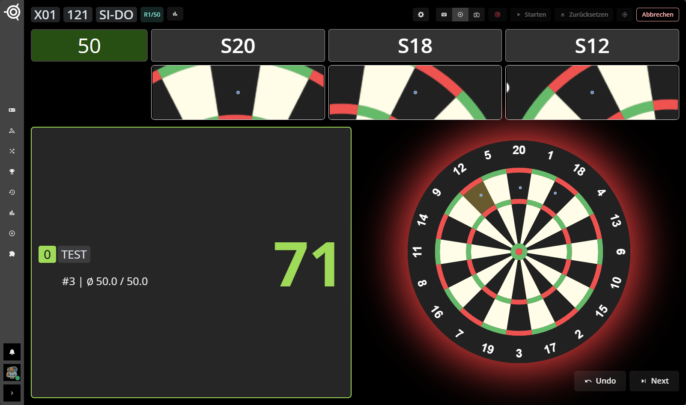

<a id="template-autodarts-theme-cricket"></a>

### Theme Cricket

- Gilt für: `Cricket`, `Tactics`
- Was macht es sichtbar? Ein gemeinsames Theme für Cricket und Tactics mit ruhigerer Grundoptik und optionaler AVG-Zeile.
- Grafisch: Farben, Karten und Hintergründe werden auf eine gemeinsame Cricket-/Tactics-Optik gezogen. Ein eigenes Bild kann hinter dem Spielbereich liegen, ohne die Board- oder Grid-Logik zu verändern.
- Wann sinnvoll? Wenn du für Cricket und Tactics eine einheitliche visuelle Basis möchtest, besonders zusammen mit den Cricket-Effekten.

**Einstellungen einfach erklärt**

- `AVG anzeigen`: Schaltet die AVG-Anzeige im Cricket-/Tactics-Theme an oder aus. Grafisch bleibt das Theme gleich; nur der AVG-Bereich erscheint oder verschwindet.
- `Hintergrund-Darstellung`: Bestimmt, ob ein eigenes Theme-Bild den Bereich füllt, eingepasst wird, gestreckt erscheint, mittig ohne Skalierung liegt oder gekachelt wiederholt wird. Grafisch ändert sich die Bildplatzierung, nicht die Struktur des Themes.
  - `Füllen`: Das Bild legt sich wie ein Vollflächen-Hintergrund über den gesamten Spielbereich. Leere Ränder entstehen nicht, dafür können Randbereiche abgeschnitten werden.
  - `Einpassen`: Das komplette Bild bleibt sichtbar und wird in die verfügbare Fläche eingepasst. Wenn das Seitenverhältnis nicht passt, bleiben am Rand freie Bereiche des Themes sichtbar.
  - `Strecken`: Das Bild wird auf Breite und Höhe des Bereichs gestreckt. Dadurch wird alles ausgefüllt, aber Kreise, Personen oder Logos können sichtbar verzerrt wirken.
  - `Zentriert`: Das Bild sitzt mittig und bleibt in seiner natürlichen Größe. Ist es kleiner als der Bereich, bleibt rundherum der normale Theme-Hintergrund sichtbar.
  - `Kacheln`: Das Bild wird nicht skaliert, sondern links oben gestartet und über die Fläche wiederholt. Dadurch entsteht eher ein Musterteppich als ein einzelnes zentriertes Motiv.
- `Hintergrundbild-Deckkraft`: Steuert, wie stark das gespeicherte Hintergrundbild durch die dunkle Theme-Überlagerung durchscheint. Hohe Werte zeigen das Bild klarer, niedrige Werte dämpfen es stärker zugunsten der Lesbarkeit.
  - `100 %`: Das Hintergrundbild bleibt fast ohne dunkle Dämpfung sichtbar. Farben, Kontraste und Details treten sehr klar hervor.
  - `85 %`: Das Bild bleibt sehr präsent, wird aber leicht durch die dunkle Theme-Schicht beruhigt. Details bleiben klar lesbar, ohne ganz so dominant wie bei 100 % zu wirken.
  - `70 %`: Das Bild bleibt gut erkennbar, während die dunkle Überlagerung bereits spürbar für Ruhe sorgt. Motive und Farben sind noch klar da, aber weniger dominant.
  - `55 %`: Das Bild bleibt sichtbar, wird aber schon spürbar abgedunkelt. Dadurch wirkt die Fläche ruhiger und konkurriert weniger mit Texten und Karten.
  - `40 %`: Das Motiv bleibt sichtbar, rückt aber klar in den Hintergrund. Farbflächen und Konturen wirken gedämpfter und dienen mehr als Stimmung als als Hauptmotiv.
  - `25 %`: Das Bild schimmert eher subtil durch die dunkle Fläche. Einzelne Formen und Farben bleiben sichtbar, ohne die Lesbarkeit des Layouts zu stören.
  - `10 %`: Das Bild wird sehr stark gedämpft. Erkennbar bleiben meist nur grobe Formen, helle Bereiche oder größere Farbflächen.
- `Spielerfelder-Transparenz`: Passt die Transparenz der Spielerflächen an. Hohe Werte lassen mehr vom Hintergrund durch, niedrige Werte machen die Flächen geschlossener und ruhiger.
  - `0 %`: Die Spielerfelder bleiben fast vollständig geschlossen. Der Hintergrund tritt kaum durch und die Karten wirken sehr kompakt.
  - `5 %`: Die Spielerfelder bleiben überwiegend geschlossen, lassen aber minimal mehr Hintergrund durch als 0 %. Der Unterschied ist dezent, aber sichtbar ruhiger als höhere Stufen.
  - `10 %`: Die Spielerfelder bleiben klar lesbar, wirken aber nicht mehr komplett geschlossen. Das Hintergrundbild schimmert leicht durch die Flächen.
  - `15 %`: Die Spielerfelder wirken bereits lockerer und lassen das Hintergrundbild sichtbar mitspielen. Texte und Werte bleiben dabei weiter klar getrennt.
  - `30 %`: Der Hintergrund tritt nun klar hinter den Spielerfeldern hervor. Die Karten wirken leichter und weniger massiv als bei den niedrigen Stufen.
  - `45 %`: Die Spielerfelder wirken sichtbar glasiger. Das Hintergrundmotiv bleibt unter den Flächen deutlich erkennbar und prägt den Gesamteindruck stärker.
  - `60 %`: Die Spielerfelder lassen den Hintergrund sehr deutlich sichtbar werden. Diese Stufe wirkt am luftigsten, kann aber je nach Bild die Ruhe der Oberfläche reduzieren.
- `Debug`: Aktiviert zusätzliche Debug-Ausgaben und Diagnosehinweise. Für den normalen Spielbetrieb ist die Option nicht gedacht und sollte in der Regel ausgeschaltet bleiben.
- `Hintergrundbild hochladen`: Öffnet die Dateiauswahl und speichert das gewählte Bild ausschließlich für dieses Theme. Das Bild wird lokal gesichert und nach Reloads wieder für genau dieses Theme verwendet.
- `Hintergrundbild entfernen`: Löscht nur den lokalen Bild-Override dieses Themes. Das Theme bleibt aktiv, verwendet danach aber wieder kein eigenes gespeichertes Hintergrundbild.


<a id="template-autodarts-theme-shanghai"></a>

### Theme Shanghai

- Gilt für: `Shanghai`
- Was macht es sichtbar? Ein aufgeräumtes Shanghai-Layout mit optionaler AVG-Zeile und ruhigerem Kontrast.
- Grafisch: Das Theme ordnet Flächen und Farben neu, ohne den Spielaufbau zu verändern. Ein eigenes Hintergrundbild liegt hinter der Oberfläche und kann die Wirkung zusätzlich prägen.
- Wann sinnvoll? Wenn du in Shanghai mehr Struktur und weniger visuelle Unruhe möchtest.

**Einstellungen einfach erklärt**

- `AVG anzeigen`: Schaltet die AVG-Anzeige im Shanghai-Theme sichtbar an oder aus. Das restliche Theme bleibt unverändert; nur der AVG-Bereich wird ein- oder ausgeblendet.
- `Hintergrund-Darstellung`: Bestimmt, ob ein eigenes Theme-Bild den Bereich füllt, eingepasst wird, gestreckt erscheint, mittig ohne Skalierung liegt oder gekachelt wiederholt wird. Grafisch ändert sich die Bildplatzierung, nicht die Struktur des Themes.
  - `Füllen`: Das Bild legt sich wie ein Vollflächen-Hintergrund über den gesamten Spielbereich. Leere Ränder entstehen nicht, dafür können Randbereiche abgeschnitten werden.
  - `Einpassen`: Das komplette Bild bleibt sichtbar und wird in die verfügbare Fläche eingepasst. Wenn das Seitenverhältnis nicht passt, bleiben am Rand freie Bereiche des Themes sichtbar.
  - `Strecken`: Das Bild wird auf Breite und Höhe des Bereichs gestreckt. Dadurch wird alles ausgefüllt, aber Kreise, Personen oder Logos können sichtbar verzerrt wirken.
  - `Zentriert`: Das Bild sitzt mittig und bleibt in seiner natürlichen Größe. Ist es kleiner als der Bereich, bleibt rundherum der normale Theme-Hintergrund sichtbar.
  - `Kacheln`: Das Bild wird nicht skaliert, sondern links oben gestartet und über die Fläche wiederholt. Dadurch entsteht eher ein Musterteppich als ein einzelnes zentriertes Motiv.
- `Hintergrundbild-Deckkraft`: Steuert, wie stark das gespeicherte Hintergrundbild durch die dunkle Theme-Überlagerung durchscheint. Hohe Werte zeigen das Bild klarer, niedrige Werte dämpfen es stärker zugunsten der Lesbarkeit.
  - `100 %`: Das Hintergrundbild bleibt fast ohne dunkle Dämpfung sichtbar. Farben, Kontraste und Details treten sehr klar hervor.
  - `85 %`: Das Bild bleibt sehr präsent, wird aber leicht durch die dunkle Theme-Schicht beruhigt. Details bleiben klar lesbar, ohne ganz so dominant wie bei 100 % zu wirken.
  - `70 %`: Das Bild bleibt gut erkennbar, während die dunkle Überlagerung bereits spürbar für Ruhe sorgt. Motive und Farben sind noch klar da, aber weniger dominant.
  - `55 %`: Das Bild bleibt sichtbar, wird aber schon spürbar abgedunkelt. Dadurch wirkt die Fläche ruhiger und konkurriert weniger mit Texten und Karten.
  - `40 %`: Das Motiv bleibt sichtbar, rückt aber klar in den Hintergrund. Farbflächen und Konturen wirken gedämpfter und dienen mehr als Stimmung als als Hauptmotiv.
  - `25 %`: Das Bild schimmert eher subtil durch die dunkle Fläche. Einzelne Formen und Farben bleiben sichtbar, ohne die Lesbarkeit des Layouts zu stören.
  - `10 %`: Das Bild wird sehr stark gedämpft. Erkennbar bleiben meist nur grobe Formen, helle Bereiche oder größere Farbflächen.
- `Spielerfelder-Transparenz`: Passt die Transparenz der Spielerflächen an. Hohe Werte lassen mehr vom Hintergrund durch, niedrige Werte machen die Flächen geschlossener und ruhiger.
  - `0 %`: Die Spielerfelder bleiben fast vollständig geschlossen. Der Hintergrund tritt kaum durch und die Karten wirken sehr kompakt.
  - `5 %`: Die Spielerfelder bleiben überwiegend geschlossen, lassen aber minimal mehr Hintergrund durch als 0 %. Der Unterschied ist dezent, aber sichtbar ruhiger als höhere Stufen.
  - `10 %`: Die Spielerfelder bleiben klar lesbar, wirken aber nicht mehr komplett geschlossen. Das Hintergrundbild schimmert leicht durch die Flächen.
  - `15 %`: Die Spielerfelder wirken bereits lockerer und lassen das Hintergrundbild sichtbar mitspielen. Texte und Werte bleiben dabei weiter klar getrennt.
  - `30 %`: Der Hintergrund tritt nun klar hinter den Spielerfeldern hervor. Die Karten wirken leichter und weniger massiv als bei den niedrigen Stufen.
  - `45 %`: Die Spielerfelder wirken sichtbar glasiger. Das Hintergrundmotiv bleibt unter den Flächen deutlich erkennbar und prägt den Gesamteindruck stärker.
  - `60 %`: Die Spielerfelder lassen den Hintergrund sehr deutlich sichtbar werden. Diese Stufe wirkt am luftigsten, kann aber je nach Bild die Ruhe der Oberfläche reduzieren.
- `Debug`: Aktiviert zusätzliche Debug-Ausgaben und Diagnosehinweise. Für den normalen Spielbetrieb ist die Option nicht gedacht und sollte in der Regel ausgeschaltet bleiben.
- `Hintergrundbild hochladen`: Öffnet die Dateiauswahl und speichert das gewählte Bild ausschließlich für dieses Theme. Das Bild wird lokal gesichert und nach Reloads wieder für genau dieses Theme verwendet.
- `Hintergrundbild entfernen`: Löscht nur den lokalen Bild-Override dieses Themes. Das Theme bleibt aktiv, verwendet danach aber wieder kein eigenes gespeichertes Hintergrundbild.


<a id="template-autodarts-theme-bermuda"></a>

### Theme Bermuda

- Gilt für: `Bermuda`
- Was macht es sichtbar? Ein ruhigeres Bermuda-Layout mit eigener Bildfläche im Hintergrund.
- Grafisch: Das Theme passt Farben und Flächen für Bermuda an; ein gespeichertes Hintergrundbild liegt hinter dem Spielbereich, während die Bermuda-Anordnung selbst erhalten bleibt.
- Wann sinnvoll? Wenn Bermuda besser lesbar sein soll, ohne viele Zusatzschalter zu benötigen.

**Einstellungen einfach erklärt**

- `Hintergrund-Darstellung`: Bestimmt, ob ein eigenes Theme-Bild den Bereich füllt, eingepasst wird, gestreckt erscheint, mittig ohne Skalierung liegt oder gekachelt wiederholt wird. Grafisch ändert sich die Bildplatzierung, nicht die Struktur des Themes.
  - `Füllen`: Das Bild legt sich wie ein Vollflächen-Hintergrund über den gesamten Spielbereich. Leere Ränder entstehen nicht, dafür können Randbereiche abgeschnitten werden.
  - `Einpassen`: Das komplette Bild bleibt sichtbar und wird in die verfügbare Fläche eingepasst. Wenn das Seitenverhältnis nicht passt, bleiben am Rand freie Bereiche des Themes sichtbar.
  - `Strecken`: Das Bild wird auf Breite und Höhe des Bereichs gestreckt. Dadurch wird alles ausgefüllt, aber Kreise, Personen oder Logos können sichtbar verzerrt wirken.
  - `Zentriert`: Das Bild sitzt mittig und bleibt in seiner natürlichen Größe. Ist es kleiner als der Bereich, bleibt rundherum der normale Theme-Hintergrund sichtbar.
  - `Kacheln`: Das Bild wird nicht skaliert, sondern links oben gestartet und über die Fläche wiederholt. Dadurch entsteht eher ein Musterteppich als ein einzelnes zentriertes Motiv.
- `Hintergrundbild-Deckkraft`: Steuert, wie stark das gespeicherte Hintergrundbild durch die dunkle Theme-Überlagerung durchscheint. Hohe Werte zeigen das Bild klarer, niedrige Werte dämpfen es stärker zugunsten der Lesbarkeit.
  - `100 %`: Das Hintergrundbild bleibt fast ohne dunkle Dämpfung sichtbar. Farben, Kontraste und Details treten sehr klar hervor.
  - `85 %`: Das Bild bleibt sehr präsent, wird aber leicht durch die dunkle Theme-Schicht beruhigt. Details bleiben klar lesbar, ohne ganz so dominant wie bei 100 % zu wirken.
  - `70 %`: Das Bild bleibt gut erkennbar, während die dunkle Überlagerung bereits spürbar für Ruhe sorgt. Motive und Farben sind noch klar da, aber weniger dominant.
  - `55 %`: Das Bild bleibt sichtbar, wird aber schon spürbar abgedunkelt. Dadurch wirkt die Fläche ruhiger und konkurriert weniger mit Texten und Karten.
  - `40 %`: Das Motiv bleibt sichtbar, rückt aber klar in den Hintergrund. Farbflächen und Konturen wirken gedämpfter und dienen mehr als Stimmung als als Hauptmotiv.
  - `25 %`: Das Bild schimmert eher subtil durch die dunkle Fläche. Einzelne Formen und Farben bleiben sichtbar, ohne die Lesbarkeit des Layouts zu stören.
  - `10 %`: Das Bild wird sehr stark gedämpft. Erkennbar bleiben meist nur grobe Formen, helle Bereiche oder größere Farbflächen.
- `Spielerfelder-Transparenz`: Passt die Transparenz der Spielerflächen an. Hohe Werte lassen mehr vom Hintergrund durch, niedrige Werte machen die Flächen geschlossener und ruhiger.
  - `0 %`: Die Spielerfelder bleiben fast vollständig geschlossen. Der Hintergrund tritt kaum durch und die Karten wirken sehr kompakt.
  - `5 %`: Die Spielerfelder bleiben überwiegend geschlossen, lassen aber minimal mehr Hintergrund durch als 0 %. Der Unterschied ist dezent, aber sichtbar ruhiger als höhere Stufen.
  - `10 %`: Die Spielerfelder bleiben klar lesbar, wirken aber nicht mehr komplett geschlossen. Das Hintergrundbild schimmert leicht durch die Flächen.
  - `15 %`: Die Spielerfelder wirken bereits lockerer und lassen das Hintergrundbild sichtbar mitspielen. Texte und Werte bleiben dabei weiter klar getrennt.
  - `30 %`: Der Hintergrund tritt nun klar hinter den Spielerfeldern hervor. Die Karten wirken leichter und weniger massiv als bei den niedrigen Stufen.
  - `45 %`: Die Spielerfelder wirken sichtbar glasiger. Das Hintergrundmotiv bleibt unter den Flächen deutlich erkennbar und prägt den Gesamteindruck stärker.
  - `60 %`: Die Spielerfelder lassen den Hintergrund sehr deutlich sichtbar werden. Diese Stufe wirkt am luftigsten, kann aber je nach Bild die Ruhe der Oberfläche reduzieren.
- `Debug`: Aktiviert zusätzliche Debug-Ausgaben und Diagnosehinweise. Für den normalen Spielbetrieb ist die Option nicht gedacht und sollte in der Regel ausgeschaltet bleiben.
- `Hintergrundbild hochladen`: Öffnet die Dateiauswahl und speichert das gewählte Bild ausschließlich für dieses Theme. Das Bild wird lokal gesichert und nach Reloads wieder für genau dieses Theme verwendet.
- `Hintergrundbild entfernen`: Löscht nur den lokalen Bild-Override dieses Themes. Das Theme bleibt aktiv, verwendet danach aber wieder kein eigenes gespeichertes Hintergrundbild.

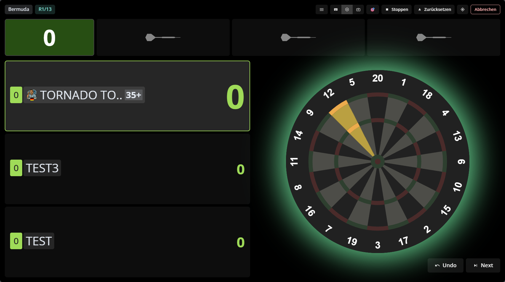

## Animationen und Komfort

<a id="animation-autodarts-animate-checkout-score-pulse"></a>

### Checkout Score Pulse

- Gilt für: `X01`
- Was macht es sichtbar? Finishfähige Restwerte werden direkt an der aktiven Punktzahl hervorgehoben.
- Grafisch: Die aktive Restpunktzahl pulsiert, glüht, skaliert oder blinkt je nach gewähltem Effekt. Die Hervorhebung sitzt direkt am Score und verändert keine anderen UI-Bereiche.
- Wann sinnvoll? Wenn du Checkout-Momente schneller am Score erkennen möchtest.

**Einstellungen einfach erklärt**

- `Effekt`: Legt fest, wie die aktive Restpunktzahl hervorgehoben wird, sobald das Modul ein Checkout erkennt. Grafisch ändert sich nur die Animationsart des Score-Elements.
  - `Pulse`: Die Zahl wächst und leuchtet rhythmisch leicht an und fällt wieder auf ihre Ausgangsform zurück. Das wirkt wie ein ruhiger Herzschlag direkt auf dem Score.
  - `Glow`: Die Zahl bleibt weitgehend ruhig an Ort und Größe, bekommt aber einen sichtbar stärker werdenden Leuchtkranz. Das eignet sich für Nutzer, die eher Licht als Bewegung wollen.
  - `Scale`: Die Zahl springt nicht hart, sondern wächst kurz auf und fällt wieder zurück. Im Gegensatz zu `Glow` steht hier die Größenänderung stärker im Vordergrund als der Lichtschein.
  - `Blink`: Die Zahl bleibt an derselben Stelle, verliert aber im Takt sichtbar an Deckkraft und wird wieder voll sichtbar. Das ist die auffälligste und härteste Variante.
- `Farbthema`: Bestimmt die Farbe, mit der die aktive Restpunktzahl hervorgehoben wird. Die gewählte Farbe steuert Glanz, Schatten und das visuelle Gewicht des Effekts.
  - `Autodarts Grün`: Der Effekt erscheint in einem frischen Grün und wirkt wie ein positives Finish-Signal. Das passt besonders gut zum Autodarts-Grundlook.
  - `Cyan`: Der Score bekommt einen kühlen, technischer wirkenden Cyan-Schimmer. Das hebt sich sichtbar vom Standardgrün ab, ohne aggressiv zu wirken.
  - `Amber`: Die Punktzahl wirkt mit einem goldgelben bis bernsteinfarbenen Schein wärmer und auffälliger. Das ist optisch näher an Warnlicht als das grüne Preset.
  - `Rot`: Die Zahl erhält einen roten Leuchteffekt und wirkt dadurch am alarmierendsten. Das fällt sofort auf, kann aber deutlich aggressiver wirken als die anderen Farbvarianten.
- `Intensität`: Steuert Skalierung, Leuchtstärke und Sichtbarkeit des Checkout-Score-Effekts. `Dezent` bleibt zurückhaltend, `Stark` wirkt deutlich auffälliger.
  - `Dezent`: Größe, Leuchtstärke und Deckkraft ändern sich nur moderat. Der Effekt ist erkennbar, ohne den Score dauerhaft zu dominieren.
  - `Standard`: Der Effekt ist klar sichtbar, ohne übermäßig hart zu wirken. Das ist die Standardbalance zwischen Aufmerksamkeit und Ruhe.
  - `Stark`: Glow, Skalierung und Sichtbarkeitswechsel werden deutlich stärker. Die Zahl springt dir optisch am schnellsten ins Auge.
- `Trigger-Quelle`: Bestimmt, woran das Modul das Checkout erkennt. `Vorschlag zuerst` nutzt den sichtbaren Checkout-Vorschlag bevorzugt und fällt nur ohne Vorschlag auf die reine Score-Prüfung zurück; die anderen Modi erzwingen ausschließlich Score- oder Vorschlagslogik.
  - `Vorschlag zuerst`: Der Effekt folgt bevorzugt dem angezeigten Suggestion-Block. Nur wenn dort nichts Verwertbares steht, entscheidet die reine Score-Prüfung.
  - `Nur Score`: Der sichtbare Suggestion-Text spielt keine Rolle. Sobald der Restwert nach den Out-Regeln finishbar ist, wird der Effekt gezeigt.
  - `Nur Vorschlag`: Der Effekt erscheint nur dann, wenn das Modul auch tatsächlich einen Suggestion-Hinweis erkennt. Ein finishbarer Score ohne Vorschlag bleibt ohne Effekt.
- `Debug`: Aktiviert zusätzliche Debug-Ausgaben und Diagnosehinweise. Für den normalen Spielbetrieb ist die Option nicht gedacht und sollte in der Regel ausgeschaltet bleiben.

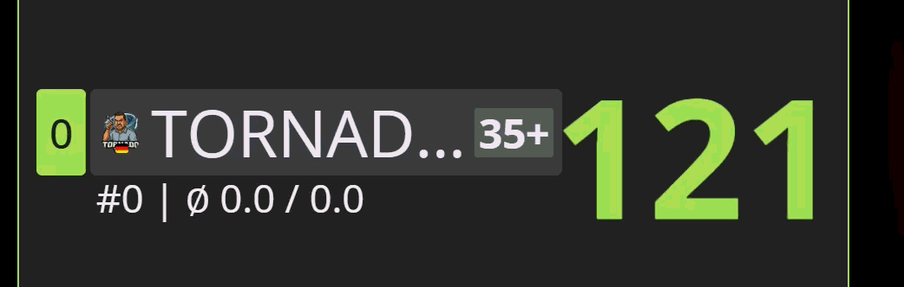

<a id="animation-autodarts-x01-score-progress"></a>

### X01 Score Progress

- Gilt für: `X01`
- Was macht es sichtbar? Jede X01-Spielerkarte erhält einen Balken, der den verbleibenden Score relativ zum Startwert zeigt.
- Grafisch: Direkt unter der Punktzahl liegt ein horizontaler Fortschrittsbalken. Aktive Spieler erhalten eine kräftigere, präsentere Darstellung mit optionalem Effekt, inaktive Karten bleiben flacher und unverändert ruhig. Je näher der Restwert an `0` liegt, desto kürzer wird der Balken.
- Wann sinnvoll? Wenn du Reststände und den Abstand zwischen Spielern in X01 schneller auf einen Blick erfassen möchtest.

**Einstellungen einfach erklärt**

- `Farben`: Enthält sowohl feste Farbpaletten als auch dynamische Schwellenmodi. So kannst du den Balken statisch einfärben oder die Farbe abhängig von Score/Prozent wechseln.
  - `Checkout Focus`: Färbt den Balken abhängig vom Restscore mit Fokus auf den Bereich bis `170` und steigert die visuelle Dringlichkeit in Checkout-Nähe.
  - `Traffic Light`: Nutzt feste Prozentstufen des verbleibenden Scores. Viel Rest = eher Rot, mittlerer Bereich = Amber, niedriger Rest = Grün.
  - `Danger Endgame`: Wechselt in den niedrigen Restwertbereichen aggressiver in warme Warnfarben und hebt kritische Endgame-Situationen deutlich hervor.
  - `Gradient Progress`: Der Balken läuft ohne harte Stufen über einen weichen Verlauf von warm nach kalt beziehungsweise zurück, abhängig vom verbleibenden Prozentwert.
  - `Autodarts`: Setzt den Balken auf eine markennahe blau-cyan Palette mit klarer Lesbarkeit auf dunklen Flächen.
  - `Signal Lime`: Bleibt konstant im grün-limetten Signalbereich und wirkt präsent, ohne dynamische Schwellenwechsel.
  - `Glass Mint`: Wirkt frischer und leichter als klassische Grünpaletten und bleibt auf dunklen Flächen klar und modern.
  - `Ember Rush`: Setzt den Balken dauerhaft auf eine energische, warme Palette mit hoher Aufmerksamkeit.
  - `Ice Circuit`: Bleibt technisch-kühl und klar, mit hoher Differenzierung auf dunklen Boards.
  - `Neon Violet`: Erzeugt einen modernen, kontrastreichen Look mit leicht futuristischer Wirkung.
  - `Sunset Amber`: Wirkt warm und atmosphärisch, bleibt aber durch hohe Helligkeitskontraste gut lesbar.
  - `Monochrome Steel`: Reduziert die Farbsignalik bewusst auf kühle Grauwerte für ein zurückhaltendes, technisches Erscheinungsbild.
- `Balkengröße`: Vergrößert oder verkleinert die Balkenhöhe für aktive Spieler zwischen `Schmal` und `Extrabreit`. Inaktive Spieler bleiben bewusst unverändert.
  - `Schmal`: Nimmt weniger vertikalen Raum ein und wirkt am zurückhaltendsten.
  - `Standard`: Balanciert Präsenz und Zurückhaltung und passt in der Regel am besten zum Standardlayout.
  - `Breit`: Der aktive Balken wird deutlicher und aus größerer Distanz schneller wahrgenommen.
  - `Extrabreit`: Stellt den aktiven Balken sehr dominant dar und priorisiert maximale Sichtbarkeit.
- `Effekt`: Bestimmt, ob und wie stark der aktive Balken zusätzlich animiert wird. Inaktive Spieler bleiben vom gewählten Effekt unberührt und behalten ihre ruhige Standarddarstellung.
  - `Pulse Core`: Der Balken pulsiert mit einer klar sichtbaren inneren Kernbewegung und bleibt dadurch dauerhaft präsent.
  - `Glass Charge`: Eine helle, glatte Spiegelung läuft durch den aktiven Balken und erzeugt eine sichtbar aufgeladene Glasschicht.
  - `Segment Drain`: Der aktive Balken wirkt sichtbar segmentiert und verliert seine Energie in klaren, technischen Abschnitten statt als glatte Fläche.
  - `Ghost Trail`: Bei Scoreänderungen bleibt kurz eine halbtransparente Spur der vorherigen Länge sichtbar und läuft dann in den neuen Stand aus.
  - `Signal Sweep`: Ein enger, heller Sweep schneidet regelmäßig über den aktiven Balken und sorgt für maximale Signalwirkung.
  - `Aus`: Der Balken zeigt nur den aktuellen Stand ohne zusätzlichen Effekt. Größe, Farben und Inaktiv-Darstellung bleiben bestehen.
- `Debug`: Aktiviert zusätzliche Debug-Ausgaben und Diagnosehinweise. Für den normalen Spielbetrieb ist die Option nicht gedacht und sollte in der Regel ausgeschaltet bleiben.

<a id="animation-autodarts-animate-checkout-board-targets"></a>

### Checkout Board Targets

- Gilt für: `X01`
- Was macht es sichtbar? Mögliche Checkout-Ziele werden direkt am virtuellen Board markiert.
- Grafisch: Die relevanten Segmente erhalten eine farbige Füllung, Kontur und Animation. So siehst du am Board selbst, welches Ziel aktuell für den Checkout relevant ist.
- Wann sinnvoll? Wenn du Finish-Wege nicht nur lesen, sondern direkt am Board sehen willst.

**Einstellungen einfach erklärt**

- `Effekt`: Wählt die Animationsart der markierten Board-Segmente. Die Segmentauswahl bleibt gleich; nur die Bewegung und Leuchtwirkung ändern sich.
  - `Pulse`: Die Zielsegmente werden rhythmisch heller und minimal größer. Das wirkt lebendig, ohne hart zu blinken.
  - `Blink`: Die Zielsegmente blinken mit klaren Helligkeitssprüngen. Das ist die direkteste und auffälligste Zielmarkierung.
  - `Glow`: Die Markierung bleibt ruhiger als bei `Blink`, bekommt aber einen stärkeren Lichtschein und sichtbaren Glow um das Zielsegment.
- `Single-Ring`: Wirkt nur dann, wenn ein Checkout-Segment ein Single-Feld ist. Grafisch kann die Markierung auf den inneren Single-Ring, den äußeren Ring oder beide gelegt werden.
  - `Beide`: Wenn ein Single-Feld Ziel eines Checkouts ist, werden beide Single-Bereiche des Segments hervorgehoben. Das erzeugt die breiteste visuelle Markierung.
  - `Innen`: Die Hervorhebung sitzt ausschließlich zwischen Triple- und Bull-Bereich. Der äußere Single-Ring bleibt unbelegt.
  - `Außen`: Die Hervorhebung liegt ausschließlich im äußeren Single-Bereich zwischen Double-Ring und Triple-Ring. Der innere Bereich bleibt frei.
- `Farbthema`: Wählt das Farbschema für Füllung, Kontur und Leuchteffekt der Checkout-Ziele. Die Segmentlogik bleibt unverändert; nur die visuelle Farbwirkung wechselt.
  - `Violett`: Die Segmentfüllung und Kontur laufen in eine violette Palette. Das wirkt am stärksten wie ein klassischer Neon-Overlay-Look.
  - `Cyan`: Die Board-Markierung wirkt technisch und frisch, ohne so warm wie Amber zu erscheinen. Gerade auf dunklen Flächen wirkt Cyan sehr klar.
  - `Amber`: Die Markierung erinnert eher an warmes Warn- oder Bühnenlicht. Das fällt deutlich auf und wirkt energischer als Cyan.
- `Kontur-Intensität`: Steuert Deckkraft, Breite und Animation der weißen Umrandung. Hohe Stufen zeichnen die Zielkontur sichtbarer und mit kräftigerem Puls.
  - `Dezent`: Die weiße Umrandung bleibt sichtbar, aber schmal und mit zurückhaltender Pulsbewegung. Das Zielsegment bleibt klar, ohne dominant umzuranden.
  - `Standard`: Die Umrandung ist deutlich sichtbar und verändert Breite und Deckkraft gut erkennbar. Das ist die Mittelstufe für die Zielkontur.
  - `Stark`: Die weiße Umrandung wirkt kräftiger, heller und pulsiert stärker. Das hebt das Zielsegment besonders deutlich aus dem Board heraus.
- `Debug`: Aktiviert zusätzliche Debug-Ausgaben und Diagnosehinweise. Für den normalen Spielbetrieb ist die Option nicht gedacht und sollte in der Regel ausgeschaltet bleiben.


<a id="animation-autodarts-animate-tv-board-zoom"></a>

### TV Board Zoom

- Gilt für: `X01`
- Was macht es sichtbar? Bei klaren X01-Zielsituationen zoomt die Ansicht auf relevante Board-Bereiche und hält den Fokus in sinnvollen Finish-Momenten stabil.
- Grafisch: Das Board wird innerhalb des rechten Board-Bereichs vergrößert, damit relevante Segmente mehr Platz bekommen. Nach `T20,T20,T20` bleibt der Fokus bis zum Spielerwechsel bestehen, nach getroffenem Checkout bis zum Leg-Ende. Klicks auf die Wurfanzeigenleiste zoomen sofort aus, damit Korrekturen auf der ganzen Scheibe möglich bleiben.
- Wann sinnvoll? Wenn du bei dritten Darts und Finishes mehr Fokus auf Zielbereiche willst, aber bei Korrekturen schnell wieder die ganze Scheibe brauchst.

**Einstellungen einfach erklärt**

- `Zoom-Stufe`: Legt fest, wie weit das Modul in den relevanten Board-Bereich hineinzoomt. Hohe Stufen zeigen weniger Umgebung und mehr Zielsegment.
  - `2,35`: Das Segment wird klar vergrößert, aber noch mit gut sichtbarer Umgebung gezeigt. Die Kamera wirkt dadurch weniger eng.
  - `2,75`: Der relevante Bereich rückt klar nach vorn, ohne den Kontext komplett zu verlieren. Das ist der Mittelweg zwischen Überblick und Fokus.
  - `3,15`: Das relevante Segment füllt deutlich mehr vom sichtbaren Bereich. Rundherum bleibt weniger Board-Kontext übrig, dafür springt das Ziel stärker in den Fokus.
- `Zoom-Geschwindigkeit`: Wählt die Geschwindigkeits- und Easing-Vorgabe für Ein- und Auszoomung. `Schnell` wirkt direkter, `Langsam` fährt sichtbar weicher ein und aus.
  - `Schnell`: Der Zoom reagiert schnell und direkt, fast wie ein kurzer Kamerasprung mit weicher Kante. Das wirkt am dynamischsten.
  - `Mittel`: Der Zoom läuft weder hektisch noch träge. Diese Stufe hält die Balance zwischen direktem Fokus und TV-artiger Ruhe.
  - `Langsam`: Der Zoom wirkt stärker wie eine bewusste Kamerafahrt. Das Ziel baut sich langsamer auf und bleibt dadurch filmischer im Blick.
- `Checkout-Zoom`: Aktiviert oder deaktiviert den Zoom auf eindeutige Ein-Dart-Checkout-Situationen in den ersten beiden Würfen. Bei aktivem Checkout-Zoom bleibt der Fokus nach einem getroffenen Checkout bis zum Leg-Ende bestehen. Andere Zoom-Fälle, etwa der spezielle `T20`-Setup-Fokus nach zwei `T20` inklusive Hold nach `T20,T20,T20` bis zum Spielerwechsel, werden dadurch nicht grundsätzlich abgeschaltet.
- `Debug`: Aktiviert zusätzliche Debug-Ausgaben und Diagnosehinweise. Für den normalen Spielbetrieb ist die Option nicht gedacht und sollte in der Regel ausgeschaltet bleiben.


<a id="animation-autodarts-style-checkout-suggestions"></a>

### Style Checkout Suggestions

- Gilt für: `X01`
- Was macht es sichtbar? Checkout-Empfehlungen werden auffälliger, strukturierter und besser lesbar gestaltet.
- Grafisch: Der sichtbare Vorschlagsblock erhält je nach Stil eine Badge-, Ribbon-, Stripe-, Ticket- oder Outline-Optik. Optional sitzt darüber ein eigenes Label wie `CHECKOUT` oder `FINISH`.
- Wann sinnvoll? Wenn du Suggestionen schneller scannen möchtest oder der Standard-Look zu unauffällig ist.

**Einstellungen einfach erklärt**

- `Stil`: Legt die Grundform des Suggestions-Containers fest. Grafisch ändert sich die Hülle des vorhandenen Vorschlags, nicht sein Inhalt.
  - `Badge`: Der Vorschlag bekommt eine plakative Badge-Optik mit gestrichelter Kontur und weichem Akzent-Hintergrund. Das wirkt wie ein klar abgesetzter Hinweisblock.
  - `Ribbon`: Die Hülle bekommt einen kräftigen Innenrahmen, Glow und ein leicht schräg sitzendes Label. Das wirkt dynamischer und markanter als `Badge`.
  - `Stripe`: Der Container bekommt eine klare Hülle und darüber ein diagonales Streifenmuster. Dadurch wirkt die Empfehlung technischer und signalartiger.
  - `Ticket`: Die Hülle erinnert an einen Ticket- oder Coupon-Look. Die sichtbare gestrichelte Linie teilt den Block optisch wie einen Abrissschein.
  - `Outline`: Die Empfehlung wird vor allem über einen starken Outline-Rahmen und einen kleinen Akzentpunkt oben rechts hervorgehoben. Das wirkt am saubersten und technischsten.
- `Labeltext`: Bestimmt, welcher feste Labeltext über dem gestylten Checkout-Vorschlag erscheint. `Kein Label` blendet diese Zusatzmarke vollständig aus.
  - `CHECKOUT`: Über dem gestylten Vorschlagsblock erscheint ein festes `CHECKOUT`-Label. Das wirkt klar technisch und direkt am klassischen Begriff orientiert.
  - `FINISH`: Der Vorschlag bekommt statt `CHECKOUT` das Wort `FINISH`. Das wirkt kürzer und etwas direkter auf den Abschluss des Legs bezogen.
  - `Kein Label`: Der gestylte Vorschlagsblock bleibt aktiv, trägt aber keine eigene Label-Kapsel mehr oberhalb des Inhalts. Dadurch wirkt das Element ruhiger und flacher.
- `Farbthema`: Steuert Akzentfarbe, Hintergründe und Leuchteffekte des Suggestion-Styles. Die inhaltliche Checkout-Empfehlung bleibt unverändert.
  - `Amber`: Der Vorschlagsblock wirkt warm, leuchtend und leicht wie Warn- oder Bühnenlicht eingefärbt. Das ist die präsenteste Standardwirkung.
  - `Cyan`: Die Hülle wirkt technischer, frischer und kühler als mit Amber. Gerade bei dunklen Hintergründen tritt die Empfehlung sehr sauber hervor.
  - `Rose`: Der Vorschlagsblock bekommt eine auffällige, leicht dramatische Rosé-Färbung. Das ist die emotionalste und kräftigste Variante unter den drei Themes.
- `Debug`: Aktiviert zusätzliche Debug-Ausgaben und Diagnosehinweise. Für den normalen Spielbetrieb ist die Option nicht gedacht und sollte in der Regel ausgeschaltet bleiben.


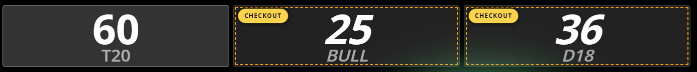


<a id="animation-autodarts-animate-average-trend-arrow"></a>

### Average Trend Arrow

- Gilt für: `alle Modi`
- Was macht es sichtbar? Ein kleiner Pfeil direkt am AVG zeigt kurz die Trendrichtung.
- Grafisch: Bei einer AVG-Änderung erscheint neben dem Wert kurz ein grüner Aufwärtspfeil oder roter Abwärtspfeil und verschwindet nach der eingestellten Zeit wieder.
- Wann sinnvoll? Wenn du Formwechsel während eines Legs schnell am AVG erkennen möchtest.

**Wie der Trend berechnet wird**

- Der Pfeil vergleicht den zuletzt gelesenen mit dem aktuell gelesenen AutoDarts-AVG-Wert. xConfig berechnet den AVG nicht selbst neu.
- Falls AutoDarts den AVG als Paar zeigt (z. B. `55.0 / 55.0`), nutzt das Modul den linken Wert vor dem `/`.
- Formel: `AVG_Delta = AVG_aktuell - AVG_vorher`.
- Interpretation: `AVG_Delta > 0` zeigt einen grünen Pfeil nach oben, `AVG_Delta < 0` einen roten Pfeil nach unten, `AVG_Delta = 0` keine neue Pfeilrichtung.
- Beispiel: `ø 52.50 / 51.80` -> `ø 53.10 / 52.00` ergibt `+0.60`, also einen Aufwärtspfeil.
- Einordnung des angezeigten Werts: X01 nutzt `3-Dart-Average = (geworfene Punkte / geworfene Darts) * 3` (gleichwertig zu `PPD * 3`), Cricket nutzt `MPR = Marks / Runden`.
- Der Trendpfeil folgt immer genau dem von AutoDarts angezeigten Wert.

**Einstellungen einfach erklärt**

- `Animationsdauer`: Bestimmt die Laufzeit der einmaligen Pfeil-Animation nach einer AVG-Änderung. Längere Stufen lassen den Richtungsimpuls spürbar länger stehen.
  - `Kurz`: Der Richtungsimpuls erscheint und verschwindet schnell wieder. Das ist die knappste und unaufdringlichste Variante.
  - `Standard`: Der Pfeil bleibt lang genug sichtbar, um die Richtung sicher zu erkennen, ohne lange stehen zu bleiben.
  - `Lang`: Die Richtungsanzeige hält spürbar länger an und wirkt dadurch präsenter. Das ist aus mehr Abstand am leichtesten zu erfassen.
- `Pfeil-Größe`: Steuert Breite, Höhe und Abstand des Pfeils direkt neben der AVG-Anzeige. Größere Stufen sind aus mehr Abstand leichter erkennbar.
  - `Klein`: Der Trendpfeil bleibt kompakt und nimmt wenig Platz neben dem AVG ein. Das wirkt zurückhaltend und sauber.
  - `Standard`: Der Pfeil bleibt klar erkennbar, ohne neben dem AVG zu dominant zu wirken. Das ist die neutrale Mittelstufe.
  - `Groß`: Der Pfeil bekommt mehr Breite, Höhe und Abstand. Dadurch bleibt die Richtung aus mehr Entfernung leichter sichtbar.
- `Debug`: Aktiviert zusätzliche Debug-Ausgaben und Diagnosehinweise. Für den normalen Spielbetrieb ist die Option nicht gedacht und sollte in der Regel ausgeschaltet bleiben.


<a id="animation-autodarts-animate-turn-start-sweep"></a>

### Turn Start Sweep

- Gilt für: `alle Modi`
- Was macht es sichtbar? Beim Spielerwechsel läuft ein kurzer Sweep über die aktive Karte.
- Grafisch: Eine helle, halbtransparente Bahn zieht einmal quer über die aktive Karte. So springt der neue Zugwechsel schneller ins Auge.
- Wann sinnvoll? Wenn du in schnellen Matches einen klareren Wechsel zwischen den Spielern sehen willst.

**Einstellungen einfach erklärt**

- `Sweep-Geschwindigkeit`: Legt die Gesamtdauer des Lichtlaufs fest. Kürzere Stufen wirken direkter, längere Stufen betonen den Wechsel stärker.
  - `Schnell`: Der Sweep zieht zügig durch und markiert den Spielerwechsel nur als kurzen Blitz. Das wirkt direkt und sportlich.
  - `Standard`: Der Lichtlauf bleibt klar sichtbar, ohne träge zu wirken. Das ist die neutrale Mittelstufe für den Spielerwechsel.
  - `Langsam`: Der Lichtlauf bleibt länger sichtbar und betont den Wechsel deutlicher. Dadurch wirkt der Übergang weicher und filmischer.
- `Sweep-Stil`: Wählt die optische Stärke des Sweeps. `Dezent` nutzt eine schmalere und schwächere Lichtbahn, `Kräftig` zeichnet sie breiter und heller.
  - `Dezent`: Der Sweep bleibt vergleichsweise schmal und hellt die Karte nur moderat auf. Das wirkt zurückhaltend und sauber.
  - `Standard`: Die Lichtbahn ist klar sichtbar, ohne die Karte komplett zu überstrahlen. Das ist die neutrale Mittelstufe.
  - `Kräftig`: Der Sweep zieht breiter und sichtbarer über die aktive Karte. Dadurch springt der Spielerwechsel am stärksten ins Auge.
- `Debug`: Aktiviert zusätzliche Debug-Ausgaben und Diagnosehinweise. Für den normalen Spielbetrieb ist die Option nicht gedacht und sollte in der Regel ausgeschaltet bleiben.


<a id="animation-autodarts-animate-triple-double-bull-hits"></a>

### Triple/Double/Bull Hits

- Gilt für: `alle Modi`
- Was macht es sichtbar? Treffer wie `T20`, `D16`, `25` und `BULL` bekommen dunkle Pattern-Highlights, stärkeren Text-Fokus und klar sichtbare Burst-Moves.
- Grafisch: Die betroffenen Wurffelder erhalten dunkle, kontrastreiche Flächen mit animierten Verläufen, Pattern-Layern, leuchtenden Rändern und textbezogenen Trefferimpulsen. Einige Farbwelten gehen eher in Cyberpunk-, Hazard- oder Vintage-Richtung. `25` (Single Bull) bleibt ruhiger, `BULL` (Bullseye) erscheint heller und markanter. Nur das frisch erkannte Feld bekommt den starken Burst; ausgewählte Presets dürfen danach subtil weiterlaufen.
- Wann sinnvoll? Wenn wichtige Treffer auch in schnellen Legs sofort lesbar, deutlich stylischer und visuell markanter wirken sollen, ohne weitere Einzelschalter zu pflegen.

**Einstellungen einfach erklärt**

- `Farbstil`: Legt fest, wie Triple-, Double- und Bull-Treffer eingefärbt werden. `Rot/Blau/Grün` erzwingt eine klare Signalzuordnung pro Trefferart (`Triple = rot`, `Double = blau`, `Bull = grün`); die anderen Einträge sind die bisherigen Preset-Farbstile.
  - `Rot/Blau/Grün`: Jede Trefferart bekommt immer dieselbe Signalfarbe. Das verbessert die schnelle Unterscheidung unabhängig vom gewählten Theme und sorgt für konsistente Farben in allen Legs.
  - `Solar Flare`: Der Look arbeitet mit warmen Feuerfarben, auffälligen Diagonalstreifen und starkem Broadcast-Glow. Das ist die aggressivste warme Palette im Paket und wirkt wie ein laufender Hitzeimpuls.
  - `Ice Reactor`: Der Look mischt eisige Cyan-/Blautone mit sichtbaren Horizontal- und Vertikallinien. Das Trefferfeld wirkt dadurch wie ein heller Sci-Fi-Reaktor mit klarer technischer Struktur.
  - `Venom Lime`: Das Trefferfeld leuchtet in toxischen Lime-, Grün- und Gelbwerten und kombiniert das mit sichtbarer Warnstreifen-Optik. Das ist die lauteste und plakativste Variante für maximale Signalwirkung.
  - `Crimson Velocity`: Die Fläche wirkt schneller und härter als die warmen Themes: roter Kern, dunklere Seiten, feine Scanlines und ein metallischer Unterton. Das ist sportlich, ernst und markant ohne Neon-Giftlook.
  - `Polar Mint`: Das Trefferfeld wirkt klar, luftig und trotzdem sichtbar geladen. Helle Stripe- und Line-Layer geben der Palette Struktur, ohne so aggressiv zu werden wie Venom Lime.
  - `Midnight Gold`: Die Treffer wirken wie warme Nachtlichter mit goldener Kante, dunkler Basis und feinen Art-Deco-Stripe-Layern. Das ist edel, sichtbar und weniger schrill als Neon.

**Vorschau Farbstile**

Die Farbwelten sind hier bewusst als kompakte Standbilder eingebunden, damit Kontrast, Pattern und Beschriftung schnell vergleichbar bleiben.
Der Farbstil `Rot/Blau/Grün` nutzt feste Trefferfarben und hat deshalb keine eigene Preset-Galerie.

|  |  |
| --- | --- |
| `Solar Flare` | `Ice Reactor` |
| 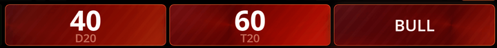 | 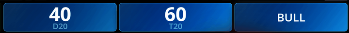 |
| `Venom Lime` | `Crimson Velocity` |
| 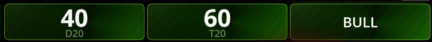 | 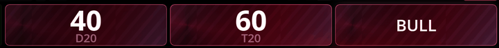 |
| `Polar Mint` | `Midnight Gold` |
| 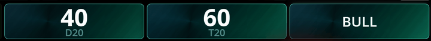 | 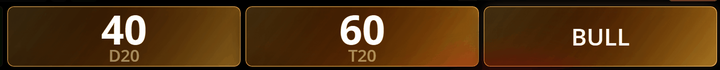 |

- `Animationsstil`: Bestimmt, wie sich das frisch erkannte Trefferfeld und sein Text bewegen. Einige Presets bleiben reine One-Shot-Bursts, andere kombinieren den Burst mit einem subtilen Idle-Loop auf markierten Feldern.
  - `Slam Punch`: Das frisch erkannte Trefferfeld drückt sichtbar nach vorn, die Zahl overshootet kurz und alles fällt sauber zurück. Das ist ein starker One-Shot-Burst ohne Dauerloop.
  - `Shock Ring`: Der Rand expandiert sichtbar, der Score öffnet sich stärker und das Feld wirkt wie von einer Ringwelle getroffen. Das bleibt ein plakativ lesbarer One-Shot-Burst.
  - `Laser Sweep`: Der Burst fühlt sich wie ein schneller TV- oder Sci-Fi-Sweep an: Lichtzug über Verlauf und Text, klar sichtbar und mit deutlicherer Seitenbewegung. Das bleibt ein One-Shot-Burst.
  - `Electric Arc`: Der Treffer springt in kurzen Seitenzucken mit hellem Spannungspeak an, bevor er sauber zurückfällt. Das wirkt wie ein elektrischer Burst ohne dauerhaften Idle-Loop.
  - `Reactor Pulse`: Der Hit-Burst ist hell und energisch, danach bleibt auf markierten Feldern ein ruhiger Glow-Loop aktiv. Das ist Burst plus subtiler Idle-Loop mit klarer Cyberpunk-Anmutung.
  - `Turbo Bounce`: Das Trefferfeld hebt sichtbar ab, federt präzise zurück und gibt der Zahl einen sportlichen Kick. Das bleibt ein One-Shot-Burst mit mehr Vertical-Motion.
  - `Card Hammer`: Das Feld knallt nicht nur in die Fläche, sondern kippt auf der X-Achse durch einen deutlichen Flip. Die Zahl schiebt nach, das Segment folgt verzögert. Das bleibt ein One-Shot-Burst mit viel Impact.
  - `Glitch Blink`: Der Treffer blinkt bewusst digital, die Zahl wackelt seitlich und das Feld bekommt kurze Signalstörungen. Das ist ein kompakter One-Shot-Burst für einen deutlich technoideren Look.
  - `Cascade Split`: Der Burst läuft nicht komplett gleichzeitig, sondern kippt gestaffelt durch die Inhalte. Das wirkt lebendig, etwas größer und bleibt ein One-Shot-Burst.
  - `Rotor Flip`: Das Wurffeld dreht deutlich auf der Y-Achse, fängt sich wieder und verleiht dem Burst eine echte Raumwirkung. Das bleibt ein One-Shot-Burst mit klar erkennbarem Spin.
  - `Edge Runner`: Der Burst betont die Kante sichtbar, danach bleibt ein ruhiger Rand-Loop aktiv. Das ist Burst plus subtiler Idle-Loop für einen grafischeren HUD-Look.
  - `Charge Burst`: Vor dem Peak baut das Trefferfeld Spannung auf, dann entlädt sich Verlauf, Rand und Score gemeinsam mit deutlich größerem Punch. Danach bleibt ein subtiler Lade-Loop aktiv. Das ist Burst plus Idle-Loop.
  - `Beacon Flicker`: Der Burst wirft das Feld kurz seitlich an und lässt danach ein diskretes Beacon-Flackern auf markierten Feldern zurück. Das ist Burst plus Idle-Loop mit mehr Richtungsgefühl.

**Vorschau Animationsstile**

Die Bewegungsstile bleiben animiert, sind für die Doku aber kompakter skaliert, damit die Unterschiede direkt nebeneinander erkennbar sind.

|  |  |
| --- | --- |
| `Slam Punch` | `Shock Ring` |
|  |  |
| `Laser Sweep` | `Reactor Pulse` |
|  |  |
| `Turbo Bounce` | `Card Hammer` |
|  |  |
| `Glitch Blink` | `Cascade Split` |
|  |  |
| `Rotor Flip` | `Edge Runner` |
|  |  |
| `Charge Burst` | `Beacon Flicker` |
|  |  |

- `Debug`: Aktiviert zusätzliche Debug-Ausgaben und Diagnosehinweise. Für den normalen Spielbetrieb ist die Option nicht gedacht und sollte in der Regel ausgeschaltet bleiben.

<a id="animation-autodarts-animate-cricket-target-highlighter"></a>

### Cricket Highlighter

- Gilt für: `Cricket`, `Tactics`
- Was macht es sichtbar? Zielzustände und Drucksituationen werden direkt am Board sichtbar.
- Grafisch: Board-Segmente erhalten je nach Zustand farbige Overlays. Relevante Ziele leuchten grün oder rot, irrelevante Felder werden je nach Stil abgeschwächt, geschraffiert oder maskiert.
- Wann sinnvoll? Wenn du in Cricket oder Tactics schneller sehen möchtest, welche Ziele offen, scorable, unter Druck oder bereits erledigt sind.

**Einstellungen einfach erklärt**

- `OPEN-Ziele anzeigen`: Aktiviert sichtbare Open-Overlays für Ziele, die noch nicht geschlossen sind. Ohne diese Option konzentriert sich das Board stärker auf scorable, Druck- und Dead-Zustände.
- `DEAD-Ziele anzeigen`: Bestimmt, ob bereits erledigte Ziele weiterhin als tote Segmente sichtbar bleiben. Ist die Option aus, verschwinden diese Hinweise vom Board.
- `Irrelevante Felder abdunkeln`: Wählt den Stil für Felder, die im aktuellen Cricket-/Tactics-Zustand keine aktive Rolle spielen. `Aus` blendet die Abdunkelung ab, `Smoke` dämpft neutral, `Hatch+` ergänzt Schraffur und `Mask` legt eine besonders harte dunkle Maske darüber.
  - `Aus`: Nicht relevante Board-Segmente werden nicht zusätzlich abgedunkelt. Das Board bleibt vollständig hell und zeigt Zustände nur über die aktiven Overlays.
  - `Smoke`: Unwichtige Board-Bereiche bekommen eine gleichmäßige dunkle Dämpfung. Das Ziel bleibt sichtbar, ohne dass harte Muster oder Kanten hinzukommen.
  - `Hatch+`: Neben der Abdunkelung erscheint ein gestreiftes Muster über den irrelevanten Segmenten. Dadurch sind diese Bereiche klar als Hintergrund markiert.
  - `Mask`: Nicht relevante Segmente werden am stärksten zurückgenommen und wirken fast abgesenkt. Das hebt aktive Ziele am deutlichsten heraus.
- `Farbthema`: Wechselt zwischen dem normalen Farbschema und einer kontraststärkeren Variante. Die Zustände bleiben gleich, nur Grün- und Rotwirkung werden optisch kräftiger.
  - `Standard`: Scoring- und Druckzustände erscheinen in der regulären Farbbalance des Moduls. Das fügt sich am unauffälligsten in die übrige Oberfläche ein.
  - `High Contrast`: Scoring-Bereiche leuchten etwas klarer und kontrastreicher, während Druck rot bleibt. Das hilft besonders auf unruhigen oder helleren Hintergründen.
- `Intensität`: Steuert Füllung, Kontur und Opazität der Zustands-Overlays. Hohe Stufen zeichnen offene, tote und druckrelevante Ziele sichtbarer.
  - `Dezent`: Offene, tote und druckrelevante Segmente bleiben markiert, wirken aber gedämpfter und weniger flächig.
  - `Standard`: Füllung, Kontur und Abdunkelung bleiben klar sichtbar, ohne das Board zu stark zu überziehen. Das ist die neutrale Mittelstufe.
  - `Stark`: Offene, tote und druckrelevante Segmente treten härter und flächiger hervor. Das erleichtert das Erkennen aus größerem Abstand.
- `Debug`: Aktiviert zusätzliche Debug-Ausgaben und Diagnosehinweise. Für den normalen Spielbetrieb ist die Option nicht gedacht und sollte in der Regel ausgeschaltet bleiben.


<a id="animation-autodarts-animate-cricket-grid-fx"></a>

### Cricket Grid FX

- Gilt für: `Cricket`, `Tactics`
- Was macht es sichtbar? Zusätzliche Live-Effekte direkt in der Cricket-/Tactics-Matrix.
- Grafisch: Zellen, Zeilen, Labels und Badges reagieren mit grünen und roten Zuständen, kurzen Chips, Kanten und Übergängen. So werden Fortschritt, Gegnerdruck und Zugwechsel in der Matrix selbst sichtbarer.
- Wann sinnvoll? Wenn du Fortschritt, Gegnerdruck und Wechsel im Grid klarer sehen willst.

**Einstellungen einfach erklärt**

- `Zeilen-Sweep`: Startet nach einer relevanten Zustandsänderung einen kurzen Zeilen-Sweep. Grafisch zieht eine helle Welle einmal über die betroffene Matrixzeile.
- `Ziel-Badge-Hinweis`: Verstärkt den Glow und die Sichtbarkeit der Ziel-Badges beziehungsweise Labelzellen, wenn sie für Scoring oder Druck relevant sind.
- `Mark-Fortschritt`: Hebt neue oder relevante Mark-Stufen in Spielerzellen sichtbar hervor. Grafisch werden die Mark-Level deutlicher ausgemalt und leichter voneinander unterscheidbar.
- `PRESSURE-Kante`: Ergänzt eine deutliche Druckkante, wenn eine Zeile oder Zelle unter relevantem Gegnerdruck steht. Die Kante dient als schneller Warnhinweis, ohne die komplette Zelle umzufärben.
- `SCORING-Streifen`: Zeichnet offensiv sinnvolle Scoring-Zeilen oder Zellen mit einer gut sichtbaren grünen Akzentfläche nach. So springen potenzielle Punkteziele schneller ins Auge.
- `DEAD-Zeilen abdunkeln`: Nimmt Zeilen, die im aktuellen Zustand als `DEAD` gelten, sichtbar zurück. Grafisch werden diese Bereiche matter und konkurrieren weniger mit aktiven Zielen.
- `Delta-Chips`: Blendet nach einer relevanten Änderung kurze Delta-Chips direkt an der Matrix ein. So ist sofort erkennbar, wie viele Marks gerade dazugekommen sind.
- `Treffer-Impuls`: Setzt auf der gerade betroffenen Zelle einen kleinen optischen Trefferfunken. Das ist ein punktueller Impuls und keine dauerhafte Färbung.
- `Zugwechsel-Übergang`: Legt beim Wechsel auf den nächsten Spieler einen sichtbaren Wipe über den betroffenen Matrixbereich. So wird der Turn-Übergang schneller lesbar.
- `PRESSURE-Overlay`: Ergänzt bei relevantem Gegnerdruck ein sichtbares Overlay zusätzlich zur Kante. So springt defensiver Druck auch dann ins Auge, wenn man nicht auf jede Zellfarbe achtet.
- `Farbthema`: Wechselt zwischen Standard und kontraststärkerer Farbpalette für offensive und druckbezogene Grid-Effekte. Die Zustandslogik selbst bleibt identisch.
  - `Standard`: Scoring- und Drucksignale bleiben klar, aber in der vorgesehenen Standardwirkung. Das wirkt am neutralsten im Grid.
  - `High Contrast`: Scoring-Flächen und offensive Akzente leuchten klarer, während Druck rot bleibt. Das trennt grüne und rote Zustände sichtbarer voneinander.
- `Intensität`: Steuert Opazität, Leuchtkraft und Sichtbarkeit des gesamten Grid-FX-Pakets. Höhere Stufen lassen grüne und rote Zustände markanter erscheinen.
  - `Dezent`: Die Matrix reagiert sichtbar, aber mit weniger Leuchtkraft und geringerer Flächenwirkung. Das wirkt ruhiger und technischer.
  - `Standard`: Die Matrix zeigt Kanten, Glows und Flächen klar, ohne zu überladen zu wirken. Das ist die neutrale Mittelstufe.
  - `Stark`: Grüne und rote Zustände wirken heller, breiter und schneller lesbar. Das springt besonders bei schnellen Wechseln stärker ins Auge.
- `Debug`: Aktiviert zusätzliche Debug-Ausgaben und Diagnosehinweise. Für den normalen Spielbetrieb ist die Option nicht gedacht und sollte in der Regel ausgeschaltet bleiben.


<a id="animation-autodarts-animate-dart-marker-emphasis"></a>

### Dart Marker Emphasis

- Gilt für: `alle Modi`
- Was macht es sichtbar? Treffer-Marker auf dem virtuellen Board werden deutlicher sichtbar.
- Grafisch: Die bestehenden Marker werden größer, farbiger und auf Wunsch mit Pulse, Glow oder Outline versehen. Das Modul ersetzt die Marker nicht, sondern betont sie.
- Wann sinnvoll? Wenn die Standardmarker zu klein oder zu unauffällig sind.

**Einstellungen einfach erklärt**

- `Marker-Größe`: Steuert die Grundgröße der bestehenden Board-Marker. Hohe Stufen machen Treffer aus mehr Abstand leichter erkennbar.
  - `Klein`: Die vorhandenen Marker wachsen nur moderat über ihre Grundgröße hinaus. Das hält die Hervorhebung kompakt.
  - `Standard`: Die Marker werden sichtbar größer, ohne das Segment zu stark zu füllen. Das ist die neutrale Mittelstufe.
  - `Groß`: Die Trefferpunkte füllen deutlich mehr Fläche und sind aus größerer Distanz leichter zu erkennen. Das ist die plakativste Variante.
- `Marker-Farbe`: Legt die Farbwirkung der Marker-Betonung fest. Die gewählte Farbe wird für Füllung beziehungsweise visuelle Hervorhebung der Marker genutzt.
  - `Blau`: Die Hervorhebung wirkt kühl, technisch und klar. Blau ist die neutralste der verfügbaren Markerfarben.
  - `Grün`: Die Treffer wirken positiv, sauber und gut sichtbar. Gerade auf dunklen Boards hebt sich Grün klar ab.
  - `Rot`: Die Marker springen sehr stark ins Auge und wirken deutlich warnender oder aggressiver als Blau und Grün.
  - `Gelb`: Die Treffer bekommen einen warmen, sehr leuchtenden Akzent. Auf dunklen Boards sticht Gelb besonders klar hervor.
  - `Weiß`: Die Hervorhebung bleibt farbneutral, wirkt aber sehr klar und kontrastreich. Das eignet sich gut, wenn die Marker nicht an eine bestimmte Farbe gebunden sein sollen.
- `Effekt`: Legt fest, ob die Marker weich glühen, leicht pulsieren oder ohne Zusatzanimation ruhig sichtbar bleiben.
  - `Glow`: Die Marker bekommen einen Lichtschein, der Breite und Helligkeit sichtbar an- und abschwellen lässt. Das wirkt ruhiger als `Pulse`.
  - `Pulse`: Die Marker skalieren sichtbar auf und ab. Das wirkt lebendiger und bewegter als der reine Glow-Effekt.
  - `Kein Effekt`: Farbe, Größe und Outline bleiben aktiv, aber der Marker bewegt sich nicht. Das ist die ruhigste Darstellung.
- `Marker-Sichtbarkeit`: Bestimmt, wie kräftig die Marker gezeichnet werden. Höhere Werte machen die Treffer präsenter, niedrigere wirken unaufdringlicher.
  - `65 %`: Die Treffer bleiben betont, wirken aber leichter und weniger massiv. Das ist die zurückhaltendste Sichtbarkeitsstufe.
  - `85 %`: Die Marker wirken klar und präsent, ohne vollständig deckend zu werden. Das ist die neutrale Mittelstufe.
  - `100 %`: Die Treffer wirken am präsentesten und verlieren kaum noch Transparenz. Das ist die auffälligste Sichtbarkeitsstufe.
- `Outline-Farbe`: Legt fest, ob die Marker zusätzlich mit einer hellen oder dunklen Outline gezeichnet werden. Das verbessert die Abgrenzung je nach Board- und Hintergrundfarbe.
  - `Aus`: Die Marker werden nur über Farbe, Größe und optionalen Effekt betont. Ein Rand zur zusätzlichen Abgrenzung bleibt aus.
  - `Weiß`: Die Marker heben sich besser gegen dunkle oder kräftig gefärbte Segmentflächen ab. Das wirkt klar und sauber.
  - `Schwarz`: Die Marker gewinnen besonders auf helleren Bereichen mehr Kontur. Das wirkt etwas härter als die weiße Outline.
- `Debug`: Aktiviert zusätzliche Debug-Ausgaben und Diagnosehinweise. Für den normalen Spielbetrieb ist die Option nicht gedacht und sollte in der Regel ausgeschaltet bleiben.


<a id="animation-autodarts-animate-dart-marker-darts"></a>

### Dart Marker Darts

- Gilt für: `alle Modi`
- Was macht es sichtbar? Standardmarker können durch kleine Dart-Grafiken ersetzt werden.
- Grafisch: Statt des normalen Markers liegt ein Dart-Bild im getroffenen Segment. Auf Wunsch fliegt der Dart sichtbar ein, bevor er an seiner Zielposition landet.
- Wann sinnvoll? Wenn du Treffer auf dem virtuellen Board persönlicher oder realistischer darstellen möchtest.

**Einstellungen einfach erklärt**

- `Dart Design`: Legt fest, welches Dart-Motiv anstelle des Standardmarkers verwendet wird. Die Trefferposition bleibt gleich, nur die Grafik ändert sich.
  - `Autodarts`: Der Dart nutzt ein metallisches Barrel und einen Flight mit violettem bis blauem Farbverlauf. Das wirkt modern und leicht neonartig.
  - `Black Blue`: Der Flight wirkt fast schwarz und trägt klare blaue Linienakzente. Dadurch entsteht ein technischer, neonartiger Look.
  - `Black Green`: Der Flight bleibt dunkel und wird von kräftigen grünen Akzenten durchzogen. Das wirkt markant, aber weniger kühl als `Black Blue`.
  - `Black Red`: Der dunkle Flight bekommt rote Akzentlinien und wirkt dadurch am aggressivsten unter den dunklen Varianten.
  - `Blue`: Der Flight bleibt farblich eindeutig blau und wirkt sauber, ruhig und gut sichtbar. Das ist eine klare einfarbige Alternative.
  - `Camouflage`: Der Flight trägt ein grün-braunes Camouflage-Muster. Das wirkt rauer und deutlich weniger clean als die Uni-Farben.
  - `Green`: Der Flight wirkt klar grün und gut sichtbar. Das ist die einfarbige grüne Alternative ohne Sondermuster.
  - `Pride`: Der Flight trägt einen vollständigen Regenbogenverlauf und wirkt dadurch am buntesten und auffälligsten der Designs.
  - `Red`: Der Flight ist klar rot eingefärbt und wirkt dadurch energisch und sehr präsent. Das ist die direkte, einfarbige Rot-Variante.
  - `White`: Der Flight wirkt neutral, hell und sauber. Das ist die schlichteste helle Variante.
  - `White Trible`: Der helle Flight trägt ein graues, tribalartiges Muster und wirkt dadurch detailreicher als das schlichte weiße Design.
  - `Yellow`: Der Flight wirkt hell, warm und sehr sichtbar. Gelb sticht auf dunklen Boards besonders klar heraus.
  - `Yellow Scull`: Der Flight bleibt gelb, bekommt aber zusätzlich einen großen schwarzen Totenkopf als Hauptmotiv. Das ist die plakativste gelbe Variante.
- `Dart-Fluganimation`: Bestimmt, ob neu gesetzte Dart-Bilder mit einer kurzen Flugbewegung ins Segment einlaufen oder sofort an ihrer Endposition erscheinen.
- `Dart-Größe`: Skaliert die eingeblendeten Dart-Bilder relativ zur Standardgröße. Große Stufen füllen das Segment stärker aus.
  - `Klein`: Der eingeblendete Dart bleibt kompakter und lässt mehr Segmentfläche frei. Das wirkt aufgeräumter und weniger dominant.
  - `Standard`: Der Dart entspricht der vorgesehenen Grundgröße des Moduls. Das ist der Mittelweg zwischen Präsenz und freier Segmentfläche.
  - `Groß`: Der Dart füllt mehr vom Segment aus und fällt stärker ins Auge. Das ist die plakativste Größenstufe.
- `Original-Marker ausblenden`: Verhindert Doppelanzeigen, indem der originale Marker unsichtbar gemacht wird, solange die Dart-Grafik aktiv ist.
- `Einschlag-Schatten`: Aktiviert einen leichten Schlagschatten unter dem Dart-Bild. Das gibt mehr räumlichen Eindruck rund um den Einschlagpunkt.
- `Einschlag-Wobble`: Aktiviert eine kurze Wackelbewegung des Dart-Bildes direkt nach der Landung. Das verstärkt den Einschlag-Effekt visuell.
- `Fluggeschwindigkeit`: Wählt die Dauer der Einfluganimation neuer Dart-Bilder. `Schnell` landet zügig, `Cinematic` hält die Flugphase sichtbar länger.
  - `Schnell`: Die Fluganimation endet zügig und wirkt direkt. Das Ziel ist schnell erreicht, ohne lange Nachwirkung.
  - `Standard`: Die Flugbewegung bleibt klar erkennbar, ohne sich lange aufzuhalten. Das ist die neutrale Mittelstufe.
  - `Cinematic`: Die Flugphase wird gestreckt und wirkt dadurch filmischer. Der Dart baut sich deutlich spürbarer in das Segment hinein auf.
- `Debug`: Aktiviert zusätzliche Debug-Ausgaben und Diagnosehinweise. Für den normalen Spielbetrieb ist die Option nicht gedacht und sollte in der Regel ausgeschaltet bleiben.


<a id="animation-autodarts-animate-remove-darts-notification"></a>

### Remove Darts Notification

- Gilt für: `alle Modi`
- Was macht es sichtbar? Der Hinweis zum Entfernen der Darts wird als große Grafik deutlich präsenter dargestellt.
- Grafisch: Der normale Hinweis wird durch eine zentrierte Bildkarte ersetzt. Optional pulsiert die Grafik leicht, damit sie im Spielablauf nicht übersehen wird.
- Wann sinnvoll? Wenn der Standardhinweis zu leicht übersehen wird.

**Einstellungen einfach erklärt**

- `Bildgröße`: Legt fest, wie groß die Hinweisgrafik auf dem Bildschirm erscheinen darf. Hohe Stufen nutzen mehr Platz und ziehen den Blick stärker an.
  - `Kompakt`: Die Grafik bleibt klar sichtbar, nimmt aber weniger Bildschirmfläche ein. Das wirkt zurückhaltender und blockiert das Spielbild weniger.
  - `Standard`: Die Grafik ist klar präsent, ohne den Bildschirm maximal zu füllen. Das ist die neutrale Mittelstufe.
  - `Groß`: Die Grafik nutzt mehr Breite und Höhe und zieht den Blick am stärksten auf sich. Das ist die plakativste Stufe.
- `Pulse-Animation`: Bestimmt, ob die Hinweisgrafik mit einer ruhigen Ein- und Ausbewegung pulsiert oder statisch bleibt.
- `Pulse-Stärke`: Steuert die Stärke der Pulsbewegung. Höhere Stufen vergrößern die Grafik in der Mitte der Animation deutlicher.
  - `Dezent`: Die Größe ändert sich in der Mitte der Animation nur minimal. Das wirkt ruhig und weich.
  - `Standard`: Die Grafik wächst im Puls klar wahrnehmbar, aber noch kontrolliert. Das ist die neutrale Mittelstufe.
  - `Stark`: Die Hinweisgrafik wirkt lebhafter und springt stärker ins Auge. Das ist die auffälligste Pulsstufe.
- `Debug`: Aktiviert zusätzliche Debug-Ausgaben und Diagnosehinweise. Für den normalen Spielbetrieb ist die Option nicht gedacht und sollte in der Regel ausgeschaltet bleiben.


<a id="animation-autodarts-animate-single-bull-sound"></a>

### Single Bull Sound

- Gilt für: `alle Modi`
- Was macht es sichtbar? Bei Single Bull hörst du einen kurzen Ton; grafisch bleibt das Spiel unverändert.
- Grafisch: Es wird keine zusätzliche Grafik eingeblendet. Die Rückmeldung ist rein akustisch und reagiert auf erkannte Single-Bull-Treffer.
- Wann sinnvoll? Wenn du Single Bull akustisch schneller bestätigen möchtest, ohne auf eine zusätzliche Animation zu achten.

**Einstellungen einfach erklärt**

- `Lautstärke`: Bestimmt die Wiedergabelautstärke des Single-Bull-Sounds. An der Treffererkennung ändert sich dadurch nichts.
  - `Leise`: Die akustische Rückmeldung bleibt vorhanden, drängt sich aber deutlich weniger in den Vordergrund. Das eignet sich für ruhige Setups.
  - `Mittel`: Der Sound ist klar hörbar, wirkt aber noch nicht so präsent wie die höheren Stufen. Das ist eine gute Zwischenstufe.
  - `Standard`: Der Ton ist deutlich hörbar und im normalen Spielbetrieb gut wahrnehmbar. Das ist die Standardwahl des Moduls.
  - `Sehr laut`: Die Rückmeldung tritt am stärksten hervor und bleibt auch in lauteren Umgebungen leichter hörbar. Das ist die auffälligste Stufe.
- `Wiederholsperre`: Legt die Sperrzeit zwischen zwei Sound-Auslösungen fest. So wird verhindert, dass derselbe Single-Bull mehrfach zu dicht nacheinander hörbar wird.
  - `400 ms`: Zwischen zwei Single-Bull-Sounds liegt nur eine kurze Sperre. Das reagiert am schnellsten, lässt aber dichter aufeinanderfolgende Sounds eher durch.
  - `700 ms`: Der Sound kann nicht sofort doppelt feuern, bleibt aber reaktionsschnell genug. Das ist die neutrale Mittelstufe.
  - `1000 ms`: Zwischen zwei Sound-Auslösungen liegt eine deutlich längere Pause. Das reduziert Doppeltrigger am stärksten, reagiert aber etwas vorsichtiger.
- `Fallback-Scan`: `Nur live` verlässt sich ausschließlich auf erkannte DOM- und State-Änderungen. `1200 ms` ergänzt einen regelmäßigen Fallback-Scan, falls Treffer in bestimmten Setups nicht zuverlässig sofort erkannt werden.
  - `Nur live`: Das Modul verlässt sich ausschließlich auf erkannte DOM- und State-Updates. Das ist schlank und direkt, setzt aber saubere Trigger voraus.
  - `1200 ms`: Zusätzlich zu Live-Triggern prüft das Modul regelmäßig nach. Das macht die Treffererkennung robuster, wenn Live-Änderungen einmal ausbleiben.
- `Debug`: Aktiviert zusätzliche Debug-Ausgaben und Diagnosehinweise. Für den normalen Spielbetrieb ist die Option nicht gedacht und sollte in der Regel ausgeschaltet bleiben.

<a id="animation-autodarts-animate-turn-points-count"></a>

### Turn Points Count

- Gilt für: `alle Modi`
- Was macht es sichtbar? Punkteänderungen beim Turn werden sichtbar hoch- oder heruntergezählt.
- Grafisch: Statt eines harten Sprungs läuft der angezeigte Wert weich zur neuen Punktzahl. Dadurch wird die Änderung als kurze Animation nachvollziehbar.
- Wann sinnvoll? Wenn du Punktwechsel im Spielbild leichter verfolgen möchtest.

**Einstellungen einfach erklärt**

- `Animationsdauer`: Legt die Dauer der Zählanimation fest. Kurze Stufen springen schneller zum Zielwert, längere machen den Zwischenverlauf deutlicher sichtbar.
  - `Kurz`: Der Zahlenlauf ist klar sichtbar, aber zügig vorbei. Das wirkt direkt und sportlich.
  - `Standard`: Die Wertänderung bleibt gut lesbar animiert, ohne träge zu werden. Das ist die neutrale Mittelstufe.
  - `Lang`: Die Zahl bewegt sich ruhiger und länger bis zum Endwert. Das macht den Wechsel besonders nachvollziehbar, aber weniger direkt.
- `Aufblitz-Effekt`: Wenn aktiv, blitzt der Turn-Wert nur in dem Zeitraum auf, in dem die Zahl wirklich animiert wird. Bei deaktivierter Option bleibt ausschließlich die Zählbewegung ohne zusätzlichen Lichtimpuls.
- `Aufblitz-Modus`: Legt fest, wie der elektrische Rahmen dargestellt wird: `Nur bei Änderung` zeigt den Effekt nur während laufender Zähländerungen, `Permanent` hält den Rahmen dauerhaft sichtbar, solange das Feature aktiv ist.
  - `Nur bei Änderung`: Der elektrische Rahmen erscheint nur in dem Zeitraum, in dem die Zahl hoch- oder herunterzählt, und klingt danach aus.
  - `Permanent`: Der elektrische Rahmen bleibt permanent aktiv, auch wenn sich der Wert gerade nicht ändert. Die Zählanimation selbst läuft weiterhin nur bei echten Wertänderungen.
- `Debug`: Aktiviert zusätzliche Debug-Ausgaben und Diagnosehinweise. Für den normalen Spielbetrieb ist die Option nicht gedacht und sollte in der Regel ausgeschaltet bleiben.


<a id="animation-autodarts-animate-winner-fireworks"></a>

### Winner Fireworks

- Gilt für: `alle Modi`
- Was macht es sichtbar? Bei einem Sieg erscheint ein Vollbild-Effekt im gewählten Feuerwerksstil.
- Grafisch: Je nach Stil starten Konfetti- oder Feuerwerksmuster über den gesamten Bildschirm. Farben, Dichte und Geschwindigkeit folgen dem gewählten Stil und der Intensität.
- Wann sinnvoll? Wenn Siege deutlich gefeiert werden sollen oder du verschiedene Effektstile testen möchtest.

**Einstellungen einfach erklärt**

- `Style`: Legt fest, ob der Siegereffekt eher wie klassisches Feuerwerk, Kanonenschuss, Sternenregen, Seitenbeschuss oder eine andere Variante wirkt. Die Farbpalette bleibt davon unabhängig.
  - `Realistic`: Der Effekt kombiniert einen kräftigen Hauptstoß aus der Mitte mit kleineren Seitenbursts. Das wirkt am ehesten wie ein klassisches Feier-Feuerwerk.
  - `Fireworks`: Die Partikel starten an wechselnden Positionen im oberen Bildschirmbereich und streuen breit auseinander. Das wirkt am ehesten wie echte Himmelsfeuerwerke.
  - `Cannon`: Die Partikel kommen gebündelt und kraftvoll aus dem unteren Zentrum. Das wirkt wie ein konzentrierter Konfetti- oder Feuerwerksstoß nach vorn.
  - `Victory Storm`: Mehrere Bursts aus Mitte, links und rechts bauen ein großes, raumgreifendes Effektbild auf. Das wirkt besonders festlich und voll.
  - `Stars`: Statt normaler Konfetti-Partikel werden Sterne verwendet, die ruhiger und dekorativer durch das Bild laufen. Das wirkt verspielter als die anderen Stile.
  - `Sides`: Die Partikel kommen seitlich herein und rahmen den Bildschirm eher ein, statt ihn von der Mitte aus zu füllen. Das wirkt schnell und randbetont.
- `Farbe`: Bestimmt, aus welchen Farben der Effekt zusammengesetzt ist. Die Partikelmuster bleiben gleich, nur die Palette wird gewechselt.
  - `Autodarts`: Der Effekt arbeitet mit mehreren Blauabstufungen und Weiß. Das wirkt kühl, sauber und markennah.
  - `Rot/Weiß`: Die Partikel wechseln zwischen Weiß, hellem Rot und dunkleren Rotabstufungen. Das wirkt klassisch, festlich und deutlich wärmer als `Autodarts`.
  - `Ice`: Der Effekt läuft von Weiß über helles Eisblau bis zu kräftigem Blau. Das wirkt kühl, sauber und fast frostig.
  - `Sunset`: Die Farbpalette erinnert an einen Sonnenuntergang mit warmen und violett auslaufenden Tönen. Das wirkt farbig und lebendig.
  - `Neon`: Die Partikel leuchten in hellen, künstlich wirkenden Neonfarben. Das ist die bunteste und auffälligste Farbpalette.
  - `Gold`: Die Partikel wirken wie goldenes Feuerwerk oder Goldregen. Das ist die klassisch festliche Premium-Variante.
- `Intensität`: Steuert über Voreinstellungen, wie viele Partikel entstehen, wie häufig Schüsse ausgelöst werden und wie energisch sich der Effekt bewegt. `Stark` wirkt dichter und lebhafter, `Dezent` ruhiger.
  - `Dezent`: Es entstehen weniger Partikel, die etwas gemächlicher und mit längeren Abständen ausgelöst werden. Der Effekt bleibt sichtbar, ohne den Bildschirm zu fluten.
  - `Standard`: Partikelmenge, Auslösefrequenz und Bewegungsenergie bleiben in Balance. Das ist die neutrale Mittelstufe des Effekts.
  - `Stark`: Mehr Partikel werden schneller und lebhafter ausgelöst. Dadurch wirkt das Feuerwerk voller, dichter und energischer.
- `Test-Button`: Löst den aktuell konfigurierten Winner-Fireworks-Effekt direkt als Vorschau aus, ohne auf einen echten Sieg warten zu müssen. Das ist nur ein Testlauf und ändert keine gespeicherten Werte.
- `Bei Bull-Out aktiv`: Bestimmt, ob der Siegereffekt auch dann startet, wenn der erkannte Spielmodus eine Bull-Out-Variante ist. Ist die Option aus, bleiben diese Varianten stumm.
- `Klick beendet Effekt`: Bestimmt, ob ein linker Mausklick den aktuell laufenden Winner-Fireworks-Effekt vorzeitig schließen darf.
- `Debug`: Aktiviert zusätzliche Debug-Ausgaben und Diagnosehinweise. Für den normalen Spielbetrieb ist die Option nicht gedacht und sollte in der Regel ausgeschaltet bleiben.

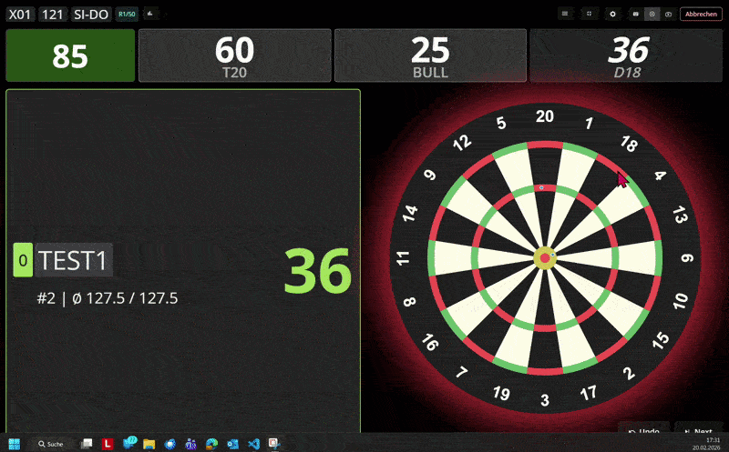
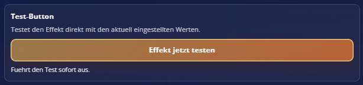

## Weitere Dokumentation

- [Feature-Übersicht](docs/FEATURES.md)
- [Technische Architektur](docs/TECHNICAL-ARCHITECTURE.md)
- [Migrationsstatus](docs/MIGRATION-STATUS.md)
- [Legacy-Paritätsmatrix](docs/LEGACY-PARITY-MATRIX.md)
- [Legacy-Diskrepanzmatrix](docs/LEGACY-DISCREPANCY-MATRIX.md)
- [Legacy-Inventur](docs/OLDREPO-INVENTORY.md)
- [Neue System-Inventur](docs/NEW-SYSTEM-INVENTORY.md)
- [Release-QA-Report](docs/RELEASE-QA-REPORT.md)
- [UI-/UX-Finalisierung](docs/UI-UX-FINALIZATION.md)

## Für Entwickler

```bash
npm install
npm run build
npm test
npm run verify
```
