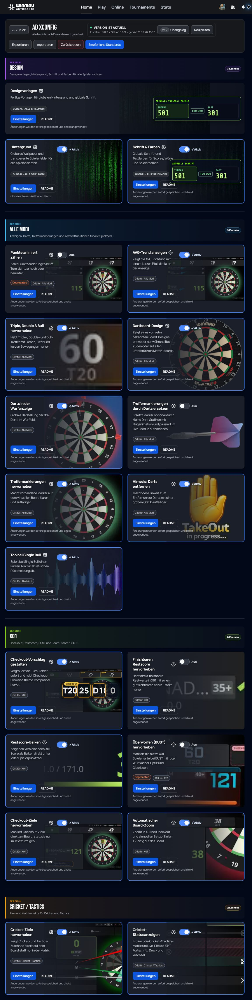

# Autodarts xConfig

> Visuelle Erweiterungen für Autodarts: bessere Lesbarkeit, klarere Hinweise, Themes und optionale Effekte.  
> Die Spiellogik bleibt unverändert.

## Version 3.0: Umstellung auf das neue Autodarts-Design

Autodarts hat sein Design und die Struktur der Oberfläche geändert. xConfig 3.0 startet deshalb eine neue Major-Version mit angepasster Verwaltung, neutralen Karten und Dialogen. Alle Kacheln stehen gemeinsam auf einer Seite und sind nach **Design**, **Alle Modi**, **X01** und **Cricket / Tactics** geordnet.

**Viele Optionen sind derzeit als `Deprecated` markiert.** Sie sind noch nicht vollständig an die neue Autodarts-Oberfläche angepasst und können eingeschränkt oder ohne Funktion sein. Die Anpassung erfolgt in den kommenden Tagen Stück für Stück; weitere Updates folgen. Das Badge bleibt bis zur Freigabe des jeweiligen Moduls sichtbar.

Bei einer frischen Installation und beim Anwenden von `Empfohlene Standards` bleiben zunächst alle Module ausgeschaltet. Aktiviere benötigte Module gezielt. Bereits gespeicherte Einstellungen bleiben beim Update erhalten.

## Installieren

1. Installiere [Tampermonkey](https://www.tampermonkey.net/) in einem aktuellen Desktop-Browser.
2. Öffne die Erweiterungsdetails von Tampermonkey und aktiviere `Nutzerscripts zulassen` sowie `Zugriff auf Datei-URLs zulassen`.
3. Klicke auf den Installationsbutton:

   [](https://github.com/thomasasen/autodarts-xconfig/releases/latest/download/autodarts-xconfig.user.js)

4. Öffne die heruntergeladene Datei `autodarts-xconfig.user.js` und bestätige die Installation in Tampermonkey.
5. Lade `https://play.autodarts.com/` beziehungsweise die noch verwendete `.io`-Adresse neu. Öffne rechts oben über dein Profilbild das Benutzermenü und wähle dort direkt unter `Legal` den Eintrag **xConfig**.

**Installiere immer nur die Datei `autodarts-xconfig.user.js`.** Der Button lädt automatisch die neueste stabile Version herunter.

Die ebenfalls bei GitHub Releases angebotene Datei `autodarts-xconfig.meta.js` ist nur für die automatische Update-Prüfung bestimmt und muss nicht heruntergeladen oder installiert werden.


Wenn Tampermonkey einen Injection-Hinweis zeigt, aktiviere die dort empfohlene Browser-Einstellung:


Die Screenshots und Bezeichnungen in dieser Anleitung stammen aus einem Chrome-/Chromium-Setup. In anderen Browsern können Menüpunkte und Schalter leicht anders heißen oder an einer etwas anderen Stelle liegen.

[Releases und Downloads](https://github.com/thomasasen/autodarts-xconfig/releases) · [Changelog](CHANGELOG.md)

## Was ist AD xConfig?

`autodarts-xconfig` ergänzt Autodarts um Themes, Animationen und kleine Komfortfunktionen. Du kannst damit das Spiel übersichtlicher machen und die Oberfläche nach deinem Geschmack anpassen.

Alles wird direkt im Spiel über **xConfig** eingestellt. Du findest den Eintrag rechts oben im Benutzermenü direkt unter `Legal`. Du musst nichts programmieren und keine Dateien ändern.

## Was bringt es mir?

- ein globaler Look aus Hintergrund, Schrift und fertigen Vorlagen
- besser sichtbare Hinweise für Checkouts, Spielerwechsel und Treffer
- Einstellungen direkt im Spiel statt in einzelnen Skripten
- ein eigenes globales Wallpaper sowie unabhängig gestaltbare Wurffeld-Darts

## Im Überblick

- Insgesamt `20` Module: `17` Animationen und Komfortfunktionen sowie `3` Themes.
- `↺ Zurücksetzen`: Ein echter Hard Reset setzt alle Einstellungen auf Standard zurück, deaktiviert alle Module, schaltet Debug aus und entfernt globales Wallpaper sowie Dart-Upload.
- `Empfohlene Standards`: Übernimmt ausgewogene Presets, schaltet alle Module aus und lässt globales Wallpaper sowie Dart-Upload unangetastet.
- `Exportieren` / `Importieren`: Sichert Einstellungen als versioniertes JSON-Backup und übernimmt auch ältere oder teilweise inkompatible Backups fehlertolerant.
- Hintergrundbild: Die Kachel `Hintergrund` verwendet ein gemeinsames Wallpaper oder das Wallpaper der zuletzt angewendeten Vorlage in allen Spielansichten.
- Bildgröße: Für das globale Wallpaper gilt ein empfohlenes Limit von `1,5 MiB`; der separate Dart-Upload wird kompakter gespeichert.

## Was du zuerst lesen solltest

- Neu hier? Starte mit [Installieren](#installieren) und lies danach [Nach der Installation](#nach-der-installation).
- Wenn das Menü da ist, helfen dir [Wo finde ich was?](#wo-finde-ich-was), [So ist eine Kachel aufgebaut](#so-ist-eine-kachel-aufgebaut) und [So sieht das Einstellungsfenster aus](#so-sieht-das-einstellungsfenster-aus).
- Für einzelne Module nutzt du am schnellsten den [Modul-Finder](#modul-finder) oder direkt im Spiel den Button `📖 README`.
- Wenn du Updates verstehen oder neu anstoßen willst, gehe zu [Updates erkennen und installieren](#updates-erkennen-und-installieren).
- Nur wenn du am Repository arbeitest, ist der Abschnitt [Für Entwickler](#für-entwickler) relevant.

## Nach der Installation

Bei einer wirklich frischen Installation ohne vorhandene oder ältere xConfig-Einstellungen wird automatisch das Profil `Empfohlene Standards` angelegt. Dadurch sind ausgewogene Presets vorbereitet; alle Module bleiben zunächst ausgeschaltet. Eine bestehende Konfiguration bleibt dagegen unverändert und wird nicht mit dem empfohlenen Profil überschrieben.

1. Öffne rechts oben über dein Profilbild das Benutzermenü und wähle direkt unter `Legal` den Eintrag **xConfig**.
2. Stelle im Bereich `Design` Hintergrund, Schrift und Farben für alle Spielansichten ein oder wende eine Designvorlage an. Die übrigen Module findest du direkt darunter nach Spielbereich geordnet.
3. Nutze `↺ Zurücksetzen`, wenn du bewusst mit vollständig deaktivierten Modulen und ohne globales Wallpaper oder Dart-Upload beginnen möchtest.
4. Mit `Empfohlene Standards` kannst du das kuratierte Profil später erneut anwenden; eigenes Wallpaper und Dart-Upload bleiben dabei erhalten.



### Wo öffne ich xConfig?

Klicke rechts oben auf dein Profilbild. Im seitlichen Benutzermenü steht **xConfig** direkt unter `Legal` und unmittelbar vor dem Bereich `Tools for Autodarts`.

## Wenn AD xConfig nicht erscheint

1. In Tampermonkey prüfen, ob `autodarts-xconfig` installiert und aktiviert ist.
2. `https://play.autodarts.com/` beziehungsweise die noch verwendete `.io`-Adresse vollständig neu laden.
3. In den Browsererweiterungen bei Tampermonkey `Nutzerscripts zulassen` und `Zugriff auf Datei-URLs zulassen` aktivieren.
4. Falls Tampermonkey beim Installieren oder Aktualisieren einen zusätzlichen Tab geöffnet hat, die Installation dort vollständig bestätigen.
5. Wenn ein Injection-Hinweis erscheint, die empfohlene Browser-Einstellung übernehmen.
6. Danach rechts oben das Benutzermenü über das Profilbild öffnen und direkt unter `Legal` nach **xConfig** suchen.

## Wo finde ich was?

- `Design`: Fertige Designvorlagen, Hintergrund, Schrift und Farben für alle Spielansichten.
- `Alle Modi`: Anzeigen, Darts, Treffermarkierungen und Komfortfunktionen für alle Spielmodi.
- `X01`: Checkout, Restscore, BUST und Board-Zoom.
- `Cricket / Tactics`: Ziel- und Matrixeffekte für beide Spielmodi.
- `⚙ Einstellungen`: Mit diesem Button öffnest du die Einstellungen einer Kachel.
- `📖 README`: Mit diesem Button öffnest du die GitHub-README direkt an der passenden Modulstelle in einem neuen Tab.
- An/Aus-Schalter: Hier schaltest du ein Modul direkt ein oder aus. Die Aktionskachel `Vorlagen` hat bewusst keinen Schalter.

## Der obere Bereich im Menü

- `Zurück`: Schließt xConfig und stellt die zuvor geöffnete Autodarts-Seite einschließlich ihrer Filter in der Adresse wieder her.
- `↺ Zurücksetzen`: Führt einen echten Hard Reset aus. Alle Einstellungen gehen auf Standard, alle Module werden deaktiviert, Debug wird ausgeschaltet und globales Wallpaper sowie Dart-Upload werden entfernt.
- `Empfohlene Standards`: Übernimmt ausgewogene Presets, schaltet alle Module aus und lässt globales Wallpaper sowie Dart-Upload unangetastet.
- `Exportieren`: Erstellt ein lokales JSON-Backup. Eigenes Wallpaper und Dart-Bild sind standardmäßig enthalten, können für eine kleinere Datei aber abgewählt werden.
- `Importieren`: Prüft ein Backup vor dem Speichern und zeigt, welche Einstellungen übernommen, migriert oder ausgelassen werden.
- Versionsstatus: Hier siehst du, ob deine Version aktuell ist, ob ein Update verfügbar ist oder ob die Update-Prüfung fehlgeschlagen ist.
- `Changelog` / `Was ist neu?`: Öffnet direkt die veröffentlichten Änderungen auf GitHub in einem neuen Tab.
- `Neu prüfen`: Startet sofort eine neue Update-Prüfung.
- Die native Autodarts-Kopfzeile bleibt sichtbar; alle vier xConfig-Bereiche sind gleichzeitig geöffnet.

## Einstellungen exportieren und importieren

Mit `Exportieren` lädst du ein versioniertes Backup aller AD xConfig Einstellungen herunter. Das Backup enthält keine Autodarts-Anmeldedaten und wird nicht an einen externen Dienst übertragen. Wenn `Eigenes Wallpaper und Dart-Bild einschließen` aktiv ist, werden auch lokal gespeicherte Bilder mitgesichert; dadurch kann die Datei deutlich größer werden.

Beim `Importieren` wird die ausgewählte JSON-Datei zuerst vollständig geprüft. Der Prüfbericht zeigt gültige, migrierte und nicht mehr unterstützte Einstellungen einzeln an. Ein veraltetes oder aus einer neueren Version stammendes Feature bricht den Import nicht ab: kompatible Einstellungen werden weiterhin übernommen, unbekannte oder ungültige Werte werden ausgelassen.

- `Sicher zusammenführen`: Überschreibt nur gültige Werte aus dem Backup. Fehlende oder inkompatible Einstellungen behalten ihren aktuellen Stand.
- `Vollständig ersetzen`: Beginnt bei den heutigen Standards und wendet danach alle gültigen Backup-Werte an. Bilddaten, die im Export ausdrücklich nicht enthalten waren, bleiben erhalten.

Erst `Import bestätigen` schreibt die geprüfte Konfiguration. Bei unlesbarem JSON, einer unbekannten Grundstruktur oder einem Speicherfehler bleibt die aktuelle Konfiguration unverändert.

## Updates erkennen und installieren

1. AD xConfig prüft direkt beim Start und danach regelmäßig im Hintergrund, ob auf GitHub eine neuere Version verfügbar ist. Wegen Zwischenspeicherung wird ohne Klick auf `Neu prüfen` höchstens ungefähr einmal pro Stunde wirklich online verglichen.
2. Wenn ein Update verfügbar ist, erscheinen ein orangefarbener Punkt am Menüpunkt **xConfig** im Benutzermenü und die Meldung `Update verfügbar` im geöffneten xConfig-Menü.
3. `Was ist neu?` öffnet den Changelog, damit du die Änderungen vor der Installation prüfen kannst.
4. `Update installieren` öffnet die vollständige Userscript-Datei. Bestätige anschließend die Aktualisierung in Tampermonkey.

Die automatische Versionsprüfung lädt nur die kleine Metadaten-Datei; das vollständige Userscript wird erst bei einer tatsächlichen Installation oder Aktualisierung abgerufen. Bestehende ältere Installationen bleiben über die dauerhafte Raw-Kompatibilitätsadresse updatefähig und können Zwischenversionen überspringen. Für eine manuelle Neuinstallation verwendest du den Abschnitt [Installieren](#installieren).

Alle stabil veröffentlichten Versionen findest du unter [GitHub Releases](https://github.com/thomasasen/autodarts-xconfig/releases). Der [Changelog](CHANGELOG.md) beschreibt die Änderungen der einzelnen Versionen.

## So ist eine Kachel aufgebaut


- Oben siehst du eine abgegrenzte Vorschau; darunter steht die Überschrift des Moduls.
- Darunter steht eine kurze Beschreibung, was das Modul macht.
- `Gilt für` zeigt dir, in welchen Spielmodi das Modul gedacht ist.
- Die Zahl bei `Einstellungen` zeigt, wie viele Einstellmöglichkeiten es gibt.
- `⚙ Einstellungen` öffnet das Einstellungsfenster dieser Kachel.
- `📖 README` öffnet die GitHub-README direkt an der passenden Modulstelle.
- Der Hinweis unten zeigt bei `Hintergrund` zum Beispiel an, ob schon ein eigenes Wallpaper gespeichert ist.
- Der An/Aus-Schalter oben rechts aktiviert das jeweilige Modul; `Designvorlagen` ist stattdessen eine reine Aktionskachel ohne Schalter.

## So sieht das Einstellungsfenster aus


- Oben findest du wieder den Button `📖 README`, der die GitHub-README direkt beim gerade geöffneten Modul öffnet.
- Die Einstellungen sind in Gruppen aufgeteilt, damit du nicht alles auf einmal suchen musst.
- Viele Gruppen funktionieren wie eine Einzelauswahl. Meist ist pro Gruppe nur eine Option gleichzeitig aktiv.
- Die aktuell ausgewählte Option ist mit `Aktuell` markiert.
- Manche Einstellungen sind einfache An/Aus-Schalter.
- `Diagnose` ist nur für Entwicklung und Fehlersuche gedacht. Diese Option nur aktivieren, wenn du ausdrücklich dazu aufgefordert wirst. Sonst kann es zu unerwünschten Nebeneffekten kommen.

## Globales Hintergrundbild


In der Kachel `Hintergrund` kannst du ein eigenes Hintergrundbild hochladen und später wieder entfernen. Das Bild gilt für alle Spielansichten unter `/matches`. Empfohlen ist ein Bild bis `1,5 MiB`, damit Upload und Speicherung im Browser stabil bleiben.

Eine Designvorlage kann das eigene Hintergrundbild durch ihr mitgeliefertes Bild ersetzen und aktiviert dabei `Hintergrund` und `Schrift & Farben`. Die Darts in der Wurfanzeige bleiben von Designvorlagen unverändert.

Den globalen Hintergrund kannst du zusätzlich anpassen:

- `Bildanpassung`: Hier legst du fest, wie das Bild platziert wird.
- `Sichtbarkeit des Hintergrundbilds`: Hier regelst du, wie stark das Bild sichtbar bleibt.
- `Durchsichtigkeit der Spielerfelder`: Hier bestimmst du, wie stark die Spielerfelder den Hintergrund durchlassen.

Hinweis: Die Option `Diagnose` ist in allen Modulen nur für Fehlersuche gedacht. Im normalen Spielbetrieb sollte sie deaktiviert bleiben.

<!-- xconfig-generated:start -->
## Modul-Finder

Wähle den Spielmodus oder den gewünschten sichtbaren Effekt und öffne anschließend die passende Kurzbeschreibung.

| Modul | Bereich | Geeignet für | Kurz erklärt |
| --- | --- | --- | --- |
| [Designvorlagen](#theme-global-presets) | Aktion | `alle Modi` | Fertige Vorlagen für globalen Hintergrund und globale Schrift. |
| [Hintergrund](#theme-global-background) | Design | `alle Modi` | Globales Wallpaper und transparente Spielerfelder für alle Spielansichten. |
| [Schrift & Farben](#template-global-typography) | Design | `alle Modi` | Globale Schrift- und Textfarben für Scores, Würfe und Spielernamen. |
| [Dartboard-Design](#bot-board-style) | Funktion | `alle Modi` | Zeigt eines von zehn bekannten Board-Designs entweder nur während Bot-Zügen oder auf allen unterstützten Match-Boards. |
| [Darts in der Wurfanzeige](#turn-dart-display) | Funktion | `alle Modi` | Globale Darstellung der drei Darts im Wurffeld. |
| [Finishbaren Restscore hervorheben](#animation-autodarts-animate-checkout-score-highlight) | Funktion | `X01` | Hebt direkt finishbare Restwerte in X01 mit einem gut sichtbaren Score-Effekt hervor. |
| [Restscore-Balken](#animation-autodarts-x01-remaining-score-bar) | Funktion | `X01` | Zeigt den verbleibenden X01-Score als Balken direkt unter jeder Spielerpunktzahl. |
| [Checkout-Ziele hervorheben](#animation-autodarts-animate-checkout-target-highlights) | Funktion | `X01` | Markiert Checkout-Ziele direkt am Board, statt sie nur im Text zu zeigen. |
| [Automatischer Board-Zoom](#animation-autodarts-animate-tv-board-zoom) | Funktion | `X01` | Zoomt in X01 bei Checkout- und sinnvollen Setup-Zielen TV-artig auf das Board. |
| [Checkout-Vorschlag gestalten](#animation-autodarts-checkout-suggestion-styles) | Funktion | `X01` | Vergrößert die Turn-Felder sofort und hebt Checkout-Hinweise theme-kompatibel hervor. |
| [Überworfen (BUST) hervorheben](#animation-autodarts-x01-bust-active-player-highlight) | Funktion | `X01` | Markiert die aktive X01-Spielerkarte bei BUST mit roter Wurfkachel-Optik und Glasrissen. |
| [AVG-Trend anzeigen](#animation-autodarts-animate-avg-trend-arrow) | Funktion | `alle Modi` | Zeigt die AVG-Richtung mit einem kurzen Pfeil direkt an der Anzeige. |
| [Triple, Double & Bull hervorheben](#animation-autodarts-animate-special-hit-highlights) | Funktion | `alle Modi` | Hebt Triple-, Double- und Bull-Treffer mit Farben, Licht und kurzen Bewegungen hervor. |
| [Cricket-Ziele hervorheben](#animation-autodarts-animate-cricket-target-highlighter) | Funktion | `Cricket`, `Tactics` | Zeigt Cricket- und Tactics-Zustände direkt auf dem Board statt nur in der Matrix. |
| [Cricket-Statusanzeigen](#animation-autodarts-animate-cricket-grid-status-effects) | Funktion | `Cricket`, `Tactics` | Ergänzt die Cricket-/Tactics-Matrix um Live-Effekte für Fortschritt, Druck und Wechsel. |
| [Treffermarkierungen hervorheben](#animation-autodarts-animate-dartboard-marker-highlight) | Funktion | `alle Modi` | Macht vorhandene Marker auf dem virtuellen Board klarer und auffälliger. |
| [Treffermarkierungen durch Darts ersetzen](#animation-autodarts-animate-dart-marker-replacer) | Funktion | `alle Modi` | Ersetzt Marker optional durch kleine Dart-Grafiken mit Fluganimation und pausiert im Live-Modus automatisch. |
| [Hinweis: Darts entfernen](#animation-autodarts-animate-take-out-darts-alert) | Funktion | `alle Modi` | Macht den Hinweis zum Entfernen der Darts mit einer großen Grafik auffälliger. |
| [Ton bei Single Bull](#animation-autodarts-animate-single-bull-hit-sound) | Funktion | `alle Modi` | Spielt bei Single Bull einen kurzen Ton zur akustischen Rückmeldung ab. |
| [Punkte animiert zählen](#animation-autodarts-animate-turn-score-counter) | Funktion | `alle Modi` | Zählt Punkteänderungen beim Turn sichtbar hoch oder herunter. |

## Empfohlene Standards

Die Aktion `Empfohlene Standards` übernimmt ausgewogene Presets, schaltet alle Module aus und lässt globales Wallpaper sowie Dart-Upload unangetastet.

[Vollständiges Profil der empfohlenen Standards](docs/FEATURES.md#empfohlene-standards)

## Design

<a id="theme-global-presets"></a>

### Designvorlagen

- Gilt für: `alle Modi`
- Was macht es sichtbar? Wendet Hintergrundbild, Schrift und Farben gemeinsam an, ohne die Darts in der Wurfanzeige zu verändern.
- Wann sinnvoll? Wenn du einen vollständigen Look mit einem Klick auswählen möchtest.

[Alle Einstellungen und Optionen in der Feature-Referenz](docs/FEATURES.md#theme-global-presets)


<a id="theme-global-background"></a>

### Hintergrund

- Gilt für: `alle Modi`
- Was macht es sichtbar? Steuert ein gemeinsames Hintergrundbild und die Transparenz der Spielerfelder unter /matches.
- Wann sinnvoll? Wenn alle Spielvarianten denselben Hintergrund erhalten sollen.

[Alle Einstellungen und Optionen in der Feature-Referenz](docs/FEATURES.md#theme-global-background)


<a id="template-global-typography"></a>

### Schrift & Farben

- Gilt für: `alle Modi`
- Was macht es sichtbar? Wendet Schrift und Farben auf ausgewählte Bereiche aller Spielansichten an und kann den Hintergrund des aktiven Spielers leicht einfärben.
- Wann sinnvoll? Wenn Scores, Würfe oder Namen spielübergreifend einheitlich lesbar sein sollen.

[Alle Einstellungen und Optionen in der Feature-Referenz](docs/FEATURES.md#template-global-typography)


## Alle Modi

<a id="bot-board-style"></a>

### Dartboard-Design

- Gilt für: `alle Modi`
- Was macht es sichtbar? Die native Board-Fläche wird durch ein ausgewähltes, lokal eingebettetes Board-Design ersetzt.
- Wann sinnvoll? Wenn Bot-Partien ein eigenes Board erhalten sollen oder du dasselbe Board-Design in allen unterstützten Matches verwenden möchtest.

[Alle Einstellungen und Optionen in der Feature-Referenz](docs/FEATURES.md#bot-board-style)

<a id="turn-dart-display"></a>

### Darts in der Wurfanzeige

- Gilt für: `alle Modi`
- Was macht es sichtbar? Ersetzt die Darts in der Wurfanzeige durch Farbe, Verlauf, Text, ein vorbereitetes Dart-Bild oder einen eigenen Upload.
- Wann sinnvoll? Wenn die Darts im Wurffeld besser zum eigenen Setup passen sollen.

[Alle Einstellungen und Optionen in der Feature-Referenz](docs/FEATURES.md#turn-dart-display)


<a id="animation-autodarts-animate-avg-trend-arrow"></a>
<a id="animation-autodarts-animate-average-trend-arrow"></a>

### AVG-Trend anzeigen

- Gilt für: `alle Modi`
- Was macht es sichtbar? Ein kleiner Pfeil direkt am AVG zeigt kurz die Trendrichtung.
- Wann sinnvoll? Wenn du Formwechsel während eines Legs schnell am AVG erkennen möchtest.

[Alle Einstellungen und Optionen in der Feature-Referenz](docs/FEATURES.md#animation-autodarts-animate-avg-trend-arrow)


<a id="animation-autodarts-animate-special-hit-highlights"></a>
<a id="animation-autodarts-animate-triple-double-bull-hits"></a>

### Triple, Double & Bull hervorheben

- Gilt für: `alle Modi`
- Was macht es sichtbar? Treffer wie `T20`, `D16`, `25` und `BULL` bekommen farbige Flächen und einen deutlich sichtbaren Trefferimpuls.
- Wann sinnvoll? Wenn wichtige Treffer auch in schnellen Legs sofort lesbar, deutlich stylischer und visuell markanter wirken sollen, ohne weitere Einzelschalter zu pflegen.

[Alle Einstellungen und Optionen in der Feature-Referenz](docs/FEATURES.md#animation-autodarts-animate-special-hit-highlights)

<a id="animation-autodarts-animate-dartboard-marker-highlight"></a>
<a id="animation-autodarts-animate-dart-marker-emphasis"></a>

### Treffermarkierungen hervorheben

- Gilt für: `alle Modi`
- Was macht es sichtbar? Treffer-Marker auf dem virtuellen Board werden deutlicher sichtbar.
- Wann sinnvoll? Wenn die Standardmarker zu klein oder zu unauffällig sind.

[Alle Einstellungen und Optionen in der Feature-Referenz](docs/FEATURES.md#animation-autodarts-animate-dartboard-marker-highlight)


<a id="animation-autodarts-animate-dart-marker-replacer"></a>
<a id="animation-autodarts-animate-dart-marker-darts"></a>

### Treffermarkierungen durch Darts ersetzen

- Gilt für: `alle Modi`
- Was macht es sichtbar? Standardmarker können auf dem virtuellen Board durch kleine Dart-Grafiken ersetzt werden. Im Live-Modus pausiert das Modul automatisch.
- Wann sinnvoll? Wenn du Treffer auf dem virtuellen Board persönlicher oder realistischer darstellen möchtest.

[Alle Einstellungen und Optionen in der Feature-Referenz](docs/FEATURES.md#animation-autodarts-animate-dart-marker-replacer)


<a id="animation-autodarts-animate-take-out-darts-alert"></a>
<a id="animation-autodarts-animate-remove-darts-notification"></a>

### Hinweis: Darts entfernen

- Gilt für: `alle Modi`
- Was macht es sichtbar? Der Hinweis zum Entfernen der Darts wird als große Grafik deutlich präsenter dargestellt.
- Wann sinnvoll? Wenn der Standardhinweis zu leicht übersehen wird.

[Alle Einstellungen und Optionen in der Feature-Referenz](docs/FEATURES.md#animation-autodarts-animate-take-out-darts-alert)


<a id="animation-autodarts-animate-single-bull-hit-sound"></a>
<a id="animation-autodarts-animate-single-bull-sound"></a>

### Ton bei Single Bull

- Gilt für: `alle Modi`
- Was macht es sichtbar? Bei Single Bull hörst du einen kurzen Ton; grafisch bleibt das Spiel unverändert.
- Wann sinnvoll? Wenn du Single Bull akustisch schneller bestätigen möchtest, ohne auf eine zusätzliche Animation zu achten.

[Alle Einstellungen und Optionen in der Feature-Referenz](docs/FEATURES.md#animation-autodarts-animate-single-bull-hit-sound)

<a id="animation-autodarts-animate-turn-score-counter"></a>
<a id="animation-autodarts-animate-turn-points-count"></a>

### Punkte animiert zählen

- Gilt für: `alle Modi`
- Was macht es sichtbar? Punkteänderungen beim Turn werden sichtbar hoch- oder heruntergezählt.
- Wann sinnvoll? Wenn du Punktwechsel im Spielbild leichter verfolgen möchtest.

[Alle Einstellungen und Optionen in der Feature-Referenz](docs/FEATURES.md#animation-autodarts-animate-turn-score-counter)


## X01

<a id="animation-autodarts-animate-checkout-score-highlight"></a>
<a id="animation-autodarts-animate-checkout-score-pulse"></a>

### Finishbaren Restscore hervorheben

- Gilt für: `X01`
- Was macht es sichtbar? Direkt finishbare Restwerte werden an der aktiven Punktzahl hervorgehoben.
- Wann sinnvoll? Wenn du Checkout-Momente schneller am Score erkennen möchtest.

[Alle Einstellungen und Optionen in der Feature-Referenz](docs/FEATURES.md#animation-autodarts-animate-checkout-score-highlight)


<a id="animation-autodarts-x01-remaining-score-bar"></a>
<a id="animation-autodarts-x01-score-progress"></a>

### Restscore-Balken

- Gilt für: `X01`
- Was macht es sichtbar? Jede X01-Spielerkarte erhält einen Balken, der den verbleibenden Score relativ zum Startwert zeigt.
- Wann sinnvoll? Wenn du Reststände und den Abstand zwischen Spielern in X01 schneller auf einen Blick erfassen möchtest.

[Alle Einstellungen und Optionen in der Feature-Referenz](docs/FEATURES.md#animation-autodarts-x01-remaining-score-bar)


<a id="animation-autodarts-animate-checkout-target-highlights"></a>
<a id="animation-autodarts-animate-checkout-board-targets"></a>

### Checkout-Ziele hervorheben

- Gilt für: `X01`
- Was macht es sichtbar? Unter `180` wird das nächste sinnvolle Checkout-Ziel direkt am virtuellen Board markiert.
- Wann sinnvoll? Wenn du in der Checkout-Phase immer direkt am Board sehen willst, welches Feld als Nächstes sinnvoll ist.

[Alle Einstellungen und Optionen in der Feature-Referenz](docs/FEATURES.md#animation-autodarts-animate-checkout-target-highlights)


<a id="animation-autodarts-animate-tv-board-zoom"></a>

### Automatischer Board-Zoom

- Gilt für: `X01`
- Was macht es sichtbar? Bei klaren X01-Zielsituationen zoomt die Ansicht auf relevante Board-Bereiche und hält den Fokus in sinnvollen Finish-Momenten stabil.
- Wann sinnvoll? Wenn du bei dritten Darts und Finishes mehr Fokus auf Zielbereiche willst, aber bei Korrekturen schnell wieder die ganze Scheibe brauchst.

[Alle Einstellungen und Optionen in der Feature-Referenz](docs/FEATURES.md#animation-autodarts-animate-tv-board-zoom)


<a id="animation-autodarts-checkout-suggestion-styles"></a>
<a id="animation-autodarts-style-checkout-suggestions"></a>

### Checkout-Vorschlag gestalten

- Gilt für: `X01`
- Was macht es sichtbar? Die drei Turn-Felder werden bei Aktivierung größer; sichtbare Checkout-Empfehlungen erhalten den gewählten Akzentstil.
- Wann sinnvoll? Wenn du größere Turn-Felder und klar erkennbare Checkout-Routen möchtest, ohne dein Theme zu übergehen.

[Alle Einstellungen und Optionen in der Feature-Referenz](docs/FEATURES.md#animation-autodarts-checkout-suggestion-styles)


<a id="animation-autodarts-x01-bust-active-player-highlight"></a>

### Überworfen (BUST) hervorheben

- Gilt für: `X01`
- Was macht es sichtbar? Bei sichtbarem `BUST` übernimmt die aktive X01-Spielerkarte Hintergrund und Rahmen der roten Wurfkacheln; optional wird ein Glasbruch-Sound abgespielt.
- Wann sinnvoll? Wenn ein Überwurf sofort am aktiven Spieler auffallen soll.

[Alle Einstellungen und Optionen in der Feature-Referenz](docs/FEATURES.md#animation-autodarts-x01-bust-active-player-highlight)


## Cricket / Tactics

<a id="animation-autodarts-animate-cricket-target-highlighter"></a>
<a id="animation-autodarts-animate-cricket-highlighter"></a>

### Cricket-Ziele hervorheben

- Gilt für: `Cricket`, `Tactics`
- Was macht es sichtbar? Zielzustände und Drucksituationen werden direkt am Board sichtbar.
- Wann sinnvoll? Wenn du in Cricket oder Tactics schneller sehen möchtest, welche Ziele offen, scorable, unter Druck oder bereits erledigt sind.

[Alle Einstellungen und Optionen in der Feature-Referenz](docs/FEATURES.md#animation-autodarts-animate-cricket-target-highlighter)


<a id="animation-autodarts-animate-cricket-grid-status-effects"></a>
<a id="animation-autodarts-animate-cricket-grid-fx"></a>

### Cricket-Statusanzeigen

- Gilt für: `Cricket`, `Tactics`
- Was macht es sichtbar? Zusätzliche Live-Effekte direkt in der Cricket-/Tactics-Matrix.
- Wann sinnvoll? Wenn du Fortschritt, Gegnerdruck und Wechsel im Grid klarer sehen willst.

[Alle Einstellungen und Optionen in der Feature-Referenz](docs/FEATURES.md#animation-autodarts-animate-cricket-grid-status-effects)


<!-- xconfig-generated:end -->
## Weitere Dokumentation

### Für Nutzer

- [Änderungen / Changelog](CHANGELOG.md)
- [Feature-Übersicht](docs/FEATURES.md)

### Für Entwicklung und Maintenance

- [Technische Architektur](docs/TECHNICAL-ARCHITECTURE.md)
- [Runtime-Entrypoints](docs/RUNTIME-ENTRYPOINTS.md)
- [Performance-Audit](docs/PERFORMANCE-AUDIT.md)
- [QA-Checkliste](docs/QA-CHECKLIST.md)
- [Dart-Rule-Module](docs/DART-RULE-MODULES.md)
- [Dart-Rules-Referenz](docs/DART-RULES-REFERENCE.md)
- [Dart-Rule-Audit](docs/DART-RULE-AUDIT.md)
- [Legacy-Konfigurationspfade](docs/LEGACY-CONFIG-DEPRECATION.md)
- [UI-/UX-Finalisierung](docs/UI-UX-FINALIZATION.md)
- [Archivierte Migrationsdokumente](docs/archive/README.md)

## Für Entwickler

Wenn du AD xConfig nur nutzen möchtest, kannst du diesen Abschnitt überspringen. Für Beiträge, lokale Prüfungen und Release-nahes Arbeiten sind diese Befehle relevant:

```bash
npm install
npm run lint
npm run check:syntax
npm run build
npm test
npm run check:changelog
npm run verify
```
