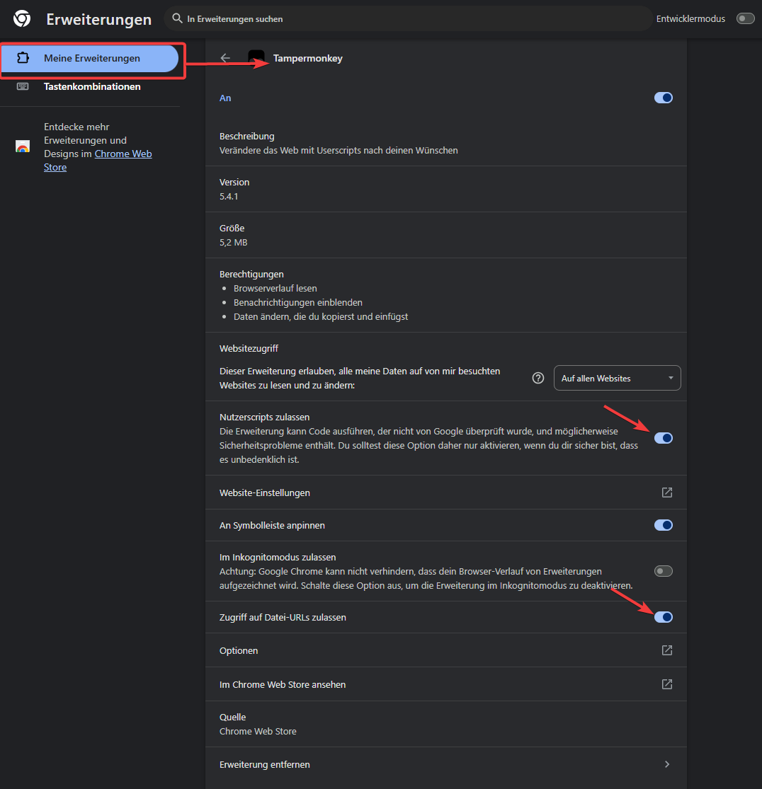
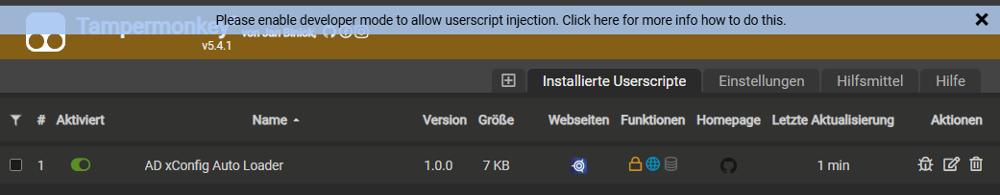
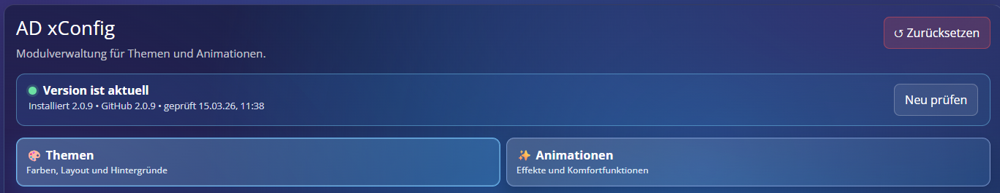
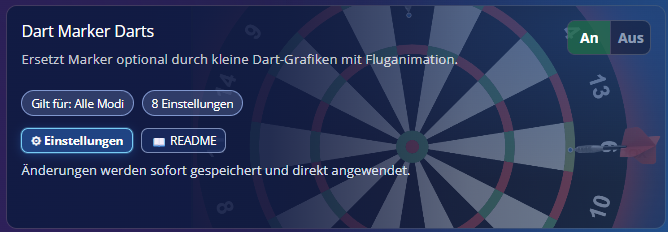
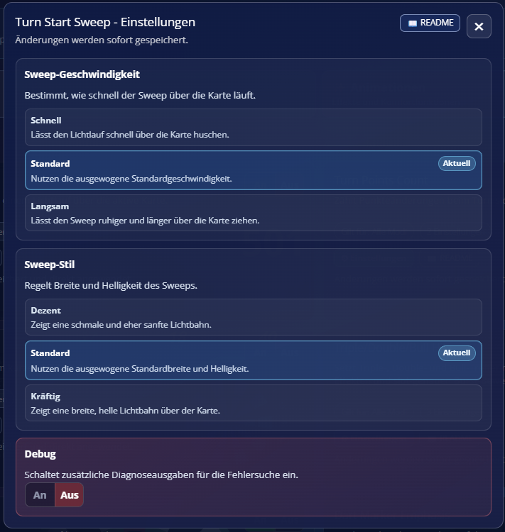
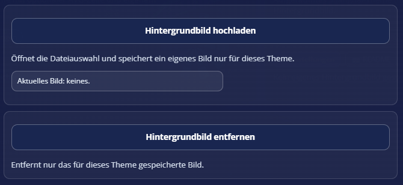
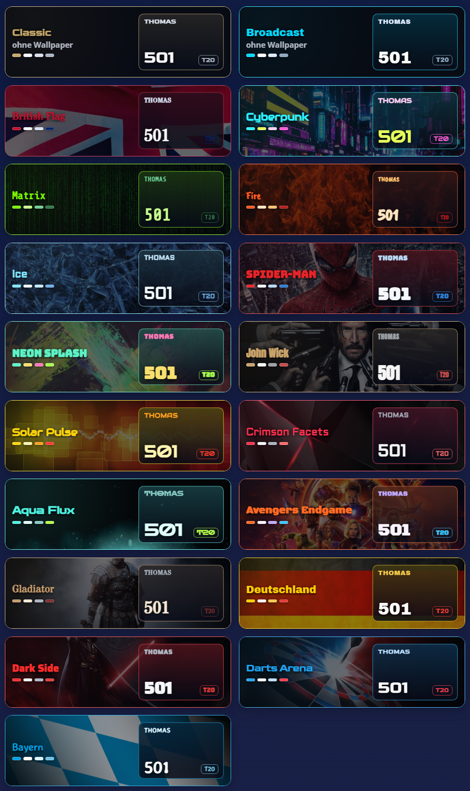

# Autodarts xConfig

> Visuelle Erweiterungen für Autodarts: bessere Lesbarkeit, klarere Hinweise, Themes und optionale Effekte.  
> Die Spiellogik bleibt unverändert.

[](https://raw.githubusercontent.com/thomasasen/autodarts-xconfig/main/dist/autodarts-xconfig.user.js)

## Was ist AD xConfig?

`autodarts-xconfig` ergänzt Autodarts um Themes, Animationen und kleine Komfortfunktionen. Du kannst damit das Spiel übersichtlicher machen und die Oberfläche nach deinem Geschmack anpassen.

Alles wird direkt im Spiel im Menü **AD xConfig** eingestellt. Du musst nichts programmieren und keine Dateien ändern.

## Was bringt es mir?

- ruhigere oder auffälligere Themes
- besser sichtbare Hinweise für Checkouts, Spielerwechsel und Treffer
- Einstellungen direkt im Spiel statt in einzelnen Skripten
- eigene Hintergrundbilder pro Theme und zusätzlich ein globales Fallback-Bild oder Preset-Wallpaper über `Templates Global`, jeweils empfohlen bis `1,5 MiB` pro gespeichertem Bild

## Im Überblick

- Insgesamt `26` Module: `17` Animationen und Komfortfunktionen sowie `9` Themes.
- `↺ Zurücksetzen`: Ein echter Hard Reset setzt alle Einstellungen auf Standard zurück, deaktiviert alle Module, schaltet Debug aus und entfernt gespeicherte Theme-Bilder.
- `Empfohlene Standards`: Aktiviert alle Module mit ausgewogenen Presets und lässt eigene Theme-Bilder unangetastet.
- `Exportieren` / `Importieren`: Sichert Einstellungen als versioniertes JSON-Backup und übernimmt auch ältere oder teilweise inkompatible Backups fehlertolerant.
- Theme-Bilder: Jedes Theme speichert sein Bild getrennt; Templates Global kann zusätzlich ein gemeinsames Fallback-Bild oder ein Preset-Wallpaper liefern, solange das aktive Theme kein eigenes Bild gespeichert hat.
- Bildgröße: Als Orientierung gilt ein empfohlenes Limit von `1,5 MiB` pro gespeichertem Bild.

## Was du zuerst lesen solltest

- Neu hier? Starte mit [Schnell loslegen](#schnell-loslegen).
- Wenn das Menü da ist, helfen dir [Wo finde ich was?](#wo-finde-ich-was), [So ist eine Kachel aufgebaut](#so-ist-eine-kachel-aufgebaut) und [So sieht das Einstellungsfenster aus](#so-sieht-das-einstellungsfenster-aus).
- Für einzelne Module nutzt du am schnellsten die [Schnellnavigation](#schnellnavigation) oder direkt im Spiel den Button `📖 README`.
- Wenn du Updates verstehen oder neu anstoßen willst, gehe zu [Updates erkennen und installieren](#updates-erkennen-und-installieren).
- Nur wenn du am Repository arbeitest, ist der Abschnitt [Für Entwickler](#für-entwickler) relevant.

## Voraussetzungen

- Ein aktueller Desktop-Browser, in dem Autodarts unter `https://play.autodarts.io/` läuft.
- Eine installierte Tampermonkey-Erweiterung.
- Die Screenshots und Bezeichnungen in dieser Anleitung stammen aus einem Chrome-/Chromium-Setup. In anderen Browsern können Menüpunkte und Schalter leicht anders heißen oder an einer etwas anderen Stelle liegen.

## Schnell loslegen

1. Tampermonkey installieren: [tampermonkey.net](https://www.tampermonkey.net/)
2. Oben auf `Installieren` klicken
3. `https://play.autodarts.io/` neu laden
4. Links in der Navigation **AD xConfig** öffnen
5. Erst `Themen` und `Animationen` in Ruhe ansehen, dann einzelne Module einschalten

Wichtige Tampermonkey-Einstellung im Browser: Öffne unter den Browsererweiterungen die Detailseite von Tampermonkey und aktiviere dort `Nutzerscripts zulassen` sowie `Zugriff auf Datei-URLs zulassen`.



Wichtiger Hinweis nach der Installation: Alle Themes sind zuerst ausgeschaltet. Die meisten Animationen und Komfortfunktionen sind ebenfalls aus. `Checkout Score Highlight` und `X01 Bust Active Player Highlight` sind standardmäßig bereits eingeschaltet. Am einfachsten ist es, wenn du Themes und Animationen einzeln ausprobierst und Autodarts Schritt für Schritt an deine Wünsche anpasst.


Wenn Tampermonkey einen Injection-Hinweis zeigt, aktiviere die empfohlene Browser-Einstellung:



## Wenn AD xConfig nicht erscheint

1. In Tampermonkey prüfen, ob `autodarts-xconfig` installiert und aktiviert ist.
2. `https://play.autodarts.io/` vollständig neu laden.
3. In den Browsererweiterungen bei Tampermonkey `Nutzerscripts zulassen` und `Zugriff auf Datei-URLs zulassen` aktivieren.
4. Falls Tampermonkey beim Installieren oder Aktualisieren einen zusätzlichen Tab geöffnet hat, die Installation dort vollständig bestätigen.
5. Wenn ein Injection-Hinweis erscheint, die empfohlene Browser-Einstellung übernehmen.
6. Danach erneut links in der Navigation nach **AD xConfig** suchen.

## Wo finde ich was?

- `Themen`: Hier findest du Farben, Layouts und Hintergründe.
- `Animationen`: Hier findest du Effekte und Komfortfunktionen.
- `⚙ Einstellungen`: Mit diesem Button öffnest du die Einstellungen einer Kachel.
- `📖 README`: Mit diesem Button öffnest du die GitHub-README direkt an der passenden Modulstelle in einem neuen Tab.
- An/Aus-Schalter: Hier schaltest du ein Modul direkt ein oder aus.

## Der obere Bereich im Menü



- `↺ Zurücksetzen`: Führt einen echten Hard Reset aus. Alle Einstellungen gehen auf Standard, alle Module werden deaktiviert, Debug wird ausgeschaltet und gespeicherte Theme-Bilder werden entfernt.
- `Empfohlene Standards`: Aktiviert alle Module mit ausgewogenen Presets und lässt eigene Theme-Bilder unangetastet.
- `Exportieren`: Erstellt ein lokales JSON-Backup. Eigene Theme- und Dart-Bilder sind standardmäßig enthalten, können für eine kleinere Datei aber abgewählt werden.
- `Importieren`: Prüft ein Backup vor dem Speichern und zeigt, welche Einstellungen übernommen, migriert oder ausgelassen werden.
- Versionsstatus: Hier siehst du, ob deine Version aktuell ist, ob ein Update verfügbar ist oder ob die Update-Prüfung fehlgeschlagen ist.
- `Changelog` / `Was ist neu?`: Öffnet direkt die veröffentlichten Änderungen auf GitHub in einem neuen Tab.
- `Neu prüfen`: Startet sofort eine neue Update-Prüfung.
- `Themen` und `Animationen`: Mit diesen Buttons wechselst du zwischen beiden Bereichen.

## Einstellungen exportieren und importieren

Mit `Exportieren` lädst du ein versioniertes Backup aller AD xConfig Einstellungen herunter. Das Backup enthält keine Autodarts-Anmeldedaten und wird nicht an einen externen Dienst übertragen. Wenn `Eigene Theme- und Dart-Bilder einschließen` aktiv ist, werden auch lokal gespeicherte Bilder mitgesichert; dadurch kann die Datei deutlich größer werden.

Beim `Importieren` wird die ausgewählte JSON-Datei zuerst vollständig geprüft. Der Prüfbericht zeigt gültige, migrierte und nicht mehr unterstützte Einstellungen einzeln an. Ein veraltetes oder aus einer neueren Version stammendes Feature bricht den Import nicht ab: kompatible Einstellungen werden weiterhin übernommen, unbekannte oder ungültige Werte werden ausgelassen.

- `Sicher zusammenführen`: Überschreibt nur gültige Werte aus dem Backup. Fehlende oder inkompatible Einstellungen behalten ihren aktuellen Stand.
- `Vollständig ersetzen`: Beginnt bei den heutigen Standards und wendet danach alle gültigen Backup-Werte an. Bilddaten, die im Export ausdrücklich nicht enthalten waren, bleiben erhalten.

Erst `Import bestätigen` schreibt die geprüfte Konfiguration. Bei unlesbarem JSON, einer unbekannten Grundstruktur oder einem Speicherfehler bleibt die aktuelle Konfiguration unverändert.

## Updates erkennen und installieren

1. AD xConfig prüft direkt beim Start, ob auf GitHub eine neuere Version verfügbar ist.
2. Danach wird im Hintergrund weiter geprüft. Der Hintergrund-Timer läuft alle 15 Minuten. Wegen Zwischenspeicherung wird ohne Klick auf `Neu prüfen` höchstens ungefähr einmal pro Stunde wirklich online verglichen.
3. Wenn ein Update verfügbar ist, siehst du am Menüpunkt **AD xConfig** einen kleinen orangefarbenen Punkt.
4. Im geöffneten Menü erscheint die Meldung `Update verfügbar` mit dem Button `Update installieren`.
5. Direkt daneben führt `Was ist neu?` zum `CHANGELOG.md`, damit du vor dem Update die Änderungen prüfen kannst.
6. Ein Klick auf `Update installieren` öffnet die Userscript-Datei in einem neuen Tab. Tampermonkey übernimmt dort die Neuinstallation.
7. Es kann ein paar Sekunden dauern, bis Tampermonkey die Aufforderung zur Re-Installation anzeigt. Danach das Update einfach bestätigen.

## So ist eine Kachel aufgebaut



- Oben steht die Überschrift des Moduls.
- Darunter steht eine kurze Beschreibung, was das Modul macht.
- `Gilt für` zeigt dir, in welchen Spielmodi das Modul gedacht ist.
- Die Zahl bei `Einstellungen` zeigt, wie viele Einstellmöglichkeiten es gibt.
- `⚙ Einstellungen` öffnet das Einstellungsfenster dieser Kachel.
- `📖 README` öffnet die GitHub-README direkt an der passenden Modulstelle.
- Der Hinweis unten zeigt bei Themes zum Beispiel an, ob schon ein eigenes Hintergrundbild gespeichert ist.
- Der An/Aus-Schalter oben rechts ist die wichtigste Aktion: Hier schaltest du das Modul direkt ein oder aus.

## So sieht das Einstellungsfenster aus



- Oben findest du wieder den Button `📖 README`, der die GitHub-README direkt beim gerade geöffneten Modul öffnet.
- Die Einstellungen sind in Gruppen aufgeteilt, damit du nicht alles auf einmal suchen musst.
- Viele Gruppen funktionieren wie eine Einzelauswahl. Meist ist pro Gruppe nur eine Option gleichzeitig aktiv.
- Die aktuell ausgewählte Option ist mit `Aktuell` markiert.
- Manche Einstellungen sind einfache An/Aus-Schalter.
- `Debug` ist nur für Entwicklung und Fehlersuche gedacht. Diese Option nur aktivieren, wenn du ausdrücklich dazu aufgefordert wirst. Sonst kann es zu unerwünschten Nebeneffekten kommen.

## Eigene Hintergrundbilder in Themes



Bei den Themes kannst du ein eigenes Hintergrundbild hochladen und später auch wieder entfernen. Das Bild wird nur für das jeweilige Theme gespeichert.
Empfohlen ist dabei ein Bild bis `1,5 MiB`, damit Upload und Speicherung im Browser stabil bleiben.

`Templates Global` bietet zusätzlich denselben Hintergrundblock als globales Fallback oder als Preset-Wallpaper. Solange das aktive Theme kein eigenes Bild gespeichert hat, greifen Bild, Darstellung, Deckkraft und Spielerfelder-Transparenz aus `Templates Global`. Sobald ein Theme ein eigenes Bild speichert, überschreibt dieses Theme den kompletten globalen Background-Block wieder vollständig.

Je nach Theme kannst du dein Hintergrundbild zusätzlich anpassen:

- `Hintergrund-Darstellung`: Hier legst du fest, wie das Bild platziert wird.
- `Hintergrundbild-Deckkraft`: Hier regelst du, wie stark das Bild sichtbar bleibt.
- `Spielerfelder-Transparenz`: Hier bestimmst du, wie stark die Spielerfelder den Hintergrund durchlassen.

Hinweis: Die Option `Debug` ist in allen Modulen nur für Fehlersuche gedacht. Im normalen Spielbetrieb sollte sie deaktiviert bleiben.

<!-- xconfig-generated:start -->
## Schnellnavigation

### Themen

- [Templates Global](#template-global-typography)
- [Bot Board Style](#bot-board-style)
- [Theme Bull-off](#template-autodarts-theme-bull-off)
- [Theme X01](#template-autodarts-theme-x01)
- [Theme Gotcha](#template-autodarts-theme-gotcha)
- [Theme X01 2Player (Beta)](#template-autodarts-theme-x01-2player)
- [Theme Cricket](#template-autodarts-theme-cricket)
- [Theme Shanghai](#template-autodarts-theme-shanghai)
- [Theme Bermuda](#template-autodarts-theme-bermuda)

### Animationen und Komfort

- [Checkout Score Highlight](#animation-autodarts-animate-checkout-score-highlight)
- [X01 Remaining Score Bar](#animation-autodarts-x01-remaining-score-bar)
- [Checkout Target Highlights](#animation-autodarts-animate-checkout-target-highlights)
- [TV Board Zoom](#animation-autodarts-animate-tv-board-zoom)
- [Checkout Suggestion Styles](#animation-autodarts-checkout-suggestion-styles)
- [X01 Bust Active Player Highlight](#animation-autodarts-x01-bust-active-player-highlight)
- [AVG Trend Arrow](#animation-autodarts-animate-avg-trend-arrow)
- [Active Player Sweep](#animation-autodarts-animate-active-player-sweep)
- [Special Hit Highlights](#animation-autodarts-animate-special-hit-highlights)
- [Cricket Target Highlighter](#animation-autodarts-animate-cricket-target-highlighter)
- [Cricket Grid Status Effects](#animation-autodarts-animate-cricket-grid-status-effects)
- [Dartboard Marker Highlight](#animation-autodarts-animate-dartboard-marker-highlight)
- [Dart Marker Replacer](#animation-autodarts-animate-dart-marker-replacer)
- [Take Out Darts Alert](#animation-autodarts-animate-take-out-darts-alert)
- [Single Bull Hit Sound](#animation-autodarts-animate-single-bull-hit-sound)
- [Turn Score Counter](#animation-autodarts-animate-turn-score-counter)
- [Winner Celebration Effect](#animation-autodarts-animate-winner-celebration-effect)

## Empfohlene Standards

Die Aktion `Empfohlene Standards` wendet aktuell dieses Profil an:

### Themen

**In allen Themen**
- `Alle aktiviert`: An
- `Kontrast-Preset`: Standard
- `Hintergrund-Darstellung`: Füllen
- `Hintergrundbild-Deckkraft`: 25 %
- `Spielerfelder-Transparenz`: 10 %
- `Debug`: Aus

**Templates Global**
- `Aktiv`: An
- `Schriftart`: Aldrich
- `Greift bei`: scores,throws,names
- `Hintergrund-Darstellung`: Füllen
- `Hintergrundbild-Deckkraft`: 10 %
- `Spielerfelder-Transparenz`: 10 %
- `Aktivspieler-Tönung`: 20 %
- `Debug`: Aus

**Bot Board Style**
- `Aktiv`: An
- `Board-Design`: Winmau Blade 6 TC
- `Geltungsbereich`: Alle Match-Boards
- `Debug`: Aus

### Animationen

**In allen Animationen**
- `Alle aktiviert`: An
- `Debug`: Aus

**Active Player Sweep**
- `Sweep-Geschwindigkeit`: Langsam
- `Sweep-Stil`: Kräftig

**Turn Score Counter**
- `Zählstil`: Smooth Count
- `Zählgeschwindigkeit`: Schnell
- `Aufblitz-Effekt`: Aus
- `Aufblitz-Modus`: Nur bei Änderung

**AVG Trend Arrow**
- `Animationsdauer`: Lang
- `Pfeil-Größe`: Standard

**Special Hit Highlights**
- `Farbstil`: Rot/Blau/Grün
- `Animationsstil`: Electric Jolt

**Dart Marker Replacer**
- `Dart Design`: German Giant
- `Dart-Fluganimation`: An
- `Dart-Größe`: Standard
- `Original-Marker ausblenden`: An
- `Einschlagstil`: Dramatisch
- `Einschlag-Schatten`: An
- `Schatten-Weichzeichnung`: An
- `Einschlag-Wobble`: An
- `Flug-Blur`: An
- `Fluggeschwindigkeit`: Standard

**Dartboard Marker Highlight**
- `Marker-Größe`: Standard
- `Marker-Farbe`: Blau
- `Effekt`: Size Pulse
- `Marker-Sichtbarkeit`: 100 %
- `Outline-Farbe`: Weiß

**Take Out Darts Alert**
- `Bildgröße`: Groß
- `Pulse-Animation`: An
- `Pulse-Stärke`: Standard

**Single Bull Hit Sound**
- `Lautstärke`: Standard
- `Wiederholsperre`: 700 ms
- `Fallback-Scan`: Nur live

**Winner Celebration Effect**
- `Style`: Center Cannon
- `Farbe`: Gold
- `Intensität`: Standard
- `Dauer`: 5 s
- `Partikelanzahl`: Sparsam
- `Bei Bull-Out aktiv`: Aus
- `Klick beendet Effekt`: An

**Checkout Suggestion Styles**
- `Stil`: Stripe
- `Labeltext`: CHECKOUT
- `Farbthema`: Amber

**Checkout Score Highlight**
- `Effekt`: Fade Blink
- `Farbthema`: Cyan
- `Intensität`: Standard
- `Trigger-Quelle`: Vorschlag zuerst

**X01 Remaining Score Bar**
- `Farben`: Traffic Light
- `Balkengröße`: Breit
- `Effekt`: Previous Score Trail

**X01 Bust Active Player Highlight**

**Checkout Target Highlights**
- `Darstellung`: Fast Blink
- `Segmentstil`: Fläche + Rahmen
- `Zielauswahl`: Nächstes Feld
- `Farbthema`: Violett

**TV Board Zoom**
- `Zoom-Stufe`: 2,75
- `Zoom-Geschwindigkeit`: Mittel
- `Checkout-Zoom`: An
- `Checkout-Ziel`: Nur Finish-Feld
- `T20-Setup-Zoom`: An

**Cricket Target Highlighter**
- `OPEN-Ziele anzeigen`: Aus
- `DEAD-Ziele anzeigen`: An
- `Irrelevante Felder abdunkeln`: Hatch+
- `Farbthema`: Standard
- `Intensität`: Standard

**Cricket Grid Status Effects**
- `Zeilen-Sweep`: An
- `Ziel-Badge-Hinweis`: An
- `Mark-Fortschritt`: An
- `PRESSURE-Kante`: An
- `SCORING-Streifen`: An
- `DEAD-Zeilen abdunkeln`: An
- `Delta-Chips`: An
- `Treffer-Impuls`: An
- `Zugwechsel-Übergang`: An
- `PRESSURE-Overlay`: An
- `Farbthema`: High Contrast
- `Intensität`: Standard

## Themen

<a id="template-global-typography"></a>

### Templates Global

- Gilt für: `alle Modi`
- Was macht es sichtbar? Bietet fertige Templates-Global-Presets, kuratierte Schriften, feste Farbrollen, eine optionale Aktivkarten-Tönung und ein gemeinsames Fallback-Hintergrundbild für aktive xConfig-Themes.
- Grafisch: Templates Global setzt eine gemeinsame Basis für unterstützte xConfig-Themes. Presets ändern Schrift, Farben und Hintergrundwerte zusammen; die einzelnen Einstellungen lassen sich danach gezielt anpassen. Die gewählte Schrift wirkt nur in stabilen Bereichen wie Scores, Würfen und Namen. Das globale Hintergrundbild ist ein Fallback: Themes mit eigenem Bild behalten ihr eigenes Hintergrundbild, alle anderen können das gespeicherte Fallback-Bild oder ein Preset-Wallpaper aus Templates Global verwenden. Zusätzlich lassen sich die drei Darts im Wurffeld als Farbe, Verlauf, gebündeltes Marker-Bild oder eigenes Bild darstellen.
- Wann sinnvoll? Wenn du mit einem Klick einen kompletten Look setzen oder Scores, Würfe, Spielernamen, den Aktiv-Akzent, die Aktivkarten-Tönung und den globalen Hintergrundblock anpassen möchtest, ohne jedes Theme separat pflegen zu müssen.

**Einstellungen einfach erklärt**

- `Classic`: Aktiviert Templates Global und setzt Schrift, Farben sowie Hintergrundwerte direkt auf Classic. Dabei wird auch ein bereits gespeichertes globales Wallpaper überschrieben.
- `Broadcast`: Aktiviert Templates Global und setzt Schrift, Farben sowie Hintergrundwerte direkt auf Broadcast. Dabei wird auch ein bereits gespeichertes globales Wallpaper überschrieben.
- `British Flag`: Aktiviert Templates Global und setzt Schrift, Farben sowie Hintergrundwerte direkt auf British Flag. Dabei wird auch ein bereits gespeichertes globales Wallpaper überschrieben.
- `Cyberpunk`: Aktiviert Templates Global und setzt Schrift, Farben sowie Hintergrundwerte direkt auf Cyberpunk. Dabei wird auch ein bereits gespeichertes globales Wallpaper überschrieben.
- `Matrix`: Aktiviert Templates Global und setzt Schrift, Farben sowie Hintergrundwerte direkt auf Matrix. Dabei wird auch ein bereits gespeichertes globales Wallpaper überschrieben.
- `Fire`: Aktiviert Templates Global und setzt Schrift, Farben sowie Hintergrundwerte direkt auf Fire. Dabei wird auch ein bereits gespeichertes globales Wallpaper überschrieben.
- `Ice`: Aktiviert Templates Global und setzt Schrift, Farben sowie Hintergrundwerte direkt auf Ice. Dabei wird auch ein bereits gespeichertes globales Wallpaper überschrieben.
- `Spider-Man`: Aktiviert Templates Global und setzt Schrift, Farben sowie Hintergrundwerte direkt auf Spider-Man. Dabei wird auch ein bereits gespeichertes globales Wallpaper überschrieben.
- `Neon Splash`: Aktiviert Templates Global und setzt Schrift, Farben sowie Hintergrundwerte direkt auf Neon Splash. Dabei wird auch ein bereits gespeichertes globales Wallpaper überschrieben.
- `John Wick`: Aktiviert Templates Global und setzt Schrift, Farben sowie Hintergrundwerte direkt auf John Wick. Dabei wird auch ein bereits gespeichertes globales Wallpaper überschrieben.
- `Solar Pulse`: Aktiviert Templates Global und setzt Schrift, Farben sowie Hintergrundwerte direkt auf Solar Pulse. Dabei wird auch ein bereits gespeichertes globales Wallpaper überschrieben.
- `Crimson Facets`: Aktiviert Templates Global und setzt Schrift, Farben sowie Hintergrundwerte direkt auf Crimson Facets. Dabei wird auch ein bereits gespeichertes globales Wallpaper überschrieben.
- `Aqua Flux`: Aktiviert Templates Global und setzt Schrift, Farben sowie Hintergrundwerte direkt auf Aqua Flux. Dabei wird auch ein bereits gespeichertes globales Wallpaper überschrieben.
- `Avengers Endgame`: Aktiviert Templates Global und setzt Schrift, Farben sowie Hintergrundwerte direkt auf Avengers Endgame. Dabei wird auch ein bereits gespeichertes globales Wallpaper überschrieben.
- `Gladiator`: Aktiviert Templates Global und setzt Schrift, Farben sowie Hintergrundwerte direkt auf Gladiator. Dabei wird auch ein bereits gespeichertes globales Wallpaper überschrieben.
- `Deutschland`: Aktiviert Templates Global und setzt Schrift, Farben sowie Hintergrundwerte direkt auf Deutschland. Dabei wird auch ein bereits gespeichertes globales Wallpaper überschrieben.
- `Dark Side`: Aktiviert Templates Global und setzt Schrift, Farben sowie Hintergrundwerte direkt auf Dark Side. Dabei wird auch ein bereits gespeichertes globales Wallpaper überschrieben.
- `Darts Arena`: Aktiviert Templates Global und setzt Schrift, Farben sowie Hintergrundwerte direkt auf Darts Arena. Dabei wird auch ein bereits gespeichertes globales Wallpaper überschrieben.
- `Bayern`: Aktiviert Templates Global und setzt Schrift, Farben sowie Hintergrundwerte direkt auf Bayern. Dabei wird auch ein bereits gespeichertes globales Wallpaper überschrieben.
- `Schriftart`: Wählt eine kuratierte Remote-Schrift für die Template-Typografie. Die Schrift wirkt nur in den unterstützten Bereichen des aktiven xConfig-Themes und verwendet bei Ladeproblemen automatisch einen lokalen Fallback-Stack.
  - Standard (deaktiviert)
  - <span style="font-family: &quot;Aldrich&quot;, &quot;Open Sans&quot;, &quot;Segoe UI&quot;, Tahoma, sans-serif; font-size: 1.08em;">Aldrich</span>
  - <span style="font-family: &quot;Allerta&quot;, &quot;Open Sans&quot;, &quot;Segoe UI&quot;, Tahoma, sans-serif; font-size: 1.08em;">Allerta</span>
  - <span style="font-family: &quot;Alumni Sans&quot;, &quot;Open Sans&quot;, &quot;Segoe UI&quot;, Tahoma, sans-serif; font-size: 1.08em;">Alumni Sans</span>
  - <span style="font-family: &quot;Alumni Sans Inline One&quot;, &quot;Open Sans&quot;, &quot;Segoe UI&quot;, Tahoma, sans-serif; font-size: 1.08em;">Alumni Sans Inline One</span>
  - <span style="font-family: &quot;Anton&quot;, &quot;Open Sans&quot;, &quot;Segoe UI&quot;, Tahoma, sans-serif; font-size: 1.08em;">Anton</span>
  - <span style="font-family: &quot;Anybody&quot;, &quot;Open Sans&quot;, &quot;Segoe UI&quot;, Tahoma, sans-serif; font-size: 1.08em;">Anybody</span>
  - <span style="font-family: &quot;Archivo Black&quot;, &quot;Open Sans&quot;, &quot;Segoe UI&quot;, Tahoma, sans-serif; font-size: 1.08em;">Archivo Black</span>
  - <span style="font-family: &quot;Armata&quot;, &quot;Open Sans&quot;, &quot;Segoe UI&quot;, Tahoma, sans-serif; font-size: 1.08em;">Armata</span>
  - <span style="font-family: &quot;Audiowide&quot;, &quot;Open Sans&quot;, &quot;Segoe UI&quot;, Tahoma, sans-serif; font-size: 1.08em;">Audiowide</span>
  - <span style="font-family: &quot;Averia Libre&quot;, Georgia, &quot;Times New Roman&quot;, serif; font-size: 1.08em;">Averia Libre</span>
  - <span style="font-family: &quot;Averia Sans Libre&quot;, &quot;Open Sans&quot;, &quot;Segoe UI&quot;, Tahoma, sans-serif; font-size: 1.08em;">Averia Sans Libre</span>
  - <span style="font-family: &quot;Bai Jamjuree&quot;, &quot;Open Sans&quot;, &quot;Segoe UI&quot;, Tahoma, sans-serif; font-size: 1.08em;">Bai Jamjuree</span>
  - <span style="font-family: &quot;Big Shoulders Stencil&quot;, &quot;Open Sans&quot;, &quot;Segoe UI&quot;, Tahoma, sans-serif; font-size: 1.08em;">Big Shoulders Stencil</span>
  - <span style="font-family: &quot;Black Ops One&quot;, &quot;Open Sans&quot;, &quot;Segoe UI&quot;, Tahoma, sans-serif; font-size: 1.08em;">Black Ops One</span>
  - <span style="font-family: &quot;Bruno Ace&quot;, &quot;Open Sans&quot;, &quot;Segoe UI&quot;, Tahoma, sans-serif; font-size: 1.08em;">Bruno Ace</span>
  - <span style="font-family: &quot;Bungee&quot;, &quot;Open Sans&quot;, &quot;Segoe UI&quot;, Tahoma, sans-serif; font-size: 1.08em;">Bungee</span>
  - <span style="font-family: &quot;Bungee Inline&quot;, &quot;Open Sans&quot;, &quot;Segoe UI&quot;, Tahoma, sans-serif; font-size: 1.08em;">Bungee Inline</span>
  - <span style="font-family: &quot;Bungee Shade&quot;, &quot;Open Sans&quot;, &quot;Segoe UI&quot;, Tahoma, sans-serif; font-size: 1.08em;">Bungee Shade</span>
  - <span style="font-family: &quot;Cairo Play&quot;, &quot;Open Sans&quot;, &quot;Segoe UI&quot;, Tahoma, sans-serif; font-size: 1.08em;">Cairo Play</span>
  - <span style="font-family: &quot;Caramel&quot;, &quot;Segoe Print&quot;, &quot;Bradley Hand&quot;, cursive; font-size: 1.08em;">Caramel</span>
  - <span style="font-family: &quot;Caveat&quot;, &quot;Segoe Print&quot;, &quot;Bradley Hand&quot;, cursive; font-size: 1.08em;">Caveat</span>
  - <span style="font-family: &quot;Caveat Brush&quot;, &quot;Segoe Print&quot;, &quot;Bradley Hand&quot;, cursive; font-size: 1.08em;">Caveat Brush</span>
  - <span style="font-family: &quot;Chakra Petch&quot;, &quot;Open Sans&quot;, &quot;Segoe UI&quot;, Tahoma, sans-serif; font-size: 1.08em;">Chakra Petch</span>
  - <span style="font-family: &quot;Chilanka&quot;, &quot;Segoe Print&quot;, &quot;Bradley Hand&quot;, cursive; font-size: 1.08em;">Chilanka</span>
  - <span style="font-family: &quot;Courier Prime&quot;, &quot;SFMono-Regular&quot;, Consolas, &quot;Liberation Mono&quot;, Menlo, monospace; font-size: 1.08em;">Courier Prime</span>
  - <span style="font-family: &quot;Cute Font&quot;, &quot;Segoe Print&quot;, &quot;Bradley Hand&quot;, cursive; font-size: 1.08em;">Cute Font</span>
  - <span style="font-family: &quot;Dangrek&quot;, &quot;Open Sans&quot;, &quot;Segoe UI&quot;, Tahoma, sans-serif; font-size: 1.08em;">Dangrek</span>
  - <span style="font-family: &quot;Days One&quot;, &quot;Open Sans&quot;, &quot;Segoe UI&quot;, Tahoma, sans-serif; font-size: 1.08em;">Days One</span>
  - <span style="font-family: &quot;Ewert&quot;, Georgia, &quot;Times New Roman&quot;, serif; font-size: 1.08em;">Ewert</span>
  - <span style="font-family: &quot;Faster One&quot;, &quot;Open Sans&quot;, &quot;Segoe UI&quot;, Tahoma, sans-serif; font-size: 1.08em;">Faster One</span>
  - <span style="font-family: &quot;Finger Paint&quot;, &quot;Segoe Print&quot;, &quot;Bradley Hand&quot;, cursive; font-size: 1.08em;">Finger Paint</span>
  - <span style="font-family: &quot;Foldit&quot;, &quot;Open Sans&quot;, &quot;Segoe UI&quot;, Tahoma, sans-serif; font-size: 1.08em;">Foldit</span>
  - <span style="font-family: &quot;Fragment Mono&quot;, &quot;SFMono-Regular&quot;, Consolas, &quot;Liberation Mono&quot;, Menlo, monospace; font-size: 1.08em;">Fragment Mono</span>
  - <span style="font-family: &quot;Fredericka the Great&quot;, Georgia, &quot;Times New Roman&quot;, serif; font-size: 1.08em;">Fredericka the Great</span>
  - <span style="font-family: &quot;Frijole&quot;, Georgia, &quot;Times New Roman&quot;, serif; font-size: 1.08em;">Frijole</span>
  - <span style="font-family: &quot;Fugaz One&quot;, &quot;Open Sans&quot;, &quot;Segoe UI&quot;, Tahoma, sans-serif; font-size: 1.08em;">Fugaz One</span>
  - <span style="font-family: &quot;Goldman&quot;, &quot;Open Sans&quot;, &quot;Segoe UI&quot;, Tahoma, sans-serif; font-size: 1.08em;">Goldman</span>
  - <span style="font-family: &quot;Inconsolata&quot;, &quot;SFMono-Regular&quot;, Consolas, &quot;Liberation Mono&quot;, Menlo, monospace; font-size: 1.08em;">Inconsolata</span>
  - <span style="font-family: &quot;Indie Flower&quot;, &quot;Segoe Print&quot;, &quot;Bradley Hand&quot;, cursive; font-size: 1.08em;">Indie Flower</span>
  - <span style="font-family: &quot;Inria Sans&quot;, &quot;Open Sans&quot;, &quot;Segoe UI&quot;, Tahoma, sans-serif; font-size: 1.08em;">Inria Sans</span>
  - <span style="font-family: &quot;Jersey 15&quot;, &quot;Open Sans&quot;, &quot;Segoe UI&quot;, Tahoma, sans-serif; font-size: 1.08em;">Jersey 15</span>
  - <span style="font-family: &quot;Keania One&quot;, &quot;Open Sans&quot;, &quot;Segoe UI&quot;, Tahoma, sans-serif; font-size: 1.08em;">Keania One</span>
  - <span style="font-family: &quot;Permanent Marker&quot;, &quot;Segoe Print&quot;, &quot;Bradley Hand&quot;, cursive; font-size: 1.08em;">Permanent Marker</span>
  - <span style="font-family: &quot;Plaster&quot;, &quot;Open Sans&quot;, &quot;Segoe UI&quot;, Tahoma, sans-serif; font-size: 1.08em;">Plaster</span>
  - <span style="font-family: &quot;Saira Stencil One&quot;, &quot;Open Sans&quot;, &quot;Segoe UI&quot;, Tahoma, sans-serif; font-size: 1.08em;">Saira Stencil One</span>
  - <span style="font-family: &quot;Share Tech Mono&quot;, &quot;SFMono-Regular&quot;, Consolas, &quot;Liberation Mono&quot;, Menlo, monospace; font-size: 1.08em;">Share Tech Mono</span>
  - <span style="font-family: &quot;Stardos Stencil&quot;, &quot;Open Sans&quot;, &quot;Segoe UI&quot;, Tahoma, sans-serif; font-size: 1.08em;">Stardos Stencil</span>
  - <span style="font-family: &quot;Wallpoet&quot;, &quot;Open Sans&quot;, &quot;Segoe UI&quot;, Tahoma, sans-serif; font-size: 1.08em;">Wallpoet</span>
  - <span style="font-family: &quot;Zen Dots&quot;, &quot;Open Sans&quot;, &quot;Segoe UI&quot;, Tahoma, sans-serif; font-size: 1.08em;">Zen Dots</span>
  - <span style="font-family: &quot;Zilla Slab Highlight&quot;, Georgia, &quot;Times New Roman&quot;, serif; font-size: 1.08em;">Zilla Slab Highlight</span>
- `Greift bei`: Bestimmt per Mehrfachauswahl, welche stabilen Textbereiche des aktiven xConfig-Themes die gewählte Schrift übernehmen. V1 beschränkt sich bewusst auf Scores, Würfe und Spielernamen.
  - `Scores`: Wendet die Schrift auf stabile Score- und Punkteanzeigen an.
  - `Würfe`: Wendet die Schrift auf die Wurfanzeige im Turn-Bereich und auf stabile nachgeladene Turn-Karten an.
  - `Namen`: Wendet die Schrift auf Spielernamen in den unterstützten Theme-Karten an.
- `Aktiv-Akzent`: Legt die semantische Akzentfarbe für aktive und gewinnende Spieler fest. Die Farbe wirkt im aktiven xConfig-Theme auf Rahmen, Outline/Glow und die aktive Hauptzahl, ohne zusätzliche Zustandsfarben einzeln freizuschalten.
- `Hauptzahlen`: Legt die Farbe für normale beziehungsweise inaktive Hauptzahlen sowie große Turn-Punkte fest. Die aktive Hauptzahl bleibt bewusst weiter an den Aktiv-Akzent gebunden.
- `Sekundärtext`: Legt eine gemeinsame Sekundärfarbe für Namen und Meta-Texte fest. Dadurch bleiben diese Bereiche ruhig und konsistent, während Scores und Aktiv-Akzente separat geführt werden.
- `Wurf-/Checkout-Text`: Legt die Farbe für Wurf-Labels, Suggestion-Texte und Checkout-Hinweise fest, ohne die großen Turn-Punkte mitzunehmen. So lassen sich Hilfstexte ruhiger oder klarer vom Hauptscore trennen.
- `Aktivspieler-Tönung`: Regelt, wie stark die Farbe des aktiven Rahmens zusätzlich in den Kartenhintergrund aktiver oder gewinnender Spieler einfließt. `Aus` deaktiviert die Tönung vollständig; höhere Werte lassen den Aktiv-Akzent deutlicher durch die Kartenfläche schimmern.
  - `Aus`: Es wird keine zusätzliche Hintergrundtönung für aktive oder gewinnende Spielerfelder gesetzt. Die Karten bleiben bei ihrer normalen Theme-Fläche.
  - `10 %`: Der Rahmenfarbton schimmert leicht in den Hintergrund aktiver Spielerkarten hinein. Die Wirkung bleibt dezent und ergänzt den Grundlook nur vorsichtig.
  - `15 %`: Der Aktiv-Akzent ist als leichte Hintergrundfärbung klar wahrnehmbar, ohne die Lesbarkeit oder die Theme-Fläche zu dominieren. Diese Stufe entspricht dem gedachten Standard-Look der Tönung.
  - `20 %`: Die aktive Karte wirkt klarer eingefärbt und übernimmt mehr von der Rahmenfarbe. Der Effekt bleibt noch kontrolliert, tritt aber sichtbar präsenter hervor als bei 15 %.
  - `25 %`: Die Rahmenfarbe prägt den Hintergrund aktiver oder gewinnender Spielerkarten deutlich und verändert den Kartencharakter spürbar. Diese Stufe ist markant, bleibt aber noch gut kontrollierbar.
  - `30 %`: Die Rahmenfarbe prägt den Hintergrund aktiver oder gewinnender Spielerkarten sehr deutlich. Diese Stufe ist die markanteste Variante und verändert den Kartencharakter am stärksten.
- `Wurffeld-Darts`: Legt fest, ob die Darts im Wurffeld original bleiben, als einfarbige SVG, als Verlauf, mit einem gebündelten Marker-Bild oder mit einem eigenen hochgeladenen Bild erscheinen. Die Einstellung betrifft nur die drei Wurffeld-Darts, nicht die Board-Marker.
  - `Original`: Die drei Dart-Grafiken im Wurffeld bleiben im Originalzustand von Autodarts.
  - `Farbe`: Die drei Dart-Grafiken im Wurffeld werden durch eine generierte SVG-Grafik in der gewählten Dart-Farbe ersetzt.
  - `Verlauf`: Die drei Dart-Grafiken im Wurffeld werden durch eine generierte SVG-Grafik mit Verlauf aus Verlaufsfarbe, Dart-Farbe und heller Spitze ersetzt.
  - `Marker-Bild`: Die drei Dart-Grafiken im Wurffeld verwenden das unter `Dart auswählen` gewählte, lokal gebündelte Dart-Bild. Das Board-Design des Dart Marker Replacers bleibt dabei unverändert.
  - `Eigenes Bild`: Die drei Dart-Grafiken im Wurffeld verwenden das in Templates Global gespeicherte eigene Bild. Ohne gespeichertes Bild bleibt die Anzeige unverändert.
- `Dart auswählen`: Zeigt passende, freigestellte Dart-Bilder für die drei Wurffelder. Die Auswahl aktiviert automatisch den Modus `Marker-Bild`, behält ein eventuell hochgeladenes eigenes Bild und verändert das Design der Board-Marker nicht.
  - `German Gigant`: Verwendet den horizontal ausgerichteten German-Gigant-Dart mit Flight links und Spitze rechts für die drei Darts im Wurffeld. In der Auswahl wird nur die Dartbezeichnung angezeigt.
  - `Blue Lightning`: Verwendet Blue Lightning mit blauem Blitz-Flight als Wurffeld-Dart.
  - `Copper Grid`: Verwendet Copper Grid mit kupferfarbenem Gitter-Flight als Wurffeld-Dart.
  - `Snakebite Purple`: Verwendet Snakebite Purple mit pink-violettem Schlangen-Flight als Wurffeld-Dart.
  - `Iceman Blue`: Verwendet Iceman Blue mit schwarz-blauem Flight als Wurffeld-Dart.
  - `Bullet Red`: Verwendet Bullet Red mit rotem Flight und goldener Spitze als Wurffeld-Dart.
  - `Carbon Gold`: Verwendet Carbon Gold mit geometrischem schwarz-goldenem Flight als Wurffeld-Dart.
  - `Vecta Gold`: Verwendet Vecta Gold mit EVO-Flight und goldenen Akzenten als Wurffeld-Dart.
  - `GVV Blue`: Verwendet GVV Blue mit kontrastreichem schwarz-weiß-blauem Flight als Wurffeld-Dart.
  - `Cool Hand Luke`: Verwendet Cool Hand Luke mit signiertem schwarz-goldenem Flight als Wurffeld-Dart.
  - `Target Neon`: Verwendet Target Neon mit transluzentem Flight und Shaft als Wurffeld-Dart.
- `Dart-Text`: Schreibt einen Text in die drei Wurffeld-Dartfelder, solange weder `Marker-Bild` noch `Eigenes Bild` aktiv ist. Das Zeichen `#` wird pro Feld durch die Wurfnummer ersetzt, also zum Beispiel `Wurf #` als `Wurf 1`, `Wurf 2` und `Wurf 3`. Dart-Farbe und Schriftart aus Templates Global greifen auch auf diesen Text.
- `Dart-Farbe`: Bestimmt die Hauptfarbe der generierten Wurffeld-Darts. Im Verlaufsmodus bildet sie die Mitte des Verlaufs, im Farbmodus füllt sie den Dart vollständig.
- `Verlaufsfarbe`: Bestimmt die zweite Farbe im Verlaufsmodus. Zusammen mit der Hauptfarbe entsteht eine horizontale Dart-Grafik mit leichter heller Spitze.
- `Dart-Größe`: Regelt die dargestellte Größe der ersetzten Darts im Wurffeld. Die feste Höhe hält die Score-Leiste stabil, auch wenn ein eigenes Bild verwendet wird.
  - `Kompakt`: Die ersetzten Wurffeld-Darts bleiben kompakt und verändern die Leiste nur minimal.
  - `Standard`: Die Wurffeld-Darts werden etwas präsenter, bleiben aber innerhalb der üblichen Leistenhöhe.
  - `Groß`: Die Wurffeld-Darts werden größer angezeigt. Das passt besonders für reduzierte oder transparente eigene Bilder.
- `Dart-Glanz`: Aktiviert oder entfernt den hellen Drop-Shadow um ersetzte Wurffeld-Darts. Größe, Dart-Bild und eigener Upload bleiben unverändert.
- `Dart-Bild hochladen`: Öffnet die Dateiauswahl und speichert ein eigenes Bild für die drei Darts im Wurffeld. Empfohlen sind transparente PNG-, WebP- oder SVG-Dateien, horizontal und eng zugeschnitten, etwa 5:1 bis 6:1. Das Bild wird lokal auf maximal 960×240 optimiert und bis 350 KB gespeichert.
- `Dart-Bild entfernen`: Löscht das in Templates Global gespeicherte Wurffeld-Dart-Bild und stellt die Wurffeld-Darts wieder auf `Original`. Farben, Verläufe und andere Templates-Global-Werte bleiben erhalten.
- `Hintergrund-Darstellung`: Bestimmt, ob ein eigenes Theme-Bild den Bereich füllt, eingepasst wird, gestreckt erscheint, mittig ohne Skalierung liegt oder gekachelt wiederholt wird. Grafisch ändert sich die Bildplatzierung, nicht die Struktur des Themes.
  - `Füllen`: Das Bild legt sich wie ein Vollflächen-Hintergrund über den gesamten Spielbereich. Leere Ränder entstehen nicht, dafür können Randbereiche abgeschnitten werden.
  - `Einpassen`: Das komplette Bild bleibt sichtbar und wird in die verfügbare Fläche eingepasst. Wenn das Seitenverhältnis nicht passt, bleiben am Rand freie Bereiche des Themes sichtbar.
  - `Strecken`: Das Bild wird auf Breite und Höhe des Bereichs gestreckt. Dadurch wird alles ausgefüllt, aber Kreise, Personen oder Logos können sichtbar verzerrt wirken.
  - `Zentriert`: Das Bild sitzt mittig und bleibt in seiner natürlichen Größe. Ist es kleiner als der Bereich, bleibt rundherum der normale Theme-Hintergrund sichtbar.
  - `Kacheln`: Das Bild wird nicht skaliert, sondern links oben gestartet und über die Fläche wiederholt. Dadurch entsteht eher ein Musterteppich als ein einzelnes zentriertes Motiv.
- `Hintergrundbild-Deckkraft`: Steuert, wie stark das gespeicherte Hintergrundbild durch die dunkle Theme-Überlagerung durchscheint. Hohe Werte zeigen das Bild klarer, niedrige Werte dämpfen es stärker zugunsten der Lesbarkeit.
  - `100 %`: Das Hintergrundbild bleibt fast ohne dunkle Dämpfung sichtbar. Farben, Kontraste und Details treten sehr klar hervor.
  - `85 %`: Das Bild bleibt sehr präsent, wird aber leicht durch die dunkle Theme-Schicht beruhigt. Details bleiben klar lesbar, ohne ganz so dominant wie bei 100 % zu wirken.
  - `70 %`: Das Bild bleibt gut erkennbar, während die dunkle Überlagerung bereits spürbar für Ruhe sorgt. Motive und Farben sind noch klar da, aber weniger dominant.
  - `55 %`: Das Bild bleibt sichtbar, wird aber schon spürbar abgedunkelt. Dadurch wirkt die Fläche ruhiger und konkurriert weniger mit Texten und Karten.
  - `40 %`: Das Motiv bleibt sichtbar, rückt aber klar in den Hintergrund. Farbflächen und Konturen wirken gedämpfter und dienen mehr als Stimmung als als Hauptmotiv.
  - `25 %`: Das Bild schimmert eher subtil durch die dunkle Fläche. Einzelne Formen und Farben bleiben sichtbar, ohne die Lesbarkeit des Layouts zu stören.
  - `10 %`: Das Bild wird sehr stark gedämpft. Erkennbar bleiben meist nur grobe Formen, helle Bereiche oder größere Farbflächen.
- `Spielerfelder-Transparenz`: Passt die Transparenz der Spielerflächen an. Hohe Werte lassen mehr vom Hintergrund durch, niedrige Werte machen die Flächen geschlossener und ruhiger.
  - `0 %`: Die Spielerfelder bleiben fast vollständig geschlossen. Der Hintergrund tritt kaum durch und die Karten wirken sehr kompakt.
  - `5 %`: Die Spielerfelder bleiben überwiegend geschlossen, lassen aber minimal mehr Hintergrund durch als 0 %. Der Unterschied ist dezent, aber sichtbar ruhiger als höhere Stufen.
  - `10 %`: Die Spielerfelder bleiben klar lesbar, wirken aber nicht mehr komplett geschlossen. Das Hintergrundbild schimmert leicht durch die Flächen.
  - `15 %`: Die Spielerfelder wirken bereits lockerer und lassen das Hintergrundbild sichtbar mitspielen. Texte und Werte bleiben dabei weiter klar getrennt.
  - `30 %`: Der Hintergrund tritt nun klar hinter den Spielerfeldern hervor. Die Karten wirken leichter und weniger massiv als bei den niedrigen Stufen.
  - `45 %`: Die Spielerfelder wirken sichtbar glasiger. Das Hintergrundmotiv bleibt unter den Flächen deutlich erkennbar und prägt den Gesamteindruck stärker.
  - `60 %`: Die Spielerfelder lassen den Hintergrund sehr deutlich sichtbar werden. Diese Stufe wirkt am luftigsten, kann aber je nach Bild die Ruhe der Oberfläche reduzieren.
- `Hintergrundbild hochladen`: Öffnet die Dateiauswahl, optimiert das Bild lokal auf maximal 1920×1080 und speichert es als globales Fallback für unterstützte xConfig-Themes. Hat das aktive Theme ein eigenes gespeichertes Bild, überschreibt dieses Theme-Bild weiterhin den kompletten globalen Background-Block; ohne eigenes Theme-Bild überstimmt das gespeicherte Fallback auch ein Preset-Wallpaper aus Templates Global.
- `Hintergrundbild entfernen`: Löscht nur das in Templates Global gespeicherte Fallback-Bild. Einzelne Themes mit eigenem Bild bleiben unverändert; Themes ohne eigenes Bild fallen danach wieder auf ihr aktives Preset-Wallpaper oder den normalen Theme-Background zurück.
- `Debug`: Aktiviert zusätzliche Debug-Ausgaben und Diagnosehinweise. Für den normalen Spielbetrieb ist die Option nicht gedacht und sollte in der Regel ausgeschaltet bleiben.




<a id="bot-board-style"></a>

### Bot Board Style

- Gilt für: `alle Modi`
- Was macht es sichtbar? Die native Board-Fläche wird durch ein ausgewähltes, lokal eingebettetes Board-Design ersetzt.
- Grafisch: Das ausgewählte Design liegt über der nativen Board-Grafik. Treffer-Marker, Checkout-Ziele und Cricket-Hervorhebungen bleiben darüber sichtbar. Im Bot-Modus erscheint das Design nur, wenn der aktive Spieler zuverlässig als Bot erkannt wird.
- Wann sinnvoll? Wenn Bot-Partien ein eigenes Board erhalten sollen oder du dasselbe Board-Design in allen unterstützten Matches verwenden möchtest.

**Einstellungen einfach erklärt**

- `Board-Design`: Legt fest, welche optimierte Board-Grafik über der nativen Autodarts-Boardfläche dargestellt wird. Das Deaktivieren des Moduls stellt das native Board wieder her.
  - `Winmau Blade 6 TC`: Verwendet die lokal eingebettete und optimierte Grafik von Winmau Blade 6 TC für die Board-Fläche. Treffer und xConfig-Zieloverlays bleiben darüber sichtbar.
  - `Winmau Blade X`: Verwendet die lokal eingebettete und optimierte Grafik von Winmau Blade X für die Board-Fläche. Treffer und xConfig-Zieloverlays bleiben darüber sichtbar.
  - `Winmau Blade 360 TC`: Verwendet die lokal eingebettete und optimierte Grafik von Winmau Blade 360 TC für die Board-Fläche. Treffer und xConfig-Zieloverlays bleiben darüber sichtbar.
  - `Target Tor`: Verwendet die lokal eingebettete und optimierte Grafik von Target Tor für die Board-Fläche. Treffer und xConfig-Zieloverlays bleiben darüber sichtbar.
  - `Target Aspar`: Verwendet die lokal eingebettete und optimierte Grafik von Target Aspar für die Board-Fläche. Treffer und xConfig-Zieloverlays bleiben darüber sichtbar.
  - `Unicorn Eclipse Pro 2`: Verwendet die lokal eingebettete und optimierte Grafik von Unicorn Eclipse Pro 2 für die Board-Fläche. Treffer und xConfig-Zieloverlays bleiben darüber sichtbar.
  - `Mission Samurai 4`: Verwendet die lokal eingebettete und optimierte Grafik von Mission Samurai 4 für die Board-Fläche. Treffer und xConfig-Zieloverlays bleiben darüber sichtbar.
  - `Bull’s NL Advantage 701`: Verwendet die lokal eingebettete und optimierte Grafik von Bull’s NL Advantage 701 für die Board-Fläche. Treffer und xConfig-Zieloverlays bleiben darüber sichtbar.
  - `Shot Bandit`: Verwendet die lokal eingebettete und optimierte Grafik von Shot Bandit für die Board-Fläche. Treffer und xConfig-Zieloverlays bleiben darüber sichtbar.
  - `One80 G4 Surge`: Verwendet die lokal eingebettete und optimierte Grafik von One80 G4 Surge für die Board-Fläche. Treffer und xConfig-Zieloverlays bleiben darüber sichtbar.
- `Geltungsbereich`: Mit `Nur bei Bot-Zügen` wird das Design bei einem zuverlässig erkannten aktiven Bot eingeblendet. `Alle Match-Boards` verwendet es unabhängig vom aktiven Spieler und Spielmodus auf jedem unterstützten sichtbaren Board.
  - `Nur bei Bot-Zügen`: Blendet das Design nur ein, wenn der aktive Spieler anhand von Spielzustand, Bot-Icon oder `BOT LEVEL` eindeutig als Bot erkannt wird. Bei unklarer Erkennung bleibt das native Board sichtbar.
  - `Alle Match-Boards`: Verwendet das Design unabhängig vom aktiven Spieler und Spielmodus auf jedem Board, das von der gemeinsamen xConfig-Board-Erkennung gefunden wird.
- `Debug`: Aktiviert zusätzliche Debug-Ausgaben und Diagnosehinweise. Für den normalen Spielbetrieb ist die Option nicht gedacht und sollte in der Regel ausgeschaltet bleiben.

<a id="template-autodarts-theme-bull-off"></a>

### Theme Bull-off

- Gilt für: `Bull-off`
- Was macht es sichtbar? Ein kontrastbetontes Bull-off-Layout mit wählbarer Stärke und eigener Bildfläche.
- Grafisch: Das Theme verändert Farben, Kontrast und Flächen speziell für Bull-off. Ein optionales Hintergrundbild liegt dahinter, während der Spielaufbau gleich bleibt.
- Wann sinnvoll? Wenn Bull-off auf helleren Displays oder aus der Distanz klarer lesbar sein soll.

**Einstellungen einfach erklärt**

- `Kontrast-Preset`: Wählt, wie stark Texte, Flächen und Hervorhebungen im Bull-off-Theme voneinander abgesetzt werden. Grafisch wirkt `Sanft` zurückhaltender, `Kräftig` zeichnet Kanten und Kontraste deutlich härter.
  - `Sanft`: Die Bull-off-Oberfläche bleibt kontrastärmer. Rahmen, Glows und aktive Flächen wirken ruhiger und weniger hart voneinander getrennt.
  - `Standard`: Das Theme zeigt klare, aber noch ausgewogene Kanten, Rahmen und Hervorhebungen. Diese Stufe ist der Mittelweg zwischen ruhiger Fläche und deutlicher Lesbarkeit.
  - `Kräftig`: Rahmen, Glows und aktive Flächen treten sichtbar stärker hervor. Das Theme wirkt klarer, markanter und kontrastreicher.
- `Hintergrund-Darstellung`: Bestimmt, ob ein eigenes Theme-Bild den Bereich füllt, eingepasst wird, gestreckt erscheint, mittig ohne Skalierung liegt oder gekachelt wiederholt wird. Grafisch ändert sich die Bildplatzierung, nicht die Struktur des Themes.
  - `Füllen`: Das Bild legt sich wie ein Vollflächen-Hintergrund über den gesamten Spielbereich. Leere Ränder entstehen nicht, dafür können Randbereiche abgeschnitten werden.
  - `Einpassen`: Das komplette Bild bleibt sichtbar und wird in die verfügbare Fläche eingepasst. Wenn das Seitenverhältnis nicht passt, bleiben am Rand freie Bereiche des Themes sichtbar.
  - `Strecken`: Das Bild wird auf Breite und Höhe des Bereichs gestreckt. Dadurch wird alles ausgefüllt, aber Kreise, Personen oder Logos können sichtbar verzerrt wirken.
  - `Zentriert`: Das Bild sitzt mittig und bleibt in seiner natürlichen Größe. Ist es kleiner als der Bereich, bleibt rundherum der normale Theme-Hintergrund sichtbar.
  - `Kacheln`: Das Bild wird nicht skaliert, sondern links oben gestartet und über die Fläche wiederholt. Dadurch entsteht eher ein Musterteppich als ein einzelnes zentriertes Motiv.
- `Hintergrundbild-Deckkraft`: Steuert, wie stark das gespeicherte Hintergrundbild durch die dunkle Theme-Überlagerung durchscheint. Hohe Werte zeigen das Bild klarer, niedrige Werte dämpfen es stärker zugunsten der Lesbarkeit.
  - `100 %`: Das Hintergrundbild bleibt fast ohne dunkle Dämpfung sichtbar. Farben, Kontraste und Details treten sehr klar hervor.
  - `85 %`: Das Bild bleibt sehr präsent, wird aber leicht durch die dunkle Theme-Schicht beruhigt. Details bleiben klar lesbar, ohne ganz so dominant wie bei 100 % zu wirken.
  - `70 %`: Das Bild bleibt gut erkennbar, während die dunkle Überlagerung bereits spürbar für Ruhe sorgt. Motive und Farben sind noch klar da, aber weniger dominant.
  - `55 %`: Das Bild bleibt sichtbar, wird aber schon spürbar abgedunkelt. Dadurch wirkt die Fläche ruhiger und konkurriert weniger mit Texten und Karten.
  - `40 %`: Das Motiv bleibt sichtbar, rückt aber klar in den Hintergrund. Farbflächen und Konturen wirken gedämpfter und dienen mehr als Stimmung als als Hauptmotiv.
  - `25 %`: Das Bild schimmert eher subtil durch die dunkle Fläche. Einzelne Formen und Farben bleiben sichtbar, ohne die Lesbarkeit des Layouts zu stören.
  - `10 %`: Das Bild wird sehr stark gedämpft. Erkennbar bleiben meist nur grobe Formen, helle Bereiche oder größere Farbflächen.
- `Spielerfelder-Transparenz`: Passt die Transparenz der Spielerflächen an. Hohe Werte lassen mehr vom Hintergrund durch, niedrige Werte machen die Flächen geschlossener und ruhiger.
  - `0 %`: Die Spielerfelder bleiben fast vollständig geschlossen. Der Hintergrund tritt kaum durch und die Karten wirken sehr kompakt.
  - `5 %`: Die Spielerfelder bleiben überwiegend geschlossen, lassen aber minimal mehr Hintergrund durch als 0 %. Der Unterschied ist dezent, aber sichtbar ruhiger als höhere Stufen.
  - `10 %`: Die Spielerfelder bleiben klar lesbar, wirken aber nicht mehr komplett geschlossen. Das Hintergrundbild schimmert leicht durch die Flächen.
  - `15 %`: Die Spielerfelder wirken bereits lockerer und lassen das Hintergrundbild sichtbar mitspielen. Texte und Werte bleiben dabei weiter klar getrennt.
  - `30 %`: Der Hintergrund tritt nun klar hinter den Spielerfeldern hervor. Die Karten wirken leichter und weniger massiv als bei den niedrigen Stufen.
  - `45 %`: Die Spielerfelder wirken sichtbar glasiger. Das Hintergrundmotiv bleibt unter den Flächen deutlich erkennbar und prägt den Gesamteindruck stärker.
  - `60 %`: Die Spielerfelder lassen den Hintergrund sehr deutlich sichtbar werden. Diese Stufe wirkt am luftigsten, kann aber je nach Bild die Ruhe der Oberfläche reduzieren.
- `Debug`: Aktiviert zusätzliche Debug-Ausgaben und Diagnosehinweise. Für den normalen Spielbetrieb ist die Option nicht gedacht und sollte in der Regel ausgeschaltet bleiben.
- `Hintergrundbild hochladen`: Öffnet die Dateiauswahl und speichert das gewählte Bild ausschließlich für dieses Theme. Das Bild wird lokal auf maximal 1920×1080 optimiert, bis 1,5 MiB begrenzt und nach Reloads wieder für genau dieses Theme verwendet.
- `Hintergrundbild entfernen`: Löscht nur den lokalen Bild-Override dieses Themes. Das Theme bleibt aktiv, verwendet danach aber wieder kein eigenes gespeichertes Hintergrundbild.


<a id="template-autodarts-theme-x01"></a>

### Theme X01

- Gilt für: `X01`
- Was macht es sichtbar? Ein ruhiges X01-Layout mit eigener Bildfläche und optionaler AVG-Zeile.
- Grafisch: Farben, Flächen und Karten werden neu gestaltet; ein eigenes Hintergrundbild liegt hinter dem Spielbereich, während die Grundstruktur des X01-Layouts erhalten bleibt.
- Wann sinnvoll? Wenn dir das Standardlayout zu unruhig ist oder du X01 optisch personalisieren möchtest.

**Einstellungen einfach erklärt**

- `AVG anzeigen`: Schaltet die AVG-Anzeige im X01-Theme sichtbar an oder aus. Grafisch bleibt das Layout gleich, nur der AVG-Bereich erscheint oder verschwindet.
- `Hintergrund-Darstellung`: Bestimmt, ob ein eigenes Theme-Bild den Bereich füllt, eingepasst wird, gestreckt erscheint, mittig ohne Skalierung liegt oder gekachelt wiederholt wird. Grafisch ändert sich die Bildplatzierung, nicht die Struktur des Themes.
  - `Füllen`: Das Bild legt sich wie ein Vollflächen-Hintergrund über den gesamten Spielbereich. Leere Ränder entstehen nicht, dafür können Randbereiche abgeschnitten werden.
  - `Einpassen`: Das komplette Bild bleibt sichtbar und wird in die verfügbare Fläche eingepasst. Wenn das Seitenverhältnis nicht passt, bleiben am Rand freie Bereiche des Themes sichtbar.
  - `Strecken`: Das Bild wird auf Breite und Höhe des Bereichs gestreckt. Dadurch wird alles ausgefüllt, aber Kreise, Personen oder Logos können sichtbar verzerrt wirken.
  - `Zentriert`: Das Bild sitzt mittig und bleibt in seiner natürlichen Größe. Ist es kleiner als der Bereich, bleibt rundherum der normale Theme-Hintergrund sichtbar.
  - `Kacheln`: Das Bild wird nicht skaliert, sondern links oben gestartet und über die Fläche wiederholt. Dadurch entsteht eher ein Musterteppich als ein einzelnes zentriertes Motiv.
- `Hintergrundbild-Deckkraft`: Steuert, wie stark das gespeicherte Hintergrundbild durch die dunkle Theme-Überlagerung durchscheint. Hohe Werte zeigen das Bild klarer, niedrige Werte dämpfen es stärker zugunsten der Lesbarkeit.
  - `100 %`: Das Hintergrundbild bleibt fast ohne dunkle Dämpfung sichtbar. Farben, Kontraste und Details treten sehr klar hervor.
  - `85 %`: Das Bild bleibt sehr präsent, wird aber leicht durch die dunkle Theme-Schicht beruhigt. Details bleiben klar lesbar, ohne ganz so dominant wie bei 100 % zu wirken.
  - `70 %`: Das Bild bleibt gut erkennbar, während die dunkle Überlagerung bereits spürbar für Ruhe sorgt. Motive und Farben sind noch klar da, aber weniger dominant.
  - `55 %`: Das Bild bleibt sichtbar, wird aber schon spürbar abgedunkelt. Dadurch wirkt die Fläche ruhiger und konkurriert weniger mit Texten und Karten.
  - `40 %`: Das Motiv bleibt sichtbar, rückt aber klar in den Hintergrund. Farbflächen und Konturen wirken gedämpfter und dienen mehr als Stimmung als als Hauptmotiv.
  - `25 %`: Das Bild schimmert eher subtil durch die dunkle Fläche. Einzelne Formen und Farben bleiben sichtbar, ohne die Lesbarkeit des Layouts zu stören.
  - `10 %`: Das Bild wird sehr stark gedämpft. Erkennbar bleiben meist nur grobe Formen, helle Bereiche oder größere Farbflächen.
- `Spielerfelder-Transparenz`: Passt die Transparenz der Spielerflächen an. Hohe Werte lassen mehr vom Hintergrund durch, niedrige Werte machen die Flächen geschlossener und ruhiger.
  - `0 %`: Die Spielerfelder bleiben fast vollständig geschlossen. Der Hintergrund tritt kaum durch und die Karten wirken sehr kompakt.
  - `5 %`: Die Spielerfelder bleiben überwiegend geschlossen, lassen aber minimal mehr Hintergrund durch als 0 %. Der Unterschied ist dezent, aber sichtbar ruhiger als höhere Stufen.
  - `10 %`: Die Spielerfelder bleiben klar lesbar, wirken aber nicht mehr komplett geschlossen. Das Hintergrundbild schimmert leicht durch die Flächen.
  - `15 %`: Die Spielerfelder wirken bereits lockerer und lassen das Hintergrundbild sichtbar mitspielen. Texte und Werte bleiben dabei weiter klar getrennt.
  - `30 %`: Der Hintergrund tritt nun klar hinter den Spielerfeldern hervor. Die Karten wirken leichter und weniger massiv als bei den niedrigen Stufen.
  - `45 %`: Die Spielerfelder wirken sichtbar glasiger. Das Hintergrundmotiv bleibt unter den Flächen deutlich erkennbar und prägt den Gesamteindruck stärker.
  - `60 %`: Die Spielerfelder lassen den Hintergrund sehr deutlich sichtbar werden. Diese Stufe wirkt am luftigsten, kann aber je nach Bild die Ruhe der Oberfläche reduzieren.
- `Debug`: Aktiviert zusätzliche Debug-Ausgaben und Diagnosehinweise. Für den normalen Spielbetrieb ist die Option nicht gedacht und sollte in der Regel ausgeschaltet bleiben.
- `Hintergrundbild hochladen`: Öffnet die Dateiauswahl und speichert das gewählte Bild ausschließlich für dieses Theme. Das Bild wird lokal auf maximal 1920×1080 optimiert, bis 1,5 MiB begrenzt und nach Reloads wieder für genau dieses Theme verwendet.
- `Hintergrundbild entfernen`: Löscht nur den lokalen Bild-Override dieses Themes. Das Theme bleibt aktiv, verwendet danach aber wieder kein eigenes gespeichertes Hintergrundbild.


<a id="template-autodarts-theme-gotcha"></a>

### Theme Gotcha

- Gilt für: `gotcha`
- Was macht es sichtbar? Ein ruhiges Gotcha-Layout auf X01-Basis, das die Differenz zum führenden Gegner direkt in der Spielerkarte mitzieht. Dafür muss `Gotcha Helper` in `Tools für Autodarts` aktiv sein.
- Grafisch: Die Karten folgen bewusst der X01-Optik, ergänzen aber die zusätzliche Gotcha-Differenz als eigene, klar abgesetzte Live-Zahl innerhalb derselben Theme-Struktur.
- Wann sinnvoll? Wenn du Gotcha ähnlich ruhig wie X01 lesen möchtest, ohne auf die abgesetzte Delta-Information zwischen den Spielern zu verzichten.

**Hinweis**

- Die zusätzliche Gotcha-Differenz erscheint nur, wenn das Feature `Gotcha Helper` in `Tools für Autodarts` aktiviert ist.

**Einstellungen einfach erklärt**

- `Delta-Position`: Legt fest, ob die zusätzliche Gotcha-Differenz als eigene Zeile unterhalb der Hauptzahl erscheint oder direkt in derselben Zeile mit einem Trenner `|`. Im Inline-Modus bestimmt die Delta-Ausrichtung zusätzlich die Reihenfolge links oder rechts vom Score.
  - `Unter Score`: Platziert die zusätzliche Gotcha-Differenz als zweite, visuell abgesetzte Zeile direkt unterhalb der Hauptzahl. Das hält die Hierarchie zwischen Hauptscore und Zusatzinfo am ruhigsten.
  - `Score-Zeile |`: Platziert die zusätzliche Gotcha-Differenz direkt rechts neben der Hauptzahl in derselben Zeile und fügt davor einen sichtbaren Trenner `|` ein. Dadurch bleibt die Zusatzinfo kompakt am Score, wirkt aber dichter als die getrennte Zeile.
- `Delta-Ausrichtung`: Legt fest, ob die zusätzliche Gotcha-Differenz in der Score-Spalte unterhalb der Hauptzahl links- oder rechtsbündig steht. Im Modus `Score-Zeile |` steuert die Option zusätzlich die Reihenfolge: `Linksbündig` setzt `Differenz | Score`, `Rechtsbündig` setzt `Score | Differenz`.
  - `Rechtsbündig`: Platziert die zusätzliche Gotcha-Differenz in der Score-Spalte unterhalb der Hauptzahl und richtet sie innerhalb dieser Spalte rechts aus. Das passt am stärksten zur bestehenden X01-Lesehierarchie.
  - `Linksbündig`: Platziert die zusätzliche Gotcha-Differenz ebenfalls unterhalb der Hauptzahl, richtet sie innerhalb der Score-Spalte aber links aus. Dadurch wirkt die Zusatzinfo etwas lockerer und weniger an der Kantenlinie der Hauptzahl ausgerichtet.
- `Delta kursiv`: Bestimmt, ob die zusätzliche Gotcha-Differenz in kursiver Schrift erscheint. Kursiv trennt die Sekundärinfo stärker vom Hauptscore; ausgeschaltet bleibt die Zahl ruhiger und sachlicher.
- `Hintergrund-Darstellung`: Bestimmt, ob ein eigenes Theme-Bild den Bereich füllt, eingepasst wird, gestreckt erscheint, mittig ohne Skalierung liegt oder gekachelt wiederholt wird. Grafisch ändert sich die Bildplatzierung, nicht die Struktur des Themes.
  - `Füllen`: Das Bild legt sich wie ein Vollflächen-Hintergrund über den gesamten Spielbereich. Leere Ränder entstehen nicht, dafür können Randbereiche abgeschnitten werden.
  - `Einpassen`: Das komplette Bild bleibt sichtbar und wird in die verfügbare Fläche eingepasst. Wenn das Seitenverhältnis nicht passt, bleiben am Rand freie Bereiche des Themes sichtbar.
  - `Strecken`: Das Bild wird auf Breite und Höhe des Bereichs gestreckt. Dadurch wird alles ausgefüllt, aber Kreise, Personen oder Logos können sichtbar verzerrt wirken.
  - `Zentriert`: Das Bild sitzt mittig und bleibt in seiner natürlichen Größe. Ist es kleiner als der Bereich, bleibt rundherum der normale Theme-Hintergrund sichtbar.
  - `Kacheln`: Das Bild wird nicht skaliert, sondern links oben gestartet und über die Fläche wiederholt. Dadurch entsteht eher ein Musterteppich als ein einzelnes zentriertes Motiv.
- `Hintergrundbild-Deckkraft`: Steuert, wie stark das gespeicherte Hintergrundbild durch die dunkle Theme-Überlagerung durchscheint. Hohe Werte zeigen das Bild klarer, niedrige Werte dämpfen es stärker zugunsten der Lesbarkeit.
  - `100 %`: Das Hintergrundbild bleibt fast ohne dunkle Dämpfung sichtbar. Farben, Kontraste und Details treten sehr klar hervor.
  - `85 %`: Das Bild bleibt sehr präsent, wird aber leicht durch die dunkle Theme-Schicht beruhigt. Details bleiben klar lesbar, ohne ganz so dominant wie bei 100 % zu wirken.
  - `70 %`: Das Bild bleibt gut erkennbar, während die dunkle Überlagerung bereits spürbar für Ruhe sorgt. Motive und Farben sind noch klar da, aber weniger dominant.
  - `55 %`: Das Bild bleibt sichtbar, wird aber schon spürbar abgedunkelt. Dadurch wirkt die Fläche ruhiger und konkurriert weniger mit Texten und Karten.
  - `40 %`: Das Motiv bleibt sichtbar, rückt aber klar in den Hintergrund. Farbflächen und Konturen wirken gedämpfter und dienen mehr als Stimmung als als Hauptmotiv.
  - `25 %`: Das Bild schimmert eher subtil durch die dunkle Fläche. Einzelne Formen und Farben bleiben sichtbar, ohne die Lesbarkeit des Layouts zu stören.
  - `10 %`: Das Bild wird sehr stark gedämpft. Erkennbar bleiben meist nur grobe Formen, helle Bereiche oder größere Farbflächen.
- `Spielerfelder-Transparenz`: Passt die Transparenz der Spielerflächen an. Hohe Werte lassen mehr vom Hintergrund durch, niedrige Werte machen die Flächen geschlossener und ruhiger.
  - `0 %`: Die Spielerfelder bleiben fast vollständig geschlossen. Der Hintergrund tritt kaum durch und die Karten wirken sehr kompakt.
  - `5 %`: Die Spielerfelder bleiben überwiegend geschlossen, lassen aber minimal mehr Hintergrund durch als 0 %. Der Unterschied ist dezent, aber sichtbar ruhiger als höhere Stufen.
  - `10 %`: Die Spielerfelder bleiben klar lesbar, wirken aber nicht mehr komplett geschlossen. Das Hintergrundbild schimmert leicht durch die Flächen.
  - `15 %`: Die Spielerfelder wirken bereits lockerer und lassen das Hintergrundbild sichtbar mitspielen. Texte und Werte bleiben dabei weiter klar getrennt.
  - `30 %`: Der Hintergrund tritt nun klar hinter den Spielerfeldern hervor. Die Karten wirken leichter und weniger massiv als bei den niedrigen Stufen.
  - `45 %`: Die Spielerfelder wirken sichtbar glasiger. Das Hintergrundmotiv bleibt unter den Flächen deutlich erkennbar und prägt den Gesamteindruck stärker.
  - `60 %`: Die Spielerfelder lassen den Hintergrund sehr deutlich sichtbar werden. Diese Stufe wirkt am luftigsten, kann aber je nach Bild die Ruhe der Oberfläche reduzieren.
- `Debug`: Aktiviert zusätzliche Debug-Ausgaben und Diagnosehinweise. Für den normalen Spielbetrieb ist die Option nicht gedacht und sollte in der Regel ausgeschaltet bleiben.
- `Hintergrundbild hochladen`: Öffnet die Dateiauswahl und speichert das gewählte Bild ausschließlich für dieses Theme. Das Bild wird lokal auf maximal 1920×1080 optimiert, bis 1,5 MiB begrenzt und nach Reloads wieder für genau dieses Theme verwendet.
- `Hintergrundbild entfernen`: Löscht nur den lokalen Bild-Override dieses Themes. Das Theme bleibt aktiv, verwendet danach aber wieder kein eigenes gespeichertes Hintergrundbild.


<a id="template-autodarts-theme-x01-2player"></a>

### Theme X01 2Player (Beta)

- Gilt für: `X01`
- Was macht es sichtbar? Dunkles X01-Layout für exakt zwei Spieler mit Board-Fokus, seitlichen Spielerkarten und wählbarer Informationsdichte.
- Grafisch: Stil, Farbschema und Spielerinformationen lassen sich für Desktop, TV oder kompakte Fenster abstimmen. Außerhalb von X01 mit genau zwei Spielern bleibt alles unverändert.
- Wann sinnvoll? Wenn du ein gut lesbares Zweispieler-Layout für Desktop, TV oder eine kompakte Livecam-Ansicht möchtest.

**Darstellung**

- Die Presets verändern nur das Zweispieler-Theme und erhalten dessen zentriertes Board sowie die bestehende Zustandslogik.

**Einstellungen einfach erklärt**

- `Darstellungsstil`: Wählt zwischen dem bisherigen Studio-Look, einem flacheren Broadcast-Look und einer kontraststarken Darstellung.
  - `Studio`: Bewahrt Kartenflächen, Radien, Schatten und Board-Glow des bisherigen Designs.
  - `Broadcast`: Reduziert Radien, Schatten, Blur und Board-Glow für eine ruhige Broadcast-Darstellung.
  - `Hoher Kontrast`: Verwendet stärkere reservierte Kanten und reduzierte Effekte für große Betrachtungsabstände.
- `Farbschema`: Ändert ausschließlich die Farbtokens und lässt Geometrie sowie Informationsdichte unverändert.
  - `Studio Mint`: Verwendet die bisherige mintgrüne Studio-Palette.
  - `Lime`: Verwendet Lime auf dunklen olivfarbenen Flächen.
  - `Amber`: Verwendet Amber auf warmen dunklen Flächen.
  - `Midnight Blue`: Verwendet helles Blau auf tiefblauen Flächen.
  - `Monochrom`: Verwendet Weiß und Grautöne ohne farbigen Akzent.
- `Informationsdichte`: Optimiert die Karten für vollständige Informationen, TV-Betrachtung oder kompakte Fenster, ohne spielrelevante Zustände auszublenden.
  - `Vollständig`: Bewahrt die bisherigen Größen und Abstände.
  - `TV`: Vergrößert Hauptscore und Namen und reduziert sekundäre Abstände.
  - `Kompakt`: Reduziert Kartenhöhe, Padding und Abstände bei sichtbaren Spielinformationen.
- `Aktivspieler-Hervorhebung`: Verstärkt den aktiven Spieler ohne Kartenskalierung oder schwer lesbare inaktive Inhalte.
  - `Dezent`: Verwendet eine zurückhaltende Kante und Kopftönung.
  - `Standard`: Verwendet eine klare Kante, innere Outline und priorisierte Score-/Namensfarbe.
  - `Stark`: Verstärkt Kante, Outline und Kopftönung ohne die Karte zu skalieren.
- `Spielerinformationen`: Vollständig zeigt Avatar und Flagge vor dem Namen sowie den Spieler-Zusatzwert wie „35+“ dahinter. Nur Name entfernt diese drei Elemente. Gewonnene Runden und die Rundenstatistik bleiben in beiden Varianten sichtbar.
  - `Vollständig`: Avatar, Flagge, Name und Spieler-Zusatzwert stehen in einer gemeinsamen Identitätszeile. Gewonnene Runden und Rundenstatistik bleiben separat in der oberen Kartenecke sichtbar.
  - `Nur Name`: Die Identitätszeile enthält ausschließlich den Namen. Gewonnene Runden, Rundenstatistik, Spielstand und weitere spielrelevante Anzeigen bleiben sichtbar.
- `Namensdarstellung`: Eine Zeile passt den Namen zwischen Avatar und Zusatzwert ein. Bis zu zwei Zeilen nutzt den tatsächlichen Browserumbruch; beide Spieler behalten eine gemeinsame Schriftgröße.
  - `Eine Zeile`: Verwendet die bestehende Canvas-basierte Einpassung.
  - `Bis zu zwei Zeilen`: Misst den tatsächlichen DOM-Umbruch und verwendet für beide Spieler eine gemeinsame Schriftgröße.
- `Hintergrund-Darstellung`: Bestimmt, ob ein eigenes Theme-Bild den Bereich füllt, eingepasst wird, gestreckt erscheint, mittig ohne Skalierung liegt oder gekachelt wiederholt wird. Grafisch ändert sich die Bildplatzierung, nicht die Struktur des Themes.
  - `Füllen`: Das Bild legt sich wie ein Vollflächen-Hintergrund über den gesamten Spielbereich. Leere Ränder entstehen nicht, dafür können Randbereiche abgeschnitten werden.
  - `Einpassen`: Das komplette Bild bleibt sichtbar und wird in die verfügbare Fläche eingepasst. Wenn das Seitenverhältnis nicht passt, bleiben am Rand freie Bereiche des Themes sichtbar.
  - `Strecken`: Das Bild wird auf Breite und Höhe des Bereichs gestreckt. Dadurch wird alles ausgefüllt, aber Kreise, Personen oder Logos können sichtbar verzerrt wirken.
  - `Zentriert`: Das Bild sitzt mittig und bleibt in seiner natürlichen Größe. Ist es kleiner als der Bereich, bleibt rundherum der normale Theme-Hintergrund sichtbar.
  - `Kacheln`: Das Bild wird nicht skaliert, sondern links oben gestartet und über die Fläche wiederholt. Dadurch entsteht eher ein Musterteppich als ein einzelnes zentriertes Motiv.
- `Hintergrundbild-Deckkraft`: Steuert, wie stark das gespeicherte Hintergrundbild durch die dunkle Theme-Überlagerung durchscheint. Hohe Werte zeigen das Bild klarer, niedrige Werte dämpfen es stärker zugunsten der Lesbarkeit.
  - `100 %`: Das Hintergrundbild bleibt fast ohne dunkle Dämpfung sichtbar. Farben, Kontraste und Details treten sehr klar hervor.
  - `85 %`: Das Bild bleibt sehr präsent, wird aber leicht durch die dunkle Theme-Schicht beruhigt. Details bleiben klar lesbar, ohne ganz so dominant wie bei 100 % zu wirken.
  - `70 %`: Das Bild bleibt gut erkennbar, während die dunkle Überlagerung bereits spürbar für Ruhe sorgt. Motive und Farben sind noch klar da, aber weniger dominant.
  - `55 %`: Das Bild bleibt sichtbar, wird aber schon spürbar abgedunkelt. Dadurch wirkt die Fläche ruhiger und konkurriert weniger mit Texten und Karten.
  - `40 %`: Das Motiv bleibt sichtbar, rückt aber klar in den Hintergrund. Farbflächen und Konturen wirken gedämpfter und dienen mehr als Stimmung als als Hauptmotiv.
  - `25 %`: Das Bild schimmert eher subtil durch die dunkle Fläche. Einzelne Formen und Farben bleiben sichtbar, ohne die Lesbarkeit des Layouts zu stören.
  - `10 %`: Das Bild wird sehr stark gedämpft. Erkennbar bleiben meist nur grobe Formen, helle Bereiche oder größere Farbflächen.
- `Spielerfelder-Transparenz`: Passt die Transparenz der Spielerflächen an. Hohe Werte lassen mehr vom Hintergrund durch, niedrige Werte machen die Flächen geschlossener und ruhiger.
  - `0 %`: Die Spielerfelder bleiben fast vollständig geschlossen. Der Hintergrund tritt kaum durch und die Karten wirken sehr kompakt.
  - `5 %`: Die Spielerfelder bleiben überwiegend geschlossen, lassen aber minimal mehr Hintergrund durch als 0 %. Der Unterschied ist dezent, aber sichtbar ruhiger als höhere Stufen.
  - `10 %`: Die Spielerfelder bleiben klar lesbar, wirken aber nicht mehr komplett geschlossen. Das Hintergrundbild schimmert leicht durch die Flächen.
  - `15 %`: Die Spielerfelder wirken bereits lockerer und lassen das Hintergrundbild sichtbar mitspielen. Texte und Werte bleiben dabei weiter klar getrennt.
  - `30 %`: Der Hintergrund tritt nun klar hinter den Spielerfeldern hervor. Die Karten wirken leichter und weniger massiv als bei den niedrigen Stufen.
  - `45 %`: Die Spielerfelder wirken sichtbar glasiger. Das Hintergrundmotiv bleibt unter den Flächen deutlich erkennbar und prägt den Gesamteindruck stärker.
  - `60 %`: Die Spielerfelder lassen den Hintergrund sehr deutlich sichtbar werden. Diese Stufe wirkt am luftigsten, kann aber je nach Bild die Ruhe der Oberfläche reduzieren.
- `Debug`: Aktiviert zusätzliche Debug-Ausgaben und Diagnosehinweise. Für den normalen Spielbetrieb ist die Option nicht gedacht und sollte in der Regel ausgeschaltet bleiben.
- `Hintergrundbild hochladen`: Öffnet die Dateiauswahl und speichert das gewählte Bild ausschließlich für dieses Theme. Das Bild wird lokal auf maximal 1920×1080 optimiert, bis 1,5 MiB begrenzt und nach Reloads wieder für genau dieses Theme verwendet.
- `Hintergrundbild entfernen`: Löscht nur den lokalen Bild-Override dieses Themes. Das Theme bleibt aktiv, verwendet danach aber wieder kein eigenes gespeichertes Hintergrundbild.
- `Zweispieler-Theme auf Standard zurücksetzen`: Übernimmt die kanonischen Standardwerte für alle Darstellungsoptionen. Aktivierung und gespeichertes Hintergrundbild bleiben unverändert.


<a id="template-autodarts-theme-cricket"></a>

### Theme Cricket

- Gilt für: `Cricket`, `Tactics`
- Was macht es sichtbar? Ein gemeinsames Theme für Cricket und Tactics mit ruhigerer Grundoptik und optionaler AVG-Zeile.
- Grafisch: Farben, Karten und Hintergründe werden auf eine gemeinsame Cricket-/Tactics-Optik gezogen. Ein eigenes Bild kann hinter dem Spielbereich liegen, ohne die Board- oder Grid-Logik zu verändern.
- Wann sinnvoll? Wenn du für Cricket und Tactics eine einheitliche visuelle Basis möchtest, besonders zusammen mit den Cricket-Effekten.

**Einstellungen einfach erklärt**

- `AVG anzeigen`: Schaltet die AVG-Anzeige im Cricket-/Tactics-Theme an oder aus. Grafisch bleibt das Theme gleich; nur der AVG-Bereich erscheint oder verschwindet.
- `Hintergrund-Darstellung`: Bestimmt, ob ein eigenes Theme-Bild den Bereich füllt, eingepasst wird, gestreckt erscheint, mittig ohne Skalierung liegt oder gekachelt wiederholt wird. Grafisch ändert sich die Bildplatzierung, nicht die Struktur des Themes.
  - `Füllen`: Das Bild legt sich wie ein Vollflächen-Hintergrund über den gesamten Spielbereich. Leere Ränder entstehen nicht, dafür können Randbereiche abgeschnitten werden.
  - `Einpassen`: Das komplette Bild bleibt sichtbar und wird in die verfügbare Fläche eingepasst. Wenn das Seitenverhältnis nicht passt, bleiben am Rand freie Bereiche des Themes sichtbar.
  - `Strecken`: Das Bild wird auf Breite und Höhe des Bereichs gestreckt. Dadurch wird alles ausgefüllt, aber Kreise, Personen oder Logos können sichtbar verzerrt wirken.
  - `Zentriert`: Das Bild sitzt mittig und bleibt in seiner natürlichen Größe. Ist es kleiner als der Bereich, bleibt rundherum der normale Theme-Hintergrund sichtbar.
  - `Kacheln`: Das Bild wird nicht skaliert, sondern links oben gestartet und über die Fläche wiederholt. Dadurch entsteht eher ein Musterteppich als ein einzelnes zentriertes Motiv.
- `Hintergrundbild-Deckkraft`: Steuert, wie stark das gespeicherte Hintergrundbild durch die dunkle Theme-Überlagerung durchscheint. Hohe Werte zeigen das Bild klarer, niedrige Werte dämpfen es stärker zugunsten der Lesbarkeit.
  - `100 %`: Das Hintergrundbild bleibt fast ohne dunkle Dämpfung sichtbar. Farben, Kontraste und Details treten sehr klar hervor.
  - `85 %`: Das Bild bleibt sehr präsent, wird aber leicht durch die dunkle Theme-Schicht beruhigt. Details bleiben klar lesbar, ohne ganz so dominant wie bei 100 % zu wirken.
  - `70 %`: Das Bild bleibt gut erkennbar, während die dunkle Überlagerung bereits spürbar für Ruhe sorgt. Motive und Farben sind noch klar da, aber weniger dominant.
  - `55 %`: Das Bild bleibt sichtbar, wird aber schon spürbar abgedunkelt. Dadurch wirkt die Fläche ruhiger und konkurriert weniger mit Texten und Karten.
  - `40 %`: Das Motiv bleibt sichtbar, rückt aber klar in den Hintergrund. Farbflächen und Konturen wirken gedämpfter und dienen mehr als Stimmung als als Hauptmotiv.
  - `25 %`: Das Bild schimmert eher subtil durch die dunkle Fläche. Einzelne Formen und Farben bleiben sichtbar, ohne die Lesbarkeit des Layouts zu stören.
  - `10 %`: Das Bild wird sehr stark gedämpft. Erkennbar bleiben meist nur grobe Formen, helle Bereiche oder größere Farbflächen.
- `Spielerfelder-Transparenz`: Passt die Transparenz der Spielerflächen an. Hohe Werte lassen mehr vom Hintergrund durch, niedrige Werte machen die Flächen geschlossener und ruhiger.
  - `0 %`: Die Spielerfelder bleiben fast vollständig geschlossen. Der Hintergrund tritt kaum durch und die Karten wirken sehr kompakt.
  - `5 %`: Die Spielerfelder bleiben überwiegend geschlossen, lassen aber minimal mehr Hintergrund durch als 0 %. Der Unterschied ist dezent, aber sichtbar ruhiger als höhere Stufen.
  - `10 %`: Die Spielerfelder bleiben klar lesbar, wirken aber nicht mehr komplett geschlossen. Das Hintergrundbild schimmert leicht durch die Flächen.
  - `15 %`: Die Spielerfelder wirken bereits lockerer und lassen das Hintergrundbild sichtbar mitspielen. Texte und Werte bleiben dabei weiter klar getrennt.
  - `30 %`: Der Hintergrund tritt nun klar hinter den Spielerfeldern hervor. Die Karten wirken leichter und weniger massiv als bei den niedrigen Stufen.
  - `45 %`: Die Spielerfelder wirken sichtbar glasiger. Das Hintergrundmotiv bleibt unter den Flächen deutlich erkennbar und prägt den Gesamteindruck stärker.
  - `60 %`: Die Spielerfelder lassen den Hintergrund sehr deutlich sichtbar werden. Diese Stufe wirkt am luftigsten, kann aber je nach Bild die Ruhe der Oberfläche reduzieren.
- `Debug`: Aktiviert zusätzliche Debug-Ausgaben und Diagnosehinweise. Für den normalen Spielbetrieb ist die Option nicht gedacht und sollte in der Regel ausgeschaltet bleiben.
- `Hintergrundbild hochladen`: Öffnet die Dateiauswahl und speichert das gewählte Bild ausschließlich für dieses Theme. Das Bild wird lokal auf maximal 1920×1080 optimiert, bis 1,5 MiB begrenzt und nach Reloads wieder für genau dieses Theme verwendet.
- `Hintergrundbild entfernen`: Löscht nur den lokalen Bild-Override dieses Themes. Das Theme bleibt aktiv, verwendet danach aber wieder kein eigenes gespeichertes Hintergrundbild.


<a id="template-autodarts-theme-shanghai"></a>

### Theme Shanghai

- Gilt für: `Shanghai`
- Was macht es sichtbar? Ein aufgeräumtes Shanghai-Layout mit optionaler AVG-Zeile und ruhigerem Kontrast.
- Grafisch: Das Theme ordnet Flächen und Farben neu, ohne den Spielaufbau zu verändern. Ein eigenes Hintergrundbild liegt hinter der Oberfläche und kann die Wirkung zusätzlich prägen.
- Wann sinnvoll? Wenn du in Shanghai mehr Struktur und weniger visuelle Unruhe möchtest.

**Einstellungen einfach erklärt**

- `AVG anzeigen`: Schaltet die AVG-Anzeige im Shanghai-Theme sichtbar an oder aus. Das restliche Theme bleibt unverändert; nur der AVG-Bereich wird ein- oder ausgeblendet.
- `Hintergrund-Darstellung`: Bestimmt, ob ein eigenes Theme-Bild den Bereich füllt, eingepasst wird, gestreckt erscheint, mittig ohne Skalierung liegt oder gekachelt wiederholt wird. Grafisch ändert sich die Bildplatzierung, nicht die Struktur des Themes.
  - `Füllen`: Das Bild legt sich wie ein Vollflächen-Hintergrund über den gesamten Spielbereich. Leere Ränder entstehen nicht, dafür können Randbereiche abgeschnitten werden.
  - `Einpassen`: Das komplette Bild bleibt sichtbar und wird in die verfügbare Fläche eingepasst. Wenn das Seitenverhältnis nicht passt, bleiben am Rand freie Bereiche des Themes sichtbar.
  - `Strecken`: Das Bild wird auf Breite und Höhe des Bereichs gestreckt. Dadurch wird alles ausgefüllt, aber Kreise, Personen oder Logos können sichtbar verzerrt wirken.
  - `Zentriert`: Das Bild sitzt mittig und bleibt in seiner natürlichen Größe. Ist es kleiner als der Bereich, bleibt rundherum der normale Theme-Hintergrund sichtbar.
  - `Kacheln`: Das Bild wird nicht skaliert, sondern links oben gestartet und über die Fläche wiederholt. Dadurch entsteht eher ein Musterteppich als ein einzelnes zentriertes Motiv.
- `Hintergrundbild-Deckkraft`: Steuert, wie stark das gespeicherte Hintergrundbild durch die dunkle Theme-Überlagerung durchscheint. Hohe Werte zeigen das Bild klarer, niedrige Werte dämpfen es stärker zugunsten der Lesbarkeit.
  - `100 %`: Das Hintergrundbild bleibt fast ohne dunkle Dämpfung sichtbar. Farben, Kontraste und Details treten sehr klar hervor.
  - `85 %`: Das Bild bleibt sehr präsent, wird aber leicht durch die dunkle Theme-Schicht beruhigt. Details bleiben klar lesbar, ohne ganz so dominant wie bei 100 % zu wirken.
  - `70 %`: Das Bild bleibt gut erkennbar, während die dunkle Überlagerung bereits spürbar für Ruhe sorgt. Motive und Farben sind noch klar da, aber weniger dominant.
  - `55 %`: Das Bild bleibt sichtbar, wird aber schon spürbar abgedunkelt. Dadurch wirkt die Fläche ruhiger und konkurriert weniger mit Texten und Karten.
  - `40 %`: Das Motiv bleibt sichtbar, rückt aber klar in den Hintergrund. Farbflächen und Konturen wirken gedämpfter und dienen mehr als Stimmung als als Hauptmotiv.
  - `25 %`: Das Bild schimmert eher subtil durch die dunkle Fläche. Einzelne Formen und Farben bleiben sichtbar, ohne die Lesbarkeit des Layouts zu stören.
  - `10 %`: Das Bild wird sehr stark gedämpft. Erkennbar bleiben meist nur grobe Formen, helle Bereiche oder größere Farbflächen.
- `Spielerfelder-Transparenz`: Passt die Transparenz der Spielerflächen an. Hohe Werte lassen mehr vom Hintergrund durch, niedrige Werte machen die Flächen geschlossener und ruhiger.
  - `0 %`: Die Spielerfelder bleiben fast vollständig geschlossen. Der Hintergrund tritt kaum durch und die Karten wirken sehr kompakt.
  - `5 %`: Die Spielerfelder bleiben überwiegend geschlossen, lassen aber minimal mehr Hintergrund durch als 0 %. Der Unterschied ist dezent, aber sichtbar ruhiger als höhere Stufen.
  - `10 %`: Die Spielerfelder bleiben klar lesbar, wirken aber nicht mehr komplett geschlossen. Das Hintergrundbild schimmert leicht durch die Flächen.
  - `15 %`: Die Spielerfelder wirken bereits lockerer und lassen das Hintergrundbild sichtbar mitspielen. Texte und Werte bleiben dabei weiter klar getrennt.
  - `30 %`: Der Hintergrund tritt nun klar hinter den Spielerfeldern hervor. Die Karten wirken leichter und weniger massiv als bei den niedrigen Stufen.
  - `45 %`: Die Spielerfelder wirken sichtbar glasiger. Das Hintergrundmotiv bleibt unter den Flächen deutlich erkennbar und prägt den Gesamteindruck stärker.
  - `60 %`: Die Spielerfelder lassen den Hintergrund sehr deutlich sichtbar werden. Diese Stufe wirkt am luftigsten, kann aber je nach Bild die Ruhe der Oberfläche reduzieren.
- `Debug`: Aktiviert zusätzliche Debug-Ausgaben und Diagnosehinweise. Für den normalen Spielbetrieb ist die Option nicht gedacht und sollte in der Regel ausgeschaltet bleiben.
- `Hintergrundbild hochladen`: Öffnet die Dateiauswahl und speichert das gewählte Bild ausschließlich für dieses Theme. Das Bild wird lokal auf maximal 1920×1080 optimiert, bis 1,5 MiB begrenzt und nach Reloads wieder für genau dieses Theme verwendet.
- `Hintergrundbild entfernen`: Löscht nur den lokalen Bild-Override dieses Themes. Das Theme bleibt aktiv, verwendet danach aber wieder kein eigenes gespeichertes Hintergrundbild.


<a id="template-autodarts-theme-bermuda"></a>

### Theme Bermuda

- Gilt für: `Bermuda`
- Was macht es sichtbar? Ein ruhigeres Bermuda-Layout mit eigener Bildfläche im Hintergrund.
- Grafisch: Das Theme passt Farben und Flächen für Bermuda an; ein gespeichertes Hintergrundbild liegt hinter dem Spielbereich, während die Bermuda-Anordnung selbst erhalten bleibt.
- Wann sinnvoll? Wenn Bermuda besser lesbar sein soll, ohne viele Zusatzschalter zu benötigen.

**Einstellungen einfach erklärt**

- `Hintergrund-Darstellung`: Bestimmt, ob ein eigenes Theme-Bild den Bereich füllt, eingepasst wird, gestreckt erscheint, mittig ohne Skalierung liegt oder gekachelt wiederholt wird. Grafisch ändert sich die Bildplatzierung, nicht die Struktur des Themes.
  - `Füllen`: Das Bild legt sich wie ein Vollflächen-Hintergrund über den gesamten Spielbereich. Leere Ränder entstehen nicht, dafür können Randbereiche abgeschnitten werden.
  - `Einpassen`: Das komplette Bild bleibt sichtbar und wird in die verfügbare Fläche eingepasst. Wenn das Seitenverhältnis nicht passt, bleiben am Rand freie Bereiche des Themes sichtbar.
  - `Strecken`: Das Bild wird auf Breite und Höhe des Bereichs gestreckt. Dadurch wird alles ausgefüllt, aber Kreise, Personen oder Logos können sichtbar verzerrt wirken.
  - `Zentriert`: Das Bild sitzt mittig und bleibt in seiner natürlichen Größe. Ist es kleiner als der Bereich, bleibt rundherum der normale Theme-Hintergrund sichtbar.
  - `Kacheln`: Das Bild wird nicht skaliert, sondern links oben gestartet und über die Fläche wiederholt. Dadurch entsteht eher ein Musterteppich als ein einzelnes zentriertes Motiv.
- `Hintergrundbild-Deckkraft`: Steuert, wie stark das gespeicherte Hintergrundbild durch die dunkle Theme-Überlagerung durchscheint. Hohe Werte zeigen das Bild klarer, niedrige Werte dämpfen es stärker zugunsten der Lesbarkeit.
  - `100 %`: Das Hintergrundbild bleibt fast ohne dunkle Dämpfung sichtbar. Farben, Kontraste und Details treten sehr klar hervor.
  - `85 %`: Das Bild bleibt sehr präsent, wird aber leicht durch die dunkle Theme-Schicht beruhigt. Details bleiben klar lesbar, ohne ganz so dominant wie bei 100 % zu wirken.
  - `70 %`: Das Bild bleibt gut erkennbar, während die dunkle Überlagerung bereits spürbar für Ruhe sorgt. Motive und Farben sind noch klar da, aber weniger dominant.
  - `55 %`: Das Bild bleibt sichtbar, wird aber schon spürbar abgedunkelt. Dadurch wirkt die Fläche ruhiger und konkurriert weniger mit Texten und Karten.
  - `40 %`: Das Motiv bleibt sichtbar, rückt aber klar in den Hintergrund. Farbflächen und Konturen wirken gedämpfter und dienen mehr als Stimmung als als Hauptmotiv.
  - `25 %`: Das Bild schimmert eher subtil durch die dunkle Fläche. Einzelne Formen und Farben bleiben sichtbar, ohne die Lesbarkeit des Layouts zu stören.
  - `10 %`: Das Bild wird sehr stark gedämpft. Erkennbar bleiben meist nur grobe Formen, helle Bereiche oder größere Farbflächen.
- `Spielerfelder-Transparenz`: Passt die Transparenz der Spielerflächen an. Hohe Werte lassen mehr vom Hintergrund durch, niedrige Werte machen die Flächen geschlossener und ruhiger.
  - `0 %`: Die Spielerfelder bleiben fast vollständig geschlossen. Der Hintergrund tritt kaum durch und die Karten wirken sehr kompakt.
  - `5 %`: Die Spielerfelder bleiben überwiegend geschlossen, lassen aber minimal mehr Hintergrund durch als 0 %. Der Unterschied ist dezent, aber sichtbar ruhiger als höhere Stufen.
  - `10 %`: Die Spielerfelder bleiben klar lesbar, wirken aber nicht mehr komplett geschlossen. Das Hintergrundbild schimmert leicht durch die Flächen.
  - `15 %`: Die Spielerfelder wirken bereits lockerer und lassen das Hintergrundbild sichtbar mitspielen. Texte und Werte bleiben dabei weiter klar getrennt.
  - `30 %`: Der Hintergrund tritt nun klar hinter den Spielerfeldern hervor. Die Karten wirken leichter und weniger massiv als bei den niedrigen Stufen.
  - `45 %`: Die Spielerfelder wirken sichtbar glasiger. Das Hintergrundmotiv bleibt unter den Flächen deutlich erkennbar und prägt den Gesamteindruck stärker.
  - `60 %`: Die Spielerfelder lassen den Hintergrund sehr deutlich sichtbar werden. Diese Stufe wirkt am luftigsten, kann aber je nach Bild die Ruhe der Oberfläche reduzieren.
- `Debug`: Aktiviert zusätzliche Debug-Ausgaben und Diagnosehinweise. Für den normalen Spielbetrieb ist die Option nicht gedacht und sollte in der Regel ausgeschaltet bleiben.
- `Hintergrundbild hochladen`: Öffnet die Dateiauswahl und speichert das gewählte Bild ausschließlich für dieses Theme. Das Bild wird lokal auf maximal 1920×1080 optimiert, bis 1,5 MiB begrenzt und nach Reloads wieder für genau dieses Theme verwendet.
- `Hintergrundbild entfernen`: Löscht nur den lokalen Bild-Override dieses Themes. Das Theme bleibt aktiv, verwendet danach aber wieder kein eigenes gespeichertes Hintergrundbild.


## Animationen und Komfort

<a id="animation-autodarts-animate-checkout-score-highlight"></a>
<a id="animation-autodarts-animate-checkout-score-pulse"></a>

### Checkout Score Highlight

- Gilt für: `X01`
- Was macht es sichtbar? Direkt finishbare Restwerte werden an der aktiven Punktzahl hervorgehoben.
- Grafisch: Die aktive Restpunktzahl pulsiert, glüht, skaliert oder blinkt je nach gewähltem Effekt. Die Hervorhebung sitzt direkt am Score und verändert keine anderen UI-Bereiche.
- Wann sinnvoll? Wenn du Checkout-Momente schneller am Score erkennen möchtest.

**Einstellungen einfach erklärt**

- `Effekt`: Legt fest, wie die aktive Restpunktzahl hervorgehoben wird, sobald das Modul einen direkten Finish-Dart erkennt. Grafisch ändert sich nur die Animationsart des Score-Elements.
  - `Grow + Glow`: Die Zahl wächst und leuchtet rhythmisch leicht an und fällt wieder auf ihre Ausgangsform zurück. Das wirkt wie ein ruhiger Herzschlag direkt auf dem Score.
  - `Glow Only`: Die Zahl bleibt weitgehend ruhig an Ort und Größe, bekommt aber einen sichtbar stärker werdenden Leuchtkranz. Das eignet sich für Nutzer, die eher Licht als Bewegung wollen.
  - `Grow Only`: Die Zahl springt nicht hart, sondern wächst kurz auf und fällt wieder zurück. Im Gegensatz zu `Glow` steht hier die Größenänderung stärker im Vordergrund als der Lichtschein.
  - `Fade Blink`: Die Zahl bleibt an derselben Stelle, verliert aber im Takt sichtbar an Deckkraft und wird wieder voll sichtbar. Das ist die auffälligste und härteste Variante.
- `Farbthema`: Bestimmt die Farbe, mit der die aktive Restpunktzahl hervorgehoben wird. Die gewählte Farbe steuert Glanz, Schatten und das visuelle Gewicht des Effekts.
  - `Autodarts Grün`: Der Effekt erscheint in einem frischen Grün und wirkt wie ein positives Finish-Signal. Das passt besonders gut zum Autodarts-Grundlook.
  - `Cyan`: Der Score bekommt einen kühlen, technischer wirkenden Cyan-Schimmer. Das hebt sich sichtbar vom Standardgrün ab, ohne aggressiv zu wirken.
  - `Amber`: Die Punktzahl wirkt mit einem goldgelben bis bernsteinfarbenen Schein wärmer und auffälliger. Das ist optisch näher an Warnlicht als das grüne Preset.
  - `Rot`: Die Zahl erhält einen roten Leuchteffekt und wirkt dadurch am alarmierendsten. Das fällt sofort auf, kann aber deutlich aggressiver wirken als die anderen Farbvarianten.
- `Intensität`: Steuert Skalierung, Leuchtstärke und Sichtbarkeit des Checkout-Score-Effekts. `Dezent` bleibt zurückhaltend, `Stark` wirkt deutlich auffälliger.
  - `Dezent`: Größe, Leuchtstärke und Deckkraft ändern sich nur moderat. Der Effekt ist erkennbar, ohne den Score dauerhaft zu dominieren.
  - `Standard`: Der Effekt ist klar sichtbar, ohne übermäßig hart zu wirken. Das ist die Standardbalance zwischen Aufmerksamkeit und Ruhe.
  - `Stark`: Glow, Skalierung und Sichtbarkeitswechsel werden deutlich stärker. Die Zahl springt dir optisch am schnellsten ins Auge.
- `Trigger-Quelle`: Bestimmt, woran das Modul den direkten Finish-Dart erkennt. `Vorschlag zuerst` prüft zuerst den sichtbaren Checkout-Vorschlag und fällt bei unpassender oder fehlender Route auf die reine Score-Prüfung zurück; die anderen Modi erzwingen ausschließlich Score- oder Vorschlagslogik.
  - `Vorschlag zuerst`: Der Effekt folgt bevorzugt dem angezeigten Suggestion-Block. Mehrschrittige Routen lösen ihn noch nicht aus; bei fehlender oder klar unpassender Route entscheidet die reine Score-Prüfung.
  - `Nur Score`: Der sichtbare Suggestion-Text spielt keine Rolle. Sobald der Restwert nach den Out-Regeln mit dem nächsten Dart direkt finishbar ist, wird der Effekt gezeigt.
  - `Nur Vorschlag`: Der Effekt erscheint nur dann, wenn der sichtbare Suggestion-Hinweis genau den aktuell fälligen Finish-Dart trägt. Ein direkt finishbarer Score ohne passenden Vorschlag bleibt ohne Effekt.
- `Debug`: Aktiviert zusätzliche Debug-Ausgaben und Diagnosehinweise. Für den normalen Spielbetrieb ist die Option nicht gedacht und sollte in der Regel ausgeschaltet bleiben.


<a id="animation-autodarts-x01-remaining-score-bar"></a>
<a id="animation-autodarts-x01-score-progress"></a>

### X01 Remaining Score Bar

- Gilt für: `X01`
- Was macht es sichtbar? Jede X01-Spielerkarte erhält einen Balken, der den verbleibenden Score relativ zum Startwert zeigt.
- Grafisch: Direkt unter der Punktzahl liegt ein horizontaler Fortschrittsbalken. Aktive Spieler erhalten eine kräftigere, präsentere Darstellung mit optionalem Effekt, inaktive Karten bleiben flacher und unverändert ruhig. Je näher der Restwert an `0` liegt, desto kürzer wird der Balken.
- Wann sinnvoll? Wenn du Reststände und den Abstand zwischen Spielern in X01 schneller auf einen Blick erfassen möchtest.

**Einstellungen einfach erklärt**

- `Farben`: Enthält sowohl feste Farbpaletten als auch dynamische Schwellenmodi. So kannst du den Balken statisch einfärben oder die Farbe abhängig von Score/Prozent wechseln.
  - `Checkout Focus`: Färbt den Balken abhängig vom Restscore mit Fokus auf den Bereich bis `170` und steigert die visuelle Dringlichkeit in Checkout-Nähe.
  - `Traffic Light`: Nutzt feste Prozentstufen des verbleibenden Scores. Viel Rest = eher Rot, mittlerer Bereich = Amber, niedriger Rest = Grün.
  - `Danger Endgame`: Wechselt in den niedrigen Restwertbereichen aggressiver in warme Warnfarben und hebt kritische Endgame-Situationen deutlich hervor.
  - `Gradient Progress`: Der Balken läuft ohne harte Stufen über einen weichen Verlauf von warm nach kalt beziehungsweise zurück, abhängig vom verbleibenden Prozentwert.
  - `Autodarts`: Setzt den Balken auf eine markennahe blau-cyan Palette mit klarer Lesbarkeit auf dunklen Flächen.
  - `Signal Lime`: Bleibt konstant im grün-limetten Signalbereich und wirkt präsent, ohne dynamische Schwellenwechsel.
  - `Glass Mint`: Wirkt frischer und leichter als klassische Grünpaletten und bleibt auf dunklen Flächen klar und modern.
  - `Ember Rush`: Setzt den Balken dauerhaft auf eine energische, warme Palette mit hoher Aufmerksamkeit.
  - `Ice Circuit`: Bleibt technisch-kühl und klar, mit hoher Differenzierung auf dunklen Boards.
  - `Neon Violet`: Erzeugt einen modernen, kontrastreichen Look mit leicht futuristischer Wirkung.
  - `Sunset Amber`: Wirkt warm und atmosphärisch, bleibt aber durch hohe Helligkeitskontraste gut lesbar.
  - `Monochrome Steel`: Reduziert die Farbsignalik bewusst auf kühle Grauwerte für ein zurückhaltendes, technisches Erscheinungsbild.
- `Balkengröße`: Vergrößert oder verkleinert die Balkenhöhe für aktive Spieler zwischen `Schmal` und `Extrabreit`. Inaktive Spieler bleiben bewusst unverändert.
  - `Schmal`: Nimmt weniger vertikalen Raum ein und wirkt am zurückhaltendsten.
  - `Standard`: Balanciert Präsenz und Zurückhaltung und passt in der Regel am besten zum Standardlayout.
  - `Breit`: Der aktive Balken wird deutlicher und aus größerer Distanz schneller wahrgenommen.
  - `Extrabreit`: Stellt den aktiven Balken sehr dominant dar und priorisiert maximale Sichtbarkeit.
- `Effekt`: Bestimmt, ob und wie stark der aktive Balken zusätzlich animiert wird. Inaktive Spieler bleiben vom gewählten Effekt unberührt und behalten ihre ruhige Standarddarstellung.
  - `Bar Pulse`: Der Balken pulsiert mit einer klar sichtbaren inneren Kernbewegung und bleibt dadurch dauerhaft präsent.
  - `Glass Light Sweep`: Eine helle, glatte Spiegelung läuft durch den aktiven Balken und erzeugt eine sichtbar aufgeladene Glasschicht.
  - `Moving Segments`: Der aktive Balken wirkt sichtbar segmentiert und verliert seine Energie in klaren, technischen Abschnitten statt als glatte Fläche.
  - `Previous Score Trail`: Bei Scoreänderungen bleibt kurz eine halbtransparente Spur der vorherigen Länge sichtbar und läuft dann in den neuen Stand aus.
  - `Fast Signal Sweep`: Ein enger, heller Sweep schneidet regelmäßig über den aktiven Balken und sorgt für maximale Signalwirkung.
  - `Aus`: Der Balken zeigt nur den aktuellen Stand ohne zusätzlichen Effekt. Größe, Farben und Inaktiv-Darstellung bleiben bestehen.
- `Debug`: Aktiviert zusätzliche Debug-Ausgaben und Diagnosehinweise. Für den normalen Spielbetrieb ist die Option nicht gedacht und sollte in der Regel ausgeschaltet bleiben.


<a id="animation-autodarts-animate-checkout-target-highlights"></a>
<a id="animation-autodarts-animate-checkout-board-targets"></a>

### Checkout Target Highlights

- Gilt für: `X01`
- Was macht es sichtbar? Unter `180` wird das nächste sinnvolle Checkout-Ziel direkt am virtuellen Board markiert.
- Grafisch: Die relevanten Segmente erhalten eine ruhige farbige Füllung, optional eine Kontur und einen kontrollierten Halo. Unter `180` validiert das Modul sichtbare Vorschläge gegen Score und Out-Mode, ergänzt sinnvolle Finish-Routen scorebasiert und hält bei klaren Setup-Hinweisen das zuerst zu spielende Feld direkt am Board sichtbar. Wenn mehrere Routenschritte sichtbar sind, bleibt das zuerst zu spielende Feld klar am stärksten betont. Single-Ziele markieren standardmäßig immer beide Single-Ringe des Segments.
- Wann sinnvoll? Wenn du in der Checkout-Phase immer direkt am Board sehen willst, welches Feld als Nächstes sinnvoll ist.

**Einstellungen einfach erklärt**

- `Darstellung`: Legt fest, wie die markierten Board-Segmente visuell wirken. Die Segmentauswahl bleibt gleich; nur Signalcharakter, Leuchtverhalten und Bewegungsruhe ändern sich.
  - `Soft Pulse`: Das Segment bleibt ruhig und klar markiert, atmet aber leicht über Opazität, Kontur, Halo und eine kleine Skalierung. Dadurch wirkt die Darstellung lebendiger, ohne unruhig zu werden.
  - `Fast Blink`: Die Markierung folgt einem sauberen Blinkpuls ähnlich zum nativen Board-Hinweis und kombiniert den Helligkeitswechsel mit leichter Skalierung und Glow. Das wirkt direkter als `Focus`, bleibt aber kontrollierter als ein schwerer Pulse-Look.
  - `Slow Glow`: Die Markierung bleibt dauerhaft präsent und bewegt sich nur minimal über Helligkeit, Halo und eine sehr kleine Skalierung. Das ist die ruhigste Variante für feste Orientierung ohne starkes Signalverhalten.
- `Segmentstil`: Bestimmt, ob die Checkout-Markierung zusätzlich eine farbige Segmentkontur und die weiße Zielkontur verwendet oder ob nur die farbige Fläche selbst sichtbar bleibt. Farben, Presets, Glow und Bewegungsverhalten laufen in beiden Modi weiter auf der Fläche.
  - `Fläche + Rahmen`: Die Checkout-Ziele behalten die farbige Füllung, ihre farbige Segmentkontur und die weiße pulsierende Zielkontur. Das ist die bisherige, klar gerahmte Darstellung.
  - `Nur Fläche`: Die Markierung färbt nur die Ziel-Fläche selbst ein und blendet sowohl die farbige Segmentkontur als auch die weiße Zielkontur aus. Farben, Glow, Opazität und Bewegungsverhalten des gewählten Presets bleiben trotzdem auf der Fläche aktiv.
- `Zielauswahl`: Steuert, wie viele Segmente aus der autoritativen Checkout-Route am Board hervorgehoben werden. `Nächstes Feld` markiert unter `180` immer genau den nächsten sinnvollen Schritt; wenn keine Finish-Route mehr steht, bleibt ein plausibler sichtbarer Setup-Hinweis als nächstes Feld erhalten. `Alle Felder` zeigt die gesamte validierte Route und `Nur Finish` hebt das Finish-Segment erst dann hervor, wenn es tatsächlich der aktuelle Ein-Dart-Checkout ist.
  - `Nächstes Feld`: Unter `180` wird immer genau das Segment hervorgehoben, das als nächster sinnvoller Dart aus Score, Out-Mode und plausibler sichtbarer Route hervorgeht. Fehlt eine brauchbare sichtbare Route, wird sie scorebasiert sinnvoll ergänzt oder ersetzt.
  - `Alle Felder`: Die komplette validierte beziehungsweise scorebasiert ergänzte Route wird am Board sichtbar gemacht. Das zuerst zu spielende Segment bleibt dabei klar am stärksten betont, Folgeziele laufen bewusst ruhiger mit.
  - `Nur Finish`: Es wird ausschließlich das Segment hervorgehoben, das den Leg im aktuellen Wurf tatsächlich beenden kann. Mehrstufige Setup-Routen wie `T20` plus `D18` bleiben deshalb zunächst unmarkiert; fällt die sichtbare Route weg oder ist erkennbar veraltet, darf ein direkter scorebasierter Ein-Dart-Checkout weiterhin erscheinen.
- `Farbthema`: Wählt das Farbschema für Füllung, optionale Kontur und Leuchteffekt der Checkout-Ziele. Die Segmentlogik bleibt unverändert; nur die visuelle Farbwirkung wechselt.
  - `Violett`: Die Segmentfüllung und Kontur laufen in eine violette Palette. Das wirkt am stärksten wie ein klassischer Neon-Overlay-Look.
  - `Cyan`: Die Board-Markierung wirkt technisch und frisch, ohne so warm wie Amber zu erscheinen. Gerade auf dunklen Flächen wirkt Cyan sehr klar.
  - `Amber`: Die Markierung erinnert eher an warmes Warn- oder Bühnenlicht. Das fällt deutlich auf und wirkt energischer als Cyan.
  - `Lime`: Die Markierung nutzt ein helles Lime-Grün mit hoher Signalwirkung. Gerade auf dunklen Board-Flächen bleibt das Ziel sehr schnell erfassbar.
  - `Rose`: Die Markierung nutzt einen klaren Rot-Pink-Akzent. Das hebt sich deutlich von Cyan, Lime und Amber ab und wirkt besonders auffällig.
  - `Weiß`: Die Markierung bleibt neutral und sehr hell. Die weiße Kontur sorgt vor allem auf dunklen Board-Bereichen für starke Lesbarkeit.
- `Debug`: Aktiviert zusätzliche Debug-Ausgaben und Diagnosehinweise. Für den normalen Spielbetrieb ist die Option nicht gedacht und sollte in der Regel ausgeschaltet bleiben.


<a id="animation-autodarts-animate-tv-board-zoom"></a>

### TV Board Zoom

- Gilt für: `X01`
- Was macht es sichtbar? Bei klaren X01-Zielsituationen zoomt die Ansicht auf relevante Board-Bereiche und hält den Fokus in sinnvollen Finish-Momenten stabil.
- Grafisch: Das Board wird innerhalb des rechten Board-Bereichs vergrößert, damit relevante Segmente mehr Platz bekommen. Nach `T20,T20,T20` bleibt der Fokus bis zum Spielerwechsel bestehen, nach getroffenem Checkout bis zum Leg-Ende. Klicks auf die Wurfanzeigenleiste zoomen sofort aus, damit Korrekturen auf der ganzen Scheibe möglich bleiben.
- Wann sinnvoll? Wenn du bei dritten Darts und Finishes mehr Fokus auf Zielbereiche willst, aber bei Korrekturen schnell wieder die ganze Scheibe brauchst.

**Einstellungen einfach erklärt**

- `Zoom-Stufe`: Legt fest, wie weit das Modul in den relevanten Board-Bereich hineinzoomt. Hohe Stufen zeigen weniger Umgebung und mehr Zielsegment.
  - `2,35`: Das Segment wird klar vergrößert, aber noch mit gut sichtbarer Umgebung gezeigt. Die Kamera wirkt dadurch weniger eng.
  - `2,75`: Der relevante Bereich rückt klar nach vorn, ohne den Kontext komplett zu verlieren. Das ist der Mittelweg zwischen Überblick und Fokus.
  - `3,15`: Das relevante Segment füllt deutlich mehr vom sichtbaren Bereich. Rundherum bleibt weniger Board-Kontext übrig, dafür springt das Ziel stärker in den Fokus.
- `Zoom-Geschwindigkeit`: Wählt die Geschwindigkeits- und Easing-Vorgabe für Ein- und Auszoomung. `Schnell` wirkt direkter, `Langsam` fährt sichtbar weicher ein und aus.
  - `Schnell`: Der Zoom reagiert schnell und direkt, fast wie ein kurzer Kamerasprung mit weicher Kante. Das wirkt am dynamischsten.
  - `Mittel`: Der Zoom läuft weder hektisch noch träge. Diese Stufe hält die Balance zwischen direktem Fokus und TV-artiger Ruhe.
  - `Langsam`: Der Zoom wirkt stärker wie eine bewusste Kamerafahrt. Das Ziel baut sich langsamer auf und bleibt dadurch filmischer im Blick.
- `Checkout-Zoom`: Aktiviert oder deaktiviert den Zoom auf eindeutige Ein-Dart-Checkout-Situationen in den ersten beiden Würfen. Bei aktivem Checkout-Zoom bleibt der Fokus nach einem getroffenen Checkout bis zum Leg-Ende bestehen. Andere Zoom-Fälle, etwa der spezielle `T20`-Setup-Fokus nach zwei `T20` inklusive Hold nach `T20,T20,T20` bis zum Spielerwechsel, werden dadurch nicht grundsätzlich abgeschaltet.
- `Checkout-Ziel`: Steuert, welches Segment aus einer sichtbaren Checkout-Route für den Zoom verwendet wird. `Nur Finish-Feld` fokussiert nur echte Ein-Dart-Finishes gemäß aktivem Out-Mode und unterdrückt normale Setup-Zooms; der optionale `T20`-Spezialfall nach zwei `T20` bleibt davon getrennt. `Erstes Routenfeld` verhält sich wie der frühere Routenfokus auf den ersten Schritt und lässt auch normale Setup-Ziele weiter zu.
  - `Nur Finish-Feld`: Mehrstufige Checkout-Routen wie `T16` plus `D8` werden standardmäßig auf das letzte, legbeendende Segment fokussiert. Gezoomt werden dabei nur echte Ein-Dart-Finishes gemäß aktivem Out-Mode; normale Setup-Schritte bleiben unberücksichtigt.
  - `Erstes Routenfeld`: Der Zoom folgt dem zuerst zu spielenden Schritt der sichtbaren Checkout-Route. Das entspricht dem früheren Routenfokus, bei dem mehrstufige Empfehlungen direkt beim ersten Segment beginnen.
- `T20-Setup-Zoom`: Aktiviert oder deaktiviert den Sonderfall, bei dem nach zwei `T20` ein weiterer `T20` als sinnvoller dritter Dart gezoomt wird. Ist die Option aus, bleiben nur echte Checkout-Zooms gemäß Out-Mode und Checkout-Ziel aktiv.
- `Debug`: Aktiviert zusätzliche Debug-Ausgaben und Diagnosehinweise. Für den normalen Spielbetrieb ist die Option nicht gedacht und sollte in der Regel ausgeschaltet bleiben.


<a id="animation-autodarts-checkout-suggestion-styles"></a>
<a id="animation-autodarts-style-checkout-suggestions"></a>

### Checkout Suggestion Styles

- Gilt für: `X01`
- Was macht es sichtbar? Checkout-Empfehlungen werden auffälliger, strukturierter und besser lesbar gestaltet.
- Grafisch: Der sichtbare Vorschlagsblock erhält je nach Stil eine Badge-, Ribbon-, Stripe-, Ticket- oder Outline-Optik. Optional sitzt darüber ein eigenes Label wie `CHECKOUT` oder `FINISH`.
- Wann sinnvoll? Wenn du Suggestionen schneller scannen möchtest oder der Standard-Look zu unauffällig ist.

**Einstellungen einfach erklärt**

- `Stil`: Legt die Grundform des Suggestions-Containers fest. Grafisch ändert sich die Hülle des vorhandenen Vorschlags, nicht sein Inhalt.
  - `Badge`: Der Vorschlag bekommt eine plakative Badge-Optik mit gestrichelter Kontur und weichem Akzent-Hintergrund. Das wirkt wie ein klar abgesetzter Hinweisblock.
  - `Ribbon`: Die Hülle bekommt einen kräftigen Innenrahmen, Glow und ein leicht schräg sitzendes Label. Das wirkt dynamischer und markanter als `Badge`.
  - `Stripe`: Der Container bekommt eine klare Hülle und darüber ein diagonales Streifenmuster. Dadurch wirkt die Empfehlung technischer und signalartiger.
  - `Ticket`: Die Hülle erinnert an einen Ticket- oder Coupon-Look. Die sichtbare gestrichelte Linie teilt den Block optisch wie einen Abrissschein.
  - `Outline`: Die Empfehlung wird vor allem über einen starken Outline-Rahmen hervorgehoben. Das wirkt am saubersten und technischsten.
- `Labeltext`: Bestimmt, welcher feste Labeltext über dem gestylten Checkout-Vorschlag erscheint. `Kein Label` blendet diese Zusatzmarke vollständig aus.
  - `CHECKOUT`: Über dem gestylten Vorschlagsblock erscheint ein festes `CHECKOUT`-Label. Das wirkt klar technisch und direkt am klassischen Begriff orientiert.
  - `FINISH`: Der Vorschlag bekommt statt `CHECKOUT` das Wort `FINISH`. Das wirkt kürzer und etwas direkter auf den Abschluss des Legs bezogen.
  - `Kein Label`: Der gestylte Vorschlagsblock bleibt aktiv, trägt aber keine eigene Label-Kapsel mehr oberhalb des Inhalts. Dadurch wirkt das Element ruhiger und flacher.
- `Farbthema`: Steuert Akzentfarbe, Hintergründe und Leuchteffekte des Suggestion-Styles. Die inhaltliche Checkout-Empfehlung bleibt unverändert.
  - `Amber`: Der Vorschlagsblock wirkt warm, leuchtend und leicht wie Warn- oder Bühnenlicht eingefärbt. Das ist die präsenteste Standardwirkung.
  - `Cyan`: Die Hülle wirkt technischer, frischer und kühler als mit Amber. Gerade bei dunklen Hintergründen tritt die Empfehlung sehr sauber hervor.
  - `Rose`: Der Vorschlagsblock bekommt eine auffällige, leicht dramatische Rosé-Färbung. Das ist die emotionalste und kräftigste Variante unter den drei Themes.
- `Debug`: Aktiviert zusätzliche Debug-Ausgaben und Diagnosehinweise. Für den normalen Spielbetrieb ist die Option nicht gedacht und sollte in der Regel ausgeschaltet bleiben.


<a id="animation-autodarts-x01-bust-active-player-highlight"></a>

### X01 Bust Active Player Highlight

- Gilt für: `X01`
- Was macht es sichtbar? Bei sichtbarem `BUST` übernimmt die aktive X01-Spielerkarte Hintergrund und Rahmen der roten Wurfkacheln; optional wird ein Glasbruch-Sound abgespielt.
- Grafisch: Beim Eintritt in BUST erscheinen die konfigurierten Glasrisse sofort an zufälligen Stellen. Wenn der Wackeleffekt aktiv ist, wackelt die aktive Karte drei Sekunden im schnellen Earthquake-Stil. Wenn der Glasbruch-Sound aktiviert ist, wird er gleichzeitig gestartet. Danach bleiben Glasrisse und rote Wurfkachel-Färbung stehen, bis `BUST` verschwindet.
- Wann sinnvoll? Wenn ein Überwurf sofort am aktiven Spieler auffallen soll.

**Einstellungen einfach erklärt**

- `Vorschau`: Löst die BUST-Vorschau mit roter aktiver Spielerkarte, aktueller Glasriss-Anzahl und optionalem Sound direkt im Einstellungsdialog aus.
- `Anzahl Glasrisse`: Erzeugt beim Eintritt in BUST die gewählte Anzahl Glasrisse an zufälligen Positionen innerhalb der aktiven Spielerkarte. `Aus` lässt Markierung und Wackeln aktiv.
  - `Aus`: Deaktiviert nur die Glasriss-Overlays. Die rote BUST-Markierung und der Earthquake-Effekt der aktiven Spielerkarte bleiben unverändert aktiv.
  - `1`: Erzeugt beim Eintritt in BUST ein einzelnes zufällig platziertes Einschlagzentrum mit Glasrissstruktur auf der aktiven Spielerkarte.
  - `2`: Erzeugt beim Eintritt in BUST zwei voneinander unabhängige Einschlagzentren und verteilt sie zufällig auf der aktiven Spielerkarte.
  - `3`: Erzeugt beim Eintritt in BUST drei zufällig verteilte Einschlagzentren. Diese Stufe füllt die aktive Spielerkarte am stärksten mit Glasrissstrukturen.
- `Wackeleffekt`: Steuert nur die kurze Earthquake-Bewegung der aktiven Spielerkarte. Rote Markierung, Glasrisse und optionaler Sound bleiben von dieser Einstellung unberührt.
- `Glasbruch-Sound`: Aktiviert den zusätzlichen Glasbruch-Sound parallel zu roter Markierung, Glasrissen und optionalem Wackeln. Bei blockierter Browser-Audiowiedergabe bleibt der visuelle Effekt unverändert.
- `Debug`: Aktiviert zusätzliche Debug-Ausgaben und Diagnosehinweise. Für den normalen Spielbetrieb ist die Option nicht gedacht und sollte in der Regel ausgeschaltet bleiben.


<a id="animation-autodarts-animate-avg-trend-arrow"></a>
<a id="animation-autodarts-animate-average-trend-arrow"></a>

### AVG Trend Arrow

- Gilt für: `alle Modi`
- Was macht es sichtbar? Ein kleiner Pfeil direkt am AVG zeigt kurz die Trendrichtung.
- Grafisch: Bei einer AVG-Änderung erscheint neben dem Wert kurz ein grüner Aufwärtspfeil oder roter Abwärtspfeil und verschwindet nach der eingestellten Zeit wieder.
- Wann sinnvoll? Wenn du Formwechsel während eines Legs schnell am AVG erkennen möchtest.

**Wie der Trend berechnet wird**

- Der Pfeil vergleicht den zuletzt gelesenen mit dem aktuell gelesenen AutoDarts-AVG-Wert. xConfig berechnet den AVG nicht selbst neu.
- Falls AutoDarts den AVG als Paar zeigt (z. B. `55.0 / 55.0`), nutzt das Modul den linken Wert vor dem `/`.
- Formel: `AVG_Delta = AVG_aktuell - AVG_vorher`.
- Interpretation: `AVG_Delta > 0` zeigt einen grünen Pfeil nach oben, `AVG_Delta < 0` einen roten Pfeil nach unten, `AVG_Delta = 0` keine neue Pfeilrichtung.
- Beispiel: `ø 52.50 / 51.80` -> `ø 53.10 / 52.00` ergibt `+0.60`, also einen Aufwärtspfeil.
- Einordnung des angezeigten Werts: X01 nutzt `3-Dart-Average = (geworfene Punkte / geworfene Darts) * 3` (gleichwertig zu `PPD * 3`), Cricket nutzt `MPR = Marks / Runden`.
- Der Trendpfeil folgt immer genau dem von AutoDarts angezeigten Wert.

**Einstellungen einfach erklärt**

- `Animationsdauer`: Bestimmt die Laufzeit der einmaligen Pfeil-Animation nach einer AVG-Änderung. Längere Stufen lassen den Richtungsimpuls spürbar länger stehen.
  - `Kurz`: Der Richtungsimpuls erscheint und verschwindet schnell wieder. Das ist die knappste und unaufdringlichste Variante.
  - `Standard`: Der Pfeil bleibt lang genug sichtbar, um die Richtung sicher zu erkennen, ohne lange stehen zu bleiben.
  - `Lang`: Die Richtungsanzeige hält spürbar länger an und wirkt dadurch präsenter. Das ist aus mehr Abstand am leichtesten zu erfassen.
- `Pfeil-Größe`: Steuert Breite, Höhe und Abstand des Pfeils direkt neben der AVG-Anzeige. Größere Stufen sind aus mehr Abstand leichter erkennbar.
  - `Klein`: Der Trendpfeil bleibt kompakt und nimmt wenig Platz neben dem AVG ein. Das wirkt zurückhaltend und sauber.
  - `Standard`: Der Pfeil bleibt klar erkennbar, ohne neben dem AVG zu dominant zu wirken. Das ist die neutrale Mittelstufe.
  - `Groß`: Der Pfeil bekommt mehr Breite, Höhe und Abstand. Dadurch bleibt die Richtung aus mehr Entfernung leichter sichtbar.
- `Debug`: Aktiviert zusätzliche Debug-Ausgaben und Diagnosehinweise. Für den normalen Spielbetrieb ist die Option nicht gedacht und sollte in der Regel ausgeschaltet bleiben.


<a id="animation-autodarts-animate-active-player-sweep"></a>
<a id="animation-autodarts-animate-turn-start-sweep"></a>

### Active Player Sweep

- Gilt für: `alle Modi`
- Was macht es sichtbar? Beim Spielerwechsel läuft ein kurzer Sweep über die aktive Karte.
- Grafisch: Eine helle, halbtransparente Bahn zieht einmal quer über die aktive Karte. So springt der neue Zugwechsel schneller ins Auge.
- Wann sinnvoll? Wenn du in schnellen Matches einen klareren Wechsel zwischen den Spielern sehen willst.

**Einstellungen einfach erklärt**

- `Sweep-Geschwindigkeit`: Legt die Gesamtdauer des Lichtlaufs fest. Kürzere Stufen wirken direkter, längere Stufen betonen den Wechsel stärker.
  - `Schnell`: Der Sweep zieht zügig durch und markiert den Spielerwechsel nur als kurzen Blitz. Das wirkt direkt und sportlich.
  - `Standard`: Der Lichtlauf bleibt klar sichtbar, ohne träge zu wirken. Das ist die neutrale Mittelstufe für den Spielerwechsel.
  - `Langsam`: Der Lichtlauf bleibt länger sichtbar und betont den Wechsel deutlicher. Dadurch wirkt der Übergang weicher und filmischer.
- `Sweep-Stil`: Wählt die optische Stärke des Sweeps. `Dezent` nutzt eine schmalere und schwächere Lichtbahn, `Kräftig` zeichnet sie breiter und heller.
  - `Dezent`: Der Sweep bleibt vergleichsweise schmal und hellt die Karte nur moderat auf. Das wirkt zurückhaltend und sauber.
  - `Standard`: Die Lichtbahn ist klar sichtbar, ohne die Karte komplett zu überstrahlen. Das ist die neutrale Mittelstufe.
  - `Kräftig`: Der Sweep zieht breiter und sichtbarer über die aktive Karte. Dadurch springt der Spielerwechsel am stärksten ins Auge.
- `Debug`: Aktiviert zusätzliche Debug-Ausgaben und Diagnosehinweise. Für den normalen Spielbetrieb ist die Option nicht gedacht und sollte in der Regel ausgeschaltet bleiben.


<a id="animation-autodarts-animate-special-hit-highlights"></a>
<a id="animation-autodarts-animate-triple-double-bull-hits"></a>

### Special Hit Highlights

- Gilt für: `alle Modi`
- Was macht es sichtbar? Treffer wie `T20`, `D16`, `25` und `BULL` bekommen dunkle Pattern-Highlights, stärkeren Text-Fokus und klar sichtbare Burst-Moves.
- Grafisch: Die betroffenen Wurffelder erhalten dunkle, kontrastreiche Flächen mit animierten Verläufen, Pattern-Layern, leuchtenden Rändern und textbezogenen Trefferimpulsen. Einige Farbwelten gehen eher in Cyberpunk-, Hazard- oder Vintage-Richtung. `25` (Single Bull) bleibt ruhiger, `BULL` (Bullseye) erscheint heller und markanter. Nur das frisch erkannte Feld bekommt den starken einmaligen Burst.
- Wann sinnvoll? Wenn wichtige Treffer auch in schnellen Legs sofort lesbar, deutlich stylischer und visuell markanter wirken sollen, ohne weitere Einzelschalter zu pflegen.

**Einstellungen einfach erklärt**

- `Farbstil`: Legt fest, wie Triple-, Double- und Bull-Treffer eingefärbt werden. `Rot/Blau/Grün` erzwingt eine klare Signalzuordnung pro Trefferart (`Triple = rot`, `Double = blau`, `Bull = grün`); die anderen Einträge sind die bisherigen Preset-Farbstile.
  - `Rot/Blau/Grün`: Jede Trefferart bekommt immer dieselbe Signalfarbe. Das verbessert die schnelle Unterscheidung unabhängig vom gewählten Theme und sorgt für konsistente Farben in allen Legs.
  - `Solar Flare`: Der Look arbeitet mit warmen Feuerfarben, auffälligen Diagonalstreifen und starkem Broadcast-Glow. Das ist die aggressivste warme Palette im Paket und wirkt wie ein laufender Hitzeimpuls.
  - `Ice Reactor`: Der Look mischt eisige Cyan-/Blautone mit sichtbaren Horizontal- und Vertikallinien. Das Trefferfeld wirkt dadurch wie ein heller Sci-Fi-Reaktor mit klarer technischer Struktur.
  - `Venom Lime`: Das Trefferfeld leuchtet in toxischen Lime-, Grün- und Gelbwerten und kombiniert das mit sichtbarer Warnstreifen-Optik. Das ist die lauteste und plakativste Variante für maximale Signalwirkung.
  - `Crimson Velocity`: Die Fläche wirkt schneller und härter als die warmen Themes: roter Kern, dunklere Seiten, feine Scanlines und ein metallischer Unterton. Das ist sportlich, ernst und markant ohne Neon-Giftlook.
  - `Polar Mint`: Das Trefferfeld wirkt klar, luftig und trotzdem sichtbar geladen. Helle Stripe- und Line-Layer geben der Palette Struktur, ohne so aggressiv zu werden wie Venom Lime.
  - `Midnight Gold`: Die Treffer wirken wie warme Nachtlichter mit goldener Kante, dunkler Basis und feinen Art-Deco-Stripe-Layern. Das ist edel, sichtbar und weniger schrill als Neon.

**Vorschau Farbstile**

Die Farbwelten sind hier bewusst als kompakte Standbilder eingebunden, damit Kontrast, Pattern und Beschriftung schnell vergleichbar bleiben.
Der Farbstil `Rot/Blau/Grün` nutzt feste Trefferfarben und hat deshalb keine eigene Preset-Galerie.

|  |  |
| --- | --- |
| `Solar Flare` | `Ice Reactor` |
|  |  |
| `Venom Lime` | `Crimson Velocity` |
|  |  |
| `Polar Mint` | `Midnight Gold` |
|  |  |

- `Animationsstil`: Bestimmt, wie sich das frisch erkannte Trefferfeld und sein Text bewegen. Alle auswählbaren Presets sind einmalige Bursts ohne dauerhaften Idle-Loop auf markierten Feldern.
  - `Pop Hit`: Das frisch erkannte Trefferfeld drückt sichtbar nach vorn, die Zahl overshootet kurz und alles fällt sauber zurück. Das ist der direkte One-Shot-Impact ohne Dauerloop.
  - `Side Shake`: Der Treffer bekommt ein schnelles horizontales Wackeln mit kleinem Zahlenkick. Das wirkt körperlicher als ein reiner Scale-Pop, bleibt aber kurz und lesbar.
  - `Glow Pop`: Der Hit baut einen kompakten Glow-Peak auf und nimmt ihn sofort wieder zurück. Anders als frühere Loop-Varianten bleibt danach kein Idle-Loop aktiv.
  - `Flip Spin`: Das Wurffeld bekommt einen kurzen Y-Achsen-Turn mit leichtem Textnachlauf. Die Bewegung ersetzt die alten Flip-Varianten und bleibt ein einzelner Burst.
  - `Light Sweep`: Der Effekt ersetzt die alten Sweep-/Outline-Doppelungen durch einen saubereren Glanz-Sweep. Er wirkt hochwertig, bleibt aber kürzer und ruhiger als ein technischer Loop.
  - `Shockwave Ring`: Der Rand expandiert sichtbar, der Score öffnet sich stärker und das Feld wirkt wie von einer Ringwelle getroffen. Das bleibt ein plakativ lesbarer One-Shot-Burst.
  - `Electric Jolt`: Der Treffer springt in kurzen Seitenzucken mit hellem Spannungspeak an, bevor er sauber zurückfällt. Das wirkt wie ein elektrischer Burst ohne dauerhaften Idle-Loop.

**Animationsstile**

`Emphase`, `Shake`, `Pulse`, `Turn`, `Sheen`, `Shock Ring` und `Electric Arc` sind jeweils einmalige Bursts. Alte Presets mit ähnlicher Wirkung werden beim Laden auf diese reduzierten Stile gemappt.

- `Debug`: Aktiviert zusätzliche Debug-Ausgaben und Diagnosehinweise. Für den normalen Spielbetrieb ist die Option nicht gedacht und sollte in der Regel ausgeschaltet bleiben.

<a id="animation-autodarts-animate-cricket-target-highlighter"></a>
<a id="animation-autodarts-animate-cricket-highlighter"></a>

### Cricket Target Highlighter

- Gilt für: `Cricket`, `Tactics`
- Was macht es sichtbar? Zielzustände und Drucksituationen werden direkt am Board sichtbar.
- Grafisch: Board-Segmente erhalten je nach Zustand farbige Overlays. Relevante Ziele leuchten grün oder rot, irrelevante Felder werden je nach Stil abgeschwächt, geschraffiert oder maskiert.
- Wann sinnvoll? Wenn du in Cricket oder Tactics schneller sehen möchtest, welche Ziele offen, scorable, unter Druck oder bereits erledigt sind.

**Einstellungen einfach erklärt**

- `OPEN-Ziele anzeigen`: Aktiviert sichtbare Open-Overlays für Ziele, die noch nicht geschlossen sind. Ohne diese Option konzentriert sich das Board stärker auf scorable, Druck- und Dead-Zustände.
- `DEAD-Ziele anzeigen`: Bestimmt, ob bereits erledigte Ziele weiterhin als tote Segmente sichtbar bleiben. Ist die Option aus, verschwinden diese Hinweise vom Board.
- `Irrelevante Felder abdunkeln`: Wählt den Stil für Felder, die im aktuellen Cricket-/Tactics-Zustand keine aktive Rolle spielen. `Aus` blendet die Abdunkelung ab, `Smoke` dämpft neutral, `Hatch+` ergänzt Schraffur und `Mask` legt eine besonders harte dunkle Maske darüber.
  - `Aus`: Nicht relevante Board-Segmente werden nicht zusätzlich abgedunkelt. Das Board bleibt vollständig hell und zeigt Zustände nur über die aktiven Overlays.
  - `Smoke`: Unwichtige Board-Bereiche bekommen eine gleichmäßige dunkle Dämpfung. Das Ziel bleibt sichtbar, ohne dass harte Muster oder Kanten hinzukommen.
  - `Hatch+`: Neben der Abdunkelung erscheint ein gestreiftes Muster über den irrelevanten Segmenten. Dadurch sind diese Bereiche klar als Hintergrund markiert.
  - `Mask`: Nicht relevante Segmente werden am stärksten zurückgenommen und wirken fast abgesenkt. Das hebt aktive Ziele am deutlichsten heraus.
- `Farbthema`: Wechselt zwischen dem normalen Farbschema und einer kontraststärkeren Variante. Die Zustände bleiben gleich, nur Grün- und Rotwirkung werden optisch kräftiger.
  - `Standard`: Scoring- und Druckzustände erscheinen in der regulären Farbbalance des Moduls. Das fügt sich am unauffälligsten in die übrige Oberfläche ein.
  - `High Contrast`: Scoring-Bereiche leuchten etwas klarer und kontrastreicher, während Druck rot bleibt. Das hilft besonders auf unruhigen oder helleren Hintergründen.
- `Intensität`: Steuert Füllung, Kontur und Opazität der Zustands-Overlays. Hohe Stufen zeichnen offene, tote und druckrelevante Ziele sichtbarer.
  - `Dezent`: Offene, tote und druckrelevante Segmente bleiben markiert, wirken aber gedämpfter und weniger flächig.
  - `Standard`: Füllung, Kontur und Abdunkelung bleiben klar sichtbar, ohne das Board zu stark zu überziehen. Das ist die neutrale Mittelstufe.
  - `Stark`: Offene, tote und druckrelevante Segmente treten härter und flächiger hervor. Das erleichtert das Erkennen aus größerem Abstand.
- `Debug`: Aktiviert zusätzliche Debug-Ausgaben und Diagnosehinweise. Für den normalen Spielbetrieb ist die Option nicht gedacht und sollte in der Regel ausgeschaltet bleiben.


<a id="animation-autodarts-animate-cricket-grid-status-effects"></a>
<a id="animation-autodarts-animate-cricket-grid-fx"></a>

### Cricket Grid Status Effects

- Gilt für: `Cricket`, `Tactics`
- Was macht es sichtbar? Zusätzliche Live-Effekte direkt in der Cricket-/Tactics-Matrix.
- Grafisch: Zellen, Zeilen, Labels und Badges reagieren mit grünen und roten Zuständen, kurzen Chips, Kanten und Übergängen. So werden Fortschritt, Gegnerdruck und Zugwechsel in der Matrix selbst sichtbarer.
- Wann sinnvoll? Wenn du Fortschritt, Gegnerdruck und Wechsel im Grid klarer sehen willst.

**Einstellungen einfach erklärt**

- `Zeilen-Sweep`: Startet nach einer relevanten Zustandsänderung einen kurzen Zeilen-Sweep. Grafisch zieht eine helle Welle einmal über die betroffene Matrixzeile.
- `Ziel-Badge-Hinweis`: Verstärkt den Glow und die Sichtbarkeit der Ziel-Badges beziehungsweise Labelzellen, wenn sie für Scoring oder Druck relevant sind.
- `Mark-Fortschritt`: Hebt neue oder relevante Mark-Stufen in Spielerzellen sichtbar hervor. Grafisch werden die Mark-Level deutlicher ausgemalt und leichter voneinander unterscheidbar.
- `PRESSURE-Kante`: Ergänzt eine deutliche Druckkante, wenn eine Zeile oder Zelle unter relevantem Gegnerdruck steht. Die Kante dient als schneller Warnhinweis, ohne die komplette Zelle umzufärben.
- `SCORING-Streifen`: Zeichnet offensiv sinnvolle Scoring-Zeilen oder Zellen mit einer gut sichtbaren grünen Akzentfläche nach. So springen potenzielle Punkteziele schneller ins Auge.
- `DEAD-Zeilen abdunkeln`: Nimmt Zeilen, die im aktuellen Zustand als `DEAD` gelten, sichtbar zurück. Grafisch werden diese Bereiche matter und konkurrieren weniger mit aktiven Zielen.
- `Delta-Chips`: Blendet nach einer relevanten Änderung kurze Delta-Chips direkt an der Matrix ein. So ist sofort erkennbar, wie viele Marks gerade dazugekommen sind.
- `Treffer-Impuls`: Setzt auf der gerade betroffenen Zelle einen kleinen optischen Trefferfunken. Das ist ein punktueller Impuls und keine dauerhafte Färbung.
- `Zugwechsel-Übergang`: Legt beim Wechsel auf den nächsten Spieler einen sichtbaren Wipe über den betroffenen Matrixbereich. So wird der Turn-Übergang schneller lesbar.
- `PRESSURE-Overlay`: Ergänzt bei relevantem Gegnerdruck ein sichtbares Overlay zusätzlich zur Kante. So springt defensiver Druck auch dann ins Auge, wenn man nicht auf jede Zellfarbe achtet.
- `Farbthema`: Wechselt zwischen Standard und kontraststärkerer Farbpalette für offensive und druckbezogene Grid-Effekte. Die Zustandslogik selbst bleibt identisch.
  - `Standard`: Scoring- und Drucksignale bleiben klar, aber in der vorgesehenen Standardwirkung. Das wirkt am neutralsten im Grid.
  - `High Contrast`: Scoring-Flächen und offensive Akzente leuchten klarer, während Druck rot bleibt. Das trennt grüne und rote Zustände sichtbarer voneinander.
- `Intensität`: Steuert Opazität, Leuchtkraft und Sichtbarkeit des gesamten Grid-FX-Pakets. Höhere Stufen lassen grüne und rote Zustände markanter erscheinen.
  - `Dezent`: Die Matrix reagiert sichtbar, aber mit weniger Leuchtkraft und geringerer Flächenwirkung. Das wirkt ruhiger und technischer.
  - `Standard`: Die Matrix zeigt Kanten, Glows und Flächen klar, ohne zu überladen zu wirken. Das ist die neutrale Mittelstufe.
  - `Stark`: Grüne und rote Zustände wirken heller, breiter und schneller lesbar. Das springt besonders bei schnellen Wechseln stärker ins Auge.
- `Debug`: Aktiviert zusätzliche Debug-Ausgaben und Diagnosehinweise. Für den normalen Spielbetrieb ist die Option nicht gedacht und sollte in der Regel ausgeschaltet bleiben.


<a id="animation-autodarts-animate-dartboard-marker-highlight"></a>
<a id="animation-autodarts-animate-dart-marker-emphasis"></a>

### Dartboard Marker Highlight

- Gilt für: `alle Modi`
- Was macht es sichtbar? Treffer-Marker auf dem virtuellen Board werden deutlicher sichtbar.
- Grafisch: Die bestehenden Marker werden größer, farbiger und auf Wunsch mit Pulse, Glow oder Outline versehen. Das Modul ersetzt die Marker nicht, sondern betont sie.
- Wann sinnvoll? Wenn die Standardmarker zu klein oder zu unauffällig sind.

**Einstellungen einfach erklärt**

- `Marker-Größe`: Steuert die Grundgröße der bestehenden Board-Marker. Hohe Stufen machen Treffer aus mehr Abstand leichter erkennbar.
  - `Klein`: Die vorhandenen Marker wachsen nur moderat über ihre Grundgröße hinaus. Das hält die Hervorhebung kompakt.
  - `Standard`: Die Marker werden sichtbar größer, ohne das Segment zu stark zu füllen. Das ist die neutrale Mittelstufe.
  - `Groß`: Die Trefferpunkte füllen deutlich mehr Fläche und sind aus größerer Distanz leichter zu erkennen. Das ist die plakativste Variante.
- `Marker-Farbe`: Legt die Farbwirkung der Marker-Betonung fest. Die gewählte Farbe wird für Füllung beziehungsweise visuelle Hervorhebung der Marker genutzt.
  - `Blau`: Die Hervorhebung wirkt kühl, technisch und klar. Blau ist die neutralste der verfügbaren Markerfarben.
  - `Grün`: Die Treffer wirken positiv, sauber und gut sichtbar. Gerade auf dunklen Boards hebt sich Grün klar ab.
  - `Rot`: Die Marker springen sehr stark ins Auge und wirken deutlich warnender oder aggressiver als Blau und Grün.
  - `Gelb`: Die Treffer bekommen einen warmen, sehr leuchtenden Akzent. Auf dunklen Boards sticht Gelb besonders klar hervor.
  - `Weiß`: Die Hervorhebung bleibt farbneutral, wirkt aber sehr klar und kontrastreich. Das eignet sich gut, wenn die Marker nicht an eine bestimmte Farbe gebunden sein sollen.
- `Effekt`: Legt fest, ob die Marker weich glühen, leicht pulsieren oder ohne Zusatzanimation ruhig sichtbar bleiben.
  - `Soft Glow`: Die Marker bekommen einen Lichtschein, der Breite und Helligkeit sichtbar an- und abschwellen lässt. Das wirkt ruhiger als `Pulse`.
  - `Size Pulse`: Die Marker skalieren sichtbar auf und ab. Das wirkt lebendiger und bewegter als der reine Glow-Effekt.
  - `Kein Effekt`: Farbe, Größe und Outline bleiben aktiv, aber der Marker bewegt sich nicht. Das ist die ruhigste Darstellung.
- `Marker-Sichtbarkeit`: Bestimmt, wie kräftig die Marker gezeichnet werden. Höhere Werte machen die Treffer präsenter, niedrigere wirken unaufdringlicher.
  - `65 %`: Die Treffer bleiben betont, wirken aber leichter und weniger massiv. Das ist die zurückhaltendste Sichtbarkeitsstufe.
  - `85 %`: Die Marker wirken klar und präsent, ohne vollständig deckend zu werden. Das ist die neutrale Mittelstufe.
  - `100 %`: Die Treffer wirken am präsentesten und verlieren kaum noch Transparenz. Das ist die auffälligste Sichtbarkeitsstufe.
- `Outline-Farbe`: Legt fest, ob die Marker zusätzlich mit einer hellen oder dunklen Outline gezeichnet werden. Das verbessert die Abgrenzung je nach Board- und Hintergrundfarbe.
  - `Aus`: Die Marker werden nur über Farbe, Größe und optionalen Effekt betont. Ein Rand zur zusätzlichen Abgrenzung bleibt aus.
  - `Weiß`: Die Marker heben sich besser gegen dunkle oder kräftig gefärbte Segmentflächen ab. Das wirkt klar und sauber.
  - `Schwarz`: Die Marker gewinnen besonders auf helleren Bereichen mehr Kontur. Das wirkt etwas härter als die weiße Outline.
- `Debug`: Aktiviert zusätzliche Debug-Ausgaben und Diagnosehinweise. Für den normalen Spielbetrieb ist die Option nicht gedacht und sollte in der Regel ausgeschaltet bleiben.


<a id="animation-autodarts-animate-dart-marker-replacer"></a>
<a id="animation-autodarts-animate-dart-marker-darts"></a>

### Dart Marker Replacer

- Gilt für: `alle Modi`
- Was macht es sichtbar? Standardmarker können auf dem virtuellen Board durch kleine Dart-Grafiken ersetzt werden. Im Live-Modus pausiert das Modul automatisch.
- Grafisch: Statt des normalen Markers liegt ein Dart-Bild im getroffenen Segment. Auf Wunsch fliegt der Dart sichtbar ein, bevor er an seiner Zielposition landet.
- Wann sinnvoll? Wenn du Treffer auf dem virtuellen Board persönlicher oder realistischer darstellen möchtest.

**Wichtiger Hinweis**

- Auf dem virtuellen Board bleibt `Dart Marker Replacer` aktiv und ersetzt sichtbare Treffer-Marker durch Dart-Grafiken. Im Live-Modus pausiert das Modul automatisch, damit dort keine zusätzlichen Dart-Overlays erscheinen.
- Leistungsintensive Effekte können auf schwächeren Geräten zu Rucklern, verzögerter Darstellung oder weniger flüssigen Animationen führen.

**Einstellungen einfach erklärt**

- `Dart-Demo`: Startet eine direkte Vorschau mit dem aktuell gewählten Dart-Design, der Größe und den aktivierten Flug- beziehungsweise Einschlagseffekten. Das ändert keine gespeicherten Werte.
- `Dart Design`: Legt fest, welches Dart-Motiv anstelle des Standardmarkers verwendet wird. Die Trefferposition bleibt gleich, nur die Grafik ändert sich.
  - `AI Replicant`: Der Flight wirkt kühl, hell und technisch und gibt dem Dart einen KI-nahen Sci-Fi-Look. Das Motiv ist detailreicher als die einfachen Farbvarianten.
  - `Bullet`: Das Design wirkt gedrungener, metallischer und stärker auf Einschlag getrimmt. Es passt, wenn die Dart-Marker robuster und direkter aussehen sollen.
  - `German Giant`: Der Dart nutzt ein klares Profi-Motiv mit markanter Flight-Gestaltung. Das wirkt sportlich und weniger abstrakt als die Standardfarben.
  - `Mandalorian`: Der Flight trägt ein starkes Sci-Fi-Motiv und wirkt dadurch dekorativer und thematischer als die Uni-Farben.
  - `Nuke`: Das Motiv wirkt warnend, energisch und deutlich plakativ. Es eignet sich, wenn Treffer optisch sehr stark herausstechen sollen.
  - `Phil Taylor`: Der Dart wirkt wie ein klassisches Spielerdesign und bleibt dabei sportlich und gut lesbar. Das Motiv ist ruhiger als die Comic- und Sci-Fi-Varianten.
  - `Snakebite`: Der Flight wirkt wild, kontrastreich und spielerbezogen. Das Design ist deutlich auffälliger als die schlichten Standardfarben.
  - `Standard`: Der Dart bleibt schlicht, ausgewogen und wenig dekorativ. Das ist die neutralste Alternative zu `Autodarts`.
  - `Standard Yellow`: Der Standard-Look bleibt schlicht, bekommt aber durch den gelben Flight mehr Sichtbarkeit und Wärme.
  - `Standard Yellow 2`: Das Motiv bleibt im Standard-Stil, setzt den gelben Flight aber etwas anders um. Es ist eine alternative gelbe Variante mit klassischer Wirkung.
  - `Ultramarine`: Der Flight wirkt tiefblau, klar und sehr kühl. Das Design ist farbkräftiger als `Blue`, bleibt aber weiterhin sauber und ruhig.
  - `Autodarts`: Der Dart nutzt ein metallisches Barrel und einen Flight mit violettem bis blauem Farbverlauf. Das wirkt modern und leicht neonartig.
  - `Black Blue`: Der Flight wirkt fast schwarz und trägt klare blaue Linienakzente. Dadurch entsteht ein technischer, neonartiger Look.
  - `Black Green`: Der Flight bleibt dunkel und wird von kräftigen grünen Akzenten durchzogen. Das wirkt markant, aber weniger kühl als `Black Blue`.
  - `Black Red`: Der dunkle Flight bekommt rote Akzentlinien und wirkt dadurch am aggressivsten unter den dunklen Varianten.
  - `Blue`: Der Flight bleibt farblich eindeutig blau und wirkt sauber, ruhig und gut sichtbar. Das ist eine klare einfarbige Alternative.
  - `Camouflage`: Der Flight trägt ein grün-braunes Camouflage-Muster. Das wirkt rauer und deutlich weniger clean als die Uni-Farben.
  - `Green`: Der Flight wirkt klar grün und gut sichtbar. Das ist die einfarbige grüne Alternative ohne Sondermuster.
  - `Pride`: Der Flight trägt einen vollständigen Regenbogenverlauf und wirkt dadurch am buntesten und auffälligsten der Designs.
  - `Red`: Der Flight ist klar rot eingefärbt und wirkt dadurch energisch und sehr präsent. Das ist die direkte, einfarbige Rot-Variante.
  - `White`: Der Flight wirkt neutral, hell und sauber. Das ist die schlichteste helle Variante.
  - `White Trible`: Der helle Flight trägt ein graues, tribalartiges Muster und wirkt dadurch detailreicher als das schlichte weiße Design.
  - `Yellow`: Der Flight wirkt hell, warm und sehr sichtbar. Gelb sticht auf dunklen Boards besonders klar heraus.
  - `Yellow Scull`: Der Flight bleibt gelb, bekommt aber zusätzlich einen großen schwarzen Totenkopf als Hauptmotiv. Das ist die plakativste gelbe Variante.
- `Dart-Fluganimation`: Bestimmt, ob neu gesetzte Dart-Bilder mit einer kurzen Flugbewegung ins Segment einlaufen oder sofort an ihrer Endposition erscheinen. Die aktivierte Fluganimation erhöht je nach Szene die CPU- und GPU-Last und kann auf schwächeren Geräten zu Rucklern oder weniger flüssigen Animationen führen.
- `Dart-Größe`: Skaliert die eingeblendeten Dart-Bilder relativ zur Standardgröße. Große Stufen füllen das Segment stärker aus.
  - `Klein`: Der eingeblendete Dart bleibt kompakter und lässt mehr Segmentfläche frei. Das wirkt aufgeräumter und weniger dominant.
  - `Standard`: Der Dart entspricht der vorgesehenen Grundgröße des Moduls. Das ist der Mittelweg zwischen Präsenz und freier Segmentfläche.
  - `Groß`: Der Dart füllt mehr vom Segment aus und fällt stärker ins Auge. Das ist die plakativste Größenstufe.
- `Original-Marker ausblenden`: Verhindert Doppelanzeigen, indem der originale Marker unsichtbar gemacht wird, solange die Dart-Grafik aktiv ist. Auf dem virtuellen Board bleibt `Dart Marker Replacer` dabei aktiv, im Live-Modus pausiert das Modul jedoch vollständig automatisch.
- `Einschlagstil`: Klassisch erhält die bisherige einheitliche Ausrichtung. Natürlich gibt jedem Dart eine stabile, realistische Variation bei Winkel, Perspektive und Schatten. Dramatisch verstärkt diese Unterschiede für einen deutlicheren Demo- und TV-Look, ohne die Spitze vom Trefferpunkt zu verschieben.
  - `Klassisch`: Alle Dart-Bilder landen mit der klassischen neutralen Ausrichtung. Winkel, Perspektive und Schatten bleiben dadurch möglichst ruhig und vorhersehbar.
  - `Natürlich`: Jeder Dart bekommt eine stabile, realistische Variation. Die Spitze bleibt exakt am Trefferpunkt, während der Einschlag natürlicher wirkt als bei `Klassisch`.
  - `Dramatisch`: Winkel, Perspektive und Schatten werden kräftiger variiert. Die Darstellung wirkt präsenter und demo-tauglicher, ohne die Spitze vom Trefferpunkt zu lösen.
- `Einschlag-Schatten`: Aktiviert einen leichten Schlagschatten unter dem Dart-Bild. Das gibt mehr räumlichen Eindruck rund um den Einschlagpunkt, erhöht aber je nach Szene auch die Grafiklast.
- `Schatten-Weichzeichnung`: Bestimmt, ob der Einschlag-Schatten weichgezeichnet dargestellt wird oder als klarere, schärfere Schattenform erscheint. Die Weichzeichnung erzeugt den realistischeren Eindruck, benötigt aber mehr GPU-Leistung.
- `Einschlag-Wobble`: Aktiviert eine kurze Wackelbewegung des Dart-Bildes direkt nach der Landung. Das verstärkt den Einschlag-Effekt visuell und erhöht je nach Szene die Animationslast leicht.
- `Flug-Blur`: Bestimmt, ob der einfliegende Dart während der Flugphase leicht weichgezeichnet wird. Das wirkt dynamischer, benötigt aber zusätzliche GPU-Leistung.
- `Fluggeschwindigkeit`: Wählt die Dauer der Einfluganimation neuer Dart-Bilder. `Schnell` landet zügig, `Cinematic` hält die Flugphase sichtbar länger und lässt belastende Effekte entsprechend länger sichtbar laufen.
  - `Schnell`: Die Fluganimation endet zügig und wirkt direkt. Das Ziel ist schnell erreicht, ohne lange Nachwirkung.
  - `Standard`: Die Flugbewegung bleibt klar erkennbar, ohne sich lange aufzuhalten. Das ist die neutrale Mittelstufe.
  - `Cinematic`: Die Flugphase wird gestreckt und wirkt dadurch filmischer. Der Dart baut sich deutlich spürbarer in das Segment hinein auf.
- `Debug`: Aktiviert zusätzliche Debug-Ausgaben und Diagnosehinweise. Für den normalen Spielbetrieb ist die Option nicht gedacht und sollte in der Regel ausgeschaltet bleiben.


<a id="animation-autodarts-animate-take-out-darts-alert"></a>
<a id="animation-autodarts-animate-remove-darts-notification"></a>

### Take Out Darts Alert

- Gilt für: `alle Modi`
- Was macht es sichtbar? Der Hinweis zum Entfernen der Darts wird als große Grafik deutlich präsenter dargestellt.
- Grafisch: Der normale Hinweis wird durch eine zentrierte Bildkarte ersetzt. Optional pulsiert die Grafik leicht, damit sie im Spielablauf nicht übersehen wird.
- Wann sinnvoll? Wenn der Standardhinweis zu leicht übersehen wird.

**Einstellungen einfach erklärt**

- `Bildgröße`: Legt fest, wie groß die Hinweisgrafik auf dem Bildschirm erscheinen darf. Hohe Stufen nutzen mehr Platz und ziehen den Blick stärker an.
  - `Kompakt`: Die Grafik bleibt klar sichtbar, nimmt aber weniger Bildschirmfläche ein. Das wirkt zurückhaltender und blockiert das Spielbild weniger.
  - `Standard`: Die Grafik ist klar präsent, ohne den Bildschirm maximal zu füllen. Das ist die neutrale Mittelstufe.
  - `Groß`: Die Grafik nutzt mehr Breite und Höhe und zieht den Blick am stärksten auf sich. Das ist die plakativste Stufe.
- `Pulse-Animation`: Bestimmt, ob die Hinweisgrafik mit einer ruhigen Ein- und Ausbewegung pulsiert oder statisch bleibt.
- `Pulse-Stärke`: Steuert die Stärke der Pulsbewegung. Höhere Stufen vergrößern die Grafik in der Mitte der Animation deutlicher.
  - `Dezent`: Die Größe ändert sich in der Mitte der Animation nur minimal. Das wirkt ruhig und weich.
  - `Standard`: Die Grafik wächst im Puls klar wahrnehmbar, aber noch kontrolliert. Das ist die neutrale Mittelstufe.
  - `Stark`: Die Hinweisgrafik wirkt lebhafter und springt stärker ins Auge. Das ist die auffälligste Pulsstufe.
- `Debug`: Aktiviert zusätzliche Debug-Ausgaben und Diagnosehinweise. Für den normalen Spielbetrieb ist die Option nicht gedacht und sollte in der Regel ausgeschaltet bleiben.


<a id="animation-autodarts-animate-single-bull-hit-sound"></a>
<a id="animation-autodarts-animate-single-bull-sound"></a>

### Single Bull Hit Sound

- Gilt für: `alle Modi`
- Was macht es sichtbar? Bei Single Bull hörst du einen kurzen Ton; grafisch bleibt das Spiel unverändert.
- Grafisch: Es wird keine zusätzliche Grafik eingeblendet. Die Rückmeldung ist rein akustisch und reagiert auf erkannte Single-Bull-Treffer.
- Wann sinnvoll? Wenn du Single Bull akustisch schneller bestätigen möchtest, ohne auf eine zusätzliche Animation zu achten.

**Einstellungen einfach erklärt**

- `Sound-Test`: Startet einen direkten Sound-Test mit der gespeicherten Lautstärke, ohne auf einen echten Single-Bull-Treffer warten zu müssen. Der Testlauf ändert keine gespeicherten Werte.
- `Lautstärke`: Bestimmt die Wiedergabelautstärke des Single-Bull-Sounds. An der Treffererkennung ändert sich dadurch nichts.
  - `Leise`: Die akustische Rückmeldung bleibt vorhanden, drängt sich aber deutlich weniger in den Vordergrund. Das eignet sich für ruhige Setups.
  - `Mittel`: Der Sound ist klar hörbar, wirkt aber noch nicht so präsent wie die höheren Stufen. Das ist eine gute Zwischenstufe.
  - `Standard`: Der Ton ist deutlich hörbar und im normalen Spielbetrieb gut wahrnehmbar. Das ist die Standardwahl des Moduls.
  - `Sehr laut`: Die Rückmeldung tritt am stärksten hervor und bleibt auch in lauteren Umgebungen leichter hörbar. Das ist die auffälligste Stufe.
- `Wiederholsperre`: Legt die Sperrzeit zwischen zwei Sound-Auslösungen fest. So wird verhindert, dass derselbe Single-Bull mehrfach zu dicht nacheinander hörbar wird.
  - `400 ms`: Zwischen zwei Single-Bull-Sounds liegt nur eine kurze Sperre. Das reagiert am schnellsten, lässt aber dichter aufeinanderfolgende Sounds eher durch.
  - `700 ms`: Der Sound kann nicht sofort doppelt feuern, bleibt aber reaktionsschnell genug. Das ist die neutrale Mittelstufe.
  - `1000 ms`: Zwischen zwei Sound-Auslösungen liegt eine deutlich längere Pause. Das reduziert Doppeltrigger am stärksten, reagiert aber etwas vorsichtiger.
- `Fallback-Scan`: `Nur live` verlässt sich ausschließlich auf erkannte DOM- und State-Änderungen. `1200 ms` ergänzt einen regelmäßigen Fallback-Scan, falls Treffer in bestimmten Setups nicht zuverlässig sofort erkannt werden.
  - `Nur live`: Das Modul verlässt sich ausschließlich auf erkannte DOM- und State-Updates. Das ist schlank und direkt, setzt aber saubere Trigger voraus.
  - `1200 ms`: Zusätzlich zu Live-Triggern prüft das Modul regelmäßig nach. Das macht die Treffererkennung robuster, wenn Live-Änderungen einmal ausbleiben.
- `Debug`: Aktiviert zusätzliche Debug-Ausgaben und Diagnosehinweise. Für den normalen Spielbetrieb ist die Option nicht gedacht und sollte in der Regel ausgeschaltet bleiben.

<a id="animation-autodarts-animate-turn-score-counter"></a>
<a id="animation-autodarts-animate-turn-points-count"></a>

### Turn Score Counter

- Gilt für: `alle Modi`
- Was macht es sichtbar? Punkteänderungen beim Turn werden sichtbar hoch- oder heruntergezählt.
- Grafisch: Statt eines harten Sprungs läuft der angezeigte Wert weich zur neuen Punktzahl. Dadurch wird die Änderung als kurze Animation nachvollziehbar.
- Wann sinnvoll? Wenn du Punktwechsel im Spielbild leichter verfolgen möchtest.

**Einstellungen einfach erklärt**

- `Zählstil`: Fließend nutzt CountUp mit outCubic-Easing, Odometer nutzt den Walzen-/Anzeigetafel-Effekt, Einzelschritte zeigt jede ganze Zahl möglichst exakt nacheinander.
  - `Smooth Count`: Der Wert läuft mit outCubic-Easing flüssig zum Zielwert und bleibt ohne zusätzliche DOM-Struktur kompatibel mit Themes.
  - `Rolling Digits`: Die Ziffern wechseln in einem Anzeigetafel-/Walzeneffekt. Der Stil wird nur geladen, wenn er ausgewählt ist.
  - `Step Count`: Diese Fallback-Variante priorisiert sichtbare Zwischenzahlen statt Easing und bleibt besonders deterministisch.
- `Zählgeschwindigkeit`: Legt die Geschwindigkeit der Zählanimation fest. Schnell zählt 0 bis 60 in 1 Sekunde, Standard in 3 Sekunden, Ruhig in 5 Sekunden.
  - `Schnell`: Diese Stufe reagiert am direktesten und eignet sich für schnelle Spielbilder.
  - `Standard`: Ein T20-Treffer läuft von 0 bis 60 in 3 Sekunden hoch. Das ist die ruhig lesbare Standardstufe.
  - `Ruhig`: Die Animation nimmt sich mehr Zeit und zeigt große Punktwechsel besonders nachvollziehbar. Das wirkt wie eine ruhige Anzeigetafel.
- `Aufblitz-Effekt`: Wenn aktiv, blitzt der Turn-Wert nur in dem Zeitraum auf, in dem die Zahl wirklich animiert wird. Bei deaktivierter Option bleibt ausschließlich die Zählbewegung ohne zusätzlichen Lichtimpuls.
- `Aufblitz-Modus`: Legt fest, wie der elektrische Rahmen dargestellt wird: `Nur bei Änderung` zeigt den Effekt nur während laufender Zähländerungen, `Permanent` hält den Rahmen dauerhaft sichtbar, solange das Feature aktiv ist.
  - `Nur bei Änderung`: Der elektrische Rahmen erscheint nur in dem Zeitraum, in dem die Zahl hoch- oder herunterzählt, und klingt danach aus.
  - `Permanent`: Der elektrische Rahmen bleibt permanent aktiv, auch wenn sich der Wert gerade nicht ändert. Die Zählanimation selbst läuft weiterhin nur bei echten Wertänderungen.
- `Debug`: Aktiviert zusätzliche Debug-Ausgaben und Diagnosehinweise. Für den normalen Spielbetrieb ist die Option nicht gedacht und sollte in der Regel ausgeschaltet bleiben.


<a id="animation-autodarts-animate-winner-celebration-effect"></a>
<a id="animation-autodarts-animate-winner-fireworks"></a>

### Winner Celebration Effect

- Gilt für: `alle Modi`
- Was macht es sichtbar? Bei einem Sieg erscheint ein Vollbild-Effekt im gewählten Feuerwerksstil.
- Grafisch: Je nach Stil starten Konfetti- oder Feuerwerksmuster über den gesamten Bildschirm. Farben, Partikelmenge, Laufzeit und Geschwindigkeit folgen der gewählten Konfiguration.
- Wann sinnvoll? Wenn Siege deutlich gefeiert werden sollen oder du verschiedene Effektstile testen möchtest.

**Einstellungen einfach erklärt**

- `Style`: Legt fest, ob der Siegereffekt eher wie klassisches Feuerwerk, Kanonenschuss, Sternenregen, Seitenbeschuss oder eine andere Variante wirkt. Die Farbpalette bleibt davon unabhängig.
  - `Center Side Burst`: Der Effekt kombiniert einen kräftigen Hauptstoß aus der Mitte mit kleineren Seitenbursts. Das wirkt am ehesten wie ein klassisches Feier-Feuerwerk.
  - `Top Fireworks`: Die Partikel starten an wechselnden Positionen im oberen Bildschirmbereich und streuen breit auseinander. Das wirkt am ehesten wie echte Himmelsfeuerwerke.
  - `Center Cannon`: Die Partikel kommen gebündelt und kraftvoll aus dem unteren Zentrum. Das wirkt wie ein konzentrierter Konfetti- oder Feuerwerksstoß nach vorn.
  - `Triple Burst`: Mehrere Bursts aus Mitte, links und rechts bauen ein großes, raumgreifendes Effektbild auf. Das wirkt besonders festlich und voll.
  - `Star Burst`: Statt normaler Konfetti-Partikel werden Sterne verwendet, die ruhiger und dekorativer durch das Bild laufen. Das wirkt verspielter als die anderen Stile.
  - `Side Cannons`: Die Partikel kommen seitlich herein und rahmen den Bildschirm eher ein, statt ihn von der Mitte aus zu füllen. Das wirkt schnell und randbetont.
- `Farbe`: Bestimmt, aus welchen Farben der Effekt zusammengesetzt ist. Die Partikelmuster bleiben gleich, nur die Palette wird gewechselt.
  - `Autodarts`: Der Effekt arbeitet mit mehreren Blauabstufungen und Weiß. Das wirkt kühl, sauber und markennah.
  - `Rot/Weiß`: Die Partikel wechseln zwischen Weiß, hellem Rot und dunkleren Rotabstufungen. Das wirkt klassisch, festlich und deutlich wärmer als `Autodarts`.
  - `Ice`: Der Effekt läuft von Weiß über helles Eisblau bis zu kräftigem Blau. Das wirkt kühl, sauber und fast frostig.
  - `Sunset`: Die Farbpalette erinnert an einen Sonnenuntergang mit warmen und violett auslaufenden Tönen. Das wirkt farbig und lebendig.
  - `Neon`: Die Partikel leuchten in hellen, künstlich wirkenden Neonfarben. Das ist die bunteste und auffälligste Farbpalette.
  - `Gold`: Die Partikel wirken wie goldenes Feuerwerk oder Goldregen. Das ist die klassisch festliche Premium-Variante.
- `Intensität`: Steuert über Voreinstellungen, wie häufig Schüsse ausgelöst werden und wie energisch sich der Effekt bewegt. `Stark` wirkt lebhafter, `Dezent` ruhiger.
  - `Dezent`: Es entstehen weniger Partikel, die etwas gemächlicher und mit längeren Abständen ausgelöst werden. Der Effekt bleibt sichtbar, ohne den Bildschirm zu fluten.
  - `Standard`: Partikelmenge, Auslösefrequenz und Bewegungsenergie bleiben in Balance. Das ist die neutrale Mittelstufe des Effekts.
  - `Stark`: Mehr Partikel werden schneller und lebhafter ausgelöst. Dadurch wirkt das Feuerwerk voller, dichter und energischer.
- `Dauer`: Stoppt das Winner-Feuerwerk nach der gewählten Dauer automatisch. Die Vorschau nutzt dieselbe Dauer wie der echte Effekt.
  - `1 s`: Der Siegereffekt läuft nur kurz an und wird dann automatisch beendet. Das ist die geringste Laufzeit und reduziert sichtbare Last am stärksten.
  - `2 s`: Der Siegereffekt bleibt klar sichtbar, endet aber schnell genug, um längere Lastspitzen zu vermeiden.
  - `5 s`: Der Siegereffekt läuft länger und wirkt feierlicher, beendet sich aber trotzdem automatisch.
- `Partikelanzahl`: Senkt oder erhöht die Partikelmenge pro Auslösung. `Optimiert` reduziert die Last gegenüber der vollen Menge, ohne den Effekt leer wirken zu lassen.
  - `Sparsam`: Pro Auslösung entstehen bewusst wenige Partikel. Das ist die leichteste Einstellung für schwächere Geräte.
  - `Optimiert`: Die Partikelanzahl liegt unter der vollen Menge, bleibt aber sichtbar genug für einen klaren Siegereffekt.
  - `Voll`: Jede Auslösung verwendet die ursprüngliche volle Partikeldichte. Das wirkt am dichtesten, kann aber spürbar mehr Leistung brauchen.
- `Test-Button`: Löst den aktuell konfigurierten Winner-Fireworks-Effekt direkt als Vorschau aus, ohne auf einen echten Sieg warten zu müssen. Das ist nur ein Testlauf und ändert keine gespeicherten Werte.
- `Bei Bull-Out aktiv`: Bestimmt, ob der Siegereffekt auch dann startet, wenn der erkannte Spielmodus eine Bull-Out-Variante ist. Ist die Option aus, bleiben diese Varianten stumm.
- `Klick beendet Effekt`: Bestimmt, ob ein linker Mausklick den aktuell laufenden Winner-Fireworks-Effekt vorzeitig schließen darf.
- `Debug`: Aktiviert zusätzliche Debug-Ausgaben und Diagnosehinweise. Für den normalen Spielbetrieb ist die Option nicht gedacht und sollte in der Regel ausgeschaltet bleiben.


<!-- xconfig-generated:end -->
## Weitere Dokumentation

### Für Nutzer

- [Änderungen / Changelog](CHANGELOG.md)
- [Feature-Übersicht](docs/FEATURES.md)

### Für Entwicklung und Maintenance

- [Technische Architektur](docs/TECHNICAL-ARCHITECTURE.md)
- [Runtime-Entrypoints](docs/RUNTIME-ENTRYPOINTS.md)
- [Performance-Audit](docs/PERFORMANCE-AUDIT.md)
- [QA-Checkliste](docs/QA-CHECKLIST.md)
- [Dart-Rule-Module](docs/DART-RULE-MODULES.md)
- [Dart-Rules-Referenz](docs/DART-RULES-REFERENCE.md)
- [Dart-Rule-Audit](docs/DART-RULE-AUDIT.md)
- [Legacy-Konfigurationspfade](docs/LEGACY-CONFIG-DEPRECATION.md)
- [UI-/UX-Finalisierung](docs/UI-UX-FINALIZATION.md)
- [Archivierte Migrationsdokumente](docs/archive/README.md)

## Für Entwickler

Wenn du AD xConfig nur nutzen möchtest, kannst du diesen Abschnitt überspringen. Für Beiträge, lokale Prüfungen und Release-nahes Arbeiten sind diese Befehle relevant:

```bash
npm install
npm run lint
npm run check:syntax
npm run build
npm test
npm run check:changelog
npm run verify
```
