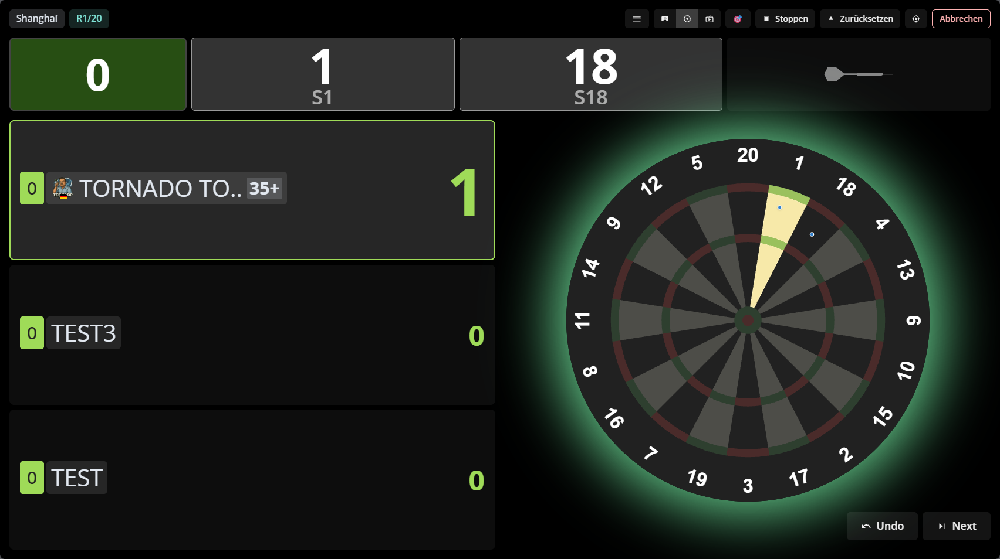
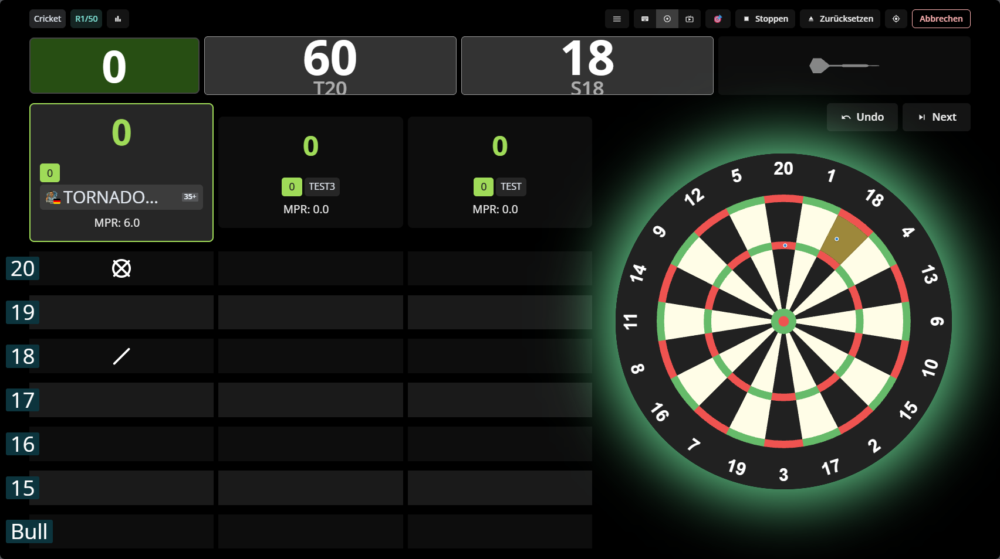

# Feature-Übersicht

## Überblick

Autodarts xConfig liefert aktuell 20 Module:

- 15 Animationen und Komfortfunktionen
- 5 Themes

Alle Module werden zentral über `AD xConfig` gesteuert. Die Feature-Registry sorgt dafür, dass ein Modul nur einmal aktiv ist und bei Konfigurationsänderungen sauber neu gemountet wird.

## AD xConfig

Die Oberfläche ist direkt in Autodarts eingebunden und über den Menüpunkt `AD xConfig` erreichbar.

## Animationen und Komfort

### X01

- `Checkout Score Pulse`: hebt finishfähige Restwerte hervor
- `Checkout Board Targets`: markiert sinnvolle Ziele direkt am Board
- `TV Board Zoom`: zoomt auf relevante Checkout-Bereiche
- `Style Checkout Suggestions`: macht Finish-Empfehlungen auffälliger

### Cricket und Tactics

- `Cricket Highlighter`: visualisiert Ziel- und Druckzustände
- `Cricket Grid FX`: ergänzt die Matrix um zusätzliche Live-Effekte

### Alle Spielmodi

- `Average Trend Arrow`
- `Turn Start Sweep`
- `Triple/Double/Bull Hits`
- `Dart Marker Emphasis`
- `Dart Marker Darts`
- `Remove Darts Notification`
- `Single Bull Sound`
- `Turn Points Count`
- `Winner Fireworks`

## Themes

### Theme X01

- Gilt für: `X01`
- Optionen: AVG, Hintergrundbild, Darstellung, Deckkraft, Spielerfeld-Transparenz

### Theme Shanghai

- Gilt für: `Shanghai`
- Optionen: AVG, Hintergrundbild, Darstellung, Deckkraft, Spielerfeld-Transparenz

### Theme Bermuda

- Gilt für: `Bermuda` und Varianten mit passendem Namenszusatz
- Optionen: Hintergrundbild, Darstellung, Deckkraft, Spielerfeld-Transparenz

### Theme Cricket

- Gilt für: `Cricket` und `Tactics`
- Optionen: AVG, Hintergrundbild, Darstellung, Deckkraft, Spielerfeld-Transparenz

### Theme Bull-off

- Gilt für: `Bull-off` und Varianten mit passendem Namenszusatz
- Optionen: Kontrast-Preset, Hintergrundbild, Darstellung, Deckkraft, Spielerfeld-Transparenz

## Hinweise

- Theme-Konfiguration liegt unter `features.themes.<themeKey>`.
- Theme-Hintergründe werden als Data-URL im lokalen Config-Speicher abgelegt.
- Die Konfiguration wird lokal im Browser gespeichert und beim Start automatisch geladen.
