<!-- xconfig-generated:start -->
# Feature-Übersicht

`autodarts-xconfig` bündelt `25` Module in einem Userscript:

- `17` Animationen und Komfortfunktionen
- `8` Themes

Die gesamte Steuerung läuft über **AD xConfig** direkt im Spiel. Die schnelle Benutzer-Einführung findest du in der [README](../README.md).

## Hinweise zur Konfiguration

- Insgesamt `25` Module: `17` Animationen und Komfortfunktionen sowie `8` Themes.
- `↺ Zurücksetzen`: Ein echter Hard Reset setzt alle Einstellungen auf Standard zurück, deaktiviert alle Module, schaltet Debug aus und entfernt gespeicherte Theme-Bilder.
- `Empfohlene Standards`: Aktiviert alle Module mit ausgewogenen Presets und lässt eigene Theme-Bilder unangetastet.
- Theme-Bilder: Jedes Theme speichert sein Bild getrennt; Templates Global kann zusätzlich ein gemeinsames Fallback-Bild oder ein Preset-Wallpaper liefern, solange das aktive Theme kein eigenes Bild gespeichert hat.
- Bildgröße: Als Orientierung gilt ein empfohlenes Limit von `1,5 MiB` pro gespeichertem Bild.

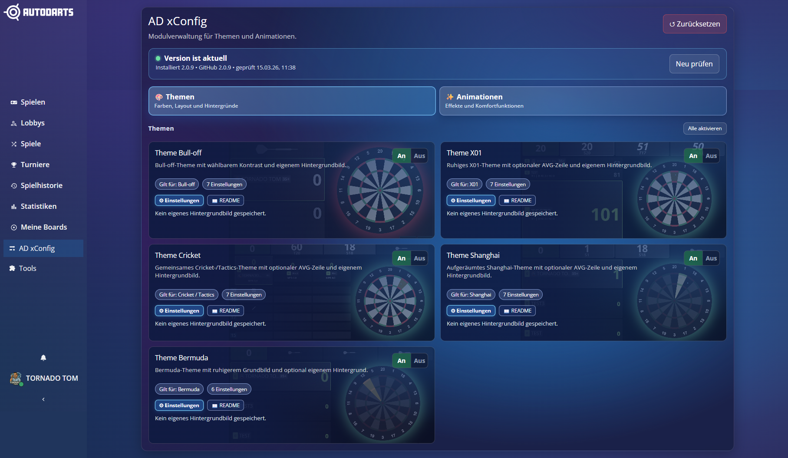

## Empfohlene Standards

Die Aktion `Empfohlene Standards` wendet aktuell dieses Profil an:

### Themen

**In allen Themen**
- `Alle aktiviert`: An
- `Kontrast-Preset`: Standard
- `Hintergrund-Darstellung`: Füllen
- `Hintergrundbild-Deckkraft`: 25 %
- `Spielerfelder-Transparenz`: 10 %
- `Debug`: Aus

**Templates Global**
- `Aktiv`: Aus
- `Schriftart`: Standard (deaktiviert)
- `Greift bei`: Scores
- `Hintergrund-Darstellung`: Füllen
- `Hintergrundbild-Deckkraft`: 25 %
- `Spielerfelder-Transparenz`: 10 %
- `Aktivspieler-Tönung`: 15 %
- `Debug`: Aus

### Animationen

**In allen Animationen**
- `Alle aktiviert`: An
- `Debug`: Aus

**Active Player Sweep**
- `Sweep-Geschwindigkeit`: Standard
- `Sweep-Stil`: Standard

**Turn Score Counter**
- `Zählstil`: Smooth Count
- `Zählgeschwindigkeit`: Standard
- `Aufblitz-Effekt`: Aus
- `Aufblitz-Modus`: Nur bei Änderung

**AVG Trend Arrow**
- `Animationsdauer`: Standard
- `Pfeil-Größe`: Standard

**Special Hit Highlights**
- `Farbstil`: Rot/Blau/Grün
- `Animationsstil`: Electric Jolt

**Dart Marker Replacer**
- `Dart Design`: Autodarts
- `Dart-Fluganimation`: An
- `Dart-Größe`: Standard
- `Original-Marker ausblenden`: An
- `Einschlag-Schatten`: An
- `Schatten-Weichzeichnung`: An
- `Einschlag-Wobble`: An
- `Flug-Blur`: An
- `Fluggeschwindigkeit`: Standard

**Dartboard Marker Highlight**
- `Marker-Größe`: Standard
- `Marker-Farbe`: Blau
- `Effekt`: Size Pulse
- `Marker-Sichtbarkeit`: 100 %
- `Outline-Farbe`: Weiß

**Take Out Darts Alert**
- `Bildgröße`: Groß
- `Pulse-Animation`: An
- `Pulse-Stärke`: Standard

**Single Bull Hit Sound**
- `Lautstärke`: Standard
- `Wiederholsperre`: 700 ms
- `Fallback-Scan`: Nur live

**Winner Celebration Effect**
- `Style`: Top Fireworks
- `Farbe`: Autodarts
- `Intensität`: Standard
- `Dauer`: 5 s
- `Partikelanzahl`: Optimiert
- `Bei Bull-Out aktiv`: An
- `Klick beendet Effekt`: An

**Checkout Suggestion Styles**
- `Stil`: Stripe
- `Labeltext`: CHECKOUT
- `Farbthema`: Amber

**Checkout Score Highlight**
- `Effekt`: Grow Only
- `Farbthema`: Autodarts Grün
- `Intensität`: Standard
- `Trigger-Quelle`: Vorschlag zuerst

**X01 Remaining Score Bar**
- `Farben`: Checkout Focus
- `Balkengröße`: Breit
- `Effekt`: Aus

**X01 Bust Active Player Highlight**

**Checkout Target Highlights**
- `Darstellung`: Fast Blink
- `Segmentstil`: Nur Fläche
- `Zielauswahl`: Nächstes Feld
- `Farbthema`: Cyan

**TV Board Zoom**
- `Zoom-Stufe`: 2,75
- `Zoom-Geschwindigkeit`: Mittel
- `Checkout-Zoom`: An
- `Checkout-Ziel`: Nur Finish-Feld
- `T20-Setup-Zoom`: An

**Cricket Target Highlighter**
- `OPEN-Ziele anzeigen`: Aus
- `DEAD-Ziele anzeigen`: An
- `Irrelevante Felder abdunkeln`: Hatch+
- `Farbthema`: Standard
- `Intensität`: Standard

**Cricket Grid Status Effects**
- `Zeilen-Sweep`: An
- `Ziel-Badge-Hinweis`: An
- `Mark-Fortschritt`: An
- `PRESSURE-Kante`: An
- `SCORING-Streifen`: An
- `DEAD-Zeilen abdunkeln`: An
- `Delta-Chips`: An
- `Treffer-Impuls`: An
- `Zugwechsel-Übergang`: An
- `PRESSURE-Overlay`: An
- `Farbthema`: Standard
- `Intensität`: Standard

## Themes

### Templates Global

- Gilt für: `alle Modi`
- Kurz: Bietet fertige Templates-Global-Presets, kuratierte Schriften, feste Farbrollen, eine optionale Aktivkarten-Tönung und ein gemeinsames Fallback-Hintergrundbild für aktive xConfig-Themes.
- Grafisch: Templates Global setzt eine gemeinsame Basis für unterstützte xConfig-Themes. Presets ändern Schrift, Farben und Hintergrundwerte zusammen; die einzelnen Einstellungen lassen sich danach gezielt anpassen. Die gewählte Schrift wirkt nur in stabilen Bereichen wie Scores, Würfen und Namen. Das globale Hintergrundbild ist ein Fallback: Themes mit eigenem Bild behalten ihr eigenes Hintergrundbild, alle anderen können das gespeicherte Fallback-Bild oder ein Preset-Wallpaper aus Templates Global verwenden. Zusätzlich lassen sich die drei Darts im Wurffeld als Farbe, Verlauf oder eigenes Bild darstellen.
- `Classic`: Wendet das Preset Classic mit einem Klick auf Templates Global an.
- `Broadcast`: Wendet das Preset Broadcast mit einem Klick auf Templates Global an.
- `British Flag`: Wendet das Preset British Flag mit einem Klick auf Templates Global an.
- `Cyberpunk`: Wendet das Preset Cyberpunk mit einem Klick auf Templates Global an.
- `Matrix`: Wendet das Preset Matrix mit einem Klick auf Templates Global an.
- `Fire`: Wendet das Preset Fire mit einem Klick auf Templates Global an.
- `Ice`: Wendet das Preset Ice mit einem Klick auf Templates Global an.
- `Schriftart`: Wählt eine kuratierte Schrift für unterstützte Template-Bereiche.
  - `Standard (deaktiviert)`: Belässt die unterstützten Bereiche bei einer normalen Systemschrift ohne Remote-Download.
  - `Aldrich`: Setzt die unterstützten Bereiche auf Aldrich.
  - `Allerta`: Setzt die unterstützten Bereiche auf Allerta.
  - `Alumni Sans`: Setzt die unterstützten Bereiche auf Alumni Sans.
  - `Alumni Sans Inline One`: Setzt die unterstützten Bereiche auf Alumni Sans Inline One.
  - `Anton`: Setzt die unterstützten Bereiche auf Anton.
  - `Anybody`: Setzt die unterstützten Bereiche auf Anybody.
  - `Archivo Black`: Setzt die unterstützten Bereiche auf Archivo Black.
  - `Armata`: Setzt die unterstützten Bereiche auf Armata.
  - `Audiowide`: Setzt die unterstützten Bereiche auf Audiowide.
  - `Averia Libre`: Setzt die unterstützten Bereiche auf Averia Libre.
  - `Averia Sans Libre`: Setzt die unterstützten Bereiche auf Averia Sans Libre.
  - `Bai Jamjuree`: Setzt die unterstützten Bereiche auf Bai Jamjuree.
  - `Big Shoulders Stencil`: Setzt die unterstützten Bereiche auf Big Shoulders Stencil.
  - `Black Ops One`: Setzt die unterstützten Bereiche auf Black Ops One.
  - `Bruno Ace`: Setzt die unterstützten Bereiche auf Bruno Ace.
  - `Bungee`: Setzt die unterstützten Bereiche auf Bungee.
  - `Bungee Inline`: Setzt die unterstützten Bereiche auf Bungee Inline.
  - `Bungee Shade`: Setzt die unterstützten Bereiche auf Bungee Shade.
  - `Cairo Play`: Setzt die unterstützten Bereiche auf Cairo Play.
  - `Caramel`: Setzt die unterstützten Bereiche auf Caramel.
  - `Caveat`: Setzt die unterstützten Bereiche auf Caveat.
  - `Caveat Brush`: Setzt die unterstützten Bereiche auf Caveat Brush.
  - `Chakra Petch`: Setzt die unterstützten Bereiche auf Chakra Petch.
  - `Chilanka`: Setzt die unterstützten Bereiche auf Chilanka.
  - `Courier Prime`: Setzt die unterstützten Bereiche auf Courier Prime.
  - `Cute Font`: Setzt die unterstützten Bereiche auf Cute Font.
  - `Dangrek`: Setzt die unterstützten Bereiche auf Dangrek.
  - `Days One`: Setzt die unterstützten Bereiche auf Days One.
  - `Ewert`: Setzt die unterstützten Bereiche auf Ewert.
  - `Faster One`: Setzt die unterstützten Bereiche auf Faster One.
  - `Finger Paint`: Setzt die unterstützten Bereiche auf Finger Paint.
  - `Foldit`: Setzt die unterstützten Bereiche auf Foldit.
  - `Fragment Mono`: Setzt die unterstützten Bereiche auf Fragment Mono.
  - `Fredericka the Great`: Setzt die unterstützten Bereiche auf Fredericka the Great.
  - `Frijole`: Setzt die unterstützten Bereiche auf Frijole.
  - `Fugaz One`: Setzt die unterstützten Bereiche auf Fugaz One.
  - `Goldman`: Setzt die unterstützten Bereiche auf Goldman.
  - `Inconsolata`: Setzt die unterstützten Bereiche auf Inconsolata.
  - `Indie Flower`: Setzt die unterstützten Bereiche auf Indie Flower.
  - `Inria Sans`: Setzt die unterstützten Bereiche auf Inria Sans.
  - `Jersey 15`: Setzt die unterstützten Bereiche auf Jersey 15.
  - `Keania One`: Setzt die unterstützten Bereiche auf Keania One.
  - `Permanent Marker`: Setzt die unterstützten Bereiche auf Permanent Marker.
  - `Plaster`: Setzt die unterstützten Bereiche auf Plaster.
  - `Saira Stencil One`: Setzt die unterstützten Bereiche auf Saira Stencil One.
  - `Share Tech Mono`: Setzt die unterstützten Bereiche auf Share Tech Mono.
  - `Stardos Stencil`: Setzt die unterstützten Bereiche auf Stardos Stencil.
  - `Wallpoet`: Setzt die unterstützten Bereiche auf Wallpoet.
  - `Zen Dots`: Setzt die unterstützten Bereiche auf Zen Dots.
  - `Zilla Slab Highlight`: Setzt die unterstützten Bereiche auf Zilla Slab Highlight.
- `Greift bei`: Legt fest, welche stabilen Template-Bereiche die Schrift übernehmen.
  - `Scores`: Greift bei stabilen Score- und Punkteanzeigen.
  - `Würfe`: Greift in der Wurfanzeige und bei stabilen Turn-Karten.
  - `Namen`: Greift bei Spielernamen in den Theme-Karten.
- `Aktiv-Akzent`: Setzt die Akzentfarbe für aktive oder gewinnende Spieler.
- `Hauptzahlen`: Steuert normale Hauptzahlen und Turn-Punkte.
- `Sekundärtext`: Setzt Namen und Meta-Texte auf eine gemeinsame Sekundärfarbe.
- `Wurf-/Checkout-Text`: Färbt Wurf-, Suggestion- und Checkout-Texte separat ein.
- `Aktivspieler-Tönung`: Regelt, wie stark der Aktiv-Akzent den Hintergrund aktiver Spielerfelder leicht einfärbt.
  - `Aus`: Die Aktivkarten-Tönung bleibt komplett deaktiviert.
  - `10 %`: Der Aktiv-Akzent färbt die Kartenfläche leicht ein.
  - `15 %`: Der Aktiv-Akzent schimmert sichtbar, aber weiterhin ausgewogen durch die aktive Kartenfläche.
  - `20 %`: Die Kartenfläche übernimmt den Aktiv-Akzent bereits deutlich.
  - `25 %`: Die Aktivkarten-Tönung wird stark sichtbar und prägt den Kartenhintergrund klar.
  - `30 %`: Die Aktivkarten-Tönung wird maximal sichtbar und prägt den Kartenhintergrund stark.
- `Wurffeld-Darts`: Ändert die Dart-Grafiken im Wurffeld.
  - `Original`: Belässt die Wurffeld-Darts unverändert.
  - `Farbe`: Nutzt eine einfarbige Dart-Grafik.
  - `Verlauf`: Nutzt eine Dart-Grafik mit Verlauf.
  - `Eigenes Bild`: Nutzt ein eigenes gespeichertes Dart-Bild.
- `Dart-Text`: Zeigt Wurftext mit `#` als Nummernplatzhalter an.
- `Dart-Farbe`: Setzt die Hauptfarbe der Wurffeld-Darts.
- `Verlaufsfarbe`: Setzt die zweite Verlaufsfarbe.
- `Dart-Größe`: Regelt die Größe der Wurffeld-Darts.
  - `Kompakt`: Kompakte Wurffeld-Darts.
  - `Standard`: Standardgröße für Wurffeld-Darts.
  - `Groß`: Große Wurffeld-Darts.
- `Dart-Bild hochladen`: Speichert ein eigenes Wurffeld-Dart-Bild bis 350 KB.
- `Dart-Bild entfernen`: Entfernt das gespeicherte Wurffeld-Dart-Bild.
- `Hintergrund-Darstellung`: Legt fest, wie ein eigenes Hintergrundbild im Theme platziert wird.
  - `Füllen`: Das Bild wirkt wie ein vollflächiges Wallpaper hinter dem Theme. Der komplette Bereich ist gefüllt, aber Motivteile am Rand können aus dem sichtbaren Ausschnitt herausfallen.
  - `Einpassen`: Das Motiv bleibt vollständig erhalten und wird vollständig in den verfügbaren Raum eingepasst. Dadurch geht nichts vom Bild verloren, aber je nach Format bleiben seitlich oder oben und unten sichtbare Theme-Flächen frei.
  - `Strecken`: Das Motiv wird unabhängig vom Originalformat auf die komplette Theme-Fläche gezogen. So ist jeder Bereich bedeckt, aber die Bildproportionen können sichtbar auseinandergezogen oder zusammengedrückt wirken.
  - `Zentriert`: Das Motiv erscheint wie ein mittig aufgelegtes Poster ohne automatische Skalierung. Große leere Ränder des Themes bleiben stehen, wenn das Bild kleiner als der verfügbare Bereich ist.
  - `Kacheln`: Das Motiv wird wie eine Kachel über die Theme-Fläche wiederholt. Statt eines einzelnen großen Hintergrundbilds entsteht ein sich wiederholendes Muster über den gesamten Bereich.
- `Hintergrundbild-Deckkraft`: Regelt, wie stark das Hintergrundbild sichtbar bleibt.
  - `100 %`: Das Hintergrundbild wirkt nahezu ungefiltert und sehr präsent. Farben und Kanten bleiben deutlich sichtbar, sodass das Motiv den Look des Themes stark mitbestimmt.
  - `85 %`: Das Motiv bleibt klar sichtbar und prägt die Fläche stark, bekommt aber schon eine leichte dunkle Dämpfung. Dadurch bleibt der Bildcharakter erhalten, ohne ganz so hart in den Vordergrund zu drängen.
  - `70 %`: Das Hintergrundmotiv bleibt deutlich sichtbar, wirkt aber bereits eingebettet statt aufgeklebt. Farben und Formen sind noch erkennbar, während das Theme die Fläche ruhiger und geschlossener erscheinen lässt.
  - `55 %`: Das Hintergrundbild ist weiterhin erkennbar, verliert aber deutlich an Dominanz. Diese Stufe ist ein Mittelweg, bei dem Motiv und Lesbarkeit ungefähr gleich wichtig bleiben.
  - `40 %`: Das Bild ist noch klar als Motiv erkennbar, wird aber bereits deutlich von der dunklen Theme-Schicht zurückgenommen. Es wirkt mehr wie Atmosphäre im Hintergrund als wie ein aktives Titelmotiv.
  - `25 %`: Das Motiv bleibt nur noch als ruhige Bildstimmung im Hintergrund erhalten. Farben und Strukturen tragen Atmosphäre bei, ohne Spielerfelder, Texte oder Karten optisch zu überholen.
  - `10 %`: Das Hintergrundmotiv ist fast nur noch als Schatten, Form oder grobe Farbstruktur wahrnehmbar. Diese Stufe priorisiert eine ruhige, sehr lesbare Oberfläche gegenüber sichtbaren Bilddetails.
- `Spielerfelder-Transparenz`: Passt die Transparenz der Spielerfelder gegenüber dem Hintergrund an.
  - `0 %`: Die Spielerfelder erscheinen nahezu opak und schirmen das Hintergrundbild stark ab. Das Layout wirkt dadurch ruhig, dicht und klar vom Hintergrund getrennt.
  - `5 %`: Die Karten wirken weiterhin fast deckend, zeigen aber schon eine leichte Durchlässigkeit. Das ist für Nutzer gedacht, die kaum Transparenz möchten, aber etwas mehr Tiefe als bei komplett geschlossenen Flächen.
  - `10 %`: Die Karten behalten eine stabile Lesbarkeit, bekommen aber eine leichte Glasscheiben-Wirkung. Hintergrundfarben und Motive bleiben nur dezent hinter den Spielerflächen sichtbar.
  - `15 %`: Die Karten wirken bereits spürbar transparenter und vermitteln mehr Tiefe zwischen Oberfläche und Hintergrund. Das Motiv hinter den Spielerfeldern wird deutlicher wahrnehmbar, ohne die Lesbarkeit stark zu gefährden.
  - `30 %`: Die Spielerfelder erscheinen deutlich luftiger und geben dem Hintergrundbild sichtbar mehr Raum. Diese Stufe verschiebt das Layout klar in Richtung transparentes Overlay statt geschlossener Kartenfläche.
  - `45 %`: Die Karten verlieren einen großen Teil ihrer optischen Dichte und lassen das Motiv dahinter klar durchkommen. Das Layout wirkt dadurch offener, aber auch stärker vom Hintergrundbild beeinflusst.
  - `60 %`: Die Karten erscheinen fast wie halbtransparente Glasflächen über dem Hintergrund. Das Motiv dahinter bleibt stark sichtbar und gestaltet die Oberfläche sehr aktiv mit.
- `Hintergrundbild hochladen`: Speichert ein globales Fallback-Hintergrundbild bis 1,5 MiB.
- `Hintergrundbild entfernen`: Entfernt nur das globale Fallback-Hintergrundbild.
- `Debug`: Aktiviert zusätzliche Debug-Ausgaben für die Fehlersuche.

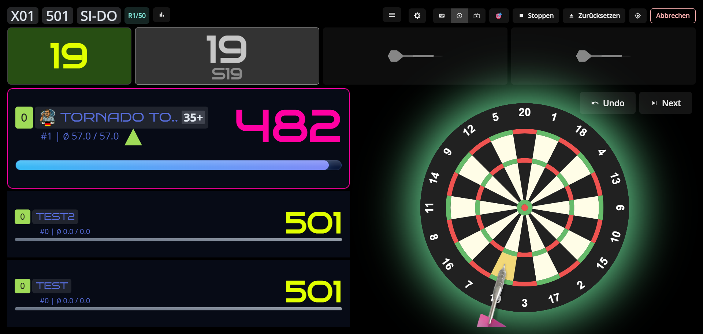
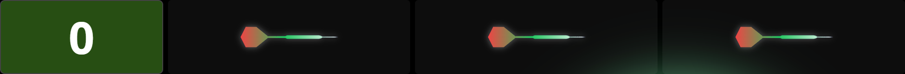

### Theme Bull-off

- Gilt für: `Bull-off`
- Kurz: Ein kontrastbetontes Bull-off-Layout mit wählbarer Stärke und eigener Bildfläche.
- Grafisch: Das Theme verändert Farben, Kontrast und Flächen speziell für Bull-off. Ein optionales Hintergrundbild liegt dahinter, während der Spielaufbau gleich bleibt.
- `Kontrast-Preset`: Schaltet die Kontrastwirkung des Bull-off-Themes um.
  - `Sanft`: Diese Stufe reduziert sichtbare Kanten, Schatten und Farbtrennung im Bull-off-Theme. Aktive und inaktive Bereiche bleiben erkennbar, wirken aber weicher und weniger aggressiv voneinander abgesetzt.
  - `Standard`: Diese Stufe liefert den vorgesehenen Mittelwert für Rahmen, aktive Hervorhebungen, Schatten und Bedienflächen. Das Layout bleibt kontrastreich genug für Lesbarkeit, ohne so hart wie `Kräftig` zu zeichnen.
  - `Kräftig`: Diese Stufe erhöht die sichtbare Trennung zwischen aktiven und inaktiven Bereichen deutlich. Ränder, Schatten und Leuchtakzente werden kräftiger, sodass das Bull-off-Theme härter und präsenter erscheint.
- `Hintergrund-Darstellung`: Legt fest, wie ein eigenes Hintergrundbild im Theme platziert wird.
  - `Füllen`: Das Bild wirkt wie ein vollflächiges Wallpaper hinter dem Theme. Der komplette Bereich ist gefüllt, aber Motivteile am Rand können aus dem sichtbaren Ausschnitt herausfallen.
  - `Einpassen`: Das Motiv bleibt vollständig erhalten und wird vollständig in den verfügbaren Raum eingepasst. Dadurch geht nichts vom Bild verloren, aber je nach Format bleiben seitlich oder oben und unten sichtbare Theme-Flächen frei.
  - `Strecken`: Das Motiv wird unabhängig vom Originalformat auf die komplette Theme-Fläche gezogen. So ist jeder Bereich bedeckt, aber die Bildproportionen können sichtbar auseinandergezogen oder zusammengedrückt wirken.
  - `Zentriert`: Das Motiv erscheint wie ein mittig aufgelegtes Poster ohne automatische Skalierung. Große leere Ränder des Themes bleiben stehen, wenn das Bild kleiner als der verfügbare Bereich ist.
  - `Kacheln`: Das Motiv wird wie eine Kachel über die Theme-Fläche wiederholt. Statt eines einzelnen großen Hintergrundbilds entsteht ein sich wiederholendes Muster über den gesamten Bereich.
- `Hintergrundbild-Deckkraft`: Regelt, wie stark das Hintergrundbild sichtbar bleibt.
  - `100 %`: Das Hintergrundbild wirkt nahezu ungefiltert und sehr präsent. Farben und Kanten bleiben deutlich sichtbar, sodass das Motiv den Look des Themes stark mitbestimmt.
  - `85 %`: Das Motiv bleibt klar sichtbar und prägt die Fläche stark, bekommt aber schon eine leichte dunkle Dämpfung. Dadurch bleibt der Bildcharakter erhalten, ohne ganz so hart in den Vordergrund zu drängen.
  - `70 %`: Das Hintergrundmotiv bleibt deutlich sichtbar, wirkt aber bereits eingebettet statt aufgeklebt. Farben und Formen sind noch erkennbar, während das Theme die Fläche ruhiger und geschlossener erscheinen lässt.
  - `55 %`: Das Hintergrundbild ist weiterhin erkennbar, verliert aber deutlich an Dominanz. Diese Stufe ist ein Mittelweg, bei dem Motiv und Lesbarkeit ungefähr gleich wichtig bleiben.
  - `40 %`: Das Bild ist noch klar als Motiv erkennbar, wird aber bereits deutlich von der dunklen Theme-Schicht zurückgenommen. Es wirkt mehr wie Atmosphäre im Hintergrund als wie ein aktives Titelmotiv.
  - `25 %`: Das Motiv bleibt nur noch als ruhige Bildstimmung im Hintergrund erhalten. Farben und Strukturen tragen Atmosphäre bei, ohne Spielerfelder, Texte oder Karten optisch zu überholen.
  - `10 %`: Das Hintergrundmotiv ist fast nur noch als Schatten, Form oder grobe Farbstruktur wahrnehmbar. Diese Stufe priorisiert eine ruhige, sehr lesbare Oberfläche gegenüber sichtbaren Bilddetails.
- `Spielerfelder-Transparenz`: Passt die Transparenz der Spielerfelder gegenüber dem Hintergrund an.
  - `0 %`: Die Spielerfelder erscheinen nahezu opak und schirmen das Hintergrundbild stark ab. Das Layout wirkt dadurch ruhig, dicht und klar vom Hintergrund getrennt.
  - `5 %`: Die Karten wirken weiterhin fast deckend, zeigen aber schon eine leichte Durchlässigkeit. Das ist für Nutzer gedacht, die kaum Transparenz möchten, aber etwas mehr Tiefe als bei komplett geschlossenen Flächen.
  - `10 %`: Die Karten behalten eine stabile Lesbarkeit, bekommen aber eine leichte Glasscheiben-Wirkung. Hintergrundfarben und Motive bleiben nur dezent hinter den Spielerflächen sichtbar.
  - `15 %`: Die Karten wirken bereits spürbar transparenter und vermitteln mehr Tiefe zwischen Oberfläche und Hintergrund. Das Motiv hinter den Spielerfeldern wird deutlicher wahrnehmbar, ohne die Lesbarkeit stark zu gefährden.
  - `30 %`: Die Spielerfelder erscheinen deutlich luftiger und geben dem Hintergrundbild sichtbar mehr Raum. Diese Stufe verschiebt das Layout klar in Richtung transparentes Overlay statt geschlossener Kartenfläche.
  - `45 %`: Die Karten verlieren einen großen Teil ihrer optischen Dichte und lassen das Motiv dahinter klar durchkommen. Das Layout wirkt dadurch offener, aber auch stärker vom Hintergrundbild beeinflusst.
  - `60 %`: Die Karten erscheinen fast wie halbtransparente Glasflächen über dem Hintergrund. Das Motiv dahinter bleibt stark sichtbar und gestaltet die Oberfläche sehr aktiv mit.
- `Debug`: Aktiviert zusätzliche Debug-Ausgaben für die Fehlersuche.
- `Hintergrundbild hochladen`: Speichert ein eigenes Bild bis 1,5 MiB nur für dieses Theme.
- `Hintergrundbild entfernen`: Entfernt nur das für dieses Theme gespeicherte Hintergrundbild.

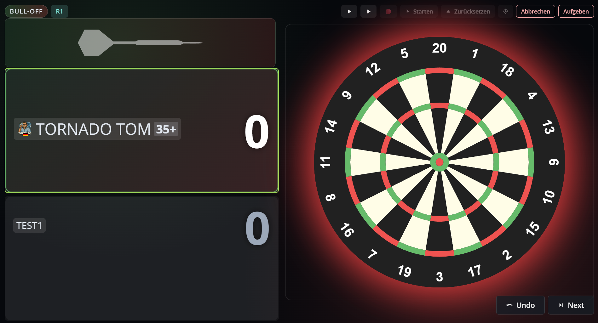

### Theme X01

- Gilt für: `X01`
- Kurz: Ein ruhiges X01-Layout mit eigener Bildfläche und optionaler AVG-Zeile.
- Grafisch: Farben, Flächen und Karten werden neu gestaltet; ein eigenes Hintergrundbild liegt hinter dem Spielbereich, während die Grundstruktur des X01-Layouts erhalten bleibt.
- `AVG anzeigen`: Blendet die AVG-Anzeige im X01-Theme ein oder aus.
- `Hintergrund-Darstellung`: Legt fest, wie ein eigenes Hintergrundbild im Theme platziert wird.
  - `Füllen`: Das Bild wirkt wie ein vollflächiges Wallpaper hinter dem Theme. Der komplette Bereich ist gefüllt, aber Motivteile am Rand können aus dem sichtbaren Ausschnitt herausfallen.
  - `Einpassen`: Das Motiv bleibt vollständig erhalten und wird vollständig in den verfügbaren Raum eingepasst. Dadurch geht nichts vom Bild verloren, aber je nach Format bleiben seitlich oder oben und unten sichtbare Theme-Flächen frei.
  - `Strecken`: Das Motiv wird unabhängig vom Originalformat auf die komplette Theme-Fläche gezogen. So ist jeder Bereich bedeckt, aber die Bildproportionen können sichtbar auseinandergezogen oder zusammengedrückt wirken.
  - `Zentriert`: Das Motiv erscheint wie ein mittig aufgelegtes Poster ohne automatische Skalierung. Große leere Ränder des Themes bleiben stehen, wenn das Bild kleiner als der verfügbare Bereich ist.
  - `Kacheln`: Das Motiv wird wie eine Kachel über die Theme-Fläche wiederholt. Statt eines einzelnen großen Hintergrundbilds entsteht ein sich wiederholendes Muster über den gesamten Bereich.
- `Hintergrundbild-Deckkraft`: Regelt, wie stark das Hintergrundbild sichtbar bleibt.
  - `100 %`: Das Hintergrundbild wirkt nahezu ungefiltert und sehr präsent. Farben und Kanten bleiben deutlich sichtbar, sodass das Motiv den Look des Themes stark mitbestimmt.
  - `85 %`: Das Motiv bleibt klar sichtbar und prägt die Fläche stark, bekommt aber schon eine leichte dunkle Dämpfung. Dadurch bleibt der Bildcharakter erhalten, ohne ganz so hart in den Vordergrund zu drängen.
  - `70 %`: Das Hintergrundmotiv bleibt deutlich sichtbar, wirkt aber bereits eingebettet statt aufgeklebt. Farben und Formen sind noch erkennbar, während das Theme die Fläche ruhiger und geschlossener erscheinen lässt.
  - `55 %`: Das Hintergrundbild ist weiterhin erkennbar, verliert aber deutlich an Dominanz. Diese Stufe ist ein Mittelweg, bei dem Motiv und Lesbarkeit ungefähr gleich wichtig bleiben.
  - `40 %`: Das Bild ist noch klar als Motiv erkennbar, wird aber bereits deutlich von der dunklen Theme-Schicht zurückgenommen. Es wirkt mehr wie Atmosphäre im Hintergrund als wie ein aktives Titelmotiv.
  - `25 %`: Das Motiv bleibt nur noch als ruhige Bildstimmung im Hintergrund erhalten. Farben und Strukturen tragen Atmosphäre bei, ohne Spielerfelder, Texte oder Karten optisch zu überholen.
  - `10 %`: Das Hintergrundmotiv ist fast nur noch als Schatten, Form oder grobe Farbstruktur wahrnehmbar. Diese Stufe priorisiert eine ruhige, sehr lesbare Oberfläche gegenüber sichtbaren Bilddetails.
- `Spielerfelder-Transparenz`: Passt die Transparenz der Spielerfelder gegenüber dem Hintergrund an.
  - `0 %`: Die Spielerfelder erscheinen nahezu opak und schirmen das Hintergrundbild stark ab. Das Layout wirkt dadurch ruhig, dicht und klar vom Hintergrund getrennt.
  - `5 %`: Die Karten wirken weiterhin fast deckend, zeigen aber schon eine leichte Durchlässigkeit. Das ist für Nutzer gedacht, die kaum Transparenz möchten, aber etwas mehr Tiefe als bei komplett geschlossenen Flächen.
  - `10 %`: Die Karten behalten eine stabile Lesbarkeit, bekommen aber eine leichte Glasscheiben-Wirkung. Hintergrundfarben und Motive bleiben nur dezent hinter den Spielerflächen sichtbar.
  - `15 %`: Die Karten wirken bereits spürbar transparenter und vermitteln mehr Tiefe zwischen Oberfläche und Hintergrund. Das Motiv hinter den Spielerfeldern wird deutlicher wahrnehmbar, ohne die Lesbarkeit stark zu gefährden.
  - `30 %`: Die Spielerfelder erscheinen deutlich luftiger und geben dem Hintergrundbild sichtbar mehr Raum. Diese Stufe verschiebt das Layout klar in Richtung transparentes Overlay statt geschlossener Kartenfläche.
  - `45 %`: Die Karten verlieren einen großen Teil ihrer optischen Dichte und lassen das Motiv dahinter klar durchkommen. Das Layout wirkt dadurch offener, aber auch stärker vom Hintergrundbild beeinflusst.
  - `60 %`: Die Karten erscheinen fast wie halbtransparente Glasflächen über dem Hintergrund. Das Motiv dahinter bleibt stark sichtbar und gestaltet die Oberfläche sehr aktiv mit.
- `Debug`: Aktiviert zusätzliche Debug-Ausgaben für die Fehlersuche.
- `Hintergrundbild hochladen`: Speichert ein eigenes Bild bis 1,5 MiB nur für dieses Theme.
- `Hintergrundbild entfernen`: Entfernt nur das für dieses Theme gespeicherte Hintergrundbild.

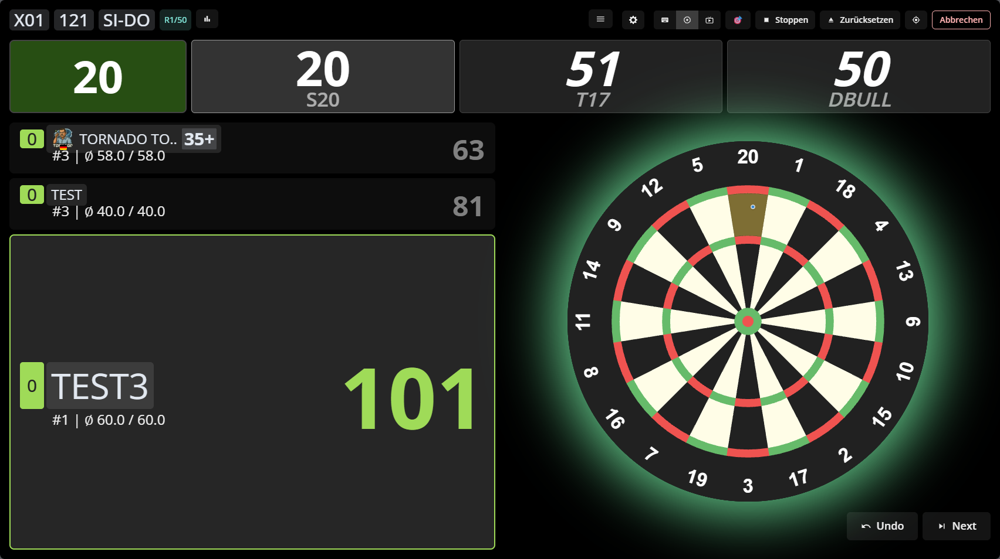
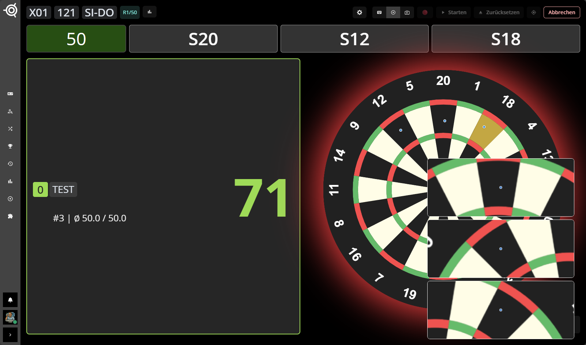
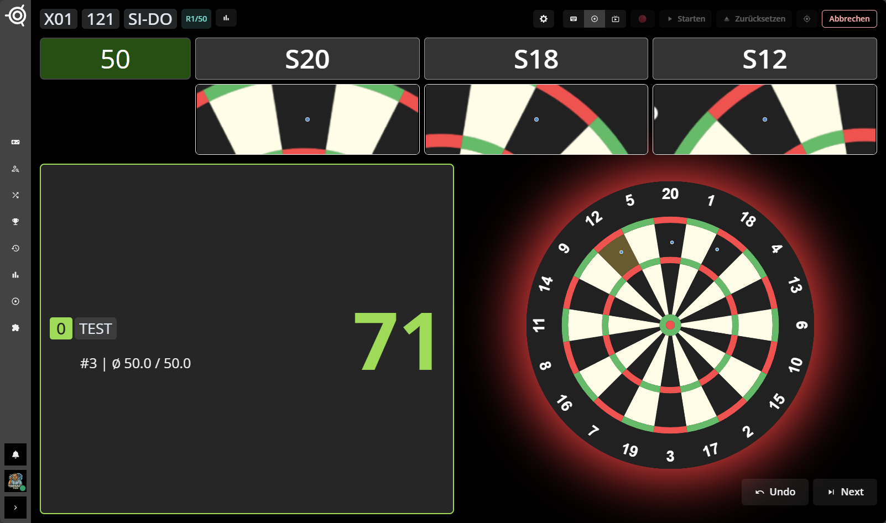

### Theme Gotcha

- Gilt für: `gotcha`
- Kurz: Ein ruhiges Gotcha-Layout auf X01-Basis, das die Differenz zum führenden Gegner direkt in der Spielerkarte mitzieht. Dafür muss `Gotcha Helper` in `Tools für Autodarts` aktiv sein.
- Grafisch: Die Karten folgen bewusst der X01-Optik, ergänzen aber die zusätzliche Gotcha-Differenz als eigene, klar abgesetzte Live-Zahl innerhalb derselben Theme-Struktur.
- Hinweis: Die zusätzliche Gotcha-Differenz erscheint nur, wenn `Gotcha Helper` in `Tools für Autodarts` aktiviert ist.
- `Delta-Position`: Wählt, ob die Gotcha-Differenz unter dem Score oder in derselben Zeile mit `|` steht.
  - `Unter Score`: Setzt die Gotcha-Differenz in eine eigene Zeile unter dem Score.
  - `Score-Zeile |`: Setzt die Gotcha-Differenz in dieselbe Zeile wie den Score und trennt sie mit `|`.
- `Delta-Ausrichtung`: Richtet die zusätzliche Gotcha-Differenz unter dem Score links oder rechts aus.
  - `Rechtsbündig`: Setzt die Gotcha-Differenz unter dem Score rechtsbündig.
  - `Linksbündig`: Setzt die Gotcha-Differenz unter dem Score linksbündig.
- `Delta kursiv`: Schaltet die Gotcha-Differenz kursiv oder normal.
- `Hintergrund-Darstellung`: Legt fest, wie ein eigenes Hintergrundbild im Theme platziert wird.
  - `Füllen`: Das Bild wirkt wie ein vollflächiges Wallpaper hinter dem Theme. Der komplette Bereich ist gefüllt, aber Motivteile am Rand können aus dem sichtbaren Ausschnitt herausfallen.
  - `Einpassen`: Das Motiv bleibt vollständig erhalten und wird vollständig in den verfügbaren Raum eingepasst. Dadurch geht nichts vom Bild verloren, aber je nach Format bleiben seitlich oder oben und unten sichtbare Theme-Flächen frei.
  - `Strecken`: Das Motiv wird unabhängig vom Originalformat auf die komplette Theme-Fläche gezogen. So ist jeder Bereich bedeckt, aber die Bildproportionen können sichtbar auseinandergezogen oder zusammengedrückt wirken.
  - `Zentriert`: Das Motiv erscheint wie ein mittig aufgelegtes Poster ohne automatische Skalierung. Große leere Ränder des Themes bleiben stehen, wenn das Bild kleiner als der verfügbare Bereich ist.
  - `Kacheln`: Das Motiv wird wie eine Kachel über die Theme-Fläche wiederholt. Statt eines einzelnen großen Hintergrundbilds entsteht ein sich wiederholendes Muster über den gesamten Bereich.
- `Hintergrundbild-Deckkraft`: Regelt, wie stark das Hintergrundbild sichtbar bleibt.
  - `100 %`: Das Hintergrundbild wirkt nahezu ungefiltert und sehr präsent. Farben und Kanten bleiben deutlich sichtbar, sodass das Motiv den Look des Themes stark mitbestimmt.
  - `85 %`: Das Motiv bleibt klar sichtbar und prägt die Fläche stark, bekommt aber schon eine leichte dunkle Dämpfung. Dadurch bleibt der Bildcharakter erhalten, ohne ganz so hart in den Vordergrund zu drängen.
  - `70 %`: Das Hintergrundmotiv bleibt deutlich sichtbar, wirkt aber bereits eingebettet statt aufgeklebt. Farben und Formen sind noch erkennbar, während das Theme die Fläche ruhiger und geschlossener erscheinen lässt.
  - `55 %`: Das Hintergrundbild ist weiterhin erkennbar, verliert aber deutlich an Dominanz. Diese Stufe ist ein Mittelweg, bei dem Motiv und Lesbarkeit ungefähr gleich wichtig bleiben.
  - `40 %`: Das Bild ist noch klar als Motiv erkennbar, wird aber bereits deutlich von der dunklen Theme-Schicht zurückgenommen. Es wirkt mehr wie Atmosphäre im Hintergrund als wie ein aktives Titelmotiv.
  - `25 %`: Das Motiv bleibt nur noch als ruhige Bildstimmung im Hintergrund erhalten. Farben und Strukturen tragen Atmosphäre bei, ohne Spielerfelder, Texte oder Karten optisch zu überholen.
  - `10 %`: Das Hintergrundmotiv ist fast nur noch als Schatten, Form oder grobe Farbstruktur wahrnehmbar. Diese Stufe priorisiert eine ruhige, sehr lesbare Oberfläche gegenüber sichtbaren Bilddetails.
- `Spielerfelder-Transparenz`: Passt die Transparenz der Spielerfelder gegenüber dem Hintergrund an.
  - `0 %`: Die Spielerfelder erscheinen nahezu opak und schirmen das Hintergrundbild stark ab. Das Layout wirkt dadurch ruhig, dicht und klar vom Hintergrund getrennt.
  - `5 %`: Die Karten wirken weiterhin fast deckend, zeigen aber schon eine leichte Durchlässigkeit. Das ist für Nutzer gedacht, die kaum Transparenz möchten, aber etwas mehr Tiefe als bei komplett geschlossenen Flächen.
  - `10 %`: Die Karten behalten eine stabile Lesbarkeit, bekommen aber eine leichte Glasscheiben-Wirkung. Hintergrundfarben und Motive bleiben nur dezent hinter den Spielerflächen sichtbar.
  - `15 %`: Die Karten wirken bereits spürbar transparenter und vermitteln mehr Tiefe zwischen Oberfläche und Hintergrund. Das Motiv hinter den Spielerfeldern wird deutlicher wahrnehmbar, ohne die Lesbarkeit stark zu gefährden.
  - `30 %`: Die Spielerfelder erscheinen deutlich luftiger und geben dem Hintergrundbild sichtbar mehr Raum. Diese Stufe verschiebt das Layout klar in Richtung transparentes Overlay statt geschlossener Kartenfläche.
  - `45 %`: Die Karten verlieren einen großen Teil ihrer optischen Dichte und lassen das Motiv dahinter klar durchkommen. Das Layout wirkt dadurch offener, aber auch stärker vom Hintergrundbild beeinflusst.
  - `60 %`: Die Karten erscheinen fast wie halbtransparente Glasflächen über dem Hintergrund. Das Motiv dahinter bleibt stark sichtbar und gestaltet die Oberfläche sehr aktiv mit.
- `Debug`: Aktiviert zusätzliche Debug-Ausgaben für die Fehlersuche.
- `Hintergrundbild hochladen`: Speichert ein eigenes Bild bis 1,5 MiB nur für dieses Theme.
- `Hintergrundbild entfernen`: Entfernt nur das für dieses Theme gespeicherte Hintergrundbild.

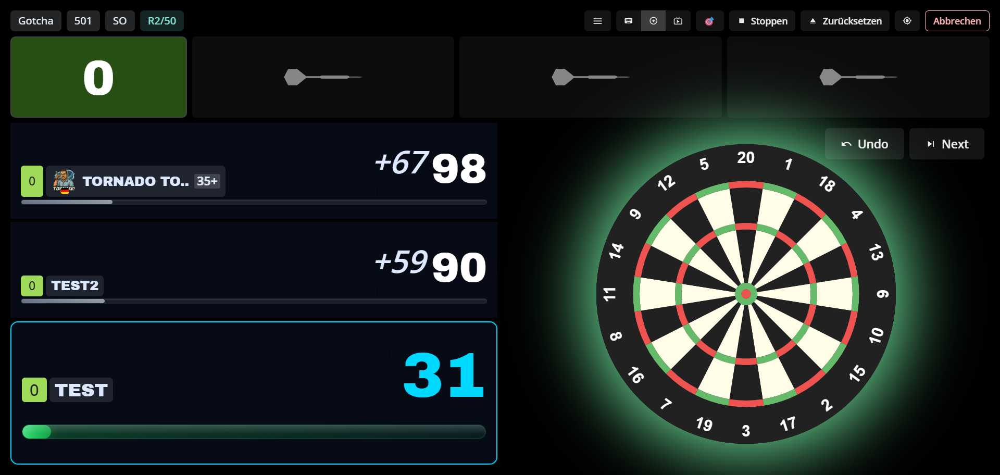

### Theme X01 2Player (Beta)

- Gilt für: `X01`
- Kurz: Eine Beta-Version des dunklen X01-Layouts für exakt 2 Spieler mit Board-Fokus, seitlichen Spieler-Karten und optionaler AVG-Zeile.
- Grafisch: Das Theme legt zwei große Spieler-Karten links und rechts um ein betontes Board an. Farben, Flächen und Kontraste werden neu interpretiert; außerhalb von X01 mit genau zwei Spielern bleibt alles unverändert.
- Beta-Hinweis: Diese Variante wird weiter ausgebaut sowie stabilisiert.
- Zusätzliche xConfig-Optionen wie Farben und weitere Feineinstellungen sind für kommende Ausbaustufen vorgesehen.
- `AVG anzeigen`: Blendet die AVG-Anzeige im X01-2Player-Theme ein oder aus.
- `Hintergrund-Darstellung`: Legt fest, wie ein eigenes Hintergrundbild im Theme platziert wird.
  - `Füllen`: Das Bild wirkt wie ein vollflächiges Wallpaper hinter dem Theme. Der komplette Bereich ist gefüllt, aber Motivteile am Rand können aus dem sichtbaren Ausschnitt herausfallen.
  - `Einpassen`: Das Motiv bleibt vollständig erhalten und wird vollständig in den verfügbaren Raum eingepasst. Dadurch geht nichts vom Bild verloren, aber je nach Format bleiben seitlich oder oben und unten sichtbare Theme-Flächen frei.
  - `Strecken`: Das Motiv wird unabhängig vom Originalformat auf die komplette Theme-Fläche gezogen. So ist jeder Bereich bedeckt, aber die Bildproportionen können sichtbar auseinandergezogen oder zusammengedrückt wirken.
  - `Zentriert`: Das Motiv erscheint wie ein mittig aufgelegtes Poster ohne automatische Skalierung. Große leere Ränder des Themes bleiben stehen, wenn das Bild kleiner als der verfügbare Bereich ist.
  - `Kacheln`: Das Motiv wird wie eine Kachel über die Theme-Fläche wiederholt. Statt eines einzelnen großen Hintergrundbilds entsteht ein sich wiederholendes Muster über den gesamten Bereich.
- `Hintergrundbild-Deckkraft`: Regelt, wie stark das Hintergrundbild sichtbar bleibt.
  - `100 %`: Das Hintergrundbild wirkt nahezu ungefiltert und sehr präsent. Farben und Kanten bleiben deutlich sichtbar, sodass das Motiv den Look des Themes stark mitbestimmt.
  - `85 %`: Das Motiv bleibt klar sichtbar und prägt die Fläche stark, bekommt aber schon eine leichte dunkle Dämpfung. Dadurch bleibt der Bildcharakter erhalten, ohne ganz so hart in den Vordergrund zu drängen.
  - `70 %`: Das Hintergrundmotiv bleibt deutlich sichtbar, wirkt aber bereits eingebettet statt aufgeklebt. Farben und Formen sind noch erkennbar, während das Theme die Fläche ruhiger und geschlossener erscheinen lässt.
  - `55 %`: Das Hintergrundbild ist weiterhin erkennbar, verliert aber deutlich an Dominanz. Diese Stufe ist ein Mittelweg, bei dem Motiv und Lesbarkeit ungefähr gleich wichtig bleiben.
  - `40 %`: Das Bild ist noch klar als Motiv erkennbar, wird aber bereits deutlich von der dunklen Theme-Schicht zurückgenommen. Es wirkt mehr wie Atmosphäre im Hintergrund als wie ein aktives Titelmotiv.
  - `25 %`: Das Motiv bleibt nur noch als ruhige Bildstimmung im Hintergrund erhalten. Farben und Strukturen tragen Atmosphäre bei, ohne Spielerfelder, Texte oder Karten optisch zu überholen.
  - `10 %`: Das Hintergrundmotiv ist fast nur noch als Schatten, Form oder grobe Farbstruktur wahrnehmbar. Diese Stufe priorisiert eine ruhige, sehr lesbare Oberfläche gegenüber sichtbaren Bilddetails.
- `Spielerfelder-Transparenz`: Passt die Transparenz der Spielerfelder gegenüber dem Hintergrund an.
  - `0 %`: Die Spielerfelder erscheinen nahezu opak und schirmen das Hintergrundbild stark ab. Das Layout wirkt dadurch ruhig, dicht und klar vom Hintergrund getrennt.
  - `5 %`: Die Karten wirken weiterhin fast deckend, zeigen aber schon eine leichte Durchlässigkeit. Das ist für Nutzer gedacht, die kaum Transparenz möchten, aber etwas mehr Tiefe als bei komplett geschlossenen Flächen.
  - `10 %`: Die Karten behalten eine stabile Lesbarkeit, bekommen aber eine leichte Glasscheiben-Wirkung. Hintergrundfarben und Motive bleiben nur dezent hinter den Spielerflächen sichtbar.
  - `15 %`: Die Karten wirken bereits spürbar transparenter und vermitteln mehr Tiefe zwischen Oberfläche und Hintergrund. Das Motiv hinter den Spielerfeldern wird deutlicher wahrnehmbar, ohne die Lesbarkeit stark zu gefährden.
  - `30 %`: Die Spielerfelder erscheinen deutlich luftiger und geben dem Hintergrundbild sichtbar mehr Raum. Diese Stufe verschiebt das Layout klar in Richtung transparentes Overlay statt geschlossener Kartenfläche.
  - `45 %`: Die Karten verlieren einen großen Teil ihrer optischen Dichte und lassen das Motiv dahinter klar durchkommen. Das Layout wirkt dadurch offener, aber auch stärker vom Hintergrundbild beeinflusst.
  - `60 %`: Die Karten erscheinen fast wie halbtransparente Glasflächen über dem Hintergrund. Das Motiv dahinter bleibt stark sichtbar und gestaltet die Oberfläche sehr aktiv mit.
- `Debug`: Aktiviert zusätzliche Debug-Ausgaben für die Fehlersuche.
- `Hintergrundbild hochladen`: Speichert ein eigenes Bild bis 1,5 MiB nur für dieses Theme.
- `Hintergrundbild entfernen`: Entfernt nur das für dieses Theme gespeicherte Hintergrundbild.

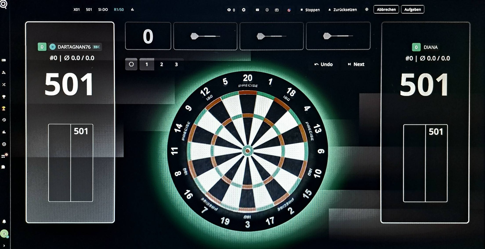

### Theme Cricket

- Gilt für: `Cricket`, `Tactics`
- Kurz: Ein gemeinsames Theme für Cricket und Tactics mit ruhigerer Grundoptik und optionaler AVG-Zeile.
- Grafisch: Farben, Karten und Hintergründe werden auf eine gemeinsame Cricket-/Tactics-Optik gezogen. Ein eigenes Bild kann hinter dem Spielbereich liegen, ohne die Board- oder Grid-Logik zu verändern.
- `AVG anzeigen`: Blendet die AVG-Anzeige im Cricket-/Tactics-Theme ein oder aus.
- `Hintergrund-Darstellung`: Legt fest, wie ein eigenes Hintergrundbild im Theme platziert wird.
  - `Füllen`: Das Bild wirkt wie ein vollflächiges Wallpaper hinter dem Theme. Der komplette Bereich ist gefüllt, aber Motivteile am Rand können aus dem sichtbaren Ausschnitt herausfallen.
  - `Einpassen`: Das Motiv bleibt vollständig erhalten und wird vollständig in den verfügbaren Raum eingepasst. Dadurch geht nichts vom Bild verloren, aber je nach Format bleiben seitlich oder oben und unten sichtbare Theme-Flächen frei.
  - `Strecken`: Das Motiv wird unabhängig vom Originalformat auf die komplette Theme-Fläche gezogen. So ist jeder Bereich bedeckt, aber die Bildproportionen können sichtbar auseinandergezogen oder zusammengedrückt wirken.
  - `Zentriert`: Das Motiv erscheint wie ein mittig aufgelegtes Poster ohne automatische Skalierung. Große leere Ränder des Themes bleiben stehen, wenn das Bild kleiner als der verfügbare Bereich ist.
  - `Kacheln`: Das Motiv wird wie eine Kachel über die Theme-Fläche wiederholt. Statt eines einzelnen großen Hintergrundbilds entsteht ein sich wiederholendes Muster über den gesamten Bereich.
- `Hintergrundbild-Deckkraft`: Regelt, wie stark das Hintergrundbild sichtbar bleibt.
  - `100 %`: Das Hintergrundbild wirkt nahezu ungefiltert und sehr präsent. Farben und Kanten bleiben deutlich sichtbar, sodass das Motiv den Look des Themes stark mitbestimmt.
  - `85 %`: Das Motiv bleibt klar sichtbar und prägt die Fläche stark, bekommt aber schon eine leichte dunkle Dämpfung. Dadurch bleibt der Bildcharakter erhalten, ohne ganz so hart in den Vordergrund zu drängen.
  - `70 %`: Das Hintergrundmotiv bleibt deutlich sichtbar, wirkt aber bereits eingebettet statt aufgeklebt. Farben und Formen sind noch erkennbar, während das Theme die Fläche ruhiger und geschlossener erscheinen lässt.
  - `55 %`: Das Hintergrundbild ist weiterhin erkennbar, verliert aber deutlich an Dominanz. Diese Stufe ist ein Mittelweg, bei dem Motiv und Lesbarkeit ungefähr gleich wichtig bleiben.
  - `40 %`: Das Bild ist noch klar als Motiv erkennbar, wird aber bereits deutlich von der dunklen Theme-Schicht zurückgenommen. Es wirkt mehr wie Atmosphäre im Hintergrund als wie ein aktives Titelmotiv.
  - `25 %`: Das Motiv bleibt nur noch als ruhige Bildstimmung im Hintergrund erhalten. Farben und Strukturen tragen Atmosphäre bei, ohne Spielerfelder, Texte oder Karten optisch zu überholen.
  - `10 %`: Das Hintergrundmotiv ist fast nur noch als Schatten, Form oder grobe Farbstruktur wahrnehmbar. Diese Stufe priorisiert eine ruhige, sehr lesbare Oberfläche gegenüber sichtbaren Bilddetails.
- `Spielerfelder-Transparenz`: Passt die Transparenz der Spielerfelder gegenüber dem Hintergrund an.
  - `0 %`: Die Spielerfelder erscheinen nahezu opak und schirmen das Hintergrundbild stark ab. Das Layout wirkt dadurch ruhig, dicht und klar vom Hintergrund getrennt.
  - `5 %`: Die Karten wirken weiterhin fast deckend, zeigen aber schon eine leichte Durchlässigkeit. Das ist für Nutzer gedacht, die kaum Transparenz möchten, aber etwas mehr Tiefe als bei komplett geschlossenen Flächen.
  - `10 %`: Die Karten behalten eine stabile Lesbarkeit, bekommen aber eine leichte Glasscheiben-Wirkung. Hintergrundfarben und Motive bleiben nur dezent hinter den Spielerflächen sichtbar.
  - `15 %`: Die Karten wirken bereits spürbar transparenter und vermitteln mehr Tiefe zwischen Oberfläche und Hintergrund. Das Motiv hinter den Spielerfeldern wird deutlicher wahrnehmbar, ohne die Lesbarkeit stark zu gefährden.
  - `30 %`: Die Spielerfelder erscheinen deutlich luftiger und geben dem Hintergrundbild sichtbar mehr Raum. Diese Stufe verschiebt das Layout klar in Richtung transparentes Overlay statt geschlossener Kartenfläche.
  - `45 %`: Die Karten verlieren einen großen Teil ihrer optischen Dichte und lassen das Motiv dahinter klar durchkommen. Das Layout wirkt dadurch offener, aber auch stärker vom Hintergrundbild beeinflusst.
  - `60 %`: Die Karten erscheinen fast wie halbtransparente Glasflächen über dem Hintergrund. Das Motiv dahinter bleibt stark sichtbar und gestaltet die Oberfläche sehr aktiv mit.
- `Debug`: Aktiviert zusätzliche Debug-Ausgaben für die Fehlersuche.
- `Hintergrundbild hochladen`: Speichert ein eigenes Bild bis 1,5 MiB nur für dieses Theme.
- `Hintergrundbild entfernen`: Entfernt nur das für dieses Theme gespeicherte Hintergrundbild.

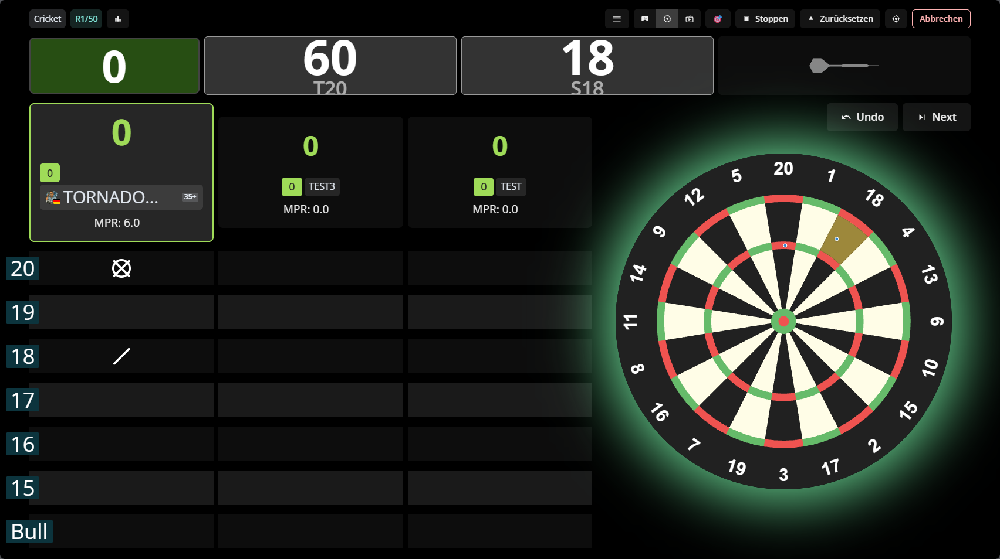

### Theme Shanghai

- Gilt für: `Shanghai`
- Kurz: Ein aufgeräumtes Shanghai-Layout mit optionaler AVG-Zeile und ruhigerem Kontrast.
- Grafisch: Das Theme ordnet Flächen und Farben neu, ohne den Spielaufbau zu verändern. Ein eigenes Hintergrundbild liegt hinter der Oberfläche und kann die Wirkung zusätzlich prägen.
- `AVG anzeigen`: Blendet die AVG-Anzeige im Shanghai-Theme ein oder aus.
- `Hintergrund-Darstellung`: Legt fest, wie ein eigenes Hintergrundbild im Theme platziert wird.
  - `Füllen`: Das Bild wirkt wie ein vollflächiges Wallpaper hinter dem Theme. Der komplette Bereich ist gefüllt, aber Motivteile am Rand können aus dem sichtbaren Ausschnitt herausfallen.
  - `Einpassen`: Das Motiv bleibt vollständig erhalten und wird vollständig in den verfügbaren Raum eingepasst. Dadurch geht nichts vom Bild verloren, aber je nach Format bleiben seitlich oder oben und unten sichtbare Theme-Flächen frei.
  - `Strecken`: Das Motiv wird unabhängig vom Originalformat auf die komplette Theme-Fläche gezogen. So ist jeder Bereich bedeckt, aber die Bildproportionen können sichtbar auseinandergezogen oder zusammengedrückt wirken.
  - `Zentriert`: Das Motiv erscheint wie ein mittig aufgelegtes Poster ohne automatische Skalierung. Große leere Ränder des Themes bleiben stehen, wenn das Bild kleiner als der verfügbare Bereich ist.
  - `Kacheln`: Das Motiv wird wie eine Kachel über die Theme-Fläche wiederholt. Statt eines einzelnen großen Hintergrundbilds entsteht ein sich wiederholendes Muster über den gesamten Bereich.
- `Hintergrundbild-Deckkraft`: Regelt, wie stark das Hintergrundbild sichtbar bleibt.
  - `100 %`: Das Hintergrundbild wirkt nahezu ungefiltert und sehr präsent. Farben und Kanten bleiben deutlich sichtbar, sodass das Motiv den Look des Themes stark mitbestimmt.
  - `85 %`: Das Motiv bleibt klar sichtbar und prägt die Fläche stark, bekommt aber schon eine leichte dunkle Dämpfung. Dadurch bleibt der Bildcharakter erhalten, ohne ganz so hart in den Vordergrund zu drängen.
  - `70 %`: Das Hintergrundmotiv bleibt deutlich sichtbar, wirkt aber bereits eingebettet statt aufgeklebt. Farben und Formen sind noch erkennbar, während das Theme die Fläche ruhiger und geschlossener erscheinen lässt.
  - `55 %`: Das Hintergrundbild ist weiterhin erkennbar, verliert aber deutlich an Dominanz. Diese Stufe ist ein Mittelweg, bei dem Motiv und Lesbarkeit ungefähr gleich wichtig bleiben.
  - `40 %`: Das Bild ist noch klar als Motiv erkennbar, wird aber bereits deutlich von der dunklen Theme-Schicht zurückgenommen. Es wirkt mehr wie Atmosphäre im Hintergrund als wie ein aktives Titelmotiv.
  - `25 %`: Das Motiv bleibt nur noch als ruhige Bildstimmung im Hintergrund erhalten. Farben und Strukturen tragen Atmosphäre bei, ohne Spielerfelder, Texte oder Karten optisch zu überholen.
  - `10 %`: Das Hintergrundmotiv ist fast nur noch als Schatten, Form oder grobe Farbstruktur wahrnehmbar. Diese Stufe priorisiert eine ruhige, sehr lesbare Oberfläche gegenüber sichtbaren Bilddetails.
- `Spielerfelder-Transparenz`: Passt die Transparenz der Spielerfelder gegenüber dem Hintergrund an.
  - `0 %`: Die Spielerfelder erscheinen nahezu opak und schirmen das Hintergrundbild stark ab. Das Layout wirkt dadurch ruhig, dicht und klar vom Hintergrund getrennt.
  - `5 %`: Die Karten wirken weiterhin fast deckend, zeigen aber schon eine leichte Durchlässigkeit. Das ist für Nutzer gedacht, die kaum Transparenz möchten, aber etwas mehr Tiefe als bei komplett geschlossenen Flächen.
  - `10 %`: Die Karten behalten eine stabile Lesbarkeit, bekommen aber eine leichte Glasscheiben-Wirkung. Hintergrundfarben und Motive bleiben nur dezent hinter den Spielerflächen sichtbar.
  - `15 %`: Die Karten wirken bereits spürbar transparenter und vermitteln mehr Tiefe zwischen Oberfläche und Hintergrund. Das Motiv hinter den Spielerfeldern wird deutlicher wahrnehmbar, ohne die Lesbarkeit stark zu gefährden.
  - `30 %`: Die Spielerfelder erscheinen deutlich luftiger und geben dem Hintergrundbild sichtbar mehr Raum. Diese Stufe verschiebt das Layout klar in Richtung transparentes Overlay statt geschlossener Kartenfläche.
  - `45 %`: Die Karten verlieren einen großen Teil ihrer optischen Dichte und lassen das Motiv dahinter klar durchkommen. Das Layout wirkt dadurch offener, aber auch stärker vom Hintergrundbild beeinflusst.
  - `60 %`: Die Karten erscheinen fast wie halbtransparente Glasflächen über dem Hintergrund. Das Motiv dahinter bleibt stark sichtbar und gestaltet die Oberfläche sehr aktiv mit.
- `Debug`: Aktiviert zusätzliche Debug-Ausgaben für die Fehlersuche.
- `Hintergrundbild hochladen`: Speichert ein eigenes Bild bis 1,5 MiB nur für dieses Theme.
- `Hintergrundbild entfernen`: Entfernt nur das für dieses Theme gespeicherte Hintergrundbild.

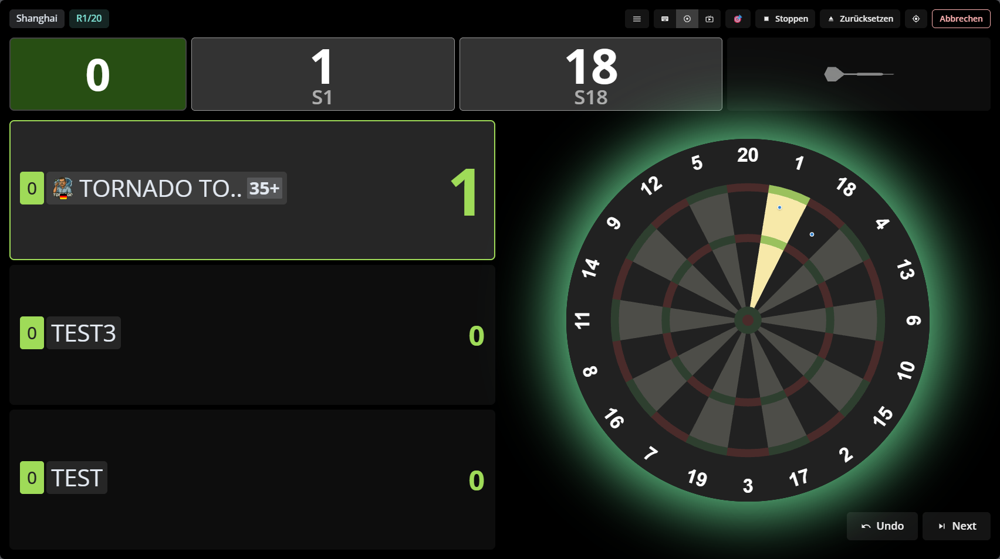

### Theme Bermuda

- Gilt für: `Bermuda`
- Kurz: Ein ruhigeres Bermuda-Layout mit eigener Bildfläche im Hintergrund.
- Grafisch: Das Theme passt Farben und Flächen für Bermuda an; ein gespeichertes Hintergrundbild liegt hinter dem Spielbereich, während die Bermuda-Anordnung selbst erhalten bleibt.
- `Hintergrund-Darstellung`: Legt fest, wie ein eigenes Hintergrundbild im Theme platziert wird.
  - `Füllen`: Das Bild wirkt wie ein vollflächiges Wallpaper hinter dem Theme. Der komplette Bereich ist gefüllt, aber Motivteile am Rand können aus dem sichtbaren Ausschnitt herausfallen.
  - `Einpassen`: Das Motiv bleibt vollständig erhalten und wird vollständig in den verfügbaren Raum eingepasst. Dadurch geht nichts vom Bild verloren, aber je nach Format bleiben seitlich oder oben und unten sichtbare Theme-Flächen frei.
  - `Strecken`: Das Motiv wird unabhängig vom Originalformat auf die komplette Theme-Fläche gezogen. So ist jeder Bereich bedeckt, aber die Bildproportionen können sichtbar auseinandergezogen oder zusammengedrückt wirken.
  - `Zentriert`: Das Motiv erscheint wie ein mittig aufgelegtes Poster ohne automatische Skalierung. Große leere Ränder des Themes bleiben stehen, wenn das Bild kleiner als der verfügbare Bereich ist.
  - `Kacheln`: Das Motiv wird wie eine Kachel über die Theme-Fläche wiederholt. Statt eines einzelnen großen Hintergrundbilds entsteht ein sich wiederholendes Muster über den gesamten Bereich.
- `Hintergrundbild-Deckkraft`: Regelt, wie stark das Hintergrundbild sichtbar bleibt.
  - `100 %`: Das Hintergrundbild wirkt nahezu ungefiltert und sehr präsent. Farben und Kanten bleiben deutlich sichtbar, sodass das Motiv den Look des Themes stark mitbestimmt.
  - `85 %`: Das Motiv bleibt klar sichtbar und prägt die Fläche stark, bekommt aber schon eine leichte dunkle Dämpfung. Dadurch bleibt der Bildcharakter erhalten, ohne ganz so hart in den Vordergrund zu drängen.
  - `70 %`: Das Hintergrundmotiv bleibt deutlich sichtbar, wirkt aber bereits eingebettet statt aufgeklebt. Farben und Formen sind noch erkennbar, während das Theme die Fläche ruhiger und geschlossener erscheinen lässt.
  - `55 %`: Das Hintergrundbild ist weiterhin erkennbar, verliert aber deutlich an Dominanz. Diese Stufe ist ein Mittelweg, bei dem Motiv und Lesbarkeit ungefähr gleich wichtig bleiben.
  - `40 %`: Das Bild ist noch klar als Motiv erkennbar, wird aber bereits deutlich von der dunklen Theme-Schicht zurückgenommen. Es wirkt mehr wie Atmosphäre im Hintergrund als wie ein aktives Titelmotiv.
  - `25 %`: Das Motiv bleibt nur noch als ruhige Bildstimmung im Hintergrund erhalten. Farben und Strukturen tragen Atmosphäre bei, ohne Spielerfelder, Texte oder Karten optisch zu überholen.
  - `10 %`: Das Hintergrundmotiv ist fast nur noch als Schatten, Form oder grobe Farbstruktur wahrnehmbar. Diese Stufe priorisiert eine ruhige, sehr lesbare Oberfläche gegenüber sichtbaren Bilddetails.
- `Spielerfelder-Transparenz`: Passt die Transparenz der Spielerfelder gegenüber dem Hintergrund an.
  - `0 %`: Die Spielerfelder erscheinen nahezu opak und schirmen das Hintergrundbild stark ab. Das Layout wirkt dadurch ruhig, dicht und klar vom Hintergrund getrennt.
  - `5 %`: Die Karten wirken weiterhin fast deckend, zeigen aber schon eine leichte Durchlässigkeit. Das ist für Nutzer gedacht, die kaum Transparenz möchten, aber etwas mehr Tiefe als bei komplett geschlossenen Flächen.
  - `10 %`: Die Karten behalten eine stabile Lesbarkeit, bekommen aber eine leichte Glasscheiben-Wirkung. Hintergrundfarben und Motive bleiben nur dezent hinter den Spielerflächen sichtbar.
  - `15 %`: Die Karten wirken bereits spürbar transparenter und vermitteln mehr Tiefe zwischen Oberfläche und Hintergrund. Das Motiv hinter den Spielerfeldern wird deutlicher wahrnehmbar, ohne die Lesbarkeit stark zu gefährden.
  - `30 %`: Die Spielerfelder erscheinen deutlich luftiger und geben dem Hintergrundbild sichtbar mehr Raum. Diese Stufe verschiebt das Layout klar in Richtung transparentes Overlay statt geschlossener Kartenfläche.
  - `45 %`: Die Karten verlieren einen großen Teil ihrer optischen Dichte und lassen das Motiv dahinter klar durchkommen. Das Layout wirkt dadurch offener, aber auch stärker vom Hintergrundbild beeinflusst.
  - `60 %`: Die Karten erscheinen fast wie halbtransparente Glasflächen über dem Hintergrund. Das Motiv dahinter bleibt stark sichtbar und gestaltet die Oberfläche sehr aktiv mit.
- `Debug`: Aktiviert zusätzliche Debug-Ausgaben für die Fehlersuche.
- `Hintergrundbild hochladen`: Speichert ein eigenes Bild bis 1,5 MiB nur für dieses Theme.
- `Hintergrundbild entfernen`: Entfernt nur das für dieses Theme gespeicherte Hintergrundbild.

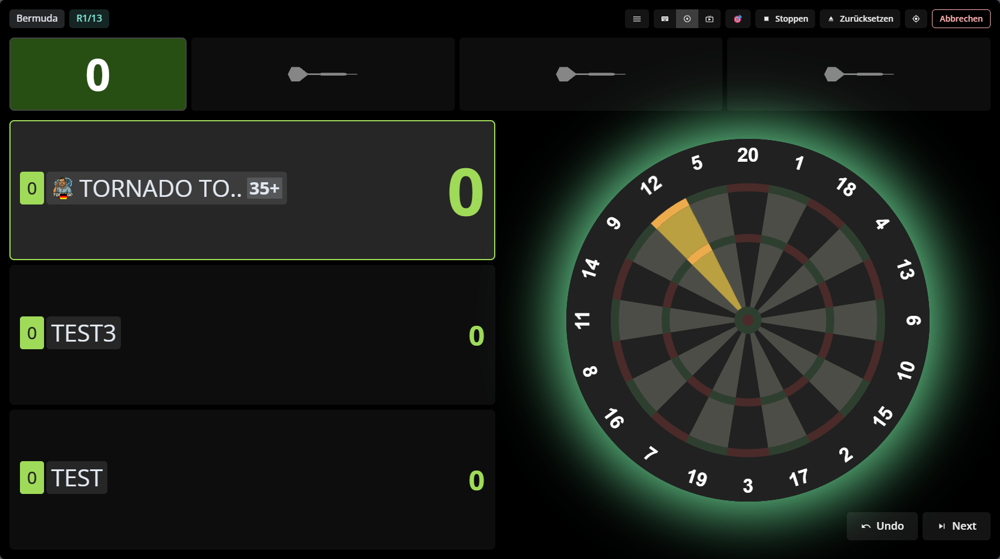

## Animationen für X01

### Checkout Score Highlight

- Gilt für: `X01`
- Kurz: Direkt finishbare Restwerte werden an der aktiven Punktzahl hervorgehoben.
- Grafisch: Die aktive Restpunktzahl pulsiert, glüht, skaliert oder blinkt je nach gewähltem Effekt. Die Hervorhebung sitzt direkt am Score und verändert keine anderen UI-Bereiche.
- `Effekt`: Wählt die Animationsart der hervorgehobenen Restpunktzahl.
  - `Grow + Glow`: Die Restpunktzahl bekommt einen weichen Puls aus Größenänderung, Helligkeit und Schattierung. Der Effekt wirkt organisch und wiederkehrend, ohne die Zahl hart springen zu lassen.
  - `Glow Only`: Der Fokus liegt auf einem an- und abschwellenden Glühen um die Zahl herum. Die Score-Anzeige selbst bleibt relativ stabil, während der Lichtschein die Aufmerksamkeit auf das Finish lenkt.
  - `Grow Only`: Die Finish-Zahl wird zyklisch vergrößert und wieder auf Normalgröße zurückgeführt. Der Effekt wirkt direkter und körperlicher als `Glow`, ohne das harte Ausblenden von `Blink` zu nutzen.
  - `Fade Blink`: Die Score-Anzeige blinkt über deutliche Helligkeitssprünge zwischen klar sichtbar und stark gedimmt. Dadurch wirkt der Effekt am alarmierendsten und fällt sofort ins Auge.
- `Farbthema`: Legt die Highlight-Farbe der Restpunktzahl fest.
  - `Autodarts Grün`: Der Score-Effekt nutzt ein helles, freundliches Grün und wirkt dadurch wie eine klare Freigabe oder Bestätigung. Diese Palette fügt sich am natürlichsten in den bestehenden Autodarts-Look ein.
  - `Cyan`: Diese Variante färbt die Hervorhebung in ein kühles Cyan. Dadurch wirkt der Checkout-Effekt moderner und technischer, bleibt aber ruhiger als warme Warnfarben.
  - `Amber`: Die Hervorhebung läuft in einen warmen Amberton und erinnert optisch eher an Bühnenlicht oder Warnakzent. Dadurch wirkt der Finish-Hinweis energischer und wärmer als Grün oder Cyan.
  - `Rot`: Diese Variante färbt die Finish-Anzeige klar rot und macht sie dadurch besonders dringlich und auffällig. Sie erzeugt den stärksten Warn- oder Alarmcharakter unter den verfügbaren Farbpaletten.
- `Intensität`: Regelt die Stärke des Score-Effekts.
  - `Dezent`: Diese Stufe hält Skalierung, Glühen und Blinktiefe bewusst zurück. Der Checkout-Hinweis bleibt lesbar und präsent, wirkt aber eher wie ein feiner Hinweis als wie ein Alarm.
  - `Standard`: Diese Stufe liefert den vorgesehenen Mittelweg für Skalierung, Leuchtweite und Blinkstärke. Die Finish-Hervorhebung ist deutlich genug für schnelle Wahrnehmung, ohne zu hektisch zu werden.
  - `Stark`: Diese Stufe erhöht die Maximalwerte für Skalierung, Schimmer und Sichtbarkeitsschwankung spürbar. Der Effekt wirkt energischer, dominanter und ist auch aus größerem Abstand leichter wahrzunehmen.
- `Trigger-Quelle`: Legt fest, welche Quelle den Score-Effekt auslösen darf.
  - `Vorschlag zuerst`: Diese Einstellung koppelt die Hervorhebung zuerst an die sichtbare Checkout-Empfehlung und nutzt den Punktestand nur als Fallback. Mehrschrittige Routen lösen den Effekt noch nicht aus; entscheidend ist erst der aktuell fällige Finish-Dart.
  - `Nur Score`: Mit dieser Einstellung entscheidet allein, ob der aktuelle Score mit dem nächsten Dart direkt finishbar ist. Sichtbare Checkout-Vorschläge beeinflussen den Effekt nicht mehr.
  - `Nur Vorschlag`: Diese Einstellung bindet die Hervorhebung strikt an den sichtbaren Suggestion-Block. Selbst ein rechnerisch direkt finishbarer Wert erzeugt keinen Effekt, solange kein passender Finish-Vorschlag erkannt wird.
- `Debug`: Aktiviert zusätzliche Debug-Ausgaben für die Fehlersuche.

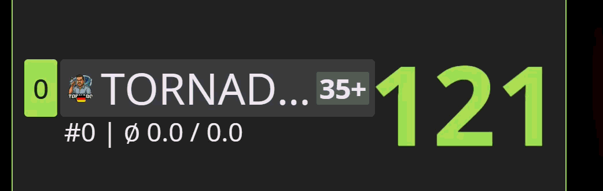

### X01 Remaining Score Bar

- Gilt für: `X01`
- Kurz: Jede X01-Spielerkarte erhält einen Balken, der den verbleibenden Score relativ zum Startwert zeigt.
- Grafisch: Direkt unter der Punktzahl liegt ein horizontaler Fortschrittsbalken. Aktive Spieler erhalten eine kräftigere, präsentere Darstellung mit optionalem Effekt, inaktive Karten bleiben flacher und unverändert ruhig. Je näher der Restwert an `0` liegt, desto kürzer wird der Balken.
- `Farben`: Steuert statische Farbpaletten und dynamische Schwellenfarben in einer gemeinsamen Auswahl.
  - `Checkout Focus`: Dynamischer Standardmodus mit Checkout-Fokus.
  - `Traffic Light`: Stufenmodus mit klaren Rot/Amber/Grün-Prozentschwellen.
  - `Danger Endgame`: Dynamischer Endgame-Modus mit starkem Warnfokus.
  - `Gradient Progress`: Kontinuierlicher Farbverlauf entlang des Score-Fortschritts.
  - `Autodarts`: Statische Autodarts-nahe Blaupalette.
  - `Signal Lime`: Statische lime-grüne Signalpalette.
  - `Glass Mint`: Statische helle Mint-/Aqua-Palette.
  - `Ember Rush`: Statische warme Ember-Palette.
  - `Ice Circuit`: Statische kühle Cyan-/Türkis-Palette.
  - `Neon Violet`: Statische violett-blaue Neonpalette.
  - `Sunset Amber`: Statische Sunset-/Amber-Palette.
  - `Monochrome Steel`: Statische, farbreduzierte Monochrom-Palette.
- `Balkengröße`: Legt die Balkenhöhe des aktiven Spielers fest.
  - `Schmal`: Schmale Balkenhöhe für eine ruhige Darstellung.
  - `Standard`: Standardhöhe als neutraler Mittelweg.
  - `Breit`: Breitere Balkenhöhe mit stärkerer Präsenz.
  - `Extrabreit`: Maximal breite Balkenhöhe für höchste Sichtbarkeit.
- `Effekt`: Wählt den Effekt des aktiven Balkens; inaktive Spieler bleiben unverändert.
  - `Bar Pulse`: Deutlicher Kern-Puls auf dem aktiven Balken.
  - `Glass Light Sweep`: Gläserner Ladeeffekt mit breiter Lichtkante.
  - `Moving Segments`: Segmentierte Drain-Optik mit klaren Abschnitten.
  - `Previous Score Trail`: Nachziehender Ghost-Trail beim Scorewechsel.
  - `Fast Signal Sweep`: Schneller Signal-Sweep mit hoher Aufmerksamkeit.
  - `Aus`: Keine Zusatzanimation; nur der statische Balken bleibt sichtbar.
- `Debug`: Aktiviert zusätzliche Debug-Ausgaben für die Fehlersuche.

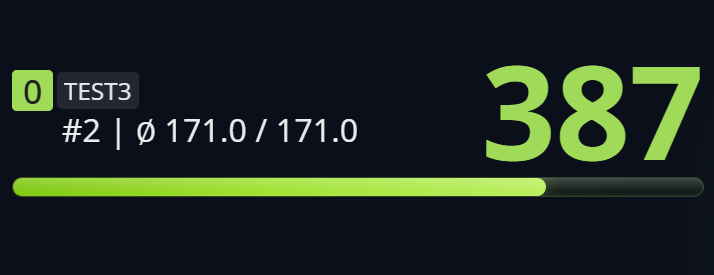

### Checkout Target Highlights

- Gilt für: `X01`
- Kurz: Unter `180` wird das nächste sinnvolle Checkout-Ziel direkt am virtuellen Board markiert.
- Grafisch: Die relevanten Segmente erhalten eine ruhige farbige Füllung, optional eine Kontur und einen kontrollierten Halo. Unter `180` validiert das Modul sichtbare Vorschläge gegen Score und Out-Mode, ergänzt sinnvolle Finish-Routen scorebasiert und hält bei klaren Setup-Hinweisen das zuerst zu spielende Feld direkt am Board sichtbar. Wenn mehrere Routenschritte sichtbar sind, bleibt das zuerst zu spielende Feld klar am stärksten betont. Single-Ziele markieren standardmäßig immer beide Single-Ringe des Segments.
- `Darstellung`: Wählt die visuelle Darstellung der markierten Segmente.
  - `Soft Pulse`: Diese Darstellung hält das nächste sinnvolle Checkout-Ziel ruhig und klar im Fokus und ergänzt Helligkeit, Halo und Kontur um eine kleine, kontrollierte Skalierung.
  - `Fast Blink`: Diese Darstellung orientiert sich am nativen Blinkgefühl und setzt das Ziel mit klaren Helligkeitswechseln, leichtem Wachstum und sauberem Halo in Szene.
  - `Slow Glow`: Diese Darstellung eignet sich, wenn das Checkout-Ziel eher als konstanter Board-Hinweis mit nur minimaler Bewegung sichtbar sein soll.
- `Segmentstil`: Legt fest, ob die Ziele mit Rahmen oder nur über die farbige Fläche markiert werden.
  - `Fläche + Rahmen`: Diese Variante kombiniert die farbige Fläche mit Segmentrahmen und zusätzlicher Zielkontur und entspricht dem bisherigen Standard-Look.
  - `Nur Fläche`: Diese Variante markiert das Ziel ausschließlich über die eingefärbte Fläche und lässt den Rahmen komplett weg, während Preset und Farblogik auf der Fläche erhalten bleiben.
- `Zielauswahl`: Legt fest, welcher Teil der autoritativen Checkout-Route am Board markiert wird.
  - `Nächstes Feld`: Markiert unter `180` genau das nächste sinnvolle Feld; wenn keine Finish-Route mehr steht, bleibt ein plausibler sichtbarer Setup-Hinweis als nächstes Feld erhalten.
  - `Alle Felder`: Markiert alle Segmente der validierten beziehungsweise scorebasiert ergänzten Route gleichzeitig, mit klarem Fokus auf dem ersten Schritt.
  - `Nur Finish`: Markiert nur das aktuelle Finish-Segment; mehrstufige Setup-Routen bleiben bis zum echten Finish-Dart unmarkiert.
- `Farbthema`: Passt die Farbe der Board-Markierungen an.
  - `Violett`: Diese Palette nutzt ein klares Violett für Füllung und Kontur der Checkout-Ziele. Dadurch wirkt die Markierung deutlich futuristischer und hebt sich stark von den Standardfarben des Boards ab.
  - `Cyan`: Diese Farbpalette färbt die Ziele in ein kühles Cyan und erzeugt damit einen sauberen, technischen Look. Auf dunklen Board-Bereichen wirkt die Markierung sehr klar und modern.
  - `Amber`: Die Checkout-Ziele werden in eine warme Amber- bis Goldwirkung getaucht. Dadurch wirkt das Overlay energetischer, wärmer und stärker wie ein Warn- oder Fokusakzent.
  - `Lime`: Diese Palette setzt auf ein klares Lime-Grün für maximale Sichtbarkeit. Sie ist bewusst stark von Violett, Cyan und Amber getrennt und wirkt wie ein präziser Signalmarker am Board.
  - `Rose`: Diese Palette färbt Checkout-Ziele in ein kräftiges Rose bis Pink. Dadurch entsteht ein warmer, sehr sichtbarer Gegenpol zu den kühleren und grünen Signalvarianten.
  - `Weiß`: Diese Palette nutzt ein kühles Signalweiß für Füllung und Kontur. Sie ist die neutralste Variante und bleibt trotzdem sehr präsent, ohne eine zusätzliche Farbstimmung vorzugeben.
- `Debug`: Aktiviert zusätzliche Debug-Ausgaben für die Fehlersuche.

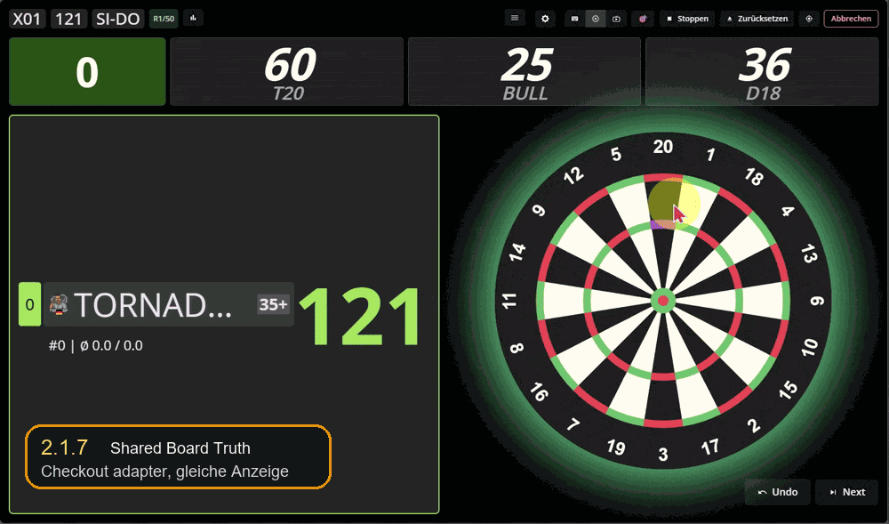

### TV Board Zoom

- Gilt für: `X01`
- Kurz: Bei klaren X01-Zielsituationen zoomt die Ansicht auf relevante Board-Bereiche und hält den Fokus in sinnvollen Finish-Momenten stabil.
- Grafisch: Das Board wird innerhalb des rechten Board-Bereichs vergrößert, damit relevante Segmente mehr Platz bekommen. Nach `T20,T20,T20` bleibt der Fokus bis zum Spielerwechsel bestehen, nach getroffenem Checkout bis zum Leg-Ende. Klicks auf die Wurfanzeigenleiste zoomen sofort aus, damit Korrekturen auf der ganzen Scheibe möglich bleiben.
- `Zoom-Stufe`: Bestimmt die Stärke des Board-Zooms.
  - `2,35`: Diese Stufe vergrößert das Ziel spürbar, lässt aber noch viel vom restlichen Board im Bild. Der Effekt wirkt eher wie ein sanfter Fokus als wie ein enger Ausschnitt.
  - `2,75`: Diese Stufe liefert den vorgesehenen Mittelwert für den Board-Zoom. Das Zielsegment wird deutlich hervorgehoben, während rundherum noch genug Board sichtbar bleibt, um sich räumlich zu orientieren.
  - `3,15`: Diese Stufe zieht die Kamera am stärksten in den relevanten Bereich hinein. Das Zielsegment dominiert das Bild klarer, während das restliche Board stärker aus dem Blickfeld rückt.
- `Zoom-Geschwindigkeit`: Regelt die Geschwindigkeit des Zooms.
  - `Schnell`: Diese Stufe verkürzt Ein- und Auszoomung sichtbar und lässt den Fokus direkter anspringen. Die Bewegung bleibt weich, fühlt sich aber deutlich sportlicher und unmittelbarer an.
  - `Mittel`: Diese Stufe ist der Mittelweg zwischen schnellem Fokuswechsel und weicher Kamerafahrt. Die Bewegung bleibt klar wahrnehmbar, ohne das Geschehen unnötig zu verzögern.
  - `Langsam`: Diese Einstellung verlängert Ein- und Auszoomung spürbar. Der Fokus wirkt dadurch weicher und cineastischer, aber weniger direkt als bei `Schnell`.
- `Checkout-Zoom`: Schaltet den Checkout-Zoom für klare Ein-Dart-Finishes ein oder aus.
- `Checkout-Ziel`: Bestimmt, welches Segment einer sichtbaren Checkout-Route als Zoomziel verwendet wird.
  - `Nur Finish-Feld`: Fokussiert bei sichtbaren Checkout-Routen nur das abschließende Finish-Feld.
  - `Erstes Routenfeld`: Fokussiert bei sichtbaren Checkout-Routen das erste Routenfeld.
- `T20-Setup-Zoom`: Schaltet den `T20`-Spezialfall nach zwei `T20` ein oder aus.
- `Debug`: Aktiviert zusätzliche Debug-Ausgaben für die Fehlersuche.

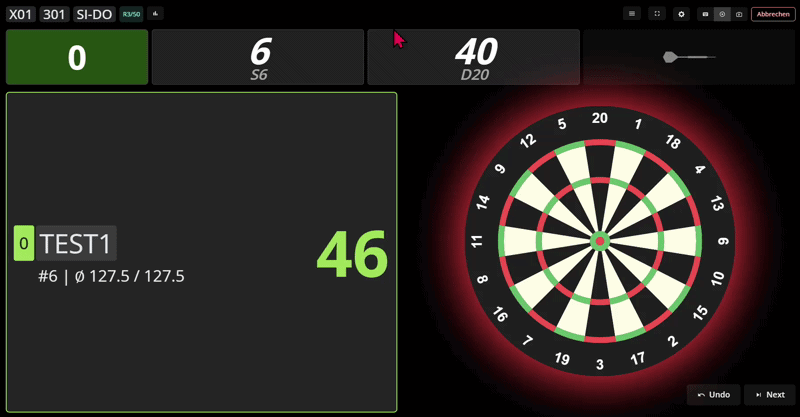

### Checkout Suggestion Styles

- Gilt für: `X01`
- Kurz: Checkout-Empfehlungen werden auffälliger, strukturierter und besser lesbar gestaltet.
- Grafisch: Der sichtbare Vorschlagsblock erhält je nach Stil eine Badge-, Ribbon-, Stripe-, Ticket- oder Outline-Optik. Optional sitzt darüber ein eigenes Label wie `CHECKOUT` oder `FINISH`.
- `Stil`: Wechselt die Hülle des Checkout-Vorschlags.
  - `Badge`: Diese Variante legt um den Suggestion-Block eine plakative Badge-Hülle mit gestrichelter Outline und weicher Akzentfläche. Der Hinweis wirkt dadurch wie ein klar eingestempeltes Label im Interface.
  - `Ribbon`: Diese Variante inszeniert den Suggestion-Block wie ein leuchtendes Ribbon oder Banner. Durch Innenrahmen, Glow und leicht gekipptes Label wirkt der Hinweis energischer und auffälliger.
  - `Stripe`: Diese Variante kombiniert einen akzentfarbenen Rahmen mit diagonalem Streifenmuster in der Fläche. Der Vorschlag wirkt dadurch besonders signalhaft und gut scanbar.
  - `Ticket`: Diese Variante formt den Suggestion-Block wie ein Ticket mit eigener Labelzone und gestrichelter Trennlinie. Dadurch wirkt die Empfehlung spielerischer und stärker wie ein separates Element.
  - `Outline`: Diese Variante hält die Fläche selbst relativ ruhig und setzt auf eine kräftige äußere Kontur. Der Vorschlag wirkt dadurch klar, präzise und eher technisch als verspielt.
- `Labeltext`: Legt den festen Labeltext über dem Vorschlag fest oder blendet ihn aus.
  - `CHECKOUT`: Diese Einstellung setzt oberhalb der Empfehlung ein festes `CHECKOUT`-Label. Dadurch wird der Block sofort als Checkout-Hinweis lesbar, auch wenn man nur kurz auf die Fläche schaut.
  - `FINISH`: Mit dieser Option trägt der Suggestion-Block das Label `FINISH` statt `CHECKOUT`. Das wirkt sprachlich etwas kompakter und rückt den erfolgreichen Abschluss stärker in den Vordergrund.
  - `Kein Label`: Diese Option entfernt die kleine Label-Marke oberhalb des Suggestion-Blocks vollständig. Die farbige Hülle bleibt erhalten, aber der Vorschlag wirkt minimalistischer und weniger plakativ.
- `Farbthema`: Wählt die Akzentfarbe des Suggestion-Styles.
  - `Amber`: Diese Palette taucht die Hülle in warme Amber- und Goldtöne. Dadurch wirkt die Empfehlung freundlich, energisch und sehr gut vom dunklen Hintergrund abgesetzt.
  - `Cyan`: Diese Farbpalette setzt auf kühle Cyan-Töne für Rahmen, Label und Hintergrundakzent. Der Vorschlag wirkt dadurch moderner, technischer und etwas nüchterner als bei warmen Farben.
  - `Rose`: Diese Palette färbt den Suggestion-Block in rosé- bis rotlastige Akzente. Dadurch wirkt der Hinweis markanter, emotionaler und stärker wie ein bewusst gesetzter Signalblock.
- `Debug`: Aktiviert zusätzliche Debug-Ausgaben für die Fehlersuche.

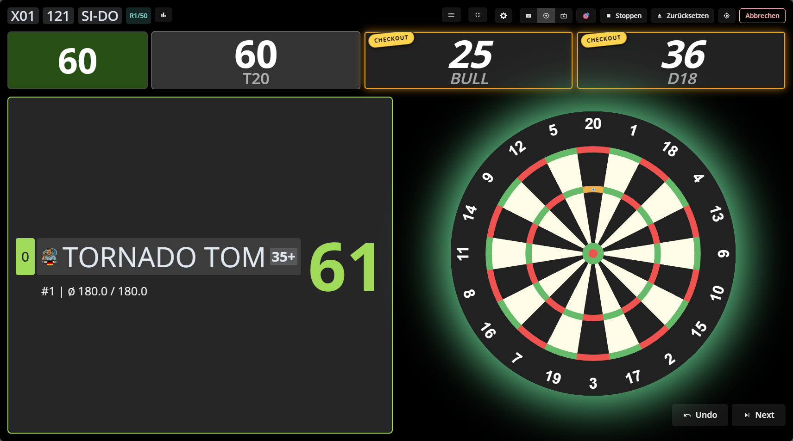
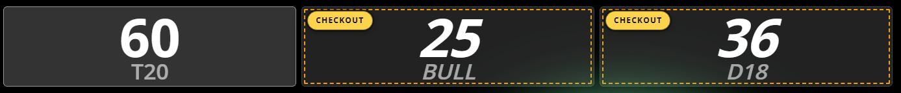
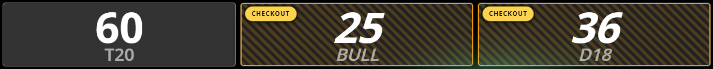
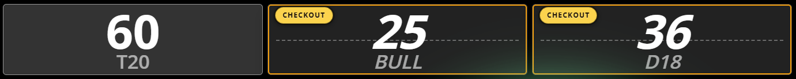
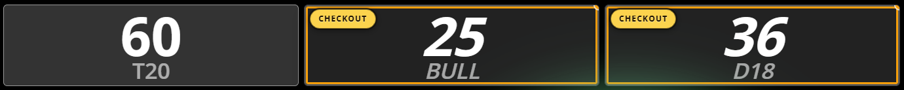

### X01 Bust Active Player Highlight

- Gilt für: `X01`
- Kurz: Bei sichtbarem `BUST` übernimmt die aktive X01-Spielerkarte Hintergrund und Rahmen der roten Wurfkacheln.
- Grafisch: Beim Eintritt in BUST erscheinen die konfigurierten Glasrisse sofort an zufälligen Stellen und die aktive Karte wackelt drei Sekunden im schnellen Earthquake-Stil. Danach bleiben Glasrisse und rote Wurfkachel-Färbung stehen, bis `BUST` verschwindet.
- `Anzahl Glasrisse`: Bestimmt die Anzahl zufällig platzierter Glasrisse.
  - `Aus`: Keine Glasrisse; Rotmarkierung und Wackeln bleiben aktiv.
  - `1`: Zeigt ein zufällig platziertes Einschlagzentrum.
  - `2`: Zeigt zwei zufällig und unabhängig platzierte Einschlagzentren.
  - `3`: Zeigt drei Einschlagzentren und damit die dichteste Darstellung.
- `Debug`: Aktiviert zusätzliche Debug-Ausgaben für die Fehlersuche.

**BUST-Hervorhebung der aktiven Spielerkarte**

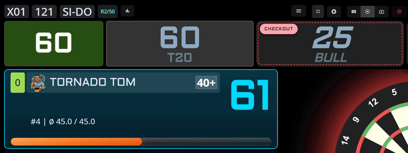

**BUST-Hervorhebung mit Glasrissen**

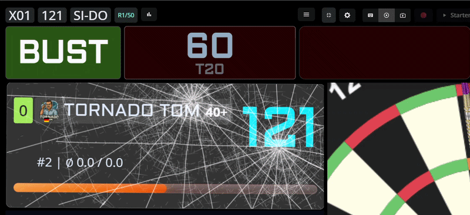

## Animationen für Cricket und Tactics

### Cricket Target Highlighter

- Gilt für: `Cricket`, `Tactics`
- Kurz: Zielzustände und Drucksituationen werden direkt am Board sichtbar.
- Grafisch: Board-Segmente erhalten je nach Zustand farbige Overlays. Relevante Ziele leuchten grün oder rot, irrelevante Felder werden je nach Stil abgeschwächt, geschraffiert oder maskiert.
- `OPEN-Ziele anzeigen`: Zeigt offene Ziele zusätzlich am Board an.
- `DEAD-Ziele anzeigen`: Zeigt erledigte Ziele weiter als `DEAD` an.
- `Irrelevante Felder abdunkeln`: Bestimmt den Abdunkelungsstil für irrelevante Felder.
  - `Aus`: Mit dieser Option bleiben irrelevante Board-Felder optisch unangetastet. Das Board behält überall seine normale Grundwirkung, während nur die tatsächlich markierten Zustände zusätzliche Overlays bekommen.
  - `Smoke`: Diese Variante legt eine weiche, gleichmäßige Abdunkelung über irrelevante Segmente. Das Board wirkt ruhiger, ohne mit Mustern oder starker Maskierung vom aktiven Ziel abzulenken.
  - `Hatch+`: Diese Stufe kombiniert eine graue Dämpfung mit sichtbarer Schraffur. Irrelevante Felder wirken dadurch klarer als passive Zone gekennzeichnet als bei `Smoke`.
  - `Mask`: Diese Variante nutzt die härteste Abdunkelung und deckt irrelevante Bereiche fast wie mit einer schwarzen Maske ab. Dadurch stehen aktive, offene und druckrelevante Ziele maximal im Vordergrund.
- `Farbthema`: Passt die Farben für Scoring- und Druckzustände an.
  - `Standard`: Diese Palette verwendet das Standard-Grün für Scoring und das normale Rot für Druckzustände. Sie liefert die vorgesehene Grundwirkung ohne zusätzliche Kontrastschärfung.
  - `High Contrast`: Diese Palette verstärkt vor allem die grüne Scoring-Wirkung gegenüber dem Standardmodus. Dadurch heben sich offensive Ziele klarer vom Board und von anderen Zuständen ab.
- `Intensität`: Regelt Deckkraft und Sichtbarkeit der Board-Overlays.
  - `Dezent`: Diese Stufe reduziert Deckkraft und Konturwirkung der Board-Overlays. Zustände bleiben lesbar, drängen sich aber weniger stark in den Vordergrund.
  - `Standard`: Diese Einstellung liefert den Standardwert für Füllung, Kontur und Dimmwirkung. Das Board bleibt gut interpretierbar, ohne optisch zu schwer zu werden.
  - `Stark`: Diese Stufe erhöht Sichtbarkeit, Konturboost und Flächenwirkung der Overlays spürbar. Zustände springen dadurch schneller ins Auge, wirken aber deutlich dominanter auf dem Board.
- `Debug`: Aktiviert zusätzliche Debug-Ausgaben für die Fehlersuche.

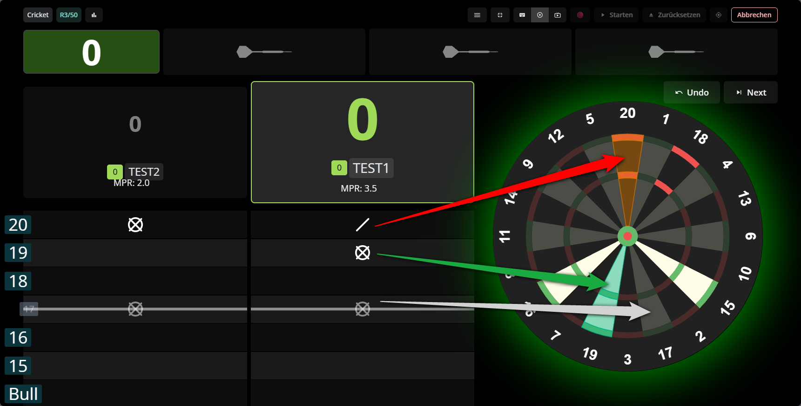

### Cricket Grid Status Effects

- Gilt für: `Cricket`, `Tactics`
- Kurz: Zusätzliche Live-Effekte direkt in der Cricket-/Tactics-Matrix.
- Grafisch: Zellen, Zeilen, Labels und Badges reagieren mit grünen und roten Zuständen, kurzen Chips, Kanten und Übergängen. So werden Fortschritt, Gegnerdruck und Zugwechsel in der Matrix selbst sichtbarer.
- `Zeilen-Sweep`: Lässt nach Änderungen einen kurzen Lichtlauf über die Zeile laufen.
- `Ziel-Badge-Hinweis`: Verstärkt Ziel-Badges und Labelzellen mit zusätzlichem Glow.
- `Mark-Fortschritt`: Betont die Mark-Stufen in den Spielerzellen.
- `PRESSURE-Kante`: Zeichnet bei Gegnerdruck eine rote Warnkante.
- `SCORING-Streifen`: Hebt offensiv scorable Bereiche grün hervor.
- `DEAD-Zeilen abdunkeln`: Dunkelt `DEAD`-Zeilen optisch ab.
- `Delta-Chips`: Zeigt kurz `+1`, `+2` oder `+3` direkt an der Matrix an.
- `Treffer-Impuls`: Erzeugt einen kurzen Trefferfunken am betroffenen Bereich.
- `Zugwechsel-Übergang`: Kennzeichnet den Zugwechsel mit einem kurzen Matrix-Übergang.
- `PRESSURE-Overlay`: Legt bei Gegnerdruck eine zusätzliche rote Druckfläche über betroffene Bereiche.
- `Farbthema`: Passt die Farben der Grid-Effekte an.
  - `Standard`: Diese Palette verwendet die Standardfarben für offensive und druckbezogene Grid-Effekte. Sie liefert den normalen Look für Badge-Glows, Streifen, Kanten und Zellmarkierungen.
  - `High Contrast`: Diese Palette verstärkt vor allem die grüne Offensivwirkung im Grid. Badge-Glows, Scoring-Streifen und offensive Flächen heben sich dadurch klarer von roten Druckzuständen ab.
- `Intensität`: Regelt die Gesamtstärke der Grid-Effekte.
  - `Dezent`: Diese Stufe reduziert die Opazität und den Glanz der Grid-FX-Komponenten. Zeilen, Badges und Zellzustände bleiben informativ, treten aber weniger plakativ auf.
  - `Standard`: Diese Einstellung liefert den Standardwert für Badge-Glow, Zellfüllung, Druckkante und Scoring-Streifen. Das Grid bleibt klar interpretierbar und zugleich kontrolliert.
  - `Stark`: Diese Stufe erhöht die sichtbare Stärke von Glow, Füllung und Kanten im gesamten Grid-FX-Paket. Offensiv- und Druckzustände wirken dadurch markanter und dominieren die Matrix stärker.
- `Debug`: Aktiviert zusätzliche Debug-Ausgaben für die Fehlersuche.

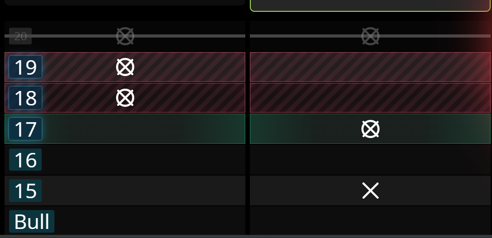

## Animationen für alle Modi

### AVG Trend Arrow

- Gilt für: `alle Modi`
- Kurz: Ein kleiner Pfeil direkt am AVG zeigt kurz die Trendrichtung.
- Grafisch: Bei einer AVG-Änderung erscheint neben dem Wert kurz ein grüner Aufwärtspfeil oder roter Abwärtspfeil und verschwindet nach der eingestellten Zeit wieder.
- Trendberechnung: Vergleich von `AVG_aktuell` mit `AVG_vorher` aus der AutoDarts-Anzeige.
- Bei einer Anzeige wie `55.0 / 55.0` wird der linke Wert vor dem `/` verwendet.
- Formel: `AVG_Delta = AVG_aktuell - AVG_vorher`; `> 0` = Aufwärtspfeil, `< 0` = Abwärtspfeil, `= 0` = keine neue Pfeilrichtung.
- Beispiel: `ø 52.50 / 51.80` -> `ø 53.10 / 52.00` ergibt `+0.60`, also Pfeil nach oben.
- Einordnung: X01 nutzt den 3-Dart-Average `((Punkte / Darts) * 3)`, Cricket nutzt `MPR = Marks / Runden`.
- `Animationsdauer`: Legt fest, wie lange der Pfeil sichtbar bleibt.
  - `Kurz`: Diese Stufe hält die Bounce-Animation sehr kurz. Der Pfeil markiert die AVG-Änderung nur als schnellen Impuls und verschwindet fast sofort wieder.
  - `Standard`: Diese Stufe bietet einen guten Mittelweg: Der Pfeil ist klar wahrnehmbar, verschwindet aber noch zügig genug, um die AVG-Anzeige nicht zu blockieren.
  - `Lang`: Diese Stufe verlängert die sichtbare Bounce-Phase deutlich. Dadurch bleibt die Trendrichtung länger lesbar und ist auch in hektischeren Spielsituationen leichter wahrzunehmen.
- `Pfeil-Größe`: Passt Größe und Abstand des Pfeils an.
  - `Klein`: Diese Stufe hält den Pfeil klein und schmal. Die AVG-Anzeige bleibt optisch führend, während der Trend nur als diskreter Zusatz erscheint.
  - `Standard`: Diese Größe bietet einen guten Mittelweg zwischen Lesbarkeit und Zurückhaltung. Der Trend ist gut erkennbar, ohne die AVG-Zahl optisch zu überholen.
  - `Groß`: Diese Stufe macht den Trendpfeil deutlich größer und gibt ihm etwas mehr Abstand zur AVG-Zahl. Das verbessert die Erkennbarkeit besonders auf größeren Displays oder aus größerer Distanz.
- `Debug`: Aktiviert zusätzliche Debug-Ausgaben für die Fehlersuche.

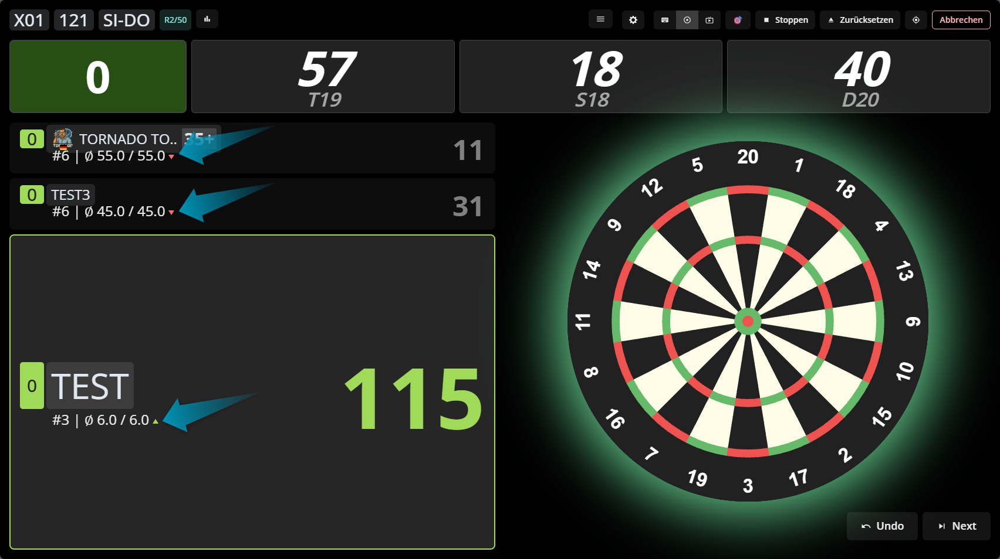

### Active Player Sweep

- Gilt für: `alle Modi`
- Kurz: Beim Spielerwechsel läuft ein kurzer Sweep über die aktive Karte.
- Grafisch: Eine helle, halbtransparente Bahn zieht einmal quer über die aktive Karte. So springt der neue Zugwechsel schneller ins Auge.
- `Sweep-Geschwindigkeit`: Bestimmt das Tempo des Sweeps.
  - `Schnell`: Diese Stufe verkürzt den Sweep auf einen schnellen, klaren Lichtimpuls. Der Turn-Wechsel springt ins Auge, ohne lange auf der Karte stehen zu bleiben.
  - `Standard`: Diese Einstellung hält die Balance zwischen schnellem Impuls und gut lesbarer Bewegung. Der Sweep wirkt bewusst gesetzt, aber nicht ausgedehnt.
  - `Langsam`: Diese Stufe verlängert den Sweep sichtbar und macht den Spielerwechsel stärker zum kleinen Übergangseffekt. Die Karte bleibt dadurch länger in einer hellen Bewegung markiert.
- `Sweep-Stil`: Regelt Breite und Helligkeit des Sweeps.
  - `Dezent`: Diese Variante hält Breite und Helligkeit des Sweeps bewusst niedrig. Der Spielerwechsel bleibt sichtbar, wirkt aber nicht wie ein dominanter Effektstreifen.
  - `Standard`: Diese Einstellung liefert den vorgesehenen Mittelwert für Breite und Helligkeit des Sweeps. Der Wechsel ist gut sichtbar, ohne die Karte optisch zu dominieren.
  - `Kräftig`: Diese Variante verbreitert und verstärkt den Lichtlauf deutlich. Der aktive Kartenwechsel wird dadurch sehr plakativ markiert und ist auch in schnellen Matches kaum zu übersehen.
- `Debug`: Aktiviert zusätzliche Debug-Ausgaben für die Fehlersuche.

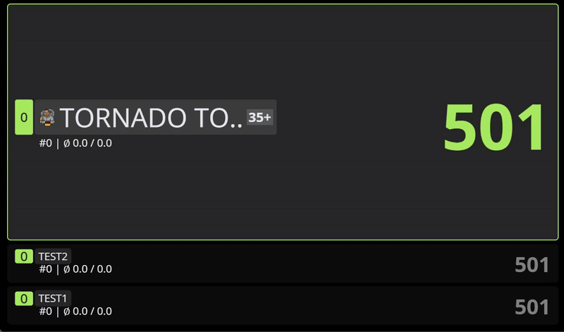

### Special Hit Highlights

- Gilt für: `alle Modi`
- Kurz: Treffer wie `T20`, `D16`, `25` und `BULL` bekommen dunkle Pattern-Highlights, stärkeren Text-Fokus und klar sichtbare Burst-Moves.
- Grafisch: Die betroffenen Wurffelder erhalten dunkle, kontrastreiche Flächen mit animierten Verläufen, Pattern-Layern, leuchtenden Rändern und textbezogenen Trefferimpulsen. Einige Farbwelten gehen eher in Cyberpunk-, Hazard- oder Vintage-Richtung. `25` (Single Bull) bleibt ruhiger, `BULL` (Bullseye) erscheint heller und markanter. Nur das frisch erkannte Feld bekommt den starken einmaligen Burst.
- `Farbstil`: Wählt die visuelle Farbwelt für Verlauf, Glow und Rand der Treffer-Highlights.
  - `Rot/Blau/Grün`: Verwendet feste Signalfarben pro Trefferart: `Triple = rot`, `Double = blau`, `Bull = grün`.
  - `Solar Flare`: Solar Flare taucht das Trefferfeld in Orange-, Rot- und Goldtöne mit sichtbaren Flame-Stripes. Rand, Verlauf und Text wirken wie aufgeheizt und präsent.
  - `Ice Reactor`: Ice Reactor baut einen kühlen Cyan-Blau-Look mit Grid-Muster und technischem Randlicht auf. Das Ergebnis wirkt präzise, futuristisch und deutlich weniger weich als warme Themes.
  - `Venom Lime`: Venom Lime mischt neonige Cyberpunk-Farben mit Hazard-Stripes und hartem Glow. Verlauf, Rand und Text springen damit am stärksten ins Auge.
  - `Crimson Velocity`: Crimson Velocity kombiniert schnelle Rottöne mit Stahlakzenten, Scanlines und scharfem Randlicht. Das Ergebnis wirkt wie ein Performance- oder Mecha-Look.
  - `Polar Mint`: Polar Mint mischt Mint, Aqua und Türkis mit leichter Stripe-Struktur zu einer frischen Trefferwelt. Der Look bleibt deutlich, aber ruhiger als die aggressiveren Varianten.
  - `Midnight Gold`: Midnight Gold legt Gold, Amber und Elfenbein über eine dunkle Vintage-Basis mit vertikalen Deco-Streifen. Das Trefferfeld wirkt dadurch hochwertig, warm und sehr gut lesbar.

**Vorschau Farbstile**

Die Farbwelten sind hier bewusst als kompakte Standbilder eingebunden, damit Kontrast, Pattern und Beschriftung schnell vergleichbar bleiben.
Der Farbstil `Rot/Blau/Grün` nutzt feste Trefferfarben und hat deshalb keine eigene Preset-Galerie.

|  |  |
| --- | --- |
| `Solar Flare` | `Ice Reactor` |
| 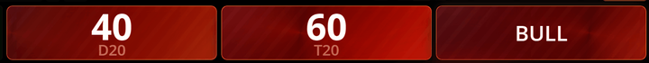 | 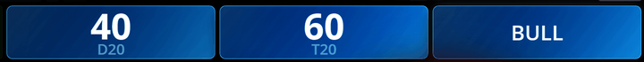 |
| `Venom Lime` | `Crimson Velocity` |
| 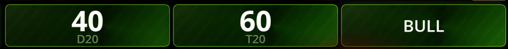 | 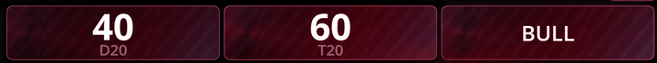 |
| `Polar Mint` | `Midnight Gold` |
| 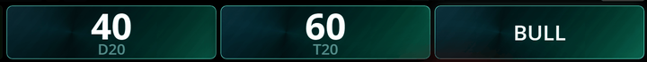 | 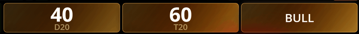 |

- `Animationsstil`: Wählt den Burst-Stil für das frisch erkannte Trefferfeld.
  - `Pop Hit`: Pop Hit ist der direkte Standard-Impact: kurzer Vorwärtsschub, klarer Zahlen-Burst und sofortige Rückkehr in den Ruhezustand.
  - `Side Shake`: Side Shake übersetzt den Treffer in einen kompakten Seitenschlag. Feld und Zahl zittern nur einmal kurz und fallen danach vollständig in den Ruhezustand zurück.
  - `Glow Pop`: Glow Pop ist ein einmaliges Aufleuchten für Spieler, die einen klaren Trefferpeak ohne Seitenbewegung oder Daueranimation wollen.
  - `Flip Spin`: Flip Spin gibt dem Treffer einen kurzen räumlichen Drehimpuls. Das ersetzt die bisherigen Flip-Doppelungen mit einem klaren One-Shot-Effekt.
  - `Light Sweep`: Light Sweep legt einen einmaligen Lichtzug über das Trefferfeld und betont den Rand ohne dauerhafte Konturbewegung.
  - `Shockwave Ring`: Shock Ring inszeniert den Treffer wie eine kurze Druckwelle mit stärkerem Ringimpuls und sichtbarem Textschub.
  - `Electric Jolt`: Electric Arc kombiniert einen kompakten Stromstoß mit leichtem Seitenshake auf Feld, Score und Segment. Die Wirkung ist aggressiv und kurz, bleibt aber klar als einmaliger Burst.

**Animationsstile**

`Emphase`, `Shake`, `Pulse`, `Turn`, `Sheen`, `Shock Ring` und `Electric Arc` sind jeweils einmalige Bursts. Alte Presets mit ähnlicher Wirkung werden beim Laden auf diese reduzierten Stile gemappt.

- `Debug`: Aktiviert zusätzliche Debug-Ausgaben für die Fehlersuche.

### Dartboard Marker Highlight

- Gilt für: `alle Modi`
- Kurz: Treffer-Marker auf dem virtuellen Board werden deutlicher sichtbar.
- Grafisch: Die bestehenden Marker werden größer, farbiger und auf Wunsch mit Pulse, Glow oder Outline versehen. Das Modul ersetzt die Marker nicht, sondern betont sie.
- `Marker-Größe`: Vergrößert oder verkleinert die Marker.
  - `Klein`: Diese Stufe lässt die Marker nur leicht anwachsen und bleibt nah an der ursprünglichen Geometrie des Boards. Die Treffer werden klarer, aber nicht großflächig.
  - `Standard`: Diese Einstellung liefert den Standardwert für die Markergröße. Treffer springen besser ins Auge, ohne die Board-Geometrie optisch zu überladen.
  - `Groß`: Diese Stufe vergrößert die Marker am stärksten. Treffer dominieren dadurch den getroffenen Bereich sichtbarer und bleiben besonders auf größeren oder weiter entfernten Displays erkennbar.
- `Marker-Farbe`: Wählt die Hauptfarbe des Markers.
  - `Blau`: Diese Variante färbt die Marker in ein kräftiges Blau und erzeugt damit eine saubere, technische Hervorhebung. Sie wirkt deutlich sichtbar, ohne die Warnwirkung von Rot oder Gelb zu nutzen.
  - `Grün`: Diese Palette färbt die Marker in ein kräftiges Grün. Dadurch wirken Treffer klar bestätigt und bleiben auf dunklen Board-Flächen sehr gut erkennbar.
  - `Rot`: Diese Farbe färbt die Treffer in ein helles Rot und erzeugt damit die auffälligste Alarmwirkung unter den Markerfarben. Das ist besonders plakativ, kann aber bewusst aggressiver wirken.
  - `Gelb`: Diese Variante färbt die Marker in ein kräftiges Gelb. Dadurch wirken Treffer sehr hell und aufmerksamkeitsstark, fast wie kleine Signalpunkte auf dem Board.
  - `Weiß`: Diese Palette setzt auf ein neutrales Weiß für die Markerbetonung. Der Effekt wirkt dadurch sehr klar und universell, ohne die Farbwirkung des restlichen Setups zu beeinflussen.
- `Effekt`: Schaltet zwischen Glow, Pulse oder keiner Zusatzanimation um.
  - `Soft Glow`: Diese Variante verstärkt die Marker primär über einen an- und abschwellenden Glow. Der Trefferpunkt bleibt stabil, wirkt aber über den Lichtschein dauerhaft präsenter.
  - `Size Pulse`: Diese Variante lässt die Marker zyklisch wachsen und wieder zurückfallen. Dadurch bekommen Treffer eine deutlichere Bewegungswirkung als beim reinen Leuchten.
  - `Kein Effekt`: Mit dieser Einstellung bleibt nur die statische Hervorhebung aus Farbe, Größe und optionaler Outline erhalten. Der Treffer wirkt klarer, aber ohne jede Zusatzbewegung.
- `Marker-Sichtbarkeit`: Regelt die Deckkraft der Marker.
  - `65 %`: Diese Stufe reduziert die Deckkraft der betonten Marker spürbar. Treffer bleiben sichtbar hervorgehoben, wirken aber weniger flächig und dominierend.
  - `85 %`: Diese Einstellung liefert den Standardwert für die Marker-Deckkraft. Treffer werden deutlich betont, ohne die Boardfläche komplett zu überdecken.
  - `100 %`: Diese Stufe zeichnet die Marker mit voller Deckkraft. Dadurch springen Treffer maximal ins Auge und setzen sich am härtesten vom Board-Hintergrund ab.
- `Outline-Farbe`: Fügt optional eine helle oder dunkle Outline hinzu.
  - `Aus`: Mit dieser Option bleibt die Markerbetonung auf Farbe, Größe und Animation beschränkt. Es wird keine zusätzliche Kontur zur Trennung vom Hintergrund gesetzt.
  - `Weiß`: Diese Variante ergänzt eine weiße Outline um den Marker. Dadurch bleibt der Treffer auch auf dunklen oder farbstarken Hintergründen besser abgegrenzt.
  - `Schwarz`: Diese Option ergänzt eine schwarze Kontur und verbessert die Trennung auf helleren oder stark leuchtenden Segmentflächen. Der Marker bekommt dadurch einen härteren, grafischeren Rand.
- `Debug`: Aktiviert zusätzliche Debug-Ausgaben für die Fehlersuche.

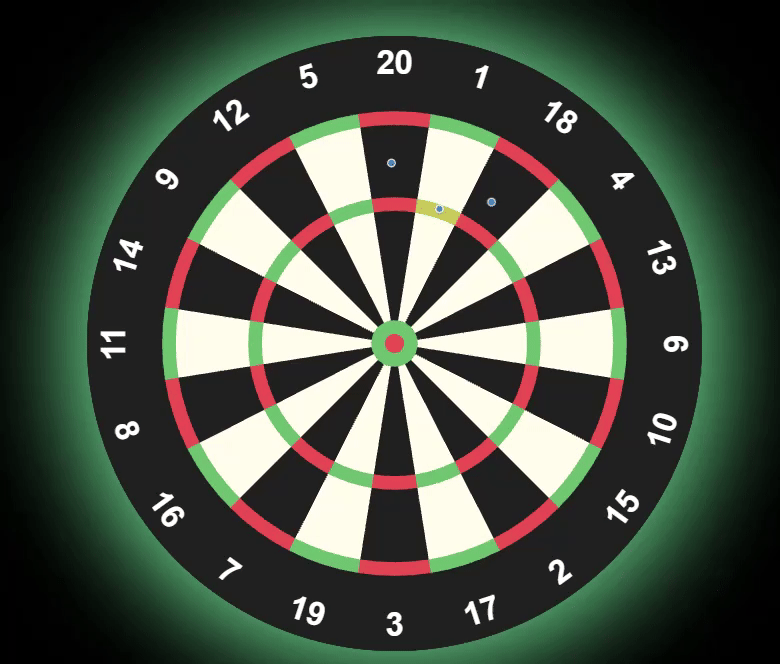

### Dart Marker Replacer

- Gilt für: `alle Modi`
- Kurz: Standardmarker können auf dem virtuellen Board durch kleine Dart-Grafiken ersetzt werden. Im Live-Modus pausiert das Modul automatisch.
- Grafisch: Statt des normalen Markers liegt ein Dart-Bild im getroffenen Segment. Auf Wunsch fliegt der Dart sichtbar ein, bevor er an seiner Zielposition landet.
- Auf dem virtuellen Board bleibt das Modul aktiv. Im Live-Modus pausiert es automatisch, damit dort keine zusätzlichen Dart-Overlays erscheinen.
- Leistungsintensive Effekte können auf schwächeren Geräten zu Rucklern oder weniger flüssigen Animationen führen.
- `Dart-Demo`: Startet eine direkte Vorschau mit dem aktuell konfigurierten Dart-Design.
- `Dart Design`: Wählt das Bilddesign der eingeblendeten Darts.
  - `AI Replicant`: Dieses Motiv nutzt einen futuristischen Flight mit technisch anmutender Gestaltung. Der Dart wirkt dadurch moderner, kühler und stärker wie ein Sci-Fi-Design als die schlichten Farbvarianten.
  - `Bullet`: Diese Variante setzt auf einen kompakten, metallischen Look mit Bullet-Anmutung. Dadurch wirkt der Dart besonders direkt, schwerer und weniger verspielt als die farbigen Flight-Designs.
  - `German Giant`: Dieses Motiv ist an einen German-Giant-Stil angelehnt und wirkt wie ein konkretes Spielerdesign. Der Dart bleibt sportlich, präsent und stärker charakterbezogen als die neutralen Varianten.
  - `Mandalorian`: Diese Variante nutzt ein Mandalorian-inspiriertes Motiv auf dem Flight. Dadurch bekommt der Dart einen klar thematischen Sci-Fi-Charakter und fällt stärker als Designobjekt auf.
  - `Nuke`: Dieses Design setzt auf ein auffälliges Nuke-Motiv mit warnender, energiegeladener Wirkung. Der Dart wirkt dadurch besonders plakativ und deutlich aggressiver als neutrale Varianten.
  - `Phil Taylor`: Diese Variante ist an einen Phil-Taylor-Stil angelehnt und wirkt wie ein traditionelleres Spielerdesign. Der Dart bleibt sportlich, klar und weniger verspielt als die auffälligeren Motiv-Flights.
  - `Snakebite`: Dieses Motiv ist an einen Snakebite-Stil angelehnt und setzt auf eine markante, lebendige Flight-Gestaltung. Dadurch wirkt der Dart charakterstark und klar weniger neutral.
  - `Standard`: Diese Variante nutzt einen klassischen Standard-Look ohne starkes Sondermotiv. Der Dart wirkt dadurch vertraut, ruhig und als neutraler Ersatzmarker gut lesbar.
  - `Standard Yellow`: Diese Variante kombiniert den klassischen Standard-Dart mit einem gelben Flight. Dadurch bleibt das Motiv ruhig, hebt sich aber heller und wärmer vom Board ab.
  - `Standard Yellow 2`: Diese zweite gelbe Standard-Variante bleibt nahe am klassischen Dart-Look, variiert aber die gelbe Flight-Gestaltung. Sie wirkt ähnlich ruhig wie `Standard Yellow`, aber etwas eigenständiger.
  - `Ultramarine`: Diese Variante nutzt einen kräftigen Ultramarin-Ton und wirkt dadurch tiefer, kühler und markanter als die einfache blaue Variante. Der Dart bleibt klar lesbar und farblich fokussiert.
  - `Autodarts`: Dieses Motiv zeigt einen silbernen Dart mit einem weichen violett-blauen Verlaufsflight. Der Look wirkt modern, leicht futuristisch und hebt sich klar von den einfarbigen Varianten ab.
  - `Black Blue`: Dieses Motiv kombiniert einen dunklen Flight mit prägnanten blauen Linien. Dadurch wirkt der Dart besonders technisch, modern und kontrastreich.
  - `Black Green`: Dieses Motiv hält den Dart insgesamt dunkel und setzt grüne Linien oder Akzente auf dem Flight. Dadurch entsteht ein sportlicher, kontrastreicher Look mit klarem Grünfokus.
  - `Black Red`: Dieses Motiv nutzt einen sehr dunklen Flight mit roten Akzentlinien. Das erzeugt den schärfsten und offensivsten Look unter den schwarzen Designs.
  - `Blue`: Diese Variante setzt auf einen klar blau gefärbten Flight ohne Sondermuster. Der Dart wirkt dadurch ruhig, sauber und eindeutig farbcodiert.
  - `Camouflage`: Dieses Motiv setzt auf ein klassisches Tarnmuster in Grün-, Braun- und Beigetönen. Der Dart wirkt dadurch rustikaler und charaktervoller als die glatten Farbvarianten.
  - `Green`: Diese Variante zeigt einen klar grün gefärbten Flight ohne zusätzliche Muster. Der Look bleibt schlicht, sportlich und farblich sofort lesbar.
  - `Pride`: Dieses Motiv nutzt einen sichtbaren Regenbogenverlauf über den Flight-Flächen. Der Dart wirkt dadurch besonders farbig, lebendig und unverwechselbar.
  - `Red`: Diese Variante setzt auf einen klar roten Flight ohne Zusatzmuster. Der Dart wirkt dadurch sofort energisch und fällt als warmer Akzent deutlich auf.
  - `White`: Dieses Motiv nutzt einen weißen Flight ohne starke Zusatzgrafik. Der Dart wirkt dadurch besonders sauber, neutral und leicht.
  - `White Trible`: Diese Variante kombiniert einen weißen Flight mit einem sichtbaren grauen Tribal-Muster. Dadurch bleibt der Dart hell, bekommt aber deutlich mehr Charakter als die reine Weiß-Version.
  - `Yellow`: Dieses Motiv setzt auf einen klar gelben Flight ohne zusätzliches Muster. Der Dart wirkt dadurch sehr hell und bleibt auch auf dunkleren Hintergründen deutlich sichtbar.
  - `Yellow Scull`: Diese Variante nutzt einen hellgelben Flight mit großem Totenkopf-Motiv. Dadurch wirkt der Dart besonders plakativ und deutlich dekorativer als die schlichte Gelb-Version.
- `Dart-Fluganimation`: Schaltet die Fluganimation der Dart-Bilder ein oder aus. Auf schwächeren Geräten kann das die Animation weniger flüssig machen.
- `Dart-Größe`: Passt die Größe der Dart-Grafiken an.
  - `Klein`: Diese Stufe reduziert die Dart-Grafik leicht unter die Standardgröße. Das Segment bleibt besser sichtbar, während der Dart weiterhin klar als Ersatzmarker erkennbar bleibt.
  - `Standard`: Diese Einstellung verwendet die reguläre Grundgröße für den Dart-Marker. Der Dart ist klar sichtbar, ohne den Trefferbereich unnötig stark zu füllen.
  - `Groß`: Diese Stufe vergrößert die Dart-Grafik sichtbar über die Standardgröße hinaus. Treffer wirken dadurch präsenter, nehmen aber auch mehr vom Segmentbild ein.
- `Original-Marker ausblenden`: Blendet die ursprünglichen Marker zugunsten der Dart-Grafiken aus. Im Live-Modus pausiert das Modul automatisch.
- `Einschlag-Schatten`: Schaltet den Einschlag-Schatten der Dart-Grafik ein oder aus.
- `Schatten-Weichzeichnung`: Schaltet die Weichzeichnung des Einschlag-Schattens ein oder aus.
- `Einschlag-Wobble`: Schaltet das kurze Wobble der Dart-Grafik beim Einschlag ein oder aus.
- `Flug-Blur`: Schaltet den Blur-Effekt der Fluganimation ein oder aus.
- `Fluggeschwindigkeit`: Regelt die Dauer der Fluganimation.
  - `Schnell`: Diese Stufe verkürzt die Flugphase deutlich. Neue Darts schießen schnell ins Segment und wirken dadurch sportlicher und unmittelbarer.
  - `Standard`: Diese Einstellung hält die Fluganimation sichtbar, aber kontrolliert. Der neue Dart ist gut wahrnehmbar und landet dennoch zügig am Zielpunkt.
  - `Cinematic`: Diese Stufe verlängert die Fluganimation merklich und macht den Anflug des Darts selbst zum kleinen Effektmoment. Dadurch wirkt das Setzen des Markers cineastischer, aber weniger direkt.
- `Debug`: Aktiviert zusätzliche Debug-Ausgaben für die Fehlersuche.

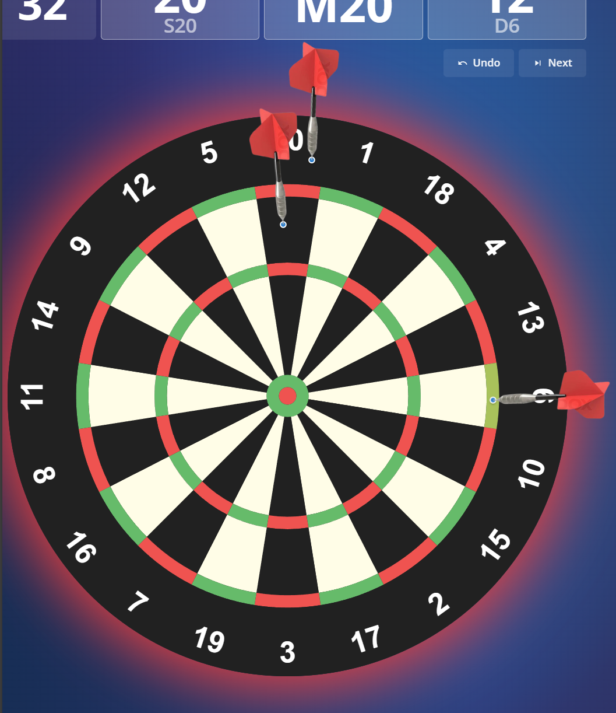

### Take Out Darts Alert

- Gilt für: `alle Modi`
- Kurz: Der Hinweis zum Entfernen der Darts wird als große Grafik deutlich präsenter dargestellt.
- Grafisch: Der normale Hinweis wird durch eine zentrierte Bildkarte ersetzt. Optional pulsiert die Grafik leicht, damit sie im Spielablauf nicht übersehen wird.
- `Bildgröße`: Bestimmt die Größe der Hinweisgrafik.
  - `Kompakt`: Diese Stufe begrenzt die Hinweisgrafik auf eine kompaktere Maximalgröße. Der `Take Out`-Hinweis bleibt deutlich erkennbar, wirkt aber weniger raumgreifend.
  - `Standard`: Diese Einstellung nutzt die vorgesehene Standardgröße für die Hinweisgrafik. Der Hinweis ist gut sichtbar und bleibt zugleich noch ausgewogen im Bild.
  - `Groß`: Diese Stufe vergrößert die Hinweisgrafik sichtbar und macht den `Take Out`-Hinweis zum dominanten Bildelement. Besonders in hektischen Spielsituationen ist er dadurch kaum zu übersehen.
- `Pulse-Animation`: Schaltet die Pulsbewegung der Hinweisgrafik ein oder aus.
- `Pulse-Stärke`: Regelt die Stärke der Pulsbewegung.
  - `Dezent`: Diese Stufe hält die Pulsbewegung bewusst klein. Die Grafik atmet sichtbar, ohne stark zu wachsen oder den Blick hektisch zu ziehen.
  - `Standard`: Diese Einstellung liefert den Standardwert für das Anwachsen der Grafik im Puls. Der Hinweis bleibt lebendig, ohne zu stark aufzuschaukeln.
  - `Stark`: Diese Stufe vergrößert die Grafik in der Mitte der Pulsbewegung deutlich stärker. Der `Take Out`-Hinweis bekommt dadurch einen merklich energischeren Bewegungscharakter.
- `Debug`: Aktiviert zusätzliche Debug-Ausgaben für die Fehlersuche.

### Single Bull Hit Sound

- Gilt für: `alle Modi`
- Kurz: Bei Single Bull hörst du einen kurzen Ton; grafisch bleibt das Spiel unverändert.
- Grafisch: Es wird keine zusätzliche Grafik eingeblendet. Die Rückmeldung ist rein akustisch und reagiert auf erkannte Single-Bull-Treffer.
- `Sound-Test`: Startet einen direkten Sound-Test mit der gespeicherten Lautstärke.
- `Lautstärke`: Regelt die Lautstärke des Single-Bull-Sounds.
  - `Leise`: Diese Stufe hält den Single-Bull-Sound bewusst leise und unaufdringlich. Der Treffer wird hörbar bestätigt, ohne andere Audioquellen stark zu überdecken.
  - `Mittel`: Diese Einstellung liefert eine mittlere Lautstärke, bei der der Single-Bull-Ton klar wahrnehmbar bleibt, aber noch nicht dominant in den Vordergrund tritt.
  - `Standard`: Diese Stufe entspricht der Standardlautstärke des Moduls. Der Single-Bull-Sound bleibt deutlich präsent, ohne bereits auf Maximalpegel zu laufen.
  - `Sehr laut`: Diese Einstellung setzt den Single-Bull-Sound auf die höchste verfügbare Lautstärke. Der Treffer ist damit am klarsten hörbar, kann aber je nach Audio-Setup deutlich präsenter wirken.
- `Wiederholsperre`: Legt die Sperrzeit zwischen zwei Sound-Auslösungen fest.
  - `400 ms`: Diese Stufe hält die Wiederholsperre kurz. Mehrere Single-Bull-Erkennungen können dadurch schneller nacheinander hörbar werden, was direkter, aber auch dichter klingt.
  - `700 ms`: Diese Einstellung liefert den Standardwert für die Wiederholsperre. Sie verhindert direkte Doppeltrigger, ohne die akustische Rückmeldung unnötig träge zu machen.
  - `1000 ms`: Diese Stufe verlängert die Sperrzeit auf eine volle Sekunde. Dadurch wird Mehrfachfeuern besonders zuverlässig gebremst, der Ton kann aber nach schnellen Folgeereignissen später wieder hörbar werden.
- `Fallback-Scan`: Schaltet optional einen zusätzlichen 1200-ms-Fallback-Scan ein.
  - `Nur live`: Mit dieser Einstellung läuft der Single-Bull-Sound rein eventbasiert und ohne zusätzlichen Polling-Scan. Das ist ressourcenschonend, reagiert aber nur dann robust, wenn die Live-Signale zuverlässig eintreffen.
  - `1200 ms`: Diese Option ergänzt die normale Live-Reaktion um einen 1200-ms-Fallback-Scan. Dadurch können Single-Bull-Treffer auch in schwierigeren DOM-Situationen zuverlässiger erkannt und nachträglich hörbar gemacht werden.
- `Debug`: Aktiviert zusätzliche Debug-Ausgaben für die Fehlersuche.

### Turn Score Counter

- Gilt für: `alle Modi`
- Kurz: Punkteänderungen beim Turn werden sichtbar hoch- oder heruntergezählt.
- Grafisch: Statt eines harten Sprungs läuft der angezeigte Wert weich zur neuen Punktzahl. Dadurch wird die Änderung als kurze Animation nachvollziehbar.
- `Zählstil`: Wählt den Zählstil der Turn-Punkte.
  - `Smooth Count`: Smooth-Count-Zählstil.
  - `Rolling Digits`: Rolling-Digits-Zählstil mit rollenden Ziffern.
  - `Step Count`: Deterministischer Step-Count-Zählstil.
- `Zählgeschwindigkeit`: Bestimmt die Geschwindigkeit des Hoch- oder Herunterzählens.
  - `Schnell`: Schnelle Zählgeschwindigkeit.
  - `Standard`: Ausgewogene Zählgeschwindigkeit.
  - `Ruhig`: Ruhige Zählgeschwindigkeit.
- `Aufblitz-Effekt`: Aktiviert oder deaktiviert den Aufblitz-Effekt während laufender Turn-Score-Änderungen.
- `Aufblitz-Modus`: Wählt, ob der Rahmen nur bei Änderungen oder dauerhaft sichtbar ist.
  - `Nur bei Änderung`: Rahmen nur während laufender Zahlenänderungen.
  - `Permanent`: Rahmen dauerhaft sichtbar, unabhängig von laufender Änderung.
- `Debug`: Aktiviert zusätzliche Debug-Ausgaben für die Fehlersuche.

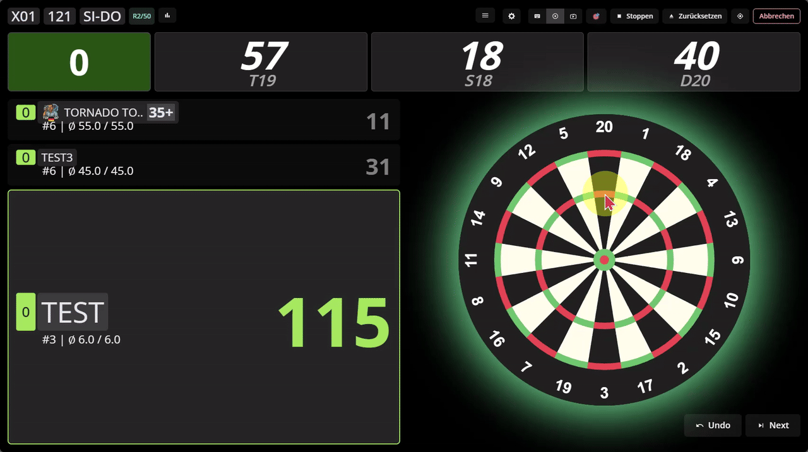
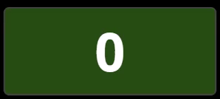

### Winner Celebration Effect

- Gilt für: `alle Modi`
- Kurz: Bei einem Sieg erscheint ein Vollbild-Effekt im gewählten Feuerwerksstil.
- Grafisch: Je nach Stil starten Konfetti- oder Feuerwerksmuster über den gesamten Bildschirm. Farben, Partikelmenge, Laufzeit und Geschwindigkeit folgen der gewählten Konfiguration.
- `Style`: Wählt das Bewegungsmuster des Siegereffekts.
  - `Center Side Burst`: Diese Variante mischt einen zentralen Hauptausbruch mit ergänzenden seitlichen Bursts. Dadurch entsteht die ausgewogenste, klassischste Feierwirkung des Moduls.
  - `Top Fireworks`: Diese Variante setzt auf wiederholte, breit streuende Explosionen im oberen Bereich des Bildes. Der Effekt erinnert am stärksten an klassisches Feuerwerk am Himmel.
  - `Center Cannon`: Diese Einstellung bündelt den Effekt in einer dichten Kanonen-Salve aus der unteren Bildmitte. Der Ausbruch wirkt kompakt, kräftig und sehr direkt.
  - `Triple Burst`: Diese Variante verbindet zentrale und seitliche Ausbrüche zu einem breiten Effektteppich. Dadurch entsteht der vollste und raumgreifendste Feiermoment unter den Mehrfachmustern.
  - `Star Burst`: Diese Einstellung ersetzt die Standardpartikel durch Sternformen und lässt sie mit ruhigerer Bewegung durchs Bild laufen. Der Effekt wirkt dadurch dekorativer und weniger wie klassisches Konfetti.
  - `Side Cannons`: Diese Variante setzt auf kurze Seitenschüsse von links und rechts. Der Effekt rahmt das Bild stärker ein und wirkt dynamischer, aber weniger flächig als zentrale Bursts.
- `Farbe`: Wählt die Farbpalette des Siegereffekts.
  - `Autodarts`: Diese Palette nutzt Blau- und Weißtöne und bleibt damit am nächsten am bestehenden Autodarts-Charakter. Der Effekt wirkt kühl, klar und relativ technisch.
  - `Rot/Weiß`: Diese Palette kombiniert Weiß mit mehreren roten Tönen. Dadurch entsteht ein klassischer, festlicher Look, der deutlich wärmer und emotionaler wirkt als die blauen Standardfarben.
  - `Ice`: Diese Palette setzt auf weiße und eisblaue Farbwerte bis in kräftige Blautöne. Der Effekt wirkt dadurch kühl, klar und fast gläsern.
  - `Sunset`: Diese Farbpalette mischt Weiß mit warmem Orange, Pink und Violett. Dadurch bekommt der Effekt eine deutlich stimmungsvollere, buntere Sunset-Wirkung.
  - `Neon`: Diese Palette kombiniert mehrere sehr helle Neonfarben und erzeugt damit den grellsten, modernsten Look. Der Effekt wirkt stark künstlich, bunt und maximal aufmerksamkeitsstark.
  - `Gold`: Diese Variante färbt den Effekt in Weiß, Gold und warme Bernsteintöne. Dadurch entsteht eine klassische Feierwirkung, die besonders edel und festlich wirkt.
- `Intensität`: Regelt Taktung und Energie des Siegereffekts.
  - `Dezent`: Diese Stufe reduziert Partikelzahl, Geschwindigkeit und Auslösefrequenz. Das Feuerwerk wirkt dadurch ruhiger, luftiger und weniger bildfüllend.
  - `Standard`: Diese Einstellung liefert den vorgesehenen Mittelwert für Partikelzahl, Auslöseintervall und Bewegungsenergie. Der Effekt bleibt klar festlich, ohne zu übersteuern.
  - `Stark`: Diese Stufe steigert Partikelzahl, Auslösefrequenz und Bewegungsenergie spürbar. Der Effekt füllt den Bildschirm stärker und wirkt deutlich druckvoller als die anderen Varianten.
- `Dauer`: Begrenzt die Laufzeit des Siegereffekts.
  - `1 s`: Kürzeste Laufzeit; ideal, wenn der Effekt nur kurz aufblitzen soll.
  - `2 s`: Kurze, gut sichtbare Laufzeit mit moderater Last.
  - `5 s`: Längste Laufzeit; feierlich, aber nicht dauerhaft aktiv.
- `Partikelanzahl`: Regelt die Partikelmenge pro Auslösung.
  - `Sparsam`: Niedrigste Partikelmenge und geringste Last.
  - `Optimiert`: Empfohlene Balance aus Wirkung und Performance.
  - `Voll`: Maximale Dichte mit der höchsten Last.
- `Test-Button`: Startet die aktuelle Konfiguration sofort als Vorschau.
- `Bei Bull-Out aktiv`: Legt fest, ob der Effekt auch bei Bull-Out aktiv ist.
- `Klick beendet Effekt`: Erlaubt das Beenden des Effekts per Klick.
- `Debug`: Aktiviert zusätzliche Debug-Ausgaben für die Fehlersuche.

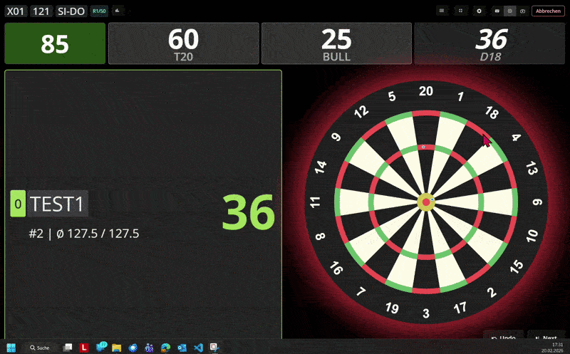
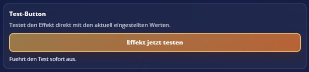
<!-- xconfig-generated:end -->
## Weitere Hinweise zur Konfiguration

- Alle Einstellungen werden lokal gespeichert.
- Theme-Hintergründe werden pro Theme als Data-URL abgelegt.
- Aktivierungen, Theme-Bilder und Feineinstellungen bleiben nach Reload erhalten.
- `Winner Celebration Effect` besitzt wieder einen integrierten Test-Button in AD xConfig.
