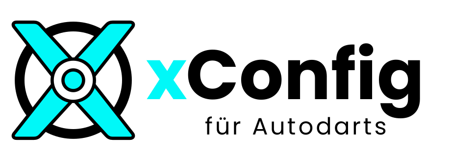
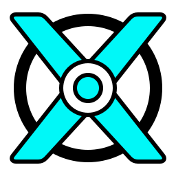

# xConfig Branding

## Sichtbare Marke

- Produktname: **xConfig**
- Descriptor: **für Autodarts**
- Vollständige sichtbare Bezeichnung: **xConfig für Autodarts**
- xConfig ist eine **inoffizielle Erweiterung für Autodarts**.

Der technische Projektname `autodarts-xconfig`, Repository-Name, Userscript-Dateinamen, Update-URLs, Storage-Keys und interne `ad-xconfig-*`-IDs bleiben unverändert.

## Logoübersicht

Die Vorschauen wählen auf GitHub automatisch die passende Hell-/Dunkel-Variante für das aktuelle Farbschema.

### Horizontaler Lockup

  <picture>
    <source media="(prefers-color-scheme: dark)" srcset="./xconfig-logo.svg">
    <source media="(prefers-color-scheme: light)" srcset="./xconfig-logo-on-light.svg">
    
  </picture>

Primäres Logo für README, Dokumentation und größere Branding-Flächen.

### App- / Repo-Mark

  <picture>
    <source media="(prefers-color-scheme: dark)" srcset="./xconfig-mark.svg">
    <source media="(prefers-color-scheme: light)" srcset="./xconfig-mark-on-light.svg">
    
  </picture>

Kompakte Marke ohne Wortmarke für App-, Repo- und quadratische Icon-Flächen.

### Menüicon · 16 px

  <picture>
    <source media="(prefers-color-scheme: dark)" srcset="./xconfig-menu-16.svg">
    <source media="(prefers-color-scheme: light)" srcset="./xconfig-menu-16-on-light.svg">
    
  </picture>

Zur besseren Sichtbarkeit 6× vergrößert dargestellt. Das Original ist für 16 × 16 px optimiert.

## Asset-Matrix

| Einsatz | Dunkler Hintergrund | Heller Hintergrund |
| --- | --- | --- |
| Horizontaler Lockup | [`xconfig-logo.svg`](./xconfig-logo.svg) | [`xconfig-logo-on-light.svg`](./xconfig-logo-on-light.svg) |
| App- / Repo-Mark | [`xconfig-mark.svg`](./xconfig-mark.svg) | [`xconfig-mark-on-light.svg`](./xconfig-mark-on-light.svg) |
| Menüicon · 16 px | [`xconfig-menu-16.svg`](./xconfig-menu-16.svg) | [`xconfig-menu-16-on-light.svg`](./xconfig-menu-16-on-light.svg) |

## Kanonische Assets

Die SVG-Dateien in diesem Ordner stammen direkt aus dem freigegebenen Vektorlogo-Satz und sind die visuelle Source of Truth. Sie dürfen nicht frei nachgezeichnet oder durch ähnlich aussehende Geometrie ersetzt werden.

Die README verwendet den horizontalen Lockup und wählt die passende Variante abhängig vom Farbschema. Das Autodarts-Menü verwendet exakt die Geometrie von `xconfig-menu-16.svg`; nur die Ausgabefarbe wird zur Laufzeit über `currentColor` an den Host angepasst.

## Farben

- Cyan: `#00F8F8`
- Schwarz: `#000000`
- Weiß: `#FFFFFF`

## Laufzeit-Regel

Die Menü-Glyph bleibt inline in `src/features/xconfig-ui/render-controller.js`, damit kein externer Request und keine zusätzliche Asset-Ladeabhängigkeit entsteht. Ihre Ring-, X-, Bullseye- und Maskengeometrie muss mit dem gelieferten 16px-SVG übereinstimmen.
